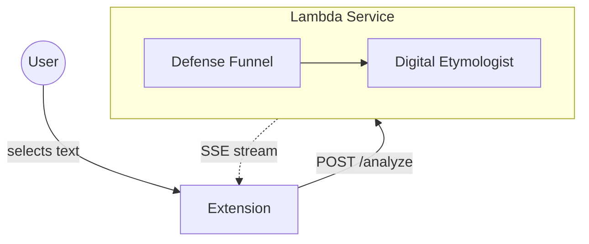

# Aletheia Architecture

Aletheia is a browser extension that reveals the historical and cultural weight of words. When a user selects text, we analyze it through a defense funnel and return structured etymological context via a "Digital Etymologist" AI persona.

## Components

| Component | Description | Zoom Deeper |
|-----------|-------------|-------------|
| Extension | Chrome MV3 / Firefox MV2 browser extension | [Container View](0001b-container-view.md#extension) |
| Lambda Service | Stateful serverless with DynamoDB hydration | [Container View](0001b-container-view.md#lambda) |
| Defense Funnel | 4-layer fail-fast content filter | [ADR-0204](0204-ADR-defense-funnel.md) |
| Digital Etymologist | Structured JSON persona (signal/gem/context) | [LLD-1124](lld/done/1124-digital-etymologist.md) |

## Key Decisions

| ADR | Decision | Status |
|-----|----------|--------|
| [0201](0201-ADR-privacy-first-permissions.md) | Never request `<all_urls>` permission | Final |
| [0202](0202-ADR-shadow-dom-isolation.md) | Shadow DOM for injected UI | Final |
| [0204](0204-ADR-defense-funnel.md) | Fail-fast defense funnel | Final |
| [0211](0211-ADR-naked-python-architecture.md) | Naked Python (no LangChain) | Final |

[Full ADR Index →](0001d-adr-digest.md)

## Quality Snapshot

| Attribute | Target | Current | Evidence |
|-----------|--------|---------|----------|
| Latency | <2s | ~1.5s | [0812 Audit](0812-audit-performance.md) |
| Privacy | No PII stored | TTL 24h | [0810 Audit](0810-audit-privacy.md) |
| Security | OWASP compliant | Passing | [0809 Audit](0809-audit-security.md) |
| Accessibility | WCAG 2.1 AA | Passing | [0811 Audit](0811-audit-accessibility.md) |

[Quality Details →](0001e-quality-attributes.md)

## Navigation

| View | Description |
|------|-------------|
| [Context View](0001a-context-view.md) | System boundary and external actors |
| [Container View](0001b-container-view.md) | Major deployable components |
| [Runtime View](0001c-runtime-view.md) | Key flows as sequence diagrams |
| [Deployment View](0001f-deployment-view.md) | AWS infrastructure and CI/CD |
| [Glossary](0001g-glossary.md) | Key terms and concepts |
