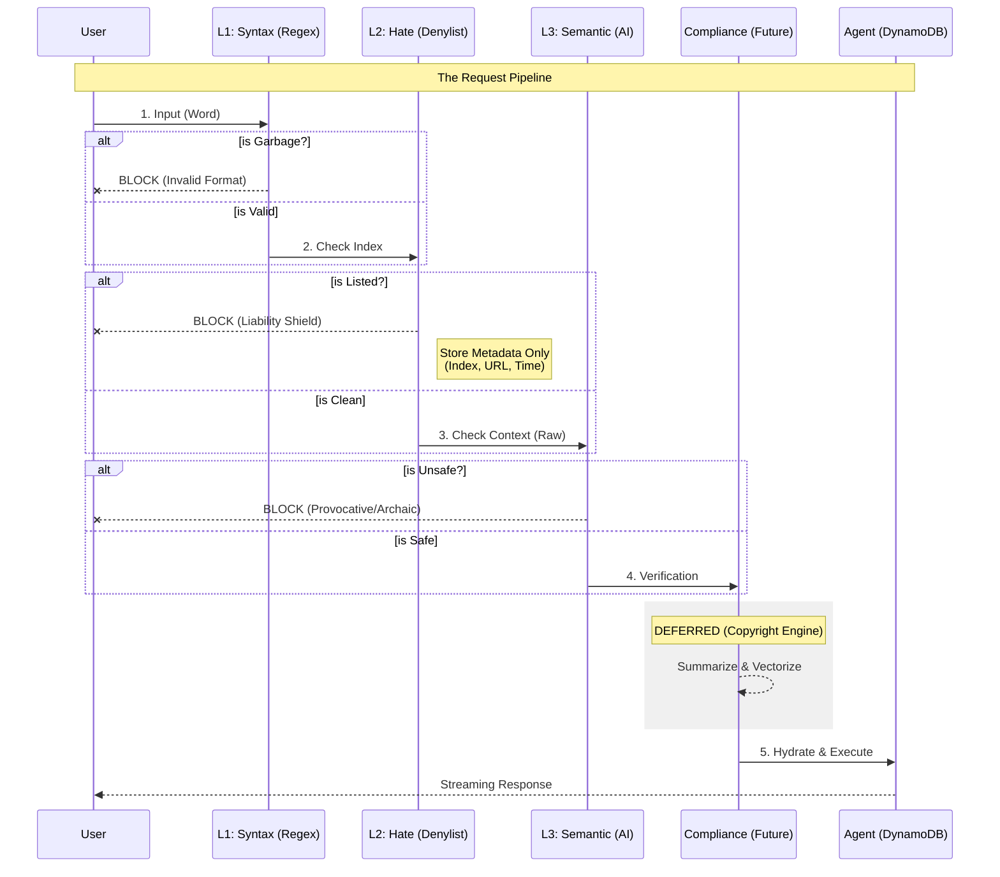

# Aletheia: Architecture & Design Decisions

## 1. The "Stateful Serverless" Pattern
* **Challenge:** AWS Lambda is stateless. Complex GenAI agents require persistent memory.
* **Architecture:** **"Hydration/Dehydration" Cycle**.
    * **Load:** Retrieve state from DynamoDB (`thread_id`).
    * **Execute:** LangGraph processes state.
    * **Persist:** Write updated state back to DynamoDB.
* **Benefit:** Infinite-scale agent memory with zero idle cost.

## 2. The Defense Funnel (Fail Fast)
We enforce a strict, ordered defense pipeline to minimize cost and liability.

### Diagram: The Gauntlet

### 2.1 Layer Definitions

| Layer | Type | Mechanism | Responsibility | Storage Logic |
| --- | --- | --- | --- | --- |
| **L1** | Syntactic | Regex (CPU) | Block gibberish, non-words, scripts. | None (Discard). |
| **L2** | Deterministic | Hash Lookup | Block known hate speech (RSDB). | **Metadata Only:** Store Index ID, Timestamp, URL. *Never store the word.* |
| **L3** | Semantic | LLM (Haiku) | Block provocative/archaic nuance. | Log Rejection Category + Score. |
| **Compliance** | Legal | LLM (Summary) | Strip copyright text before storage. | **Deferred.** (Currently passing Raw Text). |

## 3. Streaming UX (Server-Sent Events)

* **Implementation:** `@awslambda.streamify_response`.
* **Outcome:** Time-To-First-Byte < 500ms.

## 4. Why LangGraph?

* **Resilience:** cyclic graphs (`Agent -> Tool -> Agent`) handle failures better than linear chains.
* **Future Proofing:** Enables dynamic RAG loops.
