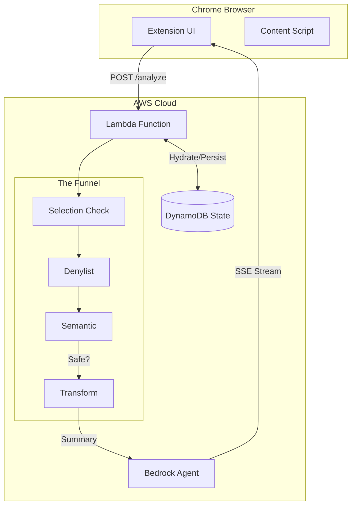
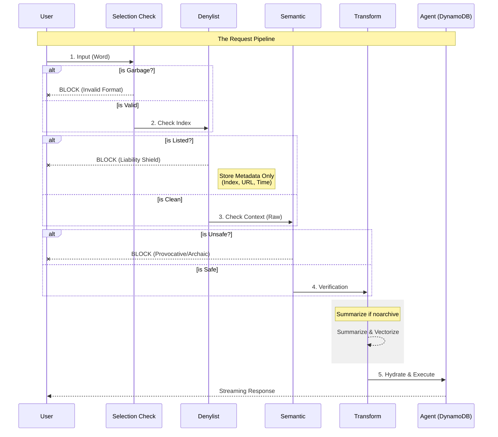

# Aletheia: Architecture & Design Decisions

## 1. The "Stateful Serverless" Pattern
* **Challenge:** AWS Lambda is stateless. Complex GenAI agents require persistent memory.
* **Architecture:** **"Hydration/Dehydration" Cycle**.
    * **Load:** Retrieve state from DynamoDB (`thread_id`).
    * **Execute:** Sequential pipeline processes state (Naked Python).
    * **Persist:** Write updated state back to DynamoDB.
* **Benefit:** Infinite-scale agent memory with zero idle cost.

### 1.1 Component Diagram (Physical Layout)


## 2. The Defense Funnel (Fail Fast)
We enforce a strict, ordered defense pipeline to minimize cost and liability.

### Diagram: The Gauntlet


### 2.1 Layer Definitions

| Layer | Type | Mechanism | Responsibility | Storage Logic |
| --- | --- | --- | --- | --- |
| **Selection Check** | Syntactic | Regex (CPU) | Block gibberish, non-words, scripts. | None (Discard). |
| **Denylist** | Deterministic | Hash Lookup | Block known hate speech (Wikipedia). | **Metadata Only:** Store Index ID, Timestamp, URL. *Never store the word.* |
| **Semantic** | Semantic | LLM (Haiku) | Block provocative/archaic nuance. | Log Rejection Category + Score. |
| **Transform** | Legal | LLM (Summary) | Summarize if noarchive flag set. | Summary only (raw text discarded). |

## 3. Data Lifecycle & Privacy

### 3.1 Retention Policy

| Data Type | Storage | Retention | Rationale |
|-----------|---------|-----------|-----------|
| User text (input) | DynamoDB `input` field | 24-48h (TTL) | Privacy by default |
| Thread context | DynamoDB | 24-48h (TTL) | Stateful conversation |
| Blocked terms | Never stored | N/A | Only hash matched |
| Metadata (URL, timestamp) | DynamoDB | 24-48h (TTL) | Audit trail |

### 3.2 DynamoDB TTL (Issue #145)

All DynamoDB items include a `ttl` attribute (Unix epoch timestamp). AWS automatically deletes expired items within 48 hours of expiry.

```python
item = {
    "thread_id": {"S": hash},
    "input": {"S": text},
    "ttl": {"N": str(int(time.time()) + 86400)},  # 24 hours
}
```

### 3.3 GDPR Compliance (Issue #147)

**Data Subject Rights:**
- **Right to Erasure:** TTL provides automatic erasure within 24-48h
- **Right to Access:** Blocked by lack of user identification (hash-based thread_id)
- **Future:** OAuth (#116) enables user identification for DSAR requests

**Current Limitation:** Without authentication, users cannot prove ownership of their data. TTL-based automatic deletion is the primary privacy mechanism.

## 4. Streaming UX (Server-Sent Events)

* **Implementation:** `@awslambda.streamify_response`.
* **Outcome:** Time-To-First-Byte < 500ms.

## 5. Why Naked Python? (ADR 0211)

* **Simplicity:** Sequential pipeline with direct boto3 calls — no framework overhead.
* **Transparency:** Each layer is a plain function, easily debugged and tested.
* **Cost:** Removed LangGraph/LangChain dependencies (see `docs/0205-ADR-langgraph-orchestration.md` for historical context).

## 6. Architecture Decision Records (ADRs)

### ADR-001: Privacy-First Extension Permissions
**Date:** 2025-12-21
**Status:** Final — Do not revisit.

**Decision:** Aletheia will NEVER request `host_permissions: ["<all_urls>"]`.

**Context:**
Chrome extensions requesting broad host permissions trigger a scary warning: "Read and change all your data on all websites." This erodes user trust and delays Chrome Web Store review.

**Rationale:**
- `activeTab` permission grants temporary per-site access only on user interaction (click, right-click)
- Users explicitly enable sites via the allowlist popup
- No background surveillance of browsing activity

**Tradeoffs Accepted:**
- Toolbar icon remains static (cannot change color/badge per-site without user action)
- Cannot inject scripts proactively — requires user-initiated context menu or popup click
- Badge feedback (setBadgeText/setBadgeBackgroundColor) is the only dynamic toolbar indicator

**Consequences:**
- Issue #77 uses badge text/color instead of icon swapping for feedback
- Allowlist status shown only inside popup UI, never on toolbar icon
-
### ADR-002: Shadow DOM for Injected UI
**Date:** 2025-12-22
**Status:** Final

**Decision:** All UI elements injected into host pages MUST use Shadow DOM (`element.attachShadow({mode: 'closed'})`).

**Context:**
Content scripts can inject DOM elements into host pages. Without isolation, host page CSS affects our UI and vice versa, causing "broken UI" reports and unprofessional appearance.

**Rationale:**
- Prevents style "bleed" from host page CSS resets
- Prevents our styles from breaking host page layout
- `mode: 'closed'` prevents host page JavaScript from accessing our shadow tree
- Required for Chrome Web Store approval on complex sites (WSJ, NYT, etc.)

**Consequences:**
- Overlay implementations must create a shadow root before appending styled content
- Slightly more complex code, but required for professional UX across all websites
