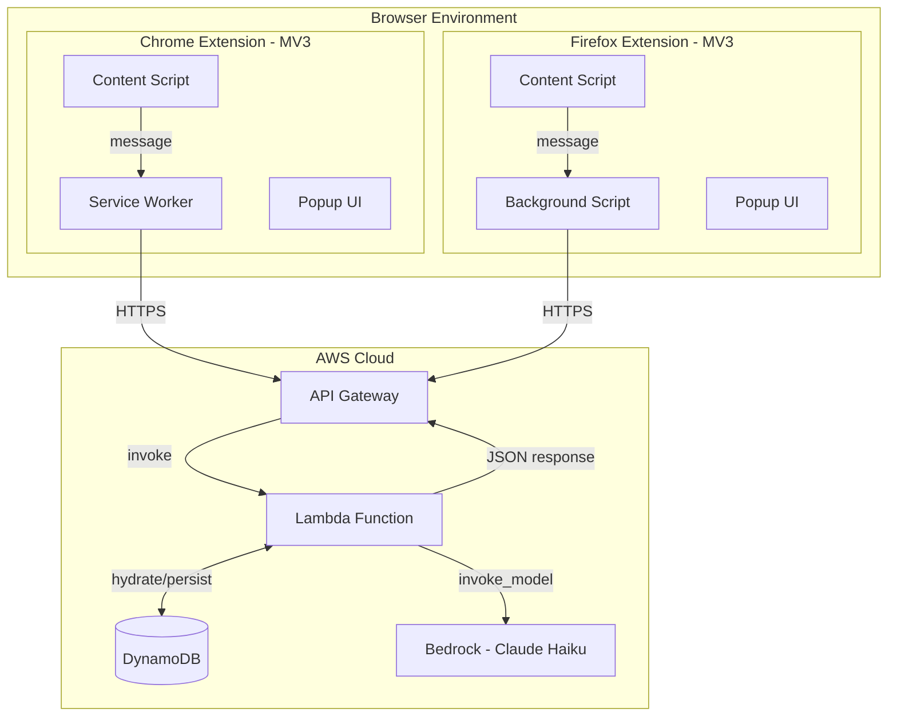

# 0001b - Container View (C4 Level 2)

The container diagram shows the high-level deployable units and their responsibilities.

## Extension Container {#extension}

| Component | Technology | Responsibility |
|-----------|------------|----------------|
| **Content Script** | JavaScript | Captures text selection, renders overlay UI |
| **Service Worker** (Chrome) | JavaScript | API communication, state coordination |
| **Background Script** (Firefox) | JavaScript | Same as service worker (MV2 equivalent) |
| **Popup UI** | HTML/CSS/JS | Allowlist management, settings |

### Key Files

| File | Purpose |
|------|---------|
| `extensions/chrome/manifest.json` | MV3 manifest with minimal permissions |
| `extensions/chrome/overlay.js` | Museum Label UI with Shadow DOM |
| `extensions/chrome/service-worker.js` | Background API coordination |
| `extensions/chrome/popup/popup.js` | Allowlist management UI |

### Design Decisions

- **Shadow DOM**: All injected UI uses closed Shadow DOM ([ADR-0202](0202-ADR-shadow-dom-isolation.md))
- **Minimal Permissions**: `activeTab` only, never `<all_urls>` ([ADR-0201](0201-ADR-privacy-first-permissions.md))
- **Cross-Browser**: Shared logic with browser-specific manifests ([ADR-0212](0212-ADR-unified-v3-secure-dom.md))

## Lambda Container {#lambda}

| Component | Technology | Responsibility |
|-----------|------------|----------------|
| **Handler** | Python 3.12 | Request routing, response streaming |
| **Defense Funnel** | Python modules | 4-layer content filtering |
| **Etymologist** | Python module | Bedrock prompt engineering, JSON extraction |
| **State Manager** | boto3/DynamoDB | Thread hydration/dehydration |

### Key Files

| File | Purpose |
|------|---------|
| `src/lambda_function.py` | Main handler and orchestration |
| `src/guardrails/selection.py` | Layer 1: Syntactic validation |
| `src/guardrails/denylist.py` | Layer 2: Hash-based blocking |
| `src/guardrails/semantic.py` | Layer 3: LLM-based classification |
| `src/etymologist.py` | Digital Etymologist persona |

### Design Decisions

- **Naked Python**: No LangChain/LangGraph, direct boto3 ([ADR-0211](0211-ADR-naked-python-architecture.md))
- **Stateful Serverless**: DynamoDB hydration/dehydration cycle ([ADR-0203](0203-ADR-stateful-serverless.md))
- **Buffered Response**: Synchronous JSON response for reliable parsing ([ADR-0206](0206-ADR-streaming-sse.md) superseded)

## Infrastructure Container {#infrastructure}

| Component | Service | Configuration |
|-----------|---------|---------------|
| **API Gateway** | AWS API Gateway | REST API with Lambda proxy |
| **Lambda** | AWS Lambda | Python 3.12, 512MB, 30s timeout |
| **DynamoDB** | AWS DynamoDB | On-demand capacity, TTL enabled |
| **Bedrock** | Amazon Bedrock | Claude 3 Haiku model |

### Key Files

| File | Purpose |
|------|---------|
| `provision.sh` | Infrastructure provisioning (IAM, DynamoDB, API GW) |
| `deploy.sh` | Lambda deployment with Poetry dependencies |
| `.github/workflows/ci.yml` | CI/CD pipeline |

---

[← Context View](0001a-context-view.md) | [Back to Architecture](0001-architecture.md) | [Runtime View →](0001c-runtime-view.md)
