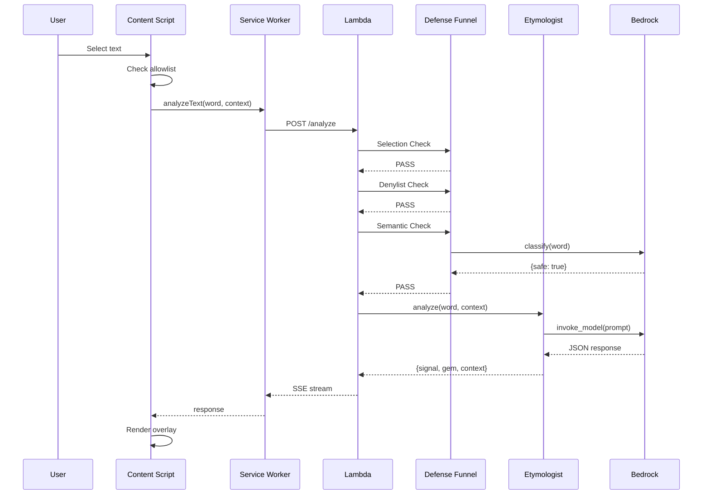
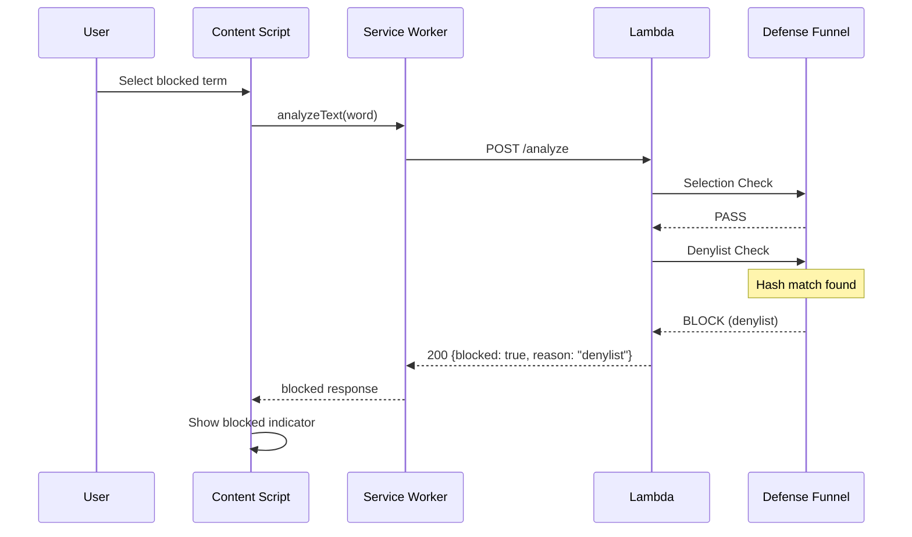
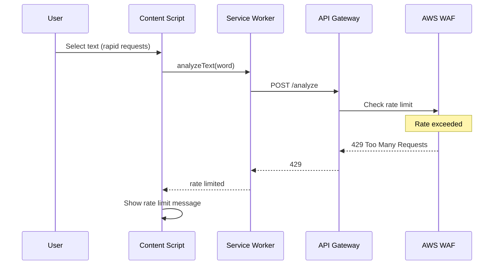
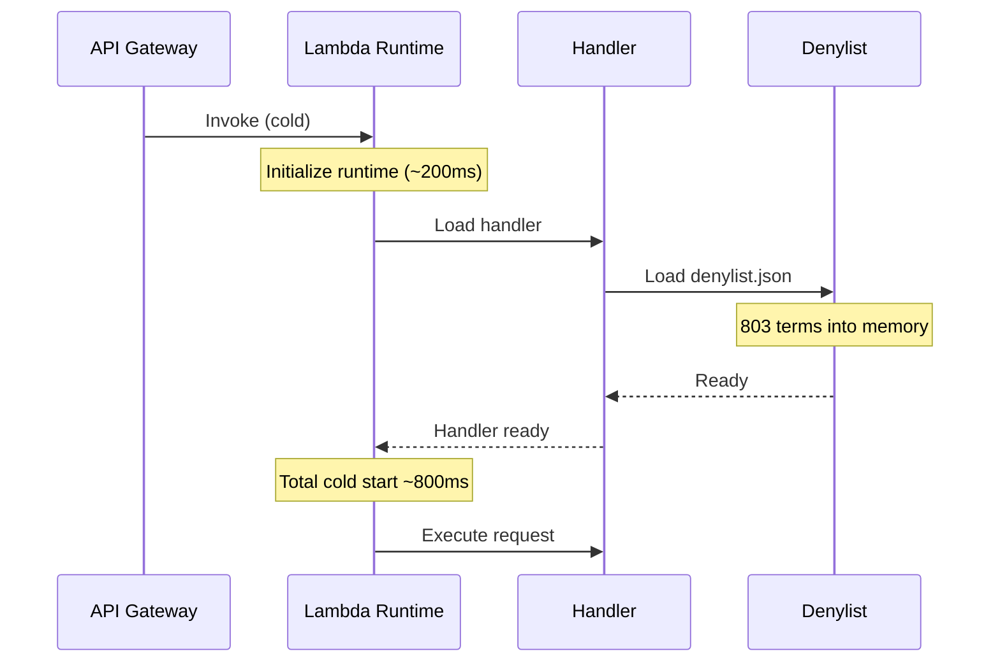
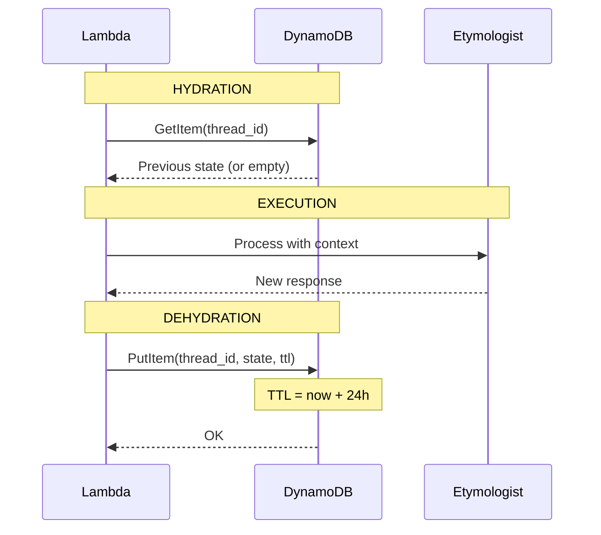

# 0001c - Runtime View

Key flows illustrated as sequence diagrams.

## Happy Path: Text Analysis

## Blocked by Denylist

## Rate Limited

## Cold Start

## State Lifecycle (Hydration/Dehydration)

---

[← Container View](0001b-container-view.md) | [Back to Architecture](0001-architecture.md) | [ADR Digest →](0001d-adr-digest.md)
