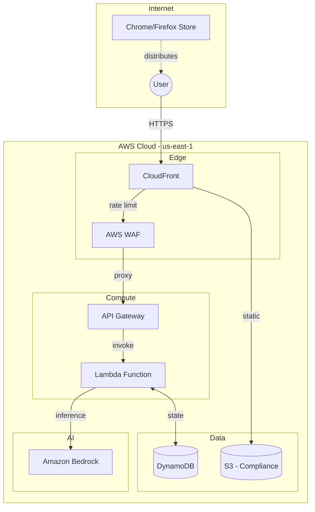
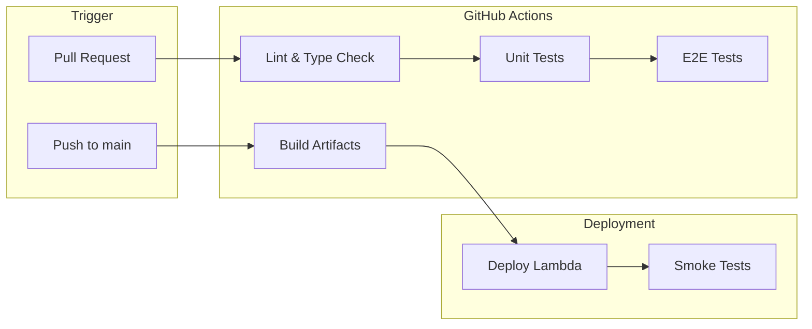

# 0001f - Deployment View

AWS infrastructure and CI/CD pipeline overview.

> **Full Detail:** [0012 DevOps Architecture](0012-devops-architecture.md)

## AWS Architecture

## Resource Configuration

| Resource | Configuration | Notes |
|----------|---------------|-------|
| **Lambda** | Python 3.12, 512MB, 30s timeout | Streaming enabled |
| **DynamoDB** | On-demand, TTL enabled | `AletheiaThreads` table |
| **API Gateway** | REST API, Lambda proxy | `/analyze` endpoint |
| **WAF** | Rate limiting (100 req/5min) | Attached to API Gateway |
| **CloudFront** | Static hosting | Privacy policy, ToS |
| **S3** | Static website bucket | `aletheia-compliance` |

## CI/CD Pipeline

### Pipeline Stages

| Stage | Trigger | Actions |
|-------|---------|---------|
| **Lint** | PR opened | ESLint, Ruff, mypy |
| **Test** | PR opened | pytest, Jest |
| **E2E** | PR opened | Playwright (Chrome, Firefox, Edge) |
| **Build** | Push to main | Poetry build, zip artifact |
| **Deploy** | Push to main | AWS Lambda update |
| **Smoke** | Post-deploy | Production endpoint test |

### Key Files

| File | Purpose |
|------|---------|
| `.github/workflows/ci.yml` | Main CI/CD workflow |
| `provision.sh` | One-time AWS resource creation |
| `deploy.sh` | Lambda deployment script |
| `tools/build_release.py` | Extension packaging |

## Store Submission

| Store | Process | Status |
|-------|---------|--------|
| Chrome Web Store | Manual via developer dashboard | Submitted |
| Firefox Add-ons | Manual via AMO dashboard | Pending |

**Artifacts:**
- `dist/aletheia-chrome.zip` - Chrome extension package
- `dist/aletheia-firefox.zip` - Firefox extension package

---

[← Quality Attributes](0001e-quality-attributes.md) | [Back to Architecture](0001-architecture.md) | [Glossary →](0001g-glossary.md)
