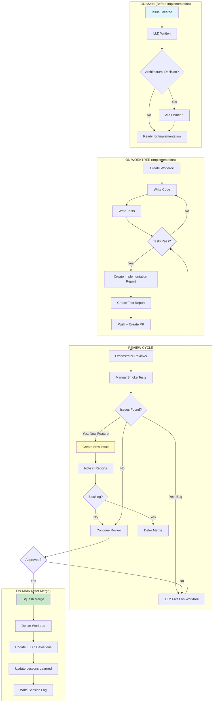

# 0004 - Orchestration Protocol

## 1. The "Single-User Orchestrator" Model
To eliminate the friction of managing multiple GitHub accounts and the cost of Organization seats, this project operates under a **Single-User Orchestration** model.

* **The Human (Orchestrator):** You (`martymcenroe`) are the sole authenticated user. You execute all commands and authorize all code.
* **The AI (Mentor):** The AI functions as a "Bespoke Accelerated Mentor," generating CLI instructions for the Orchestrator to execute.
* **Attribution:** All commits are authored by `martymcenroe`. We do not use separate "bot" accounts for AI-generated code.

## 2. Tooling Constraints
* **CLI Exclusive:** All interactions must occur via the command line (`bash` or `zsh`).
* **GitHub CLI (`gh`):** Used for Issue tracking (`gh issue`) and Pull Requests (`gh pr`).
* **Git (`git`):** Used for version control.
* **No GUIs:** Do not rely on the GitHub web interface or IDE buttons for core workflow tasks.

## 3. The "Flip Turn" Workflow (9 Steps)
Every feature or fix must strictly follow this 9-step execution loop to ensure hygiene and recoverability.

| Step | Action | Command Pattern |
| :--- | :--- | :--- |
| **1. Issue** | Discovery & Claim | `gh issue create` or `gh issue list` |
| **2. Worktree** | Isolation | `git worktree add ../Aletheia-ID -b ID-desc` (See 0002 Section 10) |
| **3a. Docs** | Update Specs/Standards | Edit `docs/10xx-feature.md` |
| **3b. Code** | Implementation | Edit source files |
| **4. Stage** | Preparation | `git add file.py` |
| **5. Commit** | Save | `git commit -m "type: desc (ref #ID)"` |
| **6. Push** | Team Visibility (REQUIRED) | `git push -u origin HEAD` - Never keep branches local-only |
| **7. PR** | Review | `gh pr create --fill` |
| **8. Merge** | Finalize (from main folder) | `cd ../Aletheia && gh pr merge --squash` |
| **9. Cleanup** | Remove worktree + branches | `git worktree remove ../Aletheia-ID && git branch -d ID-desc && git push origin --delete ID-desc` |

**Step 2 Rationale:** Worktrees provide complete isolation without affecting main. Never use `git checkout -b` in the main folder.

**Step 6 Rationale:** Remote branches provide backup, enable collaboration between agents, and give the orchestrator visibility into active work. Local-only branches violate team collaboration principles.

**Step 9 Rationale:** Zombie worktrees and remote branches clutter the system. ALWAYS clean up completely after merge.

## 4. Emergency Recovery
If the session context is lost or the environment destabilizes, strict **Emergency Recovery Mode** is active.

1.  **Stop:** Do not execute further changes.
2.  **Single-Instruction Constraint:** The AI must downgrade to **One Command Per Turn**. Do not batch commands. Wait for explicit user confirmation after every action.
3.  **Ground Truth:** Run `git status` to establish the state of the workspace before proceeding.
4.  **Sync:** Pull from `main` to ensure local state matches upstream.
5.  **Forbidden Commands:** NEVER use destructive commands in emergency recovery: `git reset`, `git push --force`, `git clean -fd`. See `docs/0002-coding-standards.md` Section 2 for complete list and safe alternatives.

## 5. Session Logging

At the end of each working session, AI agents MUST append a summary to `.session-log.md`:

1. **Timestamp & Model:** `## YYYY-MM-DD HH:MM CT | Model Name`
2. **Summary:** 1-2 sentence overview
3. **Files Modified:** List of changed files
4. **Issues Closed/Created:** Issue numbers
5. **Open Questions:** Unresolved items for next session
6. **State on Exit:** Branch, open PRs, last commit SHA

This file is `.gitignored` and provides continuity across sessions.

## 6. Mini-Sprint Protocol

A **Mini-Sprint** is a bounded unit of work containing 1-3 related issues that should be completed atomically by a single AI agent.

### 6.1 Rules
1. **Single Owner:** Only ONE AI agent works on a mini-sprint at a time.
2. **Declared Scope:** The mini-sprint scope is declared at start (issue numbers, branches).
3. **No Handoff Mid-Sprint:** If the owning AI exhausts its session, the human should:
   - Work on UNRELATED tasks with another AI, OR
   - Wait for the original AI to resume
4. **Completion Criteria:** All issues closed, all branches merged, documentation updated.

### 6.2 Tracking
- **GitHub Projects (Kanban):** Create a "Sprint" column. Move issues there when sprint starts.
- **Session Log:** Note active mini-sprint at session start/end.
- **Issue Labels:** Consider `sprint:active` label to visually mark in-flight work.

### 6.3 Declaration Format
At mini-sprint start, the AI declares:

> **MINI-SPRINT DECLARED**
> - Owner: Claude Opus 4.5
> - Issues: #73, #74
> - Branches: `73-whitelist-toggle`, `74-action-feedback`
> - Target: Whitelist UX + Action Feedback
> - Status: Planning

### 6.4 Handoff (Emergency Only)
If handoff is unavoidable:
1. Update session log with full context
2. Commit all work-in-progress (even if incomplete)
3. Add comment to each issue: "WIP: [state description]"
4. New AI must read session log + issue comments before proceeding

## 7. The Multi-Model Verification Protocol
To ensure robustness and security, we utilize a "Red Team / Blue Team" workflow between different AI models.

### 7.1 Roles
* **The Builder (e.g., Claude/Gemini A):** Generates code, UI, and creative assets.
* **The Checker (e.g., Gemini/Claude B):** Reviews inputs against Security, Privacy, and Standards constraints.
* **The Orchestrator (User):** Manages the handoff and makes final decisions.

### 7.2 The 3-Pass Review Cycle
For critical features (security-related, privacy-impacting, external API changes, or >500 LOC), we execute three distinct review passes:
1.  **Pass 1 (Requirements):** The Checker reviews the GitHub Issues/Objectives for architectural viability and privacy risks *before* code is written.
2.  **Pass 2 (Design):** The Checker reviews the Low-Level Design (LLD) or Specs generated by the Builder.
3.  **Pass 3 (Final Artifact):** The Checker reviews the final code/documentation/assets before the Merge to Main.

### 7.3 Handoff Format
When passing context between models, the Orchestrator shall provide:
* The raw content (Code/Text).
* The specific "Lens" for review (e.g., "Review for Privacy," "Review for Coding Standards").
* The Issue numbers being reviewed.
* Any prior review feedback to incorporate (if Pass 2 or 3).

## 8. Feature Development Lifecycle

Every feature produces three document types that work together:

| Document | Purpose | Analogy |
|----------|---------|---------|
| **LLD (1xxx)** | The Plan | Architectural blueprints |
| **Implementation Report** | The Narrative | Construction journal |
| **Test Report** | The Evidence | Building inspection certificate |

### 8.1 Document Lifecycle Diagram



### 8.2 Document Locations

All documents live on `main` after merge:

```
docs/
├── 1{IssueID}-{feature-name}.md     # LLD (plan)
├── reports/
│   └── {IssueID}/
│       ├── implementation-report.md  # Narrative
│       ├── test-report.md            # Evidence
│       └── test-output.log           # Raw pytest output (optional)
```

### 8.3 When to Update LLD on Main

Update the LLD on main **immediately** during implementation if:
- Deviation from plan (changed interfaces, different algorithms, added/removed components)
- New requirements emerge
- Architectural change needed

This protects against context loss if session terminates unexpectedly. The Implementation Report then documents what changed and why.

### 8.4 Willison Protocol Integration

*"Your job is to deliver code you have proven to work."* — Simon Willison

Every feature must comply with the Willison Protocol (see `0005` Section 5):

1. **Manual Testing:** See it work, capture proof
2. **Automated Testing:** Write tests that fail on revert
3. **Proof in Test Report:** Include terminal output, screenshots, or logs

### 8.5 Orchestrator Review Notes

Orchestrator feedback is captured in both reports via LLM updates:

**In Implementation Report:**
- In-Scope Observations (about this feature)
- New-Scope Observations (warrant new issues)
- Meta Observations (process improvements)

**In Test Report:**
- Manual Verification results
- Issues discovered during testing
