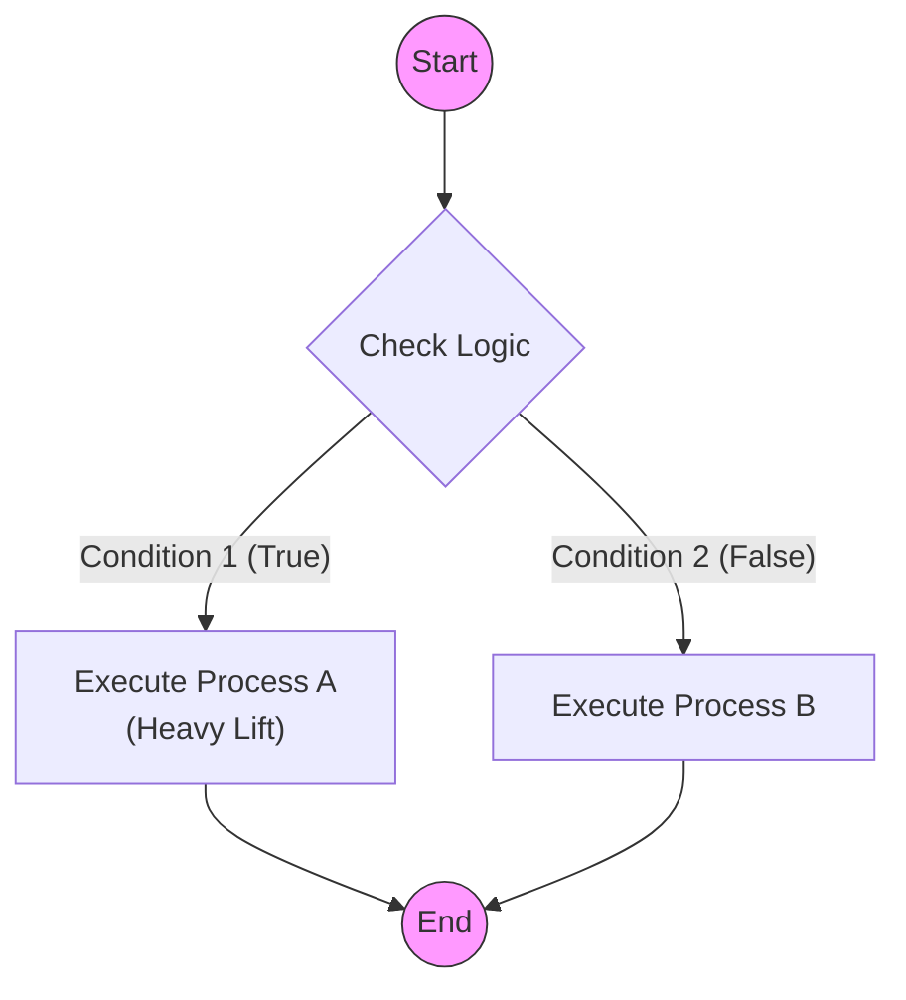

# 0006 - Mermaid Diagram Standards

## 1. Philosophy
Visual documentation is code. It must be maintained, versioned, and readable. We use **Mermaid.js** because it renders natively in GitHub and requires no binary assets.

## 2. Standard Diagram Types

### 2.1 Flowcharts (Logic & Process)
* **Type:** `flowchart TD` (Top-Down).
* **Use Case:** User flows, decision logic, system sequences.
* **Constraint:** Do not use `stateDiagram-v2` for complex logic; it lacks layout control and often results in "routing spaghetti."

### 2.2 Sequence Diagrams (Interaction)
* **Type:** `sequenceDiagram`.
* **Use Case:** API calls, message passing between agents.

## 3. The "Router Pattern"
To keep flowcharts clean, avoid connecting every node to every other node directly. Use a central "Router" decision diamond.

**Bad (Spaghetti):**
* Node A -> Node B
* Node A -> Node C
* Node B -> Node A
* Node C -> Node A

**Good (Router):**
* Start -> Router{?}
* Router -->|Condition 1| A[Process A]
* Router -->|Condition 2| B[Process B]
* A --> Router
* B --> Router

## 4. Style & Syntax Guidelines
1.  **Orientation:** Always use `TD` (Top-Down) for vertical scrolling readability.
2.  **Shapes:**
    * `[Rect]`: Standard Process
    * `{Diamond}`: Decision/Router
    * `((Circle))`: Start/Stop
    * `[[Subroutine]]`: Sub-process
3.  **Styling:** Use standard CSS classes if possible, or simple `style` definitions at the bottom of the graph to keep the logic clean.

## 5. Syntax Safety & Parser Compatibility (CRITICAL)
Mermaid parsers (GitHub, Live Editor) are fragile. Follow these escaping rules to prevent rendering errors.

### 5.1 The "Quote Everything" Rule
**ALWAYS** enclose label text in double quotes if it contains spaces, parentheses, or special characters.
* **Bad:** `A -->|No (Block)| B` (Parser interprets `()` as shape definition)
* **Good:** `A -->|"No (Block)"| B`
* **Bad:** `id[User Input]` (Space can confuse parser)
* **Good:** `id["User Input"]`

### 5.2 Line Breaks
Do not use raw newlines or malformed HTML. Use ` ` inside quoted strings.
* **Bad:** `Node[Line 1 /br Line 2]` (Invalid tag)
* **Bad:** `Node[Line 1   Line 2]` (Unquoted HTML can break strict parsers)
* **Good:** `Node["Line 1 Line 2"]`

### 5.3 Special Characters
Avoid using `#`, `;`, or `{}` inside text labels unless quoted.
* **Bad:** `Node[Issue #80]`
* **Good:** `Node["Issue #80"]`

## 6. Example Template

