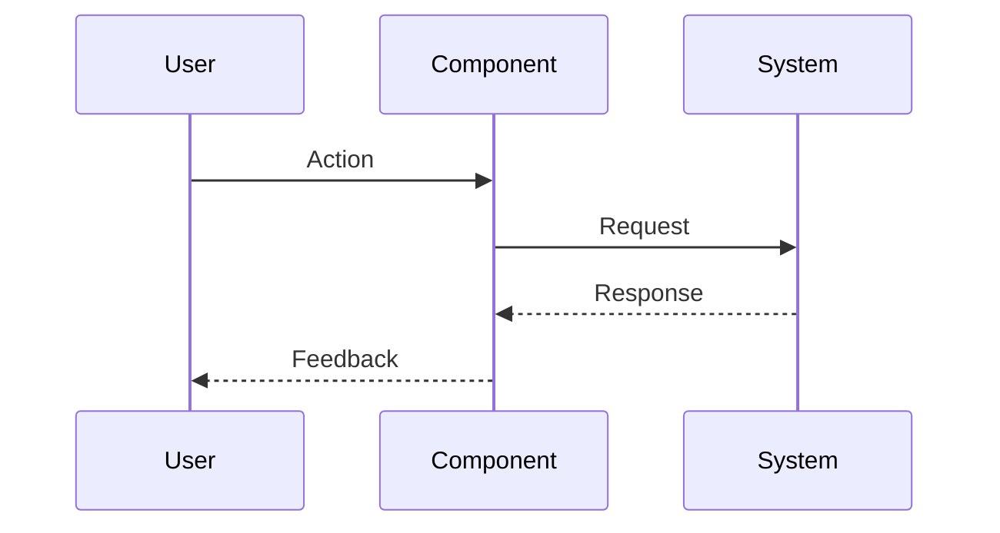

# 1{IssueID} - Feature: {Title}

## 1. Context & Goal
* **Issue:** #{IssueID}
* **Objective:** {One sentence}
* **Status:** Draft | In Progress | Complete

## 2. Requirements
{What must be true when this is done}

## 3. Diagram
{Mermaid sequence or flow diagram visualizing the logic}

## 4. Technical Approach

* **Module:** `src/...`
* **Dependencies:** {packages, APIs}
* **Performance Budget:** {if applicable}

## 5. Implementation Details

{Pseudocode, data structures, function signatures}

## 6. Verification & Testing

*Ref: [0005-testing-strategy-and-protocols.md*](0005-testing-strategy-and-protocols.md)

### 6.1 Test Modules (Select relevant from 0005)

* **Module A (Unit):** `poetry run pytest tests/test_{module}.py -v`
* **Module B (Semantic):** {Applicable? Yes/No}
* **Module C (Trace):** {Applicable? Yes/No}

### 6.2 Test Scenarios

| Scenario | Input | Expected Output | Pass Criteria |
| --- | --- | --- | --- |
| {name} | {input} | {output} | {how to verify} |

### 6.3 Manual Smoke Test

1. {Step 1}
2. {Step 2}
3. {Expected result}

## 7. Definition of Done

* [ ] Code complete and linted
* [ ] Unit tests pass
* [ ] Integration test pass (if applicable)
* [ ] Doc updated with actual test results
* [ ] PR merged to main
