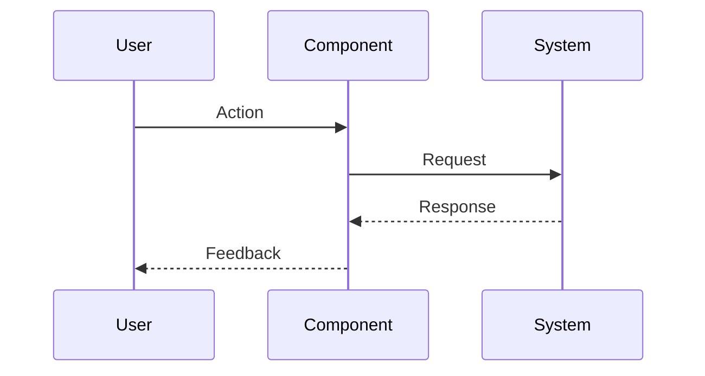

# 1{IssueID} - Feature: {Title}

## 1. Context & Goal
* **Issue:** #{IssueID}
* **Objective:** {One sentence}
* **Status:** Draft | In Progress | Complete
* **Related Issues:** {#XX, #YY if applicable}

## 2. Requirements
{What must be true when this is done}

## 3. Alternatives Considered

| Option | Pros | Cons | Decision |
|--------|------|------|----------|
| {Option A} | {pros} | {cons} | **Selected** / Rejected |
| {Option B} | {pros} | {cons} | Selected / **Rejected** |

**Rationale:** {Why the selected option was chosen}

## 4. Data & Fixtures

*Per [0108-lld-pre-implementation-review.md](0108-lld-pre-implementation-review.md) - complete this section BEFORE implementation.*

### 4.1 Data Sources

| Attribute | Value |
|-----------|-------|
| Source | {URL, API, database, user input, etc.} |
| Format | {JSON, CSV, API response, etc.} |
| Size | {Approximate size or record count} |
| Refresh | {Manual, scheduled, real-time} |
| Copyright/License | {License or "N/A"} |

### 4.2 Data Pipeline

```
{Source} ──{method}──► {Transform} ──{method}──► {Destination}
```

### 4.3 Test Fixtures

| Fixture | Source | Notes |
|---------|--------|-------|
| {e.g., Mock API response} | {Generated / Downloaded / Hardcoded} | {Data hygiene concerns?} |

### 4.4 Deployment Pipeline

{How does data get from dev → test → production?}

**If data source is external:** Is a separate utility needed? Create issue if yes.

## 5. Diagram
*{Write "N/A" if not applicable - do not delete sections}*



## 6. Technical Approach

* **Module:** `src/...`
* **Dependencies:** {packages, APIs}
* **Pattern:** {Design pattern if applicable}

## 7. Interface Specification

### 7.1 Data Structures
```python
# Pseudocode - NOT implementation
class ExampleState(TypedDict):
    field_name: type  # Description
```

### 7.2 Function Signatures
```python
# Signatures only - implementation in source files
def function_name(param: Type) -> ReturnType:
    """Brief description of purpose."""
    ...
```

### 7.3 Logic Flow (Pseudocode)
```
1. Receive input
2. Validate input
3. IF condition THEN
   - Do A
   ELSE
   - Do B
4. Return result
```

## 8. Security Considerations

| Concern | Mitigation | Status |
|---------|------------|--------|
| {e.g., Input injection} | {e.g., Sanitize all inputs} | Addressed / TODO |
| {e.g., Auth bypass} | {e.g., Validate tokens} | Addressed / TODO |

**Fail Mode:** {Fail Open / Fail Closed} - {Justification}

## 9. Performance Considerations

| Metric | Budget | Approach |
|--------|--------|----------|
| Latency | {e.g., < 500ms} | {How achieved} |
| Memory | {e.g., < 128MB} | {How achieved} |
| API Calls | {e.g., 1 per request} | {How minimized} |

**Bottlenecks:** {Known performance concerns}

## 10. Risks & Mitigations

| Risk | Impact | Likelihood | Mitigation |
|------|--------|------------|------------|
| {Risk description} | High/Med/Low | High/Med/Low | {How addressed} |

## 11. Verification & Testing

*Ref: [0005-testing-strategy-and-protocols.md](0005-testing-strategy-and-protocols.md)*

### 11.1 Test Scenarios

| ID | Scenario | Type | Input | Expected Output | Pass Criteria |
|----|----------|------|-------|-----------------|---------------|
| 010 | {Happy path} | Manual/Auto | {input} | {output} | {criteria} |
| 020 | {Edge case} | Manual/Auto | {input} | {output} | {criteria} |
| 030 | {Error case} | Manual/Auto | {input} | {output} | {criteria} |

*Note: Use 3-digit IDs with gaps of 10 (010, 020, 030...) to allow insertions.*

### 11.2 Test Modules (from 0005)

* **Unit Tests:** `poetry run pytest tests/test_{module}.py -v`
* **Semantic (Module B):** {Applicable? Yes/No}
* **End-to-End (Module C):** {Applicable? Yes/No}

### 11.3 Manual Smoke Test

1. {Step 1}
2. {Step 2}
3. {Expected result}

*Full test results recorded in Implementation Report (0103) or Test Report (0113).*

## 12. Definition of Done

### Code
- [ ] Implementation complete and linted
- [ ] Code comments reference this LLD

### Tests
- [ ] All test scenarios pass
- [ ] Test coverage meets threshold

### Documentation
- [ ] LLD updated with any deviations
- [ ] Implementation Report (0103) completed
- [ ] Test Report (0113) completed if applicable

### Review
- [ ] Code review completed
- [ ] User approval before closing issue
