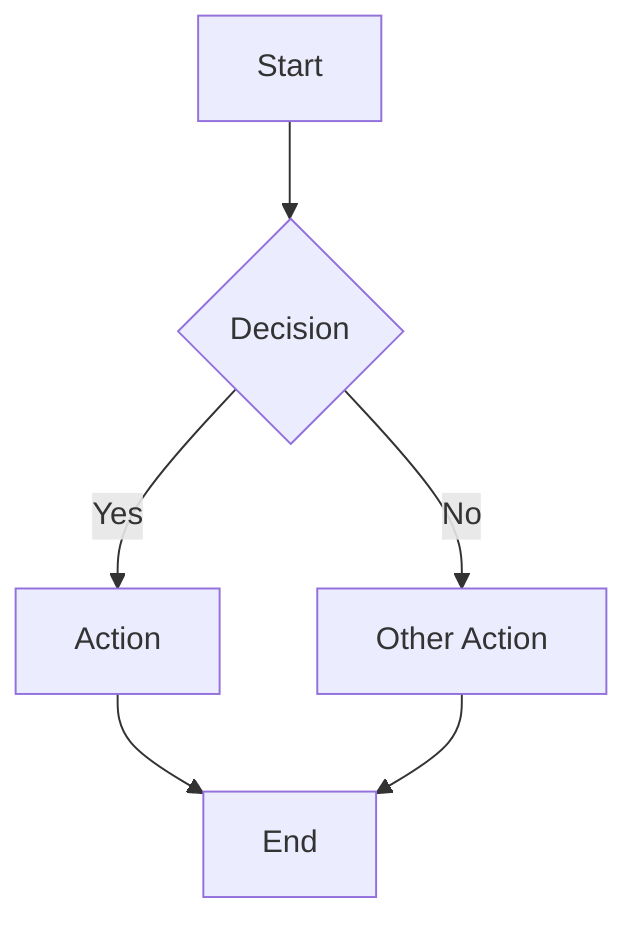

# 1{IssueID} - Feature: {Title}

## 1. Context & Goal
* **Issue:** #{IssueID}
* **Objective:** {One sentence describing what this feature accomplishes}
* **Status:** Draft | In Review | Approved | Complete
* **Dependencies:** {List any issues that must be completed first, or "None"}

## 2. Requirements

### From Issue #{IssueID}
1. {Requirement from the GitHub issue}
2. {Requirement from the GitHub issue}

### From Security Review
*If a security review was conducted (e.g., by Gemini), capture mandated requirements here.*

1. {Security requirement}
2. {Security requirement}

*If no security review: delete this subsection or write "N/A — no security-sensitive components."*

## 3. Diagram

*Ref: [0006-mermaid-diagrams.md](0006-mermaid-diagrams.md)*



## 4. Technical Approach

### 4.1 Files to Create/Modify

| File | Action | Purpose |
|:-----|:-------|:--------|
| `path/to/file.js` | Create | {What this file does} |
| `path/to/existing.js` | Modify | {What changes} |

### 4.2 Design System (if UI)

*Define colors, spacing, typography tokens. Delete if not applicable.*

| Token | Value | Usage |
|:------|:------|:------|
| `--color-primary` | `#XXXXXX` | {Usage} |

### 4.3 Data/Storage Schema (if applicable)

*Define data structures, storage keys, schemas. Delete if not applicable.*

```javascript
// Example: chrome.storage.local
{
  "key": ["value1", "value2"]
}
```

### 4.4 Function Signatures

*Key functions the implementer must create.*

```javascript
async function doSomething(param: string): Promise<void>
function helperFunction(x: number): boolean
```

### 4.5 Implementation Watchlist

*Known traps, gotchas, and things that can go wrong.*

| Trap | Risk | Guidance |
|:-----|:-----|:---------|
| {What could go wrong} | {Why it's bad} | {How to avoid it} |

### 4.6 Implementation Decisions

*Reserved for Q&A during implementation. When the implementing agent asks clarifying questions, capture the answers here so future agents don't re-ask.*

| Question | Decision | Rationale |
|:---------|:---------|:----------|
| {Question from implementer} | {Decision made} | {Why} |

## 5. Security Considerations

*For features with security implications, document the approach here. Reference ADRs from 0001-system-architecture.md and standards from 0002-coding-standards.md.*

*If no security considerations: delete this section or write "N/A — no security-sensitive operations."*

- **ADR Reference:** {e.g., ADR-002 Shadow DOM}
- **Standards Reference:** {e.g., 0002 §9.1 textContent rule}
- **Specific Mitigations:** {What this feature does to stay secure}

## 6. Verification & Testing

*Ref: [0005-testing-strategy-and-protocols.md](0005-testing-strategy-and-protocols.md)*

### 6.1 Test Scenarios

| Scenario | Action | Expected Result | Pass Criteria |
|:---------|:-------|:----------------|:--------------|
| {Happy path} | {What user does} | {What should happen} | {How to verify} |
| {Error case} | {What user does} | {What should happen} | {How to verify} |

### 6.2 Manual Smoke Test

**Setup**
1. `git checkout {branch-name}`
2. Load/refresh extension or start service
3. {Any other setup steps}

**Test: {Test Category}**
4. {Step}
5. {Step}
6. Verify {expected result}

**Test: {Another Category}**
7. {Step}
8. Verify {expected result}

## 7. Definition of Done

- [ ] Code complete and linted
- [ ] All files from 4.1 created/modified
- [ ] Security requirements from Section 2 met
- [ ] All test scenarios from 6.1 pass
- [ ] Manual smoke test from 6.2 passes
- [ ] Lessons learned captured in `docs/9000-lessons-learned.md` (if any)
