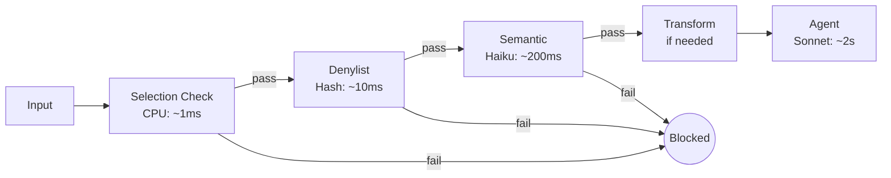

# 0204 - ADR: Defense Funnel (Fail Fast)

**Status:** Implemented
**Date:** 2025-12-15
**Categories:** Security, Content Safety, Performance

## 1. Context

Aletheia processes user-selected text through an AI agent. Without filtering:
- Malicious input could exploit the LLM (prompt injection)
- Hate speech could be processed and stored
- Copyrighted content could be persisted verbatim
- Expensive Bedrock API calls wasted on garbage input

We needed a multi-layer defense strategy that:
- Blocks bad input early (cost savings)
- Provides defense in depth (no single point of failure)
- Separates concerns (each layer has one job)

## 2. Decision

**We will implement a "Defense Funnel" with ordered layers that fail fast — rejecting bad input as early as possible.**

```
Input → Selection Check → Denylist → Semantic → Transform → Agent
         (cheap/fast)                              (expensive/slow)
```

## 3. Alternatives Considered

### Option A: Ordered Defense Funnel — SELECTED
**Description:** Sequential layers from cheap/fast to expensive/slow.

**Pros:**
- Cheapest checks run first (CPU regex before AI)
- Bad input rejected before expensive API calls
- Each layer is testable independently
- Clear separation of concerns
- Fail Closed: any error = blocked

**Cons:**
- Multiple layers add latency
- More code to maintain
- Some redundancy between layers

### Option B: Single AI Guardian — Rejected
**Description:** One LLM call to evaluate all safety concerns.

**Pros:**
- Simpler architecture
- Single point of evaluation

**Cons:**
- Expensive (AI call for every input, even garbage)
- Single point of failure
- Harder to debug which concern failed
- No cost optimization

### Option C: Parallel Evaluation — Rejected
**Description:** Run all checks simultaneously, aggregate results.

**Pros:**
- Potentially faster (parallel execution)

**Cons:**
- Wastes resources (runs expensive AI even if regex would reject)
- Complex aggregation logic
- Race conditions
- No fail-fast benefit

### Option D: Client-Side Only — Rejected
**Description:** All filtering in browser extension.

**Pros:**
- Reduces server load
- Faster feedback

**Cons:**
- Easily bypassed (client code is public)
- Can't use server-side resources (denylist DB)
- Security through obscurity fails

## 4. Rationale

The funnel pattern optimizes for:
1. **Cost:** Cheap checks first (regex is free, Bedrock costs money)
2. **Security:** Defense in depth (layers catch what others miss)
3. **Maintainability:** Each layer has single responsibility
4. **Debuggability:** Clear rejection reason per layer

Fail Fast + Fail Closed ensures safety under uncertainty.



## 5. Security Risk Analysis

| Risk | Impact | Likelihood | Severity | Mitigation |
|------|--------|------------|----------|------------|
| Bypass via layer gap | High | Med | 6 | Overlapping coverage; semantic catches what denylist misses |
| False positive blocks user | Med | Med | 4 | Logging; user feedback mechanism |
| Layer exception crashes system | High | Low | 3 | Fail Closed: exceptions = blocked |
| Denylist incomplete | Med | High | 6 | Semantic layer as backup; regular updates |
| Prompt injection bypasses semantic | High | Low | 3 | Semantic prompt hardened; no user text in system prompt |

**Residual Risk:** Medium. Semantic layer is probabilistic; edge cases exist.

## 6. Consequences

### Positive
- Cost optimized (cheap checks first)
- Defense in depth (multiple layers)
- Clear audit trail (which layer blocked)
- Testable layers (unit test each independently)
- Fail Closed safety

### Negative
- Total latency is sum of all layers
- More code to maintain
- Must keep denylist updated
- Semantic layer has false positive rate

### Neutral
- Standard security pattern (firewalls work this way)

## 7. Implementation

- **Related Issues:** #80 (Wire Agent), #45 (Denylist), #10 (Semantic)
- **Related LLDs:** 1080, 1045, 1010
- **Status:** Partial (Denylist is stub until #45)

Layer implementation:
- Selection Check: `extension/service-worker.js`
- Denylist: `src/guardrails/validators.py` (stub)
- Semantic: `src/guardrails/semantic.py`
- Transform: `compliance.py`

## 8. References

- [Defense in Depth (NIST)](https://csrc.nist.gov/glossary/term/defense_in_depth)
- [Fail Fast Principle](https://en.wikipedia.org/wiki/Fail-fast)
- `docs/0005-testing-strategy-and-protocols.md`

---

## Revision History

| Date | Author | Change |
|------|--------|--------|
| 2025-12-15 | Gemini | Initial architecture design |
| 2025-12-29 | Claude Opus 4.5 | Extracted to ADR format |
