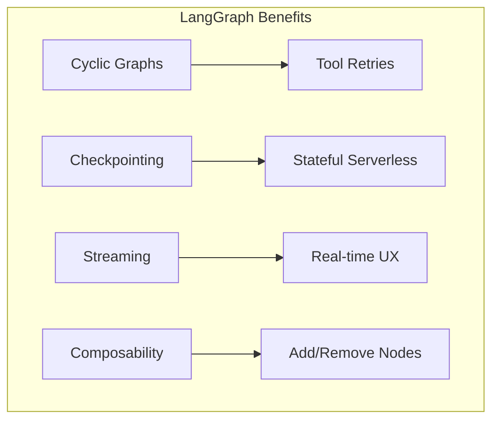

# 0205 - ADR: LangGraph for Agent Orchestration

**Status:** Implemented
**Date:** 2025-12-15
**Categories:** Infrastructure, Integration

## 1. Context

Aletheia requires an AI agent that can:
- Process user requests through multiple steps
- Handle failures gracefully (retry, fallback)
- Maintain state across invocations
- Support future enhancements (RAG, tools)

We needed an orchestration framework for the agent logic.

## 2. Decision

**We will use LangGraph for agent orchestration.**

LangGraph provides a graph-based abstraction for building stateful, multi-step AI agents with built-in persistence support.

## 3. Alternatives Considered

### Option A: LangGraph — SELECTED
**Description:** Graph-based agent framework from LangChain team.

**Pros:**
- Cyclic graphs support `Agent → Tool → Agent` loops
- Built-in checkpointing (DynamoDB, SQLite, etc.)
- Native streaming support
- Composable nodes (easy to add/remove steps)
- Active development and community

**Cons:**
- Learning curve for graph concepts
- Relatively new framework
- Dependency on LangChain ecosystem

### Option B: AWS Step Functions — Rejected
**Description:** AWS native state machine orchestration.

**Pros:**
- Deep AWS integration
- Visual workflow designer
- Built-in error handling

**Cons:**
- Not designed for AI agent patterns
- No built-in LLM integration
- Verbose state machine definitions
- Harder to iterate quickly

### Option C: Plain Lambda + Custom Code — Rejected
**Description:** Build orchestration logic from scratch.

**Pros:**
- Full control
- No external dependencies

**Cons:**
- Reinventing the wheel
- Must build persistence, streaming, error handling
- More code to maintain
- No community patterns to follow

### Option D: LangChain LCEL — Rejected
**Description:** Use LangChain Expression Language (predecessor to LangGraph).

**Pros:**
- Simpler for linear chains

**Cons:**
- No cyclic graphs (Agent → Tool → Agent not possible)
- Limited state management
- Being superseded by LangGraph

## 4. Rationale

LangGraph is purpose-built for AI agent orchestration:
- **Resilience:** Cyclic graphs handle `Agent → Tool → Agent` failures gracefully
- **State:** Built-in checkpointing with DynamoDB integration
- **Streaming:** Native support for SSE responses
- **Future-proof:** Enables RAG loops, multi-agent systems

The learning curve is justified by the capabilities gained.

## 5. Security Risk Analysis

| Risk | Impact | Likelihood | Severity | Mitigation |
|------|--------|------------|----------|------------|
| Framework vulnerability | High | Low | 3 | Pin versions; monitor CVEs |
| State serialization exploit | Med | Low | 2 | Validate state on hydration |
| Dependency supply chain | High | Low | 3 | Use pinned versions; audit deps |
| Breaking API changes | Med | Med | 4 | Pin major version; test upgrades |

**Residual Risk:** Low. LangGraph is from trusted source (LangChain/Harrison Chase).

## 6. Consequences

### Positive
- Agent loops work naturally (cyclic graphs)
- State persistence is handled
- Streaming is built-in
- Active community and documentation
- Easy to add new nodes/capabilities

### Negative
- Dependency on LangChain ecosystem
- Framework updates may require code changes
- Team must learn graph concepts
- Debugging graph execution can be complex

### Neutral
- Python-native (matches our stack)

## 7. Implementation

- **Related Issues:** #80 (Wire Agent)
- **Related LLDs:** 1080
- **Status:** Complete

Key files:
- `agent.py` - Graph definition
- `checkpointer.py` - DynamoDB persistence
- `lambda_function.py` - Entry point

## 8. References

- [LangGraph Documentation](https://langchain-ai.github.io/langgraph/)
- [LangGraph Concepts](https://langchain-ai.github.io/langgraph/concepts/)
- [LangGraph + AWS Lambda](https://langchain-ai.github.io/langgraph/how-tos/deploy-self-hosted/)

---

## Revision History

| Date | Author | Change |
|------|--------|--------|
| 2025-12-15 | Gemini | Initial architecture design |
| 2025-12-29 | Claude Opus 4.5 | Extracted to ADR format |
