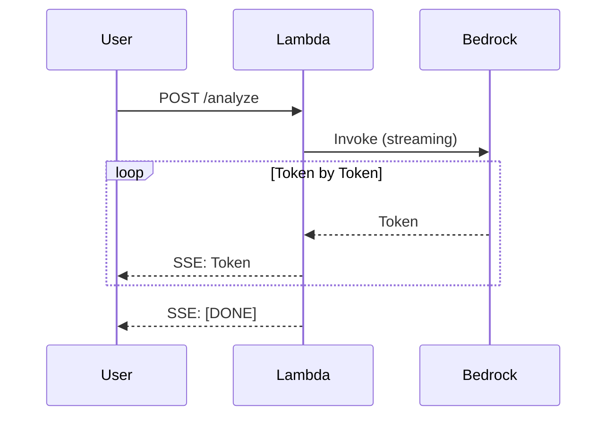

# 0206 - ADR: Server-Sent Events for Streaming

**Status:** Implemented
**Date:** 2025-12-15
**Categories:** Infrastructure, UX, Performance

## 1. Context

GenAI responses can take 2-10 seconds to complete. Without streaming:
- Users stare at a blank screen for seconds
- Perceived latency is the full generation time
- Poor user experience compared to ChatGPT-style interfaces

We needed a way to stream AI responses to the user in real-time.

## 2. Decision

**We will use Server-Sent Events (SSE) via AWS Lambda Response Streaming (`@awslambda.streamify_response`).**

This enables Time-To-First-Byte (TTFB) < 500ms while the full response continues generating.

## 3. Alternatives Considered

### Option A: Server-Sent Events (SSE) — SELECTED
**Description:** Use Lambda Response Streaming with SSE format.

**Pros:**
- Sub-500ms time to first token
- Native browser support (EventSource API)
- Simpler than WebSockets (HTTP-based)
- AWS Lambda supports response streaming
- LangGraph has built-in streaming support

**Cons:**
- Unidirectional (server → client only)
- Connection can drop (need reconnection logic)
- Lambda streaming costs slightly more

### Option B: WebSockets (API Gateway) — Rejected
**Description:** Bidirectional WebSocket connection.

**Pros:**
- Bidirectional communication
- Persistent connection

**Cons:**
- More complex setup (API Gateway WebSocket API)
- Must manage connection state
- Overkill for one-way streaming
- Higher cost for idle connections

### Option C: Long Polling — Rejected
**Description:** Client repeatedly polls for updates.

**Pros:**
- Simple to implement
- Works everywhere

**Cons:**
- Higher latency (poll interval)
- More server load (repeated requests)
- Wasteful of resources
- Poor UX compared to true streaming

### Option D: Return Complete Response — Rejected
**Description:** Wait for full response, return at once.

**Pros:**
- Simplest implementation

**Cons:**
- 2-10 second blank screen
- Terrible UX
- User may think it's broken

## 4. Rationale

SSE provides the best balance of:
- **UX:** Users see tokens as they're generated (ChatGPT-like)
- **Simplicity:** Simpler than WebSockets, native browser support
- **Compatibility:** Works with Lambda Response Streaming
- **Cost:** Only pay for data streamed

## 5. Security Risk Analysis

| Risk | Impact | Likelihood | Severity | Mitigation |
|------|--------|------------|----------|------------|
| SSE connection hijacking | Med | Low | 2 | HTTPS only; origin validation |
| Response injection | High | Low | 3 | Sanitize output; CSP headers |
| DoS via long connections | Med | Med | 4 | Lambda timeout; client disconnect handling |
| Data leakage in stream | High | Low | 3 | Apply guardrails before streaming |

**Residual Risk:** Low. SSE over HTTPS is well-understood and secure.

## 6. Consequences

### Positive
- Time-To-First-Byte < 500ms
- ChatGPT-like streaming UX
- Native browser support (no libraries needed)
- Works with Lambda Response Streaming
- LangGraph integration is seamless

### Negative
- Unidirectional (can't send updates during generation)
- Connection management needed (reconnection on drop)
- Slightly higher Lambda cost (streaming mode)
- Must handle partial responses on error

### Neutral
- Standard pattern for AI interfaces

## 7. Implementation

- **Related Issues:** #80 (Wire Agent)
- **Related LLDs:** 1080
- **Status:** Complete

Key implementation:
- Lambda: `@awslambda.streamify_response` decorator
- Format: `data: {json}\n\n` per SSE spec
- Client: `EventSource` API or fetch with reader

## 8. References

- [AWS Lambda Response Streaming](https://docs.aws.amazon.com/lambda/latest/dg/configuration-response-streaming.html)
- [MDN: Server-Sent Events](https://developer.mozilla.org/en-US/docs/Web/API/Server-sent_events)
- [LangGraph Streaming](https://langchain-ai.github.io/langgraph/how-tos/streaming/)

---

## Revision History

| Date | Author | Change |
|------|--------|--------|
| 2025-12-15 | Gemini | Initial architecture design |
| 2025-12-29 | Claude Opus 4.5 | Extracted to ADR format |
