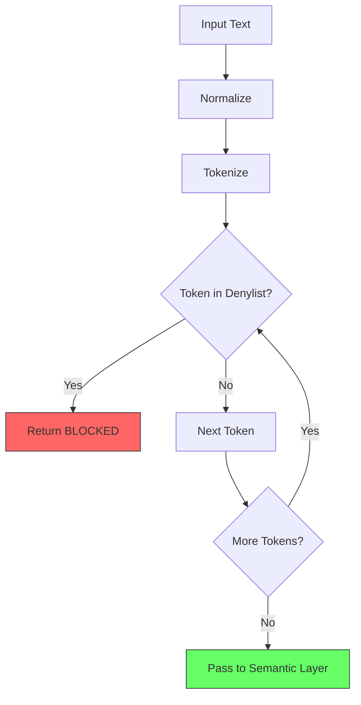

# 1045 - Feature: Deterministic Hate Speech Filter (Denylist)

## 1. Context & Goal
* **Issue:** #45
* **Objective:** Block hate speech deterministically using a known "Denylist" before engaging the LLM.
* **Status:** Draft
* **Related Issues:** #113 (Naked Python Architecture), ADR 0211

**Why:**
- **Liability:** Shifts responsibility to an external database (RSDB).
- **Cost/Latency:** Fails fast (O(1) lookup) without incurring LLM costs.
- **Safety:** Prevents toxic tokens from even entering the inference pipeline.

## 2. Requirements

| ID | Requirement | Priority |
|----|-------------|----------|
| R1 | Load denylist on Lambda cold start | Must |
| R2 | O(1) hash lookup for every input term | Must |
| R3 | Immediate rejection with generic message | Must |
| R4 | Do not ship denylist to client (server-side only) | Must |
| R5 | Normalize input (lowercase, strip whitespace) | Must |
| R6 | Support partial word matching for compound slurs | Should |
| R7 | Log blocked attempts (redacted) for monitoring | Should |

## 3. Alternatives Considered

| Option | Pros | Cons | Decision |
|--------|------|------|----------|
| **HashSet in memory** | O(1) lookup, simple, no deps | Limited by Lambda memory | **Selected** |
| Bloom filter | Space efficient | False positives, complexity | Rejected |
| External API call | Always fresh data | Latency, network dependency | Rejected |
| Regex patterns | Catches variations | O(n) complexity, maintenance | Rejected |

**Rationale:** HashSet provides the simplest O(1) lookup with no dependencies. Lambda has sufficient memory for thousands of terms. Can migrate to S3/DynamoDB later if list grows.

## 4. Diagram



## 5. Technical Approach

* **Module:** `src/guardrails/denylist.py`
* **Data Source:** `src/guardrails/resources/denylist.json`
* **Dependencies:** None (pure Python set operations)
* **Pattern:** Singleton pattern for denylist loader (load once on cold start)

## 6. Interface Specification

### 6.1 Data Structures
```python
# denylist.json format
{
    "version": "1.0",
    "source": "rsdb.org",
    "updated": "2025-01-01",
    "terms": ["term1", "term2", ...]
}

# Result type
class DenylistResult(TypedDict):
    blocked: bool
    term: str | None  # The matched term (if blocked)
    reason: str       # "denylist" or "clean"
```

### 6.2 Function Signatures
```python
def load_denylist(path: str = "src/guardrails/resources/denylist.json") -> set[str]:
    """Load denylist from JSON file into memory. Called once on cold start."""
    ...

def normalize_text(text: str) -> str:
    """Lowercase and strip whitespace from input."""
    ...

def check_denylist(text: str, denylist: set[str]) -> DenylistResult:
    """Check if any token in text matches the denylist. O(1) per token."""
    ...
```

### 6.3 Logic Flow (Pseudocode)
```
1. GLOBAL denylist = None

2. FUNCTION check_denylist(text):
   a. IF denylist is None THEN load_denylist()
   b. normalized = normalize_text(text)
   c. tokens = normalized.split()
   d. FOR each token in tokens:
      - IF token IN denylist THEN
        - RETURN {blocked: True, term: "[REDACTED]", reason: "denylist"}
   e. RETURN {blocked: False, term: None, reason: "clean"}
```

## 7. Security Considerations

| Concern | Mitigation | Status |
|---------|------------|--------|
| Denylist shipped to client | Server-side only, never in extension bundle | TODO |
| Blocked term logged in plaintext | Log "[REDACTED]" instead of actual term | TODO |
| Bypass via Unicode normalization | Use NFKC normalization | TODO |
| Bypass via l33t speak (h4te) | Future: Add common substitutions | Deferred |

**Fail Mode:** Fail Open - If denylist fails to load, log error and continue to Semantic layer (defense in depth).

## 8. Performance Considerations

| Metric | Budget | Approach |
|--------|--------|----------|
| Lookup latency | < 1ms per token | HashSet O(1) lookup |
| Cold start impact | < 50ms | Load JSON once, cache in memory |
| Memory footprint | < 1MB | ~10K terms @ ~100 bytes each |
| Total check time | < 5ms | Even for 100-word input |

**Bottlenecks:** JSON parsing on cold start. Mitigate by keeping list size reasonable.

## 9. Risks & Mitigations

| Risk | Impact | Likelihood | Mitigation |
|------|--------|------------|------------|
| Denylist file missing/corrupt | High | Low | Fail open, log error, alert |
| List grows too large for memory | Med | Low | Migrate to S3 + lazy load |
| False positives (e.g., "Scunthorpe") | Med | Med | Manual review of list, allow exceptions |
| RSDB goes offline | Low | Low | Cache local copy, update monthly |

## 10. Verification & Testing

*Ref: [0005-testing-strategy-and-protocols.md](0005-testing-strategy-and-protocols.md) - Willison Protocol*

### 10.1 Test Scenarios

| ID | Scenario | Type | Input | Expected Output | Pass Criteria |
|----|----------|------|-------|-----------------|---------------|
| 010 | Known slur blocked | Auto | Term from denylist | `{blocked: True}` | Immediate rejection |
| 020 | Clean word passes | Auto | "hello world" | `{blocked: False}` | Continues to Semantic |
| 030 | Empty input | Auto | "" | `{blocked: False}` | No crash |
| 040 | Whitespace only | Auto | "   " | `{blocked: False}` | No crash |
| 050 | Case insensitive | Auto | "SLUR" (uppercase) | `{blocked: True}` | Matches lowercase list |
| 060 | Mixed clean/bad | Auto | "hello [slur] world" | `{blocked: True}` | Catches embedded slur |
| 070 | Performance benchmark | Auto | 1000 lookups | < 5ms total | Under budget |
| 080 | Missing denylist file | Auto | No file | Fail open + log | No crash, warning logged |
| 090 | Malformed JSON | Auto | Invalid JSON | Fail open + log | No crash, warning logged |

### 10.2 Test Modules (from 0005)

* **Unit Tests:** `poetry run pytest tests/test_denylist.py -v`
* **Semantic (Module B):** No - Denylist is deterministic
* **End-to-End (Module C):** Yes - Verify blocked terms don't reach LLM

### 10.3 Willison Protocol Compliance

**Manual Testing Proof Required:**
```bash
# Agent must run and capture this output in PR
poetry run pytest tests/test_denylist.py -v

# Verify tests fail on revert
git stash
poetry run pytest tests/test_denylist.py -v  # Must FAIL
git stash pop
poetry run pytest tests/test_denylist.py -v  # Must PASS
```

**Automated Tests Required:**
- `tests/test_denylist.py` with all scenarios from 10.1
- Tests must fail if implementation is reverted

### 10.4 Manual Smoke Test

1. Deploy Lambda with denylist enabled
2. Send API request with known blocked term
3. Verify immediate rejection (check CloudWatch - no Bedrock call)
4. Send clean term, verify it reaches Semantic layer
5. **Capture proof:** Terminal output or CloudWatch screenshot

## 11. Definition of Done

### Code
- [ ] `src/guardrails/denylist.py` implemented
- [ ] `src/guardrails/resources/denylist.json` created with RSDB data
- [ ] Integration with `lambda_function.py` pipeline
- [ ] Code comments reference this LLD

### Tests (Willison Protocol)
- [ ] `tests/test_denylist.py` covers all scenarios in 10.1
- [ ] Tests FAIL when implementation is reverted (verified)
- [ ] Performance benchmark < 5ms documented
- [ ] Manual test output captured and included in PR

### Documentation
- [ ] LLD updated with any deviations
- [ ] Test Report (0113) completed with proof artifacts

### Deployment
- [ ] Lambda deployed with denylist
- [ ] CloudWatch logs show denylist checks working

### Review
- [ ] Code review completed
- [ ] Orchestrator verified test proof artifacts
- [ ] Issue #45 closed with PR reference
