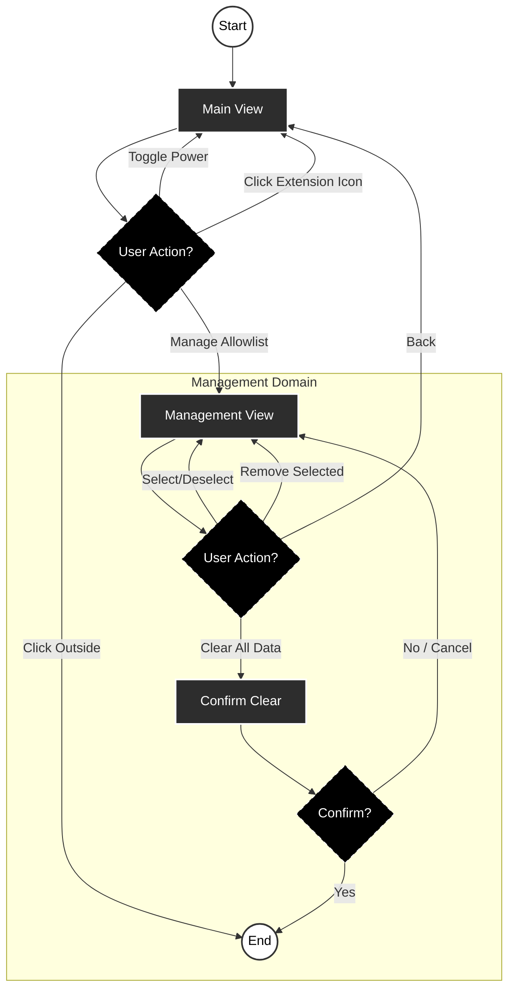

# 1076 - Feature: Domain Allowlist Popup

## 1. Context & Goal
* **Issue:** #76
* **Objective:** Provide a browser action popup allowing users to toggle Aletheia on/off for the current domain and manage their allowlist.
* **Status:** Complete

## 2. Requirements

### From Issue #76
1. **Main View:** Display current domain with power button toggle
2. **Visual States:** Filled icon = enabled, outline = disabled
3. **Management View:** Scrollable allowlist with multi-select and "Clear All Data"
4. **Persistence:** `chrome.storage.local` (survives restart and cookie clear)

### From Gemini Security Review
5. **Explicit Labels:** Power button must show "Aletheia is active/inactive on [domain]"
6. **Clear All Data:** Prominent button in Management View (paranoid user escape hatch)
7. **No Sync:** Data stays local-only (no `chrome.storage.sync`)
8. **Privacy-First Icon:** Toolbar icon remains static; allowlist status displayed only within Popup UI upon click (no `host_permissions` required)

## 3. Diagram

*Ref: [0006-mermaid-diagrams.md](0006-mermaid-diagrams.md)*



## 4. Technical Approach

### 4.1 Files to Create/Modify

| File | Action | Purpose |
|:-----|:-------|:--------|
| `extension/popup.html` | Create | Popup UI structure |
| `extension/popup.css` | Create | Modern styling (Tailwind-inspired) |
| `extension/popup.js` | Create | Popup logic and storage interaction |
| `extension/service-worker.js` | Modify | Add allowlist gate before API call |
| `extension/manifest.json` | Verify | Confirm privacy-first permissions |

### 4.2 Design System

| Token | Value | Usage |
|:------|:------|:------|
| `--color-primary` | `#22C55E` | Active state, success (Tailwind green-500) |
| `--color-primary-hover` | `#16A34A` | Hover on primary elements |
| `--color-danger` | `#EF4444` | Clear All Data button |
| `--color-danger-hover` | `#DC2626` | Hover on danger buttons |
| `--color-text` | `#1F2937` | Primary text (gray-800) |
| `--color-text-secondary` | `#6B7280` | Secondary text (gray-500) |
| `--color-bg` | `#FFFFFF` | Background |
| `--color-bg-secondary` | `#F9FAFB` | Cards, list items (gray-50) |
| `--color-border` | `#E5E7EB` | Borders (gray-200) |
| `--radius` | `8px` | Border radius |
| `--shadow` | `0 1px 3px rgba(0,0,0,0.1)` | Subtle elevation |

### 4.3 Storage Schema

```javascript
// chrome.storage.local
{
  "allowlist": ["wsj.com", "nytimes.com", "economist.com"]
}
```

### 4.4 Function Signatures

**popup.js:**
```javascript
async function getCurrentDomain(): Promise<string | null>
async function isAllowlisted(domain: string): Promise<boolean>
async function addToAllowlist(domain: string): Promise<void>
async function removeFromAllowlist(domain: string): Promise<void>
async function getAllowlist(): Promise<string[]>
async function clearAllData(): Promise<void>
function renderMainView(domain: string, isActive: boolean): void
function renderManagementView(allowlist: string[]): void
```

**service-worker.js (additions):**
```javascript
function extractDomain(url: string): string | null
async function isDomainAllowlisted(domain: string): Promise<boolean>
```

### 4.5 Manifest (Privacy-First)

```json
{
  "manifest_version": 3,
  "name": "Aletheia",
  "version": "1.0",
  "description": "AI-Powered Context Analysis",
  "permissions": [
    "activeTab",
    "scripting",
    "contextMenus",
    "storage"
  ],
  "host_permissions": [],
  "background": {
    "service_worker": "service-worker.js"
  },
  "icons": {
    "16": "icons/icon16.png",
    "32": "icons/icon32.png",
    "48": "icons/icon48.png",
    "128": "icons/icon128.png"
  },
  "action": {
    "default_title": "Aletheia",
    "default_popup": "popup.html",
    "default_icon": {
      "16": "icons/icon16.png",
      "32": "icons/icon32.png",
      "48": "icons/icon48.png",
      "128": "icons/icon128.png"
    }
  }
}
```

**Note:** No `host_permissions` means:
- No scary "reads all sites" Chrome warning
- Icon remains static (no dynamic badge)
- `activeTab` grants temporary access only on user interaction (click or right-click)

### 4.6 Allowlist Gate

Add to `service-worker.js` at start of `contextMenus.onClicked` handler:

```javascript
// Extract domain from URL
function extractDomain(url) {
  try {
    return new URL(url).hostname.replace(/^www\./, '');
  } catch {
    return null;
  }
}

// Inside onClicked handler, before existing logic:
const domain = extractDomain(info.pageUrl);
const { allowlist = [] } = await chrome.storage.local.get('allowlist');

if (!allowlist.includes(domain)) {
  console.log(`[Aletheia] Blocked: ${domain} not allowlisted`);
  // Issue #77 will add visual feedback here
  return;
}
```

### 4.7 Implementation Watchlist

| Trap | Risk | Guidance |
|:-----|:-----|:---------|
| **Subdomain handling** | User enables `finance.yahoo.com`, expects it to work on `news.yahoo.com` | MVP: Store full hostname as-is. Document as known limitation. Future: Add root-domain option using Public Suffix List. |
| **Allowlist check timing** | Gate runs after fetch, defeating the purpose | Allowlist check MUST execute inside `onClicked` handler BEFORE any `chrome.scripting.executeScript` or `fetch` calls. Do not refactor this sequence. |

### 4.8 UX Decisions

| Question | Decision | Rationale |
|:---------|:---------|:----------|
| Clear All confirmation | Custom in-popup UI | Matches prototype, avoids jarring native dialog |
| Remove Selected visibility | Always visible, disabled when empty | Prevents layout shift |
| Empty allowlist message | "No domains allowlisted yet" | Better UX than empty void |
| Domain normalization | Strip `www.` only | MVP scope, edge cases documented as limitation |


## 5. Prototype Reference

A high-fidelity interactive React prototype was created during design review:
- **File:** `docs/prototypes/popup-prototype.jsx`
- **Purpose:** Visual/interaction reference for implementation
- **Note:** Prototype uses React; actual implementation will be vanilla JS
- **Note:** The popup logo must use the Lambda icon asset (`icons/icon128.png`), not a hardcoded letter

## 6. Verification & Testing

*Ref: [0005-testing-strategy-and-protocols.md](0005-testing-strategy-and-protocols.md)*

### 6.1 Test Scenarios

| Scenario | Action | Expected Result | Pass Criteria |
|:---------|:-------|:----------------|:--------------|
| Fresh install | Open popup | Empty allowlist, domain shown | UI renders correctly |
| Enable domain | Click power (OFF→ON) | Domain added, status shows "ACTIVE" | Storage updated |
| Disable domain | Click power (ON→OFF) | Domain removed, status shows "INACTIVE" | Storage updated |
| Persistence | Enable, restart browser | Domain still enabled | Status still "ACTIVE" |
| Cookie immunity | Enable, clear cookies | Domain still enabled | Status still "ACTIVE" |
| Allowlist gate | "Explain with AI" on non-allowlisted | No API call | Console shows block message |
| Remove selected | Select 2, click Remove | Both removed from list | List updates |
| Clear All Data | Click, confirm | All data gone | Allowlist empty |
| Static icon | Browse any site | Icon never changes | No badge, no color change |

### 6.2 Manual Smoke Test

**Setup**
1. `git checkout 76-allowlist-popup`
2. Open Chrome, go to `chrome://extensions/`
3. Remove Aletheia if already loaded
4. Enable Developer Mode, click "Load unpacked", select `extension/` folder
5. Pin Aletheia to toolbar (click puzzle icon → pin)

**Test: Inactive State (Verify Gate Blocks)**
6. Visit wsj.com
7. Click Aletheia icon → verify "wsj.com" displayed, status "INACTIVE"
8. Select text, right-click → "Explain with AI"
9. Run `poetry run python tools/log_viewer.py --tail 1` → note timestamp of last entry
10. Confirm NO new entry (gate blocked)

**Test: Active State (Verify API Works)**
11. Click power button → verify "ACTIVE" state
12. Select text, right-click → "Explain with AI"
13. Run `tools/log_viewer.py --tail 1` → verify NEW entry with later timestamp

**Test: Management View**
14. Click "Manage Allowlist" → verify wsj.com in list
15. Visit nytimes.com, click icon, enable it
16. Return to wsj.com, click "Manage Allowlist" → verify both domains listed
17. Select nytimes.com checkbox, click "Remove Selected" → verify removed

**Test: Toggle Back to Inactive**
18. Click power button on wsj.com → verify "INACTIVE" state

**Test: Clear All Data**
19. First add wsj.com back (click power → ACTIVE)
20. Click "Manage Allowlist" → Click "Clear All Data" → confirm in dialog → verify list empty

**Test: Persistence**
21. Add wsj.com to allowlist again
22. Close browser completely, reopen
23. Visit wsj.com, click icon → verify state persisted (should be ACTIVE)

**Test: Static Icon**
24. Throughout all steps: verify toolbar icon never changed (always Lambda, no badge)

## 7. Definition of Done

- [x] `extension/popup.html` created
- [x] `extension/popup.css` created with design system
- [x] `extension/popup.js` created with all functions
- [x] `extension/service-worker.js` updated with allowlist gate
- [x] `extension/manifest.json` verified (no host_permissions)
- [x] Storage persists across browser restart
- [x] Storage survives "Clear cookies on exit"
- [x] "Clear All Data" works with confirmation
- [x] All smoke test scenarios pass
- [ ] PR merged to main
