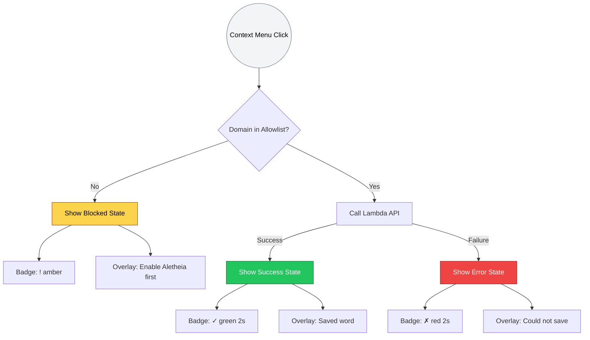

# 1077 - Feature: User Feedback for Context Menu Actions

## 1. Context & Goal
* **Issue:** #77
* **Objective:** Provide immediate visual feedback via selection-anchored overlay and toolbar badge when user clicks "Explain with AI" context menu action.
* **Status:** Draft
* **Dependencies:** #76 (Allowlist Popup) — Complete ✅

## 2. Requirements

### From Issue #77
1. **Selection-Anchored Overlay:** Tooltip appears adjacent to selected text
2. **Toolbar Badge Feedback:** Badge color/text indicates status (no icon swap)
3. **Three States:** Blocked (not allowlisted), Success, Error
4. **Auto-Dismiss:** Overlays disappear after timeout
5. **Allowlist Integration:** Check storage before API call

### From Gemini Security Review
6. **Shadow DOM Isolation:** Overlay must use `attachShadow({mode: 'closed'})` (ADR-002)
7. **XSS Prevention:** Use `textContent`, never `innerHTML` with user content (0002 §9.1)
8. **Programmatic Injection:** Use `chrome.scripting.executeScript()` only on user action

## 3. Diagram



## 4. Technical Approach

### 4.1 Files to Create/Modify

| File | Action | Purpose |
|:-----|:-------|:--------|
| `extension/overlay.js` | Create | Content script for selection-anchored overlay |
| `extension/service-worker.js` | Modify | Add badge logic, orchestrate overlay injection |
| `extension/manifest.json` | Verify | Ensure `scripting` permission present |

### 4.2 Design System (Overlay)

| Token | Value | Usage |
|:------|:------|:------|
| `--overlay-bg` | `#1F2937` | Dark background (gray-800) |
| `--overlay-text` | `#F9FAFB` | Light text (gray-50) |
| `--overlay-success` | `#22C55E` | Success icon/border |
| `--overlay-warning` | `#FBBF24` | Warning icon/border (amber-400) |
| `--overlay-error` | `#EF4444` | Error icon/border |
| `--overlay-radius` | `6px` | Border radius |
| `--overlay-shadow` | `0 4px 12px rgba(0,0,0,0.3)` | Drop shadow |
| `--overlay-padding` | `8px 12px` | Internal padding |
| `--overlay-font` | `13px system-ui, sans-serif` | Typography |

### 4.3 Badge States

| State | Badge Text | Badge Color | Duration |
|:------|:-----------|:------------|:---------|
| Blocked | `!` | `#FBBF24` (amber) | Until popup clicked |
| Success | `✓` | `#22C55E` (green) | 2 seconds |
| Error | `✗` | `#EF4444` (red) | 2 seconds |
| Normal | (empty) | — | Default state |

### 4.4 Overlay Positioning

```javascript
// Get selection bounding rect
const selection = window.getSelection();
const range = selection.getRangeAt(0);
const rect = range.getBoundingClientRect();

// Position overlay below selection, but check viewport bounds
overlay.style.position = 'fixed';
overlay.style.left = `${rect.left}px`;

// If selection is near bottom of viewport, show above instead of below
const spaceBelow = window.innerHeight - rect.bottom;
if (spaceBelow < 60) {
  // Not enough space below - position above selection
  overlay.style.bottom = `${window.innerHeight - rect.top + 8}px`;
} else {
  // Normal case - position below selection
  overlay.style.top = `${rect.bottom + 8}px`;
}
```

### 4.5 Shadow DOM Structure

```javascript
function createOverlay(message, type) {
  const host = document.createElement('div');
  host.id = 'aletheia-overlay-host';
  
  const shadow = host.attachShadow({ mode: 'closed' });
  
  const styles = `
    .overlay {
      position: fixed;
      background: #1F2937;
      color: #F9FAFB;
      padding: 8px 12px;
      border-radius: 6px;
      font: 13px system-ui, sans-serif;
      box-shadow: 0 4px 12px rgba(0,0,0,0.3);
      z-index: 2147483647;
      border-left: 3px solid ${getBorderColor(type)};
    }
  `;
  
  shadow.innerHTML = `<style>${styles}</style><div class="overlay"></div>`;
  
  // SECURITY: Use textContent, never innerHTML for user content
  shadow.querySelector('.overlay').textContent = message;
  
  document.body.appendChild(host);
  return host;
}
```

### 4.6 Service Worker Badge Logic

```javascript
// Badge helper functions
function setBadge(text, color) {
  chrome.action.setBadgeText({ text });
  chrome.action.setBadgeBackgroundColor({ color });
}

function clearBadge() {
  chrome.action.setBadgeText({ text: '' });
}

function flashBadge(text, color, duration) {
  setBadge(text, color);
  setTimeout(clearBadge, duration);
}

// Usage in onClicked handler:
// Blocked: setBadge('!', '#FBBF24'); // Cleared when popup opens
// Success: flashBadge('✓', '#22C55E', 2000);
// Error:   flashBadge('✗', '#EF4444', 2000);
```

### 4.7 Clearing Blocked Badge

When user clicks toolbar icon (opening popup), clear the amber badge:

```javascript
// In popup.js, on load:
chrome.action.setBadgeText({ text: '' });
```

### 4.8 Implementation Watchlist

| Trap | Risk | Guidance |
|:-----|:-----|:---------|
| **innerHTML XSS** | User selects malicious text | ALWAYS use `textContent` for the selected word |
| **Style bleed** | Host page CSS breaks overlay | ALWAYS use Shadow DOM with `mode: 'closed'` |
| **Z-index wars** | Overlay hidden behind page elements | Use `z-index: 2147483647` (max 32-bit int) |
| **Selection lost** | Selection clears before we read it | Read selection immediately in content script |
| **Badge race condition** | Multiple rapid clicks confuse badge state | Use `clearTimeout` before setting new badge timer |

### 4.9 Implementation Decisions

| Question | Decision | Rationale |
|:---------|:---------|:----------|
| Badge clearing trigger | `popup.js` on DOMContentLoaded | Simpler than service-worker listener; clears even if popup already open |
| Blocked overlay timeout | 5 seconds | Longer duration since user action required |
| Success overlay timeout | 3 seconds | Per Issue #77 spec |
| Error overlay timeout | 3 seconds | Per Issue #77 spec |
| Badge flash duration | 2 seconds | Shorter than overlay; catches attention without lingering |
| Error message text | "✗ Could not save. Try again." | Generic; don't include word (error may be unrelated) |
| Blocked overlay timing | Inject immediately (no API call) | Gate fires before any network activity |
| Success/Error overlay timing | Inject after API completes | Show result of actual operation |

## 5. Content Script Injection

The overlay is injected programmatically, not via manifest `content_scripts`. This supports our privacy narrative: "We only run when you ask us to."

```javascript
// In service-worker.js, after allowlist check passes:
await chrome.scripting.executeScript({
  target: { tabId: tab.id },
  func: showOverlay,
  args: [message, type, position]
});
```

## 6. Verification & Testing

*Ref: [0005-testing-strategy-and-protocols.md](0005-testing-strategy-and-protocols.md)*

### 6.1 Test Scenarios

| Test | Scenario | Action | Expected Result | Status |
|:-----|:---------|:-------|:----------------|:-------|
| **010** | Blocked state | "Explain with AI" on non-allowlisted site | Overlay: warning message, Badge: "!" amber | ✅ PASSED |
| **020** | Clear blocked badge | Click toolbar icon while badge shows "!" | Badge clears | ✅ PASSED |
| **030** | Success state | "Explain with AI" on allowlisted site | Overlay: "Saved: [word]", Badge: "✓" green | ✅ PASSED |
| **040** | Error state | "Explain with AI" with network offline | Overlay: error message, Badge: "✗" red | ✅ PASSED |
| **050** | Overlay position (top) | Select text at top of page | Overlay appears below selection | ✅ PASSED |
| ~~**060**~~ | ~~Overlay position (bottom)~~ | ~~Select text at bottom of viewport~~ | ~~Overlay appears ABOVE selection~~ | **Moved to #98** |
| **070** | Shadow DOM isolation | Test on Economist, UnHerd, WSJ | Overlay styling consistent | ✅ PASSED |
| **080** | XSS prevention | Select `<script>alert('xss')</script>` | Text displayed literally | ✅ PASSED |
| **090** | Rapid clicks | Click "Explain with AI" 5x quickly | Badge state coherent | ✅ PASSED |

### 6.2 Manual Smoke Test

**Setup**
- `git checkout 77-action-feedback`
- Load unpacked extension in Chrome
- Pin Aletheia to toolbar
- Ensure wsj.com is NOT in allowlist

**Test 010: Blocked State**
1. Visit wsj.com
2. Select any word, right-click → "Explain with AI"
3. Verify overlay appears with warning message near selection
4. Verify badge shows "!" with amber background
5. Wait 5 seconds → verify overlay disappears, badge persists

**Test 020: Clear Blocked Badge**
6. Click toolbar icon → verify badge clears, popup opens

**Test 030: Success State**
7. Enable wsj.com in popup (click power button)
8. Select a word, right-click → "Explain with AI"
9. Verify overlay shows "Saved: [word]" near selection
10. Verify badge shows "✓" with green background
11. Verify both clear after ~2-3 seconds
12. Run `poetry run python tools/log_viewer.py --tail 1` → verify new entry

**Test 040: Error State**
13. Open DevTools → Network → check "Offline"
14. Select a word, right-click → "Explain with AI"
15. Verify overlay shows error message
16. Verify badge shows "✗" with red background
17. Verify both clear after ~2-3 seconds
18. Uncheck "Offline"

**Test 050: Overlay Position (Top)**
19. Select text at top of page
20. Right-click → "Explain with AI"
21. Verify overlay appears BELOW selection, fully visible

**Test 060: Overlay Position (Bottom)** — **MOVED TO ISSUE #98**
~~22. Scroll to bottom of page~~
~~23. Select text at bottom of viewport (last visible line)~~
~~24. Right-click → "Explain with AI"~~
~~25. Verify overlay appears ABOVE selection, fully visible (not clipped)~~

**Note:** Viewport-aware positioning moved to Issue #98 after discovering overlay.js is never executed (root cause documented in ISSUE-98-DEBUG-HISTORY.md).

**Test 070: Shadow DOM Isolation**
26. Test on wsj.com, nytimes.com, github.com
27. Verify overlay appearance is consistent across all sites

**Test 080: XSS Prevention**
28. Visit any allowlisted site
29. Select the text: `<script>alert('xss')</script>`
30. Right-click → "Explain with AI"
31. Verify overlay shows the text literally (no alert popup)

**Test 090: Rapid Clicks**
32. Select a word, rapidly click "Explain with AI" 5 times
33. Verify badge state remains coherent (no stuck badges)

## 7. Definition of Done

- [x] `extension/overlay.js` created with Shadow DOM
- [x] `extension/service-worker.js` updated with badge logic
- [x] Overlay uses `textContent` (never `innerHTML`)
- [x] Shadow DOM with `mode: 'closed'`
- [x] Blocked state: overlay + persistent amber badge
- [x] Success state: overlay + green badge (2s)
- [x] Error state: overlay + red badge (2s)
- [x] Badge clears when popup opened
- [x] All smoke test scenarios pass (8/8 - Test 060 moved to #98)

