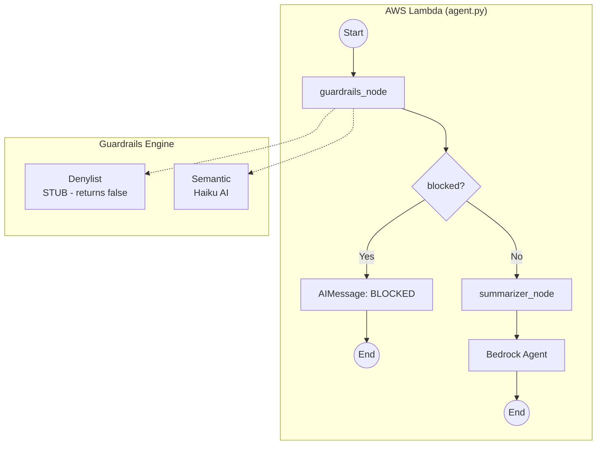
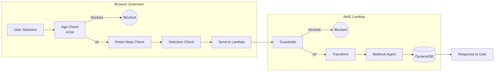

[Gemini | Turn ID: 71 | Time: 2025-12-23 01:05 CST]
[Updated: Claude Opus 4.5 | 2025-12-29 | Architecture clarification, TDD expansion]

# 1080 - Low-Level Design: Wire Agent to Defense Funnel

## 1. Context & Goal

* **Issue:** #80
* **Objective:** Wire the `agent.py` LangGraph to enforce the "Defense in Depth" architecture.
* **Reviewer:** Claude Opus (Verdict: Approved with clarifications).
* **Strategy:** Fail Fast, Fail Closed.
* **Related Issues:** #45 (Denylist - stub), #109 (Layer renaming), #112 (Signal handling)

## 2. Architecture Overview

### 2.1 Layer Naming Convention

We use **functional names** instead of L1/L2/L3/L4 because layers may move between client and server.

| Layer | Location | Purpose | Status |
|-------|----------|---------|--------|
| **Age Check** | Extension | Block adult-rated sites | Future (#104) |
| **Robot Meta Check** | Extension | Detect noarchive flag | Future |
| **Selection Check** | Extension | Validate input (entropy, XSS) | Partial |
| **Denylist** | Lambda | Hate term blocking | **STUB** (#45) |
| **Semantic** | Lambda | AI-based context analysis | Implemented |
| **Transform** | Lambda | Summarizer for noarchive | Implemented |

### 2.2 Scope of This Issue (#80)

**In Scope:** Server-side wiring (Lambda)
- Wire `guardrails_node` → calls Denylist (stub) + Semantic
- Wire `summarizer_node` → Transform (pass-through unless noarchive)
- Wire `should_continue` → routing logic
- State schema updates

**Out of Scope:** Client-side checks (separate issues)
- Age Check (#104)
- Robot Meta detection
- Selection validation enhancements

## 3. Requirements

### 3.1 Guardrails Integration (The Gatekeeper)

1. **Single Entry Point:** Call `src.guardrails.engine.validate(text)`.
   - Internally orchestrates **Denylist** (stub) and **Semantic** checks
   - Denylist is a no-op stub returning `blocked=False` until #45 is implemented
2. **Fail Closed:** If `engine.validate` throws an exception, treat input as **BLOCKED** (Reason: "Internal Security Error").
3. **Feedback:** If blocked, append an `AIMessage` with the block reason to `state['messages']`.

### 3.2 Transform Integration (The Summarizer)

1. Create a `summarizer_node` (renamed from "compliance").
2. **Behavior for #80:** Pass-through (No-Op).
3. **Future Behavior:** When `noarchive_flag=True`, invoke Transform to summarize raw text before storage.

### 3.3 Graph Topology

```
Start → Guardrails → (blocked?) → End
                  ↘ (safe) → Transform → Agent → End
```

## 4. Diagrams

### 4.1 Server-Side Graph (This Issue)



### 4.2 Full Architecture (Context)



## 5. Technical Approach

* **Module:** `agent.py`
* **Dependencies:** `src.guardrails.engine`
* **Pattern:** "Fail Fast" (Security violations abort execution immediately)
* **State Management:** Extends `AgentState` to carry security signals

## 6. Implementation Details

### 6.1 State Schema Update

```python
from typing import TypedDict, Annotated
from langchain_core.messages import AnyMessage
from langgraph.graph import add_messages

class AgentState(TypedDict):
    # Existing fields
    messages: Annotated[list[AnyMessage], add_messages]
    thread_id: str
    raw_selection: str

    # New fields for #80
    guardrail_result: dict  # {'blocked': bool, 'reason': str, 'layer': str}

    # Signal flags from extension (populated by Lambda handler)
    signals: dict  # {'noarchive': bool, 'source_url': str, ...}
```

### 6.2 Node Logic

**A. `guardrails_node`**

```python
from src.guardrails import engine
from langchain_core.messages import AIMessage
import logging

logger = logging.getLogger(__name__)

def guardrails_node(state: AgentState) -> dict:
    """
    Gatekeeper node - validates input through Denylist and Semantic checks.

    Fail Closed: Any exception results in BLOCKED status.
    """
    raw_text = state.get("raw_selection", "")

    if not raw_text or not raw_text.strip():
        return {
            "guardrail_result": {"blocked": True, "reason": "Empty selection", "layer": "validation"},
            "messages": [AIMessage(content="BLOCKED: No text selected")]
        }

    try:
        # Orchestrates Denylist (stub) and Semantic checks
        result = engine.validate(raw_text)
    except Exception as e:
        # Fail Closed - treat any error as security violation
        logger.error(f"Guardrail exception: {e}", exc_info=True)
        result = {"blocked": True, "reason": "Internal Security Error", "layer": "exception"}

    if result.get("blocked"):
        return {
            "guardrail_result": result,
            "messages": [AIMessage(content=f"BLOCKED: {result.get('reason', 'Unknown')}")]
        }

    return {"guardrail_result": result}
```

**B. `summarizer_node` (Transform)**

```python
def summarizer_node(state: AgentState) -> dict:
    """
    Transform node - handles noarchive content by summarizing instead of storing raw.

    For #80: Pass-through (no-op).
    Future: Check signals['noarchive'] and invoke Transform if True.
    """
    signals = state.get("signals", {})

    # STUB for #80 - pass through
    # TODO (#85): If signals.get('noarchive'):
    #     - Call compliance.analyze_context()
    #     - Replace raw_selection with summary
    #     - Set signals['transformed'] = True

    return {"signals": signals}
```

**C. Conditional Edge: `should_continue`**

```python
def should_continue(state: AgentState) -> str:
    """
    Routing logic - determines next node based on guardrail result.

    Returns:
        "__end__" if blocked
        "summarizer_node" if safe to proceed
    """
    result = state.get("guardrail_result", {})

    if result.get("blocked"):
        return "__end__"

    return "summarizer_node"
```

### 6.3 Graph Construction

```python
from langgraph.graph import StateGraph, END

def build_agent_graph():
    """Construct the agent graph with defense funnel."""

    graph = StateGraph(AgentState)

    # Add nodes
    graph.add_node("guardrails_node", guardrails_node)
    graph.add_node("summarizer_node", summarizer_node)
    graph.add_node("agent_node", agent_node)  # Existing Bedrock agent

    # Set entry point
    graph.set_entry_point("guardrails_node")

    # Add conditional edge from guardrails
    graph.add_conditional_edges(
        "guardrails_node",
        should_continue,
        {
            "__end__": END,
            "summarizer_node": "summarizer_node"
        }
    )

    # Add remaining edges
    graph.add_edge("summarizer_node", "agent_node")
    graph.add_edge("agent_node", END)

    return graph.compile()
```

## 7. Verification & Testing

* **Ref:** `docs/0005-testing-strategy-and-protocols.md`
* **Test File:** `tests/test_agent_wiring.py`
* **Strategy:** Test-Driven Development (TDD) - write tests BEFORE implementation

### 7.1 Test Setup

```python
import pytest
from unittest.mock import patch, MagicMock
from agent import guardrails_node, summarizer_node, should_continue, AgentState

@pytest.fixture
def clean_state() -> AgentState:
    """Baseline state for testing."""
    return {
        "messages": [],
        "thread_id": "test-thread-001",
        "raw_selection": "The quick brown fox jumps over the lazy dog.",
        "guardrail_result": {},
        "signals": {}
    }

@pytest.fixture
def mock_engine_safe():
    """Mock engine.validate returning safe result."""
    with patch('src.guardrails.engine.validate') as mock:
        mock.return_value = {"blocked": False, "reason": None, "layer": None}
        yield mock

@pytest.fixture
def mock_engine_blocked():
    """Mock engine.validate returning blocked result."""
    with patch('src.guardrails.engine.validate') as mock:
        mock.return_value = {"blocked": True, "reason": "Hate speech detected", "layer": "denylist"}
        yield mock

@pytest.fixture
def mock_engine_exception():
    """Mock engine.validate raising exception."""
    with patch('src.guardrails.engine.validate') as mock:
        mock.side_effect = ValueError("Database connection failed")
        yield mock
```

### 7.2 Test Scenarios

| # | Scenario | Mock Behavior | Expected Path | Expected Output | Test Function |
|---|----------|---------------|---------------|-----------------|---------------|
| 1 | Happy Path | `blocked=False` | GR → Transform → Agent | Agent processes input | `test_happy_path` |
| 2 | Blocked by Denylist | `blocked=True, layer=denylist` | GR → End | "BLOCKED: Hate speech..." | `test_blocked_denylist` |
| 3 | Blocked by Semantic | `blocked=True, layer=semantic` | GR → End | "BLOCKED: Provocative..." | `test_blocked_semantic` |
| 4 | Exception (Fail Closed) | Raises `ValueError` | GR → End | "BLOCKED: Internal Security Error" | `test_exception_fail_closed` |
| 5 | Empty Selection | N/A (validation) | GR → End | "BLOCKED: No text selected" | `test_empty_selection` |
| 6 | Whitespace Only | N/A (validation) | GR → End | "BLOCKED: No text selected" | `test_whitespace_only` |
| 7 | Transform Pass-through | `blocked=False` | GR → Transform | signals unchanged | `test_transform_passthrough` |

### 7.3 Test Implementations

```python
class TestGuardrailsNode:
    """Tests for guardrails_node function."""

    def test_happy_path(self, clean_state, mock_engine_safe):
        """Safe content passes through without messages."""
        result = guardrails_node(clean_state)

        assert result["guardrail_result"]["blocked"] == False
        assert "messages" not in result or len(result.get("messages", [])) == 0
        mock_engine_safe.assert_called_once_with(clean_state["raw_selection"])

    def test_blocked_denylist(self, clean_state, mock_engine_blocked):
        """Blocked content returns BLOCKED message."""
        result = guardrails_node(clean_state)

        assert result["guardrail_result"]["blocked"] == True
        assert len(result["messages"]) == 1
        assert "BLOCKED:" in result["messages"][0].content
        assert "Hate speech" in result["messages"][0].content

    def test_exception_fail_closed(self, clean_state, mock_engine_exception):
        """Exceptions result in BLOCKED with Internal Security Error."""
        result = guardrails_node(clean_state)

        assert result["guardrail_result"]["blocked"] == True
        assert result["guardrail_result"]["reason"] == "Internal Security Error"
        assert "Internal Security Error" in result["messages"][0].content

    def test_empty_selection(self, clean_state):
        """Empty selection is blocked at validation."""
        clean_state["raw_selection"] = ""
        result = guardrails_node(clean_state)

        assert result["guardrail_result"]["blocked"] == True
        assert "Empty selection" in result["guardrail_result"]["reason"]

    def test_whitespace_only(self, clean_state):
        """Whitespace-only selection is blocked."""
        clean_state["raw_selection"] = "   \n\t  "
        result = guardrails_node(clean_state)

        assert result["guardrail_result"]["blocked"] == True


class TestShouldContinue:
    """Tests for should_continue routing function."""

    def test_routes_to_end_when_blocked(self, clean_state):
        """Blocked state routes to __end__."""
        clean_state["guardrail_result"] = {"blocked": True, "reason": "test"}

        assert should_continue(clean_state) == "__end__"

    def test_routes_to_summarizer_when_safe(self, clean_state):
        """Safe state routes to summarizer_node."""
        clean_state["guardrail_result"] = {"blocked": False}

        assert should_continue(clean_state) == "summarizer_node"

    def test_routes_to_summarizer_when_missing_result(self, clean_state):
        """Missing guardrail_result defaults to safe (routes to summarizer)."""
        clean_state["guardrail_result"] = {}

        assert should_continue(clean_state) == "summarizer_node"


class TestSummarizerNode:
    """Tests for summarizer_node (Transform) function."""

    def test_passthrough_returns_signals(self, clean_state):
        """Pass-through mode returns signals unchanged."""
        clean_state["signals"] = {"noarchive": False, "source_url": "https://example.com"}

        result = summarizer_node(clean_state)

        assert result["signals"] == clean_state["signals"]

    def test_empty_signals_returns_empty(self, clean_state):
        """Empty signals returns empty dict."""
        clean_state["signals"] = {}

        result = summarizer_node(clean_state)

        assert result["signals"] == {}
```

### 7.4 Running Tests

```bash
# Run all agent wiring tests
poetry run pytest tests/test_agent_wiring.py -v

# Run with coverage
poetry run pytest tests/test_agent_wiring.py -v --cov=agent --cov-report=term-missing

# Run specific test class
poetry run pytest tests/test_agent_wiring.py::TestGuardrailsNode -v
```

## 8. Stub Modules

The following are **intentional stubs** that pass through until their respective issues are implemented:

| Component | Stub Behavior | Implementing Issue |
|-----------|--------------|-------------------|
| Denylist (in engine.validate) | Returns `blocked=False` | #45 |
| Transform (summarizer_node) | Returns signals unchanged | #85 |
| Age Check | Not called (extension-side) | #104 |
| Robot Meta Check | Not called (extension-side) | Future |

## 9. Definition of Done

### Code
- [ ] `agent.py` updated with new nodes and state schema
- [ ] `guardrails_node` implements "Fail Closed" logic
- [ ] `summarizer_node` implements pass-through stub
- [ ] `should_continue` implements routing logic
- [ ] `build_agent_graph` constructs the graph correctly
- [ ] `lambda_function.py` updated to use new graph

### Tests
- [ ] `tests/test_agent_wiring.py` created with all test scenarios
- [ ] All 7 test scenarios pass
- [ ] Test coverage > 90% for new code

### Documentation
- [ ] This LLD updated with any implementation deviations
- [ ] Code comments reference this LLD and related issues

### Integration
- [ ] Manual smoke test: Extension → Lambda → Bedrock → Response
- [ ] Blocked content returns user-friendly message
- [ ] Safe content processes through to agent

### Review
- [ ] Code review by Gemini or Claude
- [ ] User approval before closing issue
