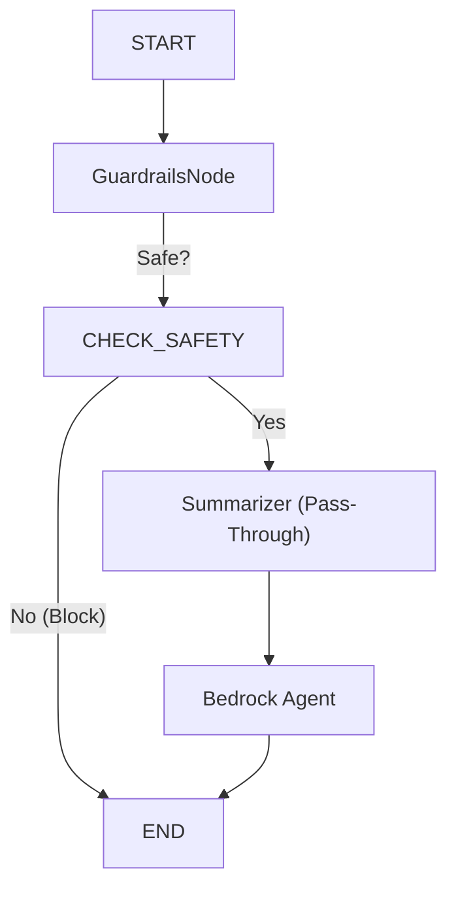

[Gemini | Turn ID: 71 | Time: 2025-12-23 01:05 CST]
# 1080 - Low-Level Design: Wire Agent to Defense Funnel

## 1. Context & Goal
* **Issue:** #80
* **Objective:** Wire the `agent.py` LangGraph to enforce the "Defense in Depth" architecture.
* **Reviewer:** Claude Opus (Verdict: Approved with clarifications).
* **Strategy:** Fail Fast, Fail Closed.

## 2. Requirements

### 2.1 Guardrails Integration (The Gatekeeper)
1.  **Single Entry Point:** Call `src.guardrails.engine.validate(text)`. This internally orchestrates L1 (Regex), L2 (Hate List), and L3 (Semantic).
2.  **Fail Closed:** If `engine.validate` throws an exception, catch it and treat the input as **BLOCKED** (Reason: "Internal Security Error").
3.  **Feedback:** If blocked, append an `AIMessage` with the block reason to `state['messages']` so the user sees it immediately.

### 2.2 Summarizer Integration (The Placeholder)
1.  Create a `summarizer_node`.
2.  **Behavior:** Pass-through (No-Op) for now.
3.  **Future:** Will handle Legal Compliance (Issue #85).

### 2.3 Graph Topology
1.  `Start` -> `Guardrails`
2.  `Guardrails` -> (Conditional) -> `End` (if blocked) OR `Summarizer` (if safe)
3.  `Summarizer` -> `Agent`
4.  `Agent` -> `End`

## 3. Diagram



## 4. Technical Approach

* **Module:** `agent.py`
* **Dependencies:** `src.guardrails.engine`
* **Pattern:** "Fail Fast" (Security violations abort execution immediately).
* **State Management:** Extends `AgentState` to carry security signals.

## 5. Implementation Details

### 5.1 State Schema Update

```python
class AgentState(TypedDict):
    messages: Annotated[list[AnyMessage], add_messages]
    thread_id: str
    raw_selection: str
    
    # New Fields
    guardrail_result: dict  # {'blocked': bool, 'reason': str}
    signals: dict           # Default: {} (Future use for Issue #85)

```

### 5.2 Node Logic

**A. `guardrails_node**`

```python
def guardrails_node(state: AgentState):
    raw_text = state.get("raw_selection", "")
    
    try:
        # Orchestrates L1, L2, L3
        result = engine.validate(raw_text)
    except Exception as e:
        # Fail Closed (Opus Point 1)
        result = {"blocked": True, "reason": "Internal Security Error"}
        # Log the error here (logger.error(e))

    if result["blocked"]:
        # Delivery Mechanism (Opus Point 3)
        return {
            "guardrail_result": result,
            "messages": [AIMessage(content=f"BLOCKED: {result['reason']}")]
        }
    
    return {"guardrail_result": result}

```

**B. `summarizer_node**`

```python
def summarizer_node(state: AgentState):
    # Pass-through for Issue #80. 
    # Logic for 'noarchive' handling comes in Issue #85.
    return {"signals": {}} 

```

**C. Conditional Edge: `should_continue**`

```python
def should_continue(state: AgentState):
    result = state.get("guardrail_result", {})
    if result.get("blocked"):
        return "__end__"
    return "summarizer_node"

```

## 6. Verification & Testing

* **Ref:** `docs/0005-testing-strategy-and-protocols.md`
* **Test File:** `tests/test_agent_wiring.py`
* **Strategy:** Use `langgraph`'s local testing capabilities (Mock `src.guardrails.engine.validate`).

### 6.2 Test Scenarios

| Scenario | Mock Behavior | Expected Path | Expected Output |
| --- | --- | --- | --- |
| **Happy Path** | Returns `blocked=False` | `GR` -> `Sum` -> `Agent` | Agent Output |
| **Violation** | Returns `blocked=True` | `GR` -> `End` | Message: "BLOCKED:..." |
| **Exception** | Raises `ValueError` | `GR` -> `End` | Message: "BLOCKED: Internal..." |

## 7. Definition of Done

* [ ] `agent.py` updated with new nodes and state schema.
* [ ] `guardrails_node` implements "Fail Closed" logic.
* [ ] Unit tests (`tests/test_agent_wiring.py`) pass for all 3 scenarios.
