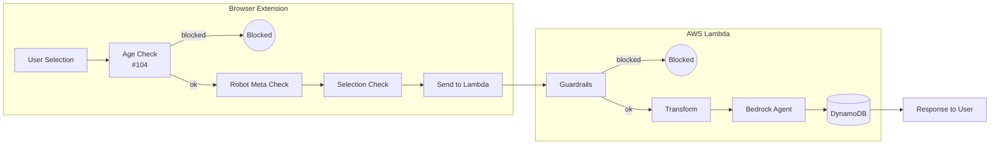

[Gemini | Turn ID: 71 | Time: 2025-12-23 01:05 CST]
[Updated: Claude Opus 4.5 | 2025-12-29 | Template compliance, removed implementation code]

# 1080 - Low-Level Design: Wire Agent to Defense Funnel

## 1. Context & Goal

* **Issue:** #80
* **Objective:** Wire the `agent.py` LangGraph to enforce the "Defense in Depth" architecture.
* **Status:** In Progress
* **Reviewer:** Claude Opus (Verdict: Approved with clarifications)
* **Strategy:** Fail Fast, Fail Closed
* **Related Issues:** #45 (Denylist - stub), #104 (Age Check), #109 (Layer renaming), #112 (Signal handling)

## 2. Requirements

1. **Guardrails Integration:** Single entry point via `engine.validate()` orchestrating Denylist (stub) and Semantic checks
2. **Fail Closed:** Any exception treated as BLOCKED (Internal Security Error)
3. **User Feedback:** Blocked content returns user-friendly message via `AIMessage`
4. **Transform Integration:** Pass-through stub for noarchive handling (future)
5. **State Management:** Extend `AgentState` to carry security signals

## 3. Alternatives Considered

| Option | Pros | Cons | Decision |
|--------|------|------|----------|
| Sequential node checks | Simple, clear flow | Can't parallelize, verbose graph | **Selected** |
| Parallel guardrail execution | Faster for multiple checks | Complex error handling, race conditions | Rejected |
| Single monolithic node | Fewer graph nodes | Hard to test, violates SRP | Rejected |

**Rationale:** Sequential nodes align with "Defense in Depth" philosophy - each layer is a distinct checkpoint. Easier to test, debug, and extend.

## 4. Architecture Overview

### 4.1 Layer Naming Convention

We use **functional names** instead of L1/L2/L3/L4 because layers may move between client and server.

| Layer | Location | Purpose | Status |
|-------|----------|---------|--------|
| **Age Check** | Extension | Block adult-rated sites | Future (#104) |
| **Robot Meta Check** | Extension | Detect noarchive flag | Future |
| **Selection Check** | Extension | Validate input (entropy, XSS) | Partial |
| **Denylist** | Lambda | Hate term blocking | **STUB** (#45) |
| **Semantic** | Lambda | AI-based context analysis | Implemented |
| **Transform** | Lambda | Summarizer for noarchive | Implemented |

### 4.2 Scope of This Issue (#80)

**In Scope:** Server-side wiring (Lambda)
- Wire `guardrails_node` → calls Denylist (stub) + Semantic
- Wire `summarizer_node` → Transform (pass-through unless noarchive)
- Wire `should_continue` → routing logic
- State schema updates

**Out of Scope:** Client-side checks (separate issues)

## 5. Diagrams

### 5.1 Server-Side Graph (This Issue)


### 5.2 Full Architecture (Context)



## 6. Technical Approach

* **Module:** `agent.py`
* **Dependencies:** `src.guardrails.engine`, `langchain_core.messages`, `langgraph.graph`
* **Pattern:** Fail Fast (security violations abort immediately)

## 7. Interface Specification

### 7.1 Data Structures

```python
# State schema - extends existing AgentState
class AgentState(TypedDict):
    messages: Annotated[list[AnyMessage], add_messages]
    thread_id: str
    raw_selection: str
    guardrail_result: dict   # {'blocked': bool, 'reason': str, 'layer': str}
    signals: dict            # {'noarchive': bool, 'source_url': str, ...}
```

### 7.2 Function Signatures

```python
def guardrails_node(state: AgentState) -> dict:
    """Gatekeeper - validates input through Denylist and Semantic checks.
    Returns: {'guardrail_result': {...}, 'messages': [...] if blocked}
    """
    ...

def summarizer_node(state: AgentState) -> dict:
    """Transform - handles noarchive content. Pass-through for #80.
    Returns: {'signals': {...}}
    """
    ...

def should_continue(state: AgentState) -> str:
    """Router - determines next node based on guardrail result.
    Returns: '__end__' if blocked, 'summarizer_node' if safe
    """
    ...

def build_agent_graph() -> CompiledGraph:
    """Constructs the agent graph with defense funnel.
    Returns: Compiled LangGraph ready for invocation
    """
    ...
```

### 7.3 Logic Flow (Pseudocode)

**guardrails_node:**
```
1. Get raw_selection from state
2. IF empty or whitespace THEN
   - Return blocked (Empty selection)
3. TRY
   - Call engine.validate(raw_selection)
4. CATCH any exception
   - Return blocked (Internal Security Error)  [Fail Closed]
5. IF result.blocked THEN
   - Return guardrail_result + AIMessage with block reason
6. ELSE
   - Return guardrail_result only
```

**summarizer_node:**
```
1. Get signals from state
2. [STUB] Return signals unchanged
3. [FUTURE] IF signals.noarchive THEN
   - Call Transform to summarize
   - Replace raw_selection with summary
```

**should_continue:**
```
1. Get guardrail_result from state
2. IF blocked THEN return "__end__"
3. ELSE return "summarizer_node"
```

## 8. Security Considerations

| Concern | Mitigation | Status |
|---------|------------|--------|
| Input injection | All input passes through guardrails before processing | Addressed |
| Exception leakage | Fail Closed - exceptions become generic "Internal Security Error" | Addressed |
| Bypass via empty input | Explicit empty/whitespace check before engine call | Addressed |
| Malformed API requests | Lambda handler validates payload structure | TODO |

**Fail Mode:** Fail Closed - Any uncertainty results in BLOCKED status. User safety over availability.

## 9. Performance Considerations

| Metric | Budget | Approach |
|--------|--------|----------|
| Latency (guardrails) | < 200ms | Denylist is O(1) hash lookup, Semantic uses Haiku (fast) |
| Latency (total) | < 2000ms | Bedrock dominates; guardrails negligible |
| Memory | < 256MB Lambda | State is small (text + signals) |
| API Calls | 1-2 per request | Haiku for Semantic, Sonnet for Agent |

**Bottlenecks:** Bedrock API latency dominates. Guardrails add ~100-200ms.

## 10. Risks & Mitigations

| Risk | Impact | Likelihood | Mitigation |
|------|--------|------------|------------|
| Semantic check false positive | User blocked incorrectly | Medium | Log all blocks, review patterns |
| Denylist bypass (not implemented) | Hate content passes through | High until #45 | Semantic provides backup |
| Exception in guardrails crashes Lambda | Service unavailable | Low | Fail Closed catches all exceptions |
| State schema mismatch | Runtime errors | Medium | Type hints + unit tests |

## 11. Verification & Testing

*Ref: [0005-testing-strategy-and-protocols.md](0005-testing-strategy-and-protocols.md)*
*Test File: `tests/test_agent_wiring.py`*

### 11.1 Test Scenarios

| ID | Scenario | Type | Input | Expected Output | Pass Criteria |
|----|----------|------|-------|-----------------|---------------|
| 010 | Happy Path | Auto | Safe text | Agent processes, returns response | No BLOCKED message |
| 020 | Blocked by Denylist | Auto | Mock blocked=True | BLOCKED message | Contains "BLOCKED:" |
| 030 | Blocked by Semantic | Auto | Mock blocked=True, layer=semantic | BLOCKED message | Contains "BLOCKED:" |
| 040 | Exception (Fail Closed) | Auto | Mock raises ValueError | BLOCKED: Internal Security Error | Reason = "Internal Security Error" |
| 050 | Malformed Request - Empty | Auto | "" | BLOCKED: No text | guardrail_result.blocked=True |
| 060 | Malformed Request - Whitespace | Auto | "   \n\t  " | BLOCKED: No text | guardrail_result.blocked=True |
| 070 | Transform Pass-through | Auto | Safe text + signals | signals unchanged | signals returned as-is |

*Note: Tests 050/060 are API-level validation tests (automation only). Cannot be triggered from extension UI - empty selection doesn't show context menu.*

### 11.2 Test Strategy

* **Unit Tests:** Mock `engine.validate` to test node logic in isolation
* **Integration Test:** Run full graph with mocked Bedrock
* **End-to-End:** Manual smoke test with real Lambda + Bedrock

### 11.3 Manual Smoke Test

1. Load extension on allowlisted site
2. Select safe text, click "Explain with AI"
3. Verify response appears (not BLOCKED)
4. Select provocative text (if Semantic working)
5. Verify BLOCKED message appears

*Full test results recorded in Test Report (0113) or Implementation Report (0103).*

## 12. Stub Modules

The following are **intentional stubs** that pass through until their respective issues are implemented:

| Component | Stub Behavior | Implementing Issue |
|-----------|--------------|-------------------|
| Denylist (in engine.validate) | Returns `blocked=False` | #45 |
| Transform (summarizer_node) | Returns signals unchanged | #85 |
| Age Check | Not called (extension-side) | #104 |
| Robot Meta Check | Not called (extension-side) | Future |

## 13. Definition of Done

### Code
- [ ] `agent.py` updated with new nodes and state schema
- [ ] `guardrails_node` implements Fail Closed logic
- [ ] `summarizer_node` implements pass-through stub
- [ ] `should_continue` implements routing logic
- [ ] `build_agent_graph` constructs graph correctly
- [ ] `lambda_function.py` updated to use new graph
- [ ] Code comments reference this LLD
- [ ] `src/guardrails/engine.py` refactored to integrate `SemanticGuardrail`
- [ ] `src/guardrails/engine.py` implements Denylist stub (hardcoded empty set)

### Tests
- [ ] `tests/test_agent_wiring.py` created
- [ ] All 7 test scenarios pass (010-070)
- [ ] Test coverage > 90% for new code

### Documentation
- [ ] This LLD updated with any deviations
- [ ] Implementation Report (0103) completed
- [ ] Test Report (0113) completed

### Review
- [ ] Code review by Gemini or Claude
- [ ] User approval before closing issue
