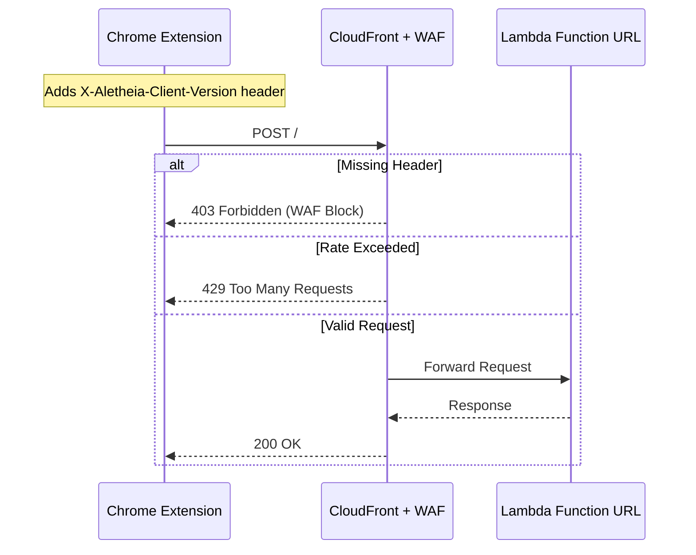

# 1095 - Feature: Security Hardening & Rate Limiting

## 1. Context & Goal
* **Issue:** #95
* **Objective:** Protect Lambda from abuse via AWS WAF (rate limiting + header validation)
* **Status:** Draft
* **Related Issues:** #116 (OAuth - future auth gate)

## 2. Requirements

1. **Rate Limiting:** Cap requests per IP (configurable: 100/5min prod, 10/10min dev)
2. **Header Validation:** Block requests missing `X-Aletheia-Client-Version` header
3. **Denial of Wallet Protection:** Prevent attackers from running up AWS costs
4. **Extension Updates:** Inject required headers into all API calls
5. **Automated Verification:** Script to assert WAF behavior (no manual-only testing)

## 3. Alternatives Considered

### Architecture Options

**Critical Constraint:** AWS WAF cannot attach directly to Lambda Function URLs. WAF requires one of:
- CloudFront distribution
- API Gateway (REST or HTTP)
- Application Load Balancer

| Option | Pros | Cons | Decision |
|--------|------|------|----------|
| A: CloudFront → Lambda Function URL | Simple, no Lambda changes, CDN benefits | Extra service, caching can interfere with POST | **Selected** |
| B: API Gateway → Lambda | Native integration, built-in throttling | Requires Lambda permission changes, new URL | Rejected |
| C: Lambda-level validation only | No AWS service changes | No real protection (attacker still invokes Lambda) | Rejected |

**Rationale:** Option A provides WAF protection while preserving the existing Lambda Function URL as the origin. CloudFront can be configured to not cache POST requests. This adds a layer of protection before requests even reach Lambda.

### Header Strategy

| Option | Pros | Cons | Decision |
|--------|------|------|----------|
| X-Api-Key (static) | Simple, can validate in WAF | Key embedded in extension (reversible) | Rejected (alone) |
| X-Client-Version only | Identifies extension requests, version tracking | No secret, easy to spoof | **Selected** |
| Both headers | Defense in depth | Complexity, false security | Selected for future |

**Rationale:** For MVP, `X-Aletheia-Client-Version` header provides:
1. Differentiation from random scripts (must know header name)
2. Version tracking for deprecation
3. WAF rule anchor point

A static API key adds minimal security since it's embedded in the extension source. Real protection comes from rate limiting + future OAuth (#116).

## 4. Data & Fixtures

### 4.1 Data Sources

| Attribute | Value |
|-----------|-------|
| Source | N/A (configuration only) |
| Format | N/A |
| Size | N/A |
| Refresh | Manual (version bump) |
| Copyright/License | N/A |

### 4.2 Data Pipeline

```
Extension Request → CloudFront (WAF) → Lambda Function URL → Lambda
```

### 4.3 Test Fixtures

| Fixture | Source | Notes |
|---------|--------|-------|
| curl without headers | Manual | Should return 403 |
| curl with headers | Manual | Should return 200 |
| Rapid requests | Manual | Should trigger 429 after threshold |

### 4.4 Deployment Pipeline

1. Create CloudFront distribution pointing to Lambda Function URL
2. Create WAF Web ACL with rules
3. Associate WAF with CloudFront
4. Update extension with new endpoint + headers
5. Deploy extension update

## 5. Diagram



## 6. Technical Approach

### 6.1 AWS Infrastructure

**CloudFront Distribution:**
- Origin: `sqrqfnypgswudwtcheeasq5xri0aryfx.lambda-url.us-east-1.on.aws`
- Cache Policy: CachingDisabled (POST requests)
- Origin Request Policy: AllViewerExceptHostHeader
- SSL: Default CloudFront certificate (or custom domain later)

**WAF Web ACL:**
- Scope: CloudFront (global)
- Rules (in priority order):
  1. **Block Missing Header:** Block if `X-Aletheia-Client-Version` header absent
  2. **Rate Limit:** Configurable per environment (action: Block with 429)
  3. **Default:** Allow

**Rate Limit Configuration:**

| Environment | Limit | Window | CLI Flag |
|-------------|-------|--------|----------|
| Production | 100 requests | 5 minutes (300s) | `--env prod` (default) |
| Development | 10 requests | 10 minutes (600s) | `--env dev` |

Note: WAF rate-based rules have minimum 5-minute evaluation windows. Dev mode uses 10-minute window for stricter testing.

### 6.2 Extension Changes

**File:** `extension/service-worker.js`
**Change:** Add headers to fetch request

### 6.3 Infrastructure Scripts

**New File:** `tools/aws/waf-setup.sh`

* **Module:** `tools/aws/waf-setup.sh`
* **Dependencies:** AWS CLI v2, CloudFront, WAFv2
* **Pattern:** Infrastructure as Code (shell script)

## 7. Interface Specification

### 7.1 WAF Rule Definitions (JSON)

```json
{
  "Name": "AletheiaWebACL",
  "Rules": [
    {
      "Name": "RequireClientVersion",
      "Priority": 1,
      "Action": { "Block": {} },
      "Statement": {
        "NotStatement": {
          "Statement": {
            "ByteMatchStatement": {
              "FieldToMatch": { "SingleHeader": { "Name": "x-aletheia-client-version" } },
              "PositionalConstraint": "STARTS_WITH",
              "SearchString": "1.",
              "TextTransformations": [{ "Priority": 0, "Type": "NONE" }]
            }
          }
        }
      }
    },
    {
      "Name": "RateLimitPerIP",
      "Priority": 2,
      "Action": { "Block": { "CustomResponse": { "ResponseCode": 429 } } },
      "Statement": {
        "RateBasedStatement": {
          "Limit": 100,
          "EvaluationWindowSec": 300,
          "AggregateKeyType": "IP"
        }
      }
    }
  ],
  "DefaultAction": { "Allow": {} }
}
```

### 7.2 Extension Header Addition

```javascript
// service-worker.js - Updated fetch call
const response = await fetch(API_ENDPOINT, {
    method: 'POST',
    headers: {
        'Content-Type': 'application/json',
        'X-Aletheia-Client-Version': '1.0'
    },
    body: JSON.stringify(payload)
});
```

### 7.3 CORS Update Required

CloudFront origin must forward the new header. Lambda CORS config must allow it:

```json
{
  "AllowHeaders": ["content-type", "x-aletheia-client-version"],
  "AllowMethods": ["POST"],
  "AllowOrigins": ["*"]
}
```

## 8. Security Considerations

| Concern | Mitigation | Status |
|---------|------------|--------|
| Header can be spoofed | **TEMPORARY STOPGAP** - raises bar until Issue #116 (OAuth) is live | Accepted |
| API key in extension source | Not using API key for MVP | N/A |
| DDoS on CloudFront | AWS Shield Standard (free) | Addressed |
| Rate limit bypass via IP rotation | Real protection needs auth (#116) | Accepted |
| Cost spike from attack | Rate limiting + CloudFront tiered pricing | Addressed |
| CloudFront/WAF unreachable | Extension shows "Connection Error" overlay (existing behavior) | Addressed |

**Fail Mode:** Fail Closed - Missing headers = blocked, rate exceeded = blocked

### 8.1 Extension Failure Behavior

If CloudFront or WAF is unreachable (network error, AWS outage):
1. `fetch()` throws network error
2. Extension catches error in existing try/catch block
3. User sees "Connection Error" overlay (amber warning)
4. No data is sent - **Fail Closed**

This is identical to current behavior when Lambda is unreachable. No extension changes needed for error handling.

### 8.2 Manifest Permissions

The `API_ENDPOINT` change from Lambda Function URL to CloudFront URL does NOT require manifest permission changes:
- Extension uses `fetch()` which doesn't require host_permissions for POST to any HTTPS URL
- No `host_permissions` array changes needed
- Only `service-worker.js` constant update required

## 9. Performance Considerations

| Metric | Budget | Approach |
|--------|--------|----------|
| Latency | +10-50ms | CloudFront edge location reduces this |
| Cold start | N/A | CloudFront doesn't affect Lambda cold starts |
| Cost | ~$0 at MVP scale | CloudFront free tier: 1TB/month, 10M requests |

**Bottlenecks:** None expected at MVP scale

## 10. Risks & Mitigations

| Risk | Impact | Likelihood | Mitigation |
|------|--------|------------|------------|
| CloudFront misconfiguration blocks legitimate users | High | Medium | Thorough testing with checklist |
| WAF rule too aggressive | High | Low | Start with permissive limits, monitor |
| Extension users on old version blocked | Medium | Low | Version prefix match (1.*) |
| Origin header forwarding breaks Lambda | High | Medium | Test CORS thoroughly |

## 11. Verification & Testing

### 11.1 Test Scenarios

| ID | Scenario | Type | Input | Expected Output | Pass Criteria |
|----|----------|------|-------|-----------------|---------------|
| 010 | Request without header | **Auto** | `verify_waf.sh` | 403 Forbidden | Script asserts exit 0 |
| 020 | Request with valid header | **Auto** | `verify_waf.sh` | 200 OK | Script asserts exit 0 |
| 030 | Rate limit trigger | **Auto** | `verify_waf.sh --test-rate-limit` | 429 after limit | Script asserts exit 0 |
| 040 | Extension E2E via Playwright | **Auto** | `npm run test:waf` | All tests pass | Playwright assertions pass |
| 050 | Invalid version format | **Auto** | `verify_waf.sh` | 403 Forbidden | Script asserts exit 0 |

### 11.2 Test Modules

* **Infrastructure Tests:** `tests/infra/verify_waf.sh` (automated assertions)
* **E2E Tests:** `tests/e2e/waf-integration.spec.js` (Playwright, browser + extension)
* **Unit Tests:** N/A (infrastructure change)

### 11.3 Automated WAF Verification Script

**File:** `tests/infra/verify_waf.sh`

```bash
#!/bin/bash
# Automated WAF verification - NO VIBES TESTING
# Exit codes: 0 = all pass, 1 = failure

set -e

CLOUDFRONT_URL="${CLOUDFRONT_URL:-https://d1234567890.cloudfront.net}"

echo "=== WAF Verification Suite ==="

# Test 010: Missing header should return 403
echo -n "Test 010: Missing header... "
HTTP_CODE=$(curl -s -o /dev/null -w "%{http_code}" -X POST "$CLOUDFRONT_URL")
if [ "$HTTP_CODE" -eq 403 ]; then
    echo "PASS (got $HTTP_CODE)"
else
    echo "FAIL (expected 403, got $HTTP_CODE)"
    exit 1
fi

# Test 020: Valid header should return 200
echo -n "Test 020: Valid header... "
HTTP_CODE=$(curl -s -o /dev/null -w "%{http_code}" -X POST \
    -H "X-Aletheia-Client-Version: 1.0" \
    -H "Content-Type: application/json" \
    -d '{"word":"test","url":"https://example.com","title":"Test","context":"Test context"}' \
    "$CLOUDFRONT_URL")
if [ "$HTTP_CODE" -eq 200 ]; then
    echo "PASS (got $HTTP_CODE)"
else
    echo "FAIL (expected 200, got $HTTP_CODE)"
    exit 1
fi

# Test 050: Invalid version format should return 403
echo -n "Test 050: Invalid version (0.9)... "
HTTP_CODE=$(curl -s -o /dev/null -w "%{http_code}" -X POST \
    -H "X-Aletheia-Client-Version: 0.9" \
    "$CLOUDFRONT_URL")
if [ "$HTTP_CODE" -eq 403 ]; then
    echo "PASS (got $HTTP_CODE)"
else
    echo "FAIL (expected 403, got $HTTP_CODE)"
    exit 1
fi

# Test 030: Rate limit (optional, slow)
if [ "$1" == "--test-rate-limit" ]; then
    echo "Test 030: Rate limit (this takes time)..."
    LIMIT="${RATE_LIMIT:-100}"
    for i in $(seq 1 $((LIMIT + 1))); do
        HTTP_CODE=$(curl -s -o /dev/null -w "%{http_code}" -X POST \
            -H "X-Aletheia-Client-Version: 1.0" \
            -H "Content-Type: application/json" \
            -d '{"word":"test"}' \
            "$CLOUDFRONT_URL")
        if [ "$i" -le "$LIMIT" ] && [ "$HTTP_CODE" -ne 200 ]; then
            echo "FAIL: Request $i got $HTTP_CODE (expected 200)"
            exit 1
        fi
        if [ "$i" -gt "$LIMIT" ] && [ "$HTTP_CODE" -ne 429 ]; then
            echo "FAIL: Request $i got $HTTP_CODE (expected 429)"
            exit 1
        fi
    done
    echo "PASS: Rate limit enforced at $LIMIT"
fi

echo "=== All WAF tests passed ==="
exit 0
```

### 11.4 Manual Smoke Test (Extension Only)

Scenario 040 requires human verification:
1. Load updated extension with CloudFront endpoint
2. Navigate to test page, enable domain
3. Select text, click "Explain with AI"
4. Verify: Success overlay appears (green border)

## 12. Definition of Done

### Code
- [ ] `tools/aws/waf-setup.sh` created with `--env dev|prod` flag
- [ ] `tests/infra/verify_waf.sh` created (automated assertions)
- [ ] `extension/service-worker.js` updated with header
- [ ] Lambda CORS updated to allow new header
- [ ] Extension `API_ENDPOINT` updated to CloudFront URL

### Tests
- [ ] `tests/infra/verify_waf.sh` exits 0 (scenarios 010, 020, 050)
- [ ] `tests/infra/verify_waf.sh --test-rate-limit` exits 0 (scenario 030)
- [ ] Manual scenario 040 passes (extension end-to-end)

### Documentation
- [ ] LLD updated with any deviations
- [ ] Implementation Report completed
- [ ] Test Report completed

### Review
- [ ] Code review completed
- [ ] User approval before closing issue

---

## Appendix A: Implementation Script Outline

```bash
#!/bin/bash
# tools/aws/waf-setup.sh
# Creates CloudFront distribution + WAF Web ACL for Aletheia
#
# Usage:
#   ./waf-setup.sh              # Production: 100 req/5min
#   ./waf-setup.sh --env dev    # Development: 10 req/10min
#   ./waf-setup.sh --env prod   # Production (explicit)

set -e

# Parse arguments
ENV="prod"
while [[ $# -gt 0 ]]; do
    case $1 in
        --env) ENV="$2"; shift 2 ;;
        *) echo "Unknown option: $1"; exit 1 ;;
    esac
done

# Environment-specific rate limits
if [ "$ENV" == "dev" ]; then
    RATE_LIMIT=10
    RATE_WINDOW=600  # 10 minutes
    echo "=== Development Mode: 10 req/10min ==="
else
    RATE_LIMIT=100
    RATE_WINDOW=300  # 5 minutes
    echo "=== Production Mode: 100 req/5min ==="
fi

LAMBDA_URL="sqrqfnypgswudwtcheeasq5xri0aryfx.lambda-url.us-east-1.on.aws"
WAF_NAME="AletheiaWebACL"
CF_COMMENT="Aletheia API Gateway"

# 1. Create WAF Web ACL (must be in us-east-1 for CloudFront)
# 2. Create CloudFront distribution with Lambda URL origin
# 3. Associate WAF with CloudFront
# 4. Output new endpoint URL

echo "Implementation details in full script..."
```

## Appendix B: Rollback Plan

If issues occur post-deployment:
1. Update extension `API_ENDPOINT` back to direct Lambda URL
2. Disable WAF Web ACL (or set default action to Allow)
3. CloudFront can remain (acts as passthrough)
