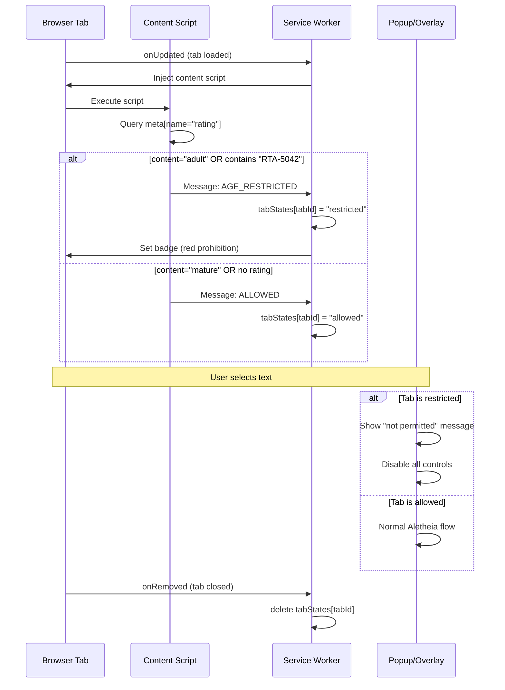

# 1104 - Feature: Block Age-Restricted Sites

## 1. Context & Goal
* **Issue:** #104
* **Objective:** Prevent Aletheia from activating on age-restricted websites by detecting adult content meta tags.
* **Status:** Draft
* **Related Issues:** #105 (test site infrastructure for verification)

## 2. Requirements

| ID | Requirement | Acceptance Criteria |
|----|-------------|---------------------|
| R1 | Detect `<meta name="rating" content="adult">` tag | Extension identifies adult-rated pages |
| R2 | Detect RTA label pattern | Recognize `RTA-5042-1996-1400-1577-RTA` content value |
| R3 | Block text selection prompt | Show "not permitted" message instead of "Enable Aletheia" |
| R4 | Display prohibition icon | Extension icon shows red prohibition symbol on restricted tabs |
| R5 | Icon persists until tab close | No timer - state lasts for tab lifetime |
| R6 | No data persistence | Forget site restriction when tab closes |
| R7 | Popup shows disabled state | All controls disabled with explanation when on restricted site |
| R8 | Allow `content="mature"` | Do NOT block on mature rating (movie reviews, medical sites) |

## 3. Alternatives Considered

| Option | Pros | Cons | Decision |
|--------|------|------|----------|
| A. Block on any rating | Simple implementation | Over-blocks legitimate content (mature != adult) | **Rejected** |
| B. Block only on `adult` + RTA | Precise, follows Google guidance | Two patterns to check | **Selected** |
| C. Maintain persistent blocklist | Remembers known adult sites | Privacy concern, storage overhead | **Rejected** |
| D. Time-limited blocking | Allows accidental visits to recover | Could enable bypass attempts | **Rejected** |

**Rationale:** Google's SafeSearch guidelines explicitly distinguish `adult` from `mature`. We block on definitive adult indicators only, per-tab without persistence to maintain privacy.

## 4. Data & Fixtures

### 4.1 Data Sources

| Attribute | Value |
|-----------|-------|
| Source | Host page `<meta>` tags (DOM) |
| Format | HTML meta element |
| Size | Single DOM query per page |
| Refresh | On page load / tab update |
| Copyright/License | N/A - reading public page metadata |

### 4.2 Data Pipeline

```
Page Load ──DOM query──► Content Script ──message──► Service Worker ──state──► Tab State Map
```

### 4.3 Test Fixtures

| Fixture | Source | Notes |
|---------|--------|-------|
| `test-adult.html` | Created for testing | `<meta name="rating" content="adult">` |
| `test-rta.html` | Created for testing | `<meta name="rating" content="RTA-5042-...">` |
| `test-mature.html` | Created for testing | `<meta name="rating" content="mature">` - should NOT block |
| `test-clean.html` | Created for testing | No rating meta tag |

### 4.4 Deployment Pipeline

Test pages deployed via GitHub Pages or similar (see #105). Extension updated via normal Chrome extension deployment.

## 5. Diagram



## 6. Technical Approach

* **Module:** `extension/service-worker.js`, `extension/content-check.js` (new)
* **Dependencies:** Chrome Extension APIs (`scripting`, `tabs`, `action`)
* **Pattern:** Event-driven state machine per tab

### 6.1 Detection Logic

```javascript
// Content script detection
const ratingMeta = document.querySelector('meta[name="rating"]');
const content = ratingMeta?.getAttribute('content')?.toLowerCase() || '';

const isRestricted =
    content === 'adult' ||
    content.includes('rta-5042-1996-1400-1577-rta');
```

### 6.2 State Management

Tab states stored in memory (not `chrome.storage`):
```javascript
// service-worker.js
const tabStates = new Map(); // tabId -> 'restricted' | 'allowed'
```

Cleared automatically when tab closes via `chrome.tabs.onRemoved`.

## 7. Interface Specification

### 7.1 Data Structures

```javascript
// Tab state (in-memory only)
const TabState = {
    RESTRICTED: 'restricted',  // Adult content detected
    ALLOWED: 'allowed',        // No adult content
};

// Message from content script to service worker
const RatingCheckMessage = {
    type: 'RATING_CHECK',
    isRestricted: boolean,
    ratingValue: string | null,  // For logging
};
```

### 7.2 Function Signatures

```javascript
// content-check.js
function checkPageRating(): RatingCheckMessage;

// service-worker.js
function handleRatingCheck(tabId: number, message: RatingCheckMessage): void;
function isTabRestricted(tabId: number): boolean;
function setRestrictedBadge(tabId: number): void;
function clearTabState(tabId: number): void;
```

### 7.3 Logic Flow (Pseudocode)

```
1. Tab loads or updates (onUpdated event)
2. Inject content-check.js into tab
3. Content script queries <meta name="rating">
4. IF content === "adult" OR content contains RTA pattern:
   - Send RESTRICTED message to service worker
   - Service worker stores tabStates[tabId] = "restricted"
   - Set badge to prohibition icon
   ELSE:
   - Send ALLOWED message
   - Service worker stores tabStates[tabId] = "allowed"

5. ON text selection (context menu):
   - Check tabStates[tabId]
   - IF restricted: show "not permitted" overlay, return
   - ELSE: normal Aletheia flow

6. ON tab close (onRemoved):
   - delete tabStates[tabId]
```

## 8. Security Considerations

| Concern | Mitigation | Status |
|---------|------------|--------|
| Bypass via meta tag removal | State set once on load, not re-checked | Addressed |
| Injection from page | Content script runs in isolated world | Addressed |
| False positives | Only block exact patterns per Google spec | Addressed |
| Storage of adult site visits | No persistence - memory only, cleared on tab close | Addressed |

**Fail Mode:** Fail Open - If detection fails, site is treated as allowed. We cannot risk blocking legitimate sites. Adult site operators who want to be blocked must properly tag their content.

## 9. Performance Considerations

| Metric | Budget | Approach |
|--------|--------|----------|
| Detection latency | < 10ms | Single DOM query |
| Memory per tab | < 100 bytes | Simple string state |
| CPU | Negligible | Event-driven, no polling |

**Bottlenecks:** None expected. Single synchronous DOM query on page load.

## 10. Risks & Mitigations

| Risk | Impact | Likelihood | Mitigation |
|------|--------|------------|------------|
| Site doesn't use rating meta | Low | High | Fail open - not our problem if site doesn't tag |
| User disables content scripts | Med | Low | Extension won't work anyway without scripts |
| RTA pattern changes | Low | Very Low | RTA-5042 is a fixed standard from 1996 |
| Browser caches old page | Low | Low | Detection runs on each page load event |

## 11. Verification & Testing

### 11.1 Test Scenarios

| ID | Scenario | Type | Input | Expected Output | Pass Criteria |
|----|----------|------|-------|-----------------|---------------|
| 010 | Detect adult rating | Manual | Page with `content="adult"` | Badge shows prohibition | Icon changes |
| 020 | Detect RTA pattern | Manual | Page with RTA content | Badge shows prohibition | Icon changes |
| 030 | Allow mature rating | Manual | Page with `content="mature"` | Normal operation | No blocking |
| 040 | Allow no rating | Manual | Page without rating meta | Normal operation | No blocking |
| 050 | Text selection blocked | Manual | Select text on adult page | "Not permitted" message | No "Enable" prompt |
| 060 | State clears on tab close | Manual | Close restricted tab, reopen site | Fresh state check | No persistent block |
| 070 | Popup disabled state | Manual | Open popup on restricted tab | All controls disabled | Explanation shown |
| 080 | Multiple tabs independent | Manual | Adult tab + normal tab | Each has correct state | States don't leak |

### 11.2 Test Modules (from 0005)

* **Unit Tests:** N/A - extension code, manual testing
* **Semantic (Module B):** No
* **End-to-End (Module C):** Yes - requires test site hosting (#105)

### 11.3 Manual Smoke Test

1. Deploy test pages (per #105)
2. Load `test-adult.html` - verify prohibition badge appears
3. Select text - verify "not permitted" message (not "Enable Aletheia")
4. Click extension icon - verify popup shows disabled state
5. Close tab
6. Load `test-mature.html` - verify normal operation
7. Load `test-clean.html` - verify normal operation

## 12. Definition of Done

### Code
- [ ] `content-check.js` created with meta tag detection
- [ ] `service-worker.js` updated with tab state management
- [ ] Prohibition badge implementation
- [ ] "Not permitted" overlay message
- [ ] Popup disabled state UI

### Tests
- [ ] All manual test scenarios pass (010-080)
- [ ] Test pages created and deployed (#105)

### Documentation
- [ ] LLD updated with any deviations
- [ ] Decision recorded in 0202-DR-content-safety.md (referenced in issue)

### Review
- [ ] Code review completed
- [ ] User approval before closing issue
