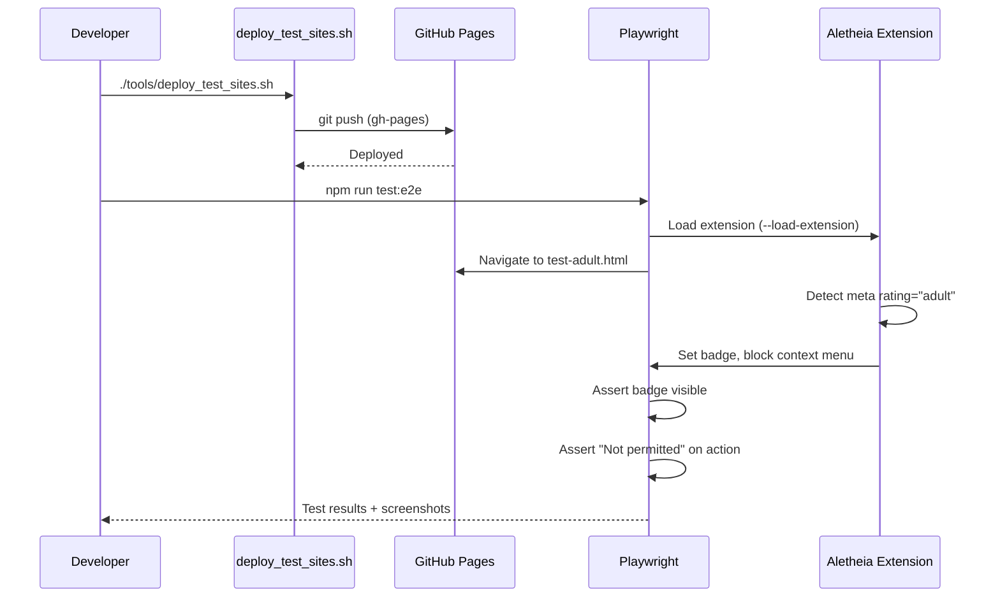

# 1105 - Feature: Scriptable Test Site Infrastructure

## 1. Context & Goal
* **Issue:** #105
* **Objective:** Create scriptable infrastructure to host test websites for Aletheia extension testing, enabling automated verification of #104 (age gate) and XSS protection.
* **Status:** Draft
* **Related Issues:** #104 (age-restricted blocking - blocked by this)

## 2. Requirements

| ID | Requirement | Acceptance Criteria |
|----|-------------|---------------------|
| R1 | Free or near-free hosting | $0/month or pennies |
| R2 | Scriptable provisioning | No manual clicking - CLI deploy |
| R3 | Test page hosting | Multiple HTML pages with various meta tags |
| R4 | Custom domain support | Can use user's existing domains |
| R5 | Playwright integration | Automated tests can load extension and verify behavior |
| R6 | XSS test coverage | Verify extension doesn't execute injected scripts |

## 3. Alternatives Considered

| Option | Pros | Cons | Decision |
|--------|------|------|----------|
| GitHub Pages | Free, scriptable via git push, custom domains | Public repo required for free tier | **Selected** |
| Cloudflare Pages | Free, fast, Wrangler CLI | Learning curve, another account | Rejected |
| AWS S3 + CloudFront | Already using AWS, full control | Not free, more setup | Rejected |
| Netlify | Free tier, CLI available | Another account to manage | Rejected |
| Local file:// URLs | No hosting needed | Extension restrictions, unknown domain | Rejected |

**Rationale:** GitHub Pages is free, already integrated with our workflow, supports custom domains, and deploys via simple `git push`.

## 4. Data & Fixtures

### 4.1 Data Sources

| Attribute | Value |
|-----------|-------|
| Source | Static HTML files in `tests/fixtures/html/` |
| Format | HTML with specific meta tags |
| Size | ~1KB per test page |
| Refresh | On git push to gh-pages branch |
| Copyright/License | N/A - our own test fixtures |

### 4.2 Data Pipeline

```
tests/fixtures/html/ ──git push──► gh-pages branch ──GitHub──► *.github.io or custom domain
```

### 4.3 Test Fixtures

| Fixture | Purpose | Key Content |
|---------|---------|-------------|
| `test-adult.html` | Age gate - adult rating | `<meta name="rating" content="adult">` |
| `test-rta.html` | Age gate - RTA pattern | `<meta name="rating" content="RTA-5042-1996-1400-1577-RTA">` |
| `test-mature.html` | Age gate - allowed rating | `<meta name="rating" content="mature">` |
| `test-clean.html` | Baseline - no restrictions | No meta rating tag |
| `test-xss-script.html` | XSS - script tag in selectable text | `<p>Select this: <script>alert(1)</script></p>` |
| `test-xss-img.html` | XSS - img onerror in selectable text | `<p>Select this: </p>` |
| `test-xss-event.html` | XSS - event handler in selectable text | `<p onmouseover="alert(1)">Select this text</p>` |

### 4.4 Deployment Pipeline

1. Test fixtures live in `tests/fixtures/html/`
2. Deploy script copies to gh-pages branch
3. GitHub Pages serves at `https://martymcenroe.github.io/Aletheia/` or custom domain
4. Playwright tests reference these URLs

## 5. Diagram



## 6. Technical Approach

* **Module:** `tests/e2e/`, `tools/deploy_test_sites.sh`
* **Dependencies:** Playwright, GitHub Pages
* **Pattern:** E2E testing with real browser + extension

### 6.1 Playwright Setup

```javascript
// tests/e2e/playwright.config.js
const extensionPath = path.join(__dirname, '../../extension');

module.exports = {
    use: {
        // Chrome with extension loaded
        launchOptions: {
            args: [
                `--disable-extensions-except=${extensionPath}`,
                `--load-extension=${extensionPath}`
            ]
        }
    }
};
```

### 6.2 Test Site URLs

| Environment | Base URL |
|-------------|----------|
| Production | `https://martymcenroe.github.io/Aletheia/tests/` |
| Custom domain (optional) | `https://test.aletheia.example.com/` |

## 7. Interface Specification

### 7.1 Deploy Script

```bash
# tools/deploy_test_sites.sh
#!/bin/bash
# Deploys test fixtures to GitHub Pages

FIXTURES_DIR="tests/fixtures/html"
BRANCH="gh-pages"

# 1. Create/checkout gh-pages branch
# 2. Copy fixtures
# 3. Commit and push
# 4. Return to original branch
```

### 7.2 Playwright Test Structure

```javascript
// tests/e2e/age-gate.spec.js
const { test, expect } = require('@playwright/test');

test.describe('Age Gate (#104)', () => {
    test('blocks adult-rated pages', async ({ page, context }) => {
        await page.goto(TEST_URL + '/test-adult.html');
        // Wait for extension to process
        await page.waitForTimeout(500);
        // Verify badge shows prohibition
        // Verify popup shows "Not Permitted"
        // Verify context menu shows error
    });
});
```

### 7.3 XSS Test Structure

```javascript
// tests/e2e/xss-protection.spec.js
test.describe('XSS Protection', () => {
    test('does not execute script tags in selected text', async ({ page }) => {
        await page.goto(TEST_URL + '/test-xss-script.html');
        // Select the malicious text
        // Trigger Aletheia context menu
        // Verify no alert dialog appeared
        // Verify text was sanitized in overlay
    });
});
```

## 8. Security Considerations

| Concern | Mitigation | Status |
|---------|------------|--------|
| XSS in test fixtures | Test fixtures ARE malicious by design - that's the point | N/A |
| Public test pages | No sensitive data in fixtures | Addressed |
| Extension security | Tests VERIFY extension sanitizes input | TODO |

**Fail Mode:** N/A - This is test infrastructure, not production code.

## 9. Performance Considerations

| Metric | Budget | Approach |
|--------|--------|----------|
| Test execution | < 60s total | Parallel test execution |
| Page load | < 2s | Static HTML, no JS frameworks |
| CI integration | < 5 min | Cache browser binaries |

**Bottlenecks:** GitHub Pages cold start may add latency on first request.

## 10. Risks & Mitigations

| Risk | Impact | Likelihood | Mitigation |
|------|--------|------------|------------|
| GitHub Pages rate limiting | Med | Low | Cache test results, don't hammer |
| Extension load fails in CI | High | Med | Document Chrome flags, pin versions |
| Flaky tests from timing | Med | Med | Use explicit waits, retry logic |
| GH Pages not available | Low | Very Low | Can fall back to local server |

## 11. Verification & Testing

### 11.1 Test Scenarios

| ID | Scenario | Type | Input | Expected Output | Pass Criteria |
|----|----------|------|-------|-----------------|---------------|
| 010 | Deploy script creates gh-pages | Auto | `./tools/deploy_test_sites.sh` | Branch exists, files present | Script exits 0 |
| 020 | Test pages accessible | Auto | `curl $TEST_URL/test-clean.html` | HTTP 200 | Status code 200 |
| 030 | Adult page shows badge | Auto | Navigate to test-adult.html | Prohibition badge visible | Badge text = "⊘" |
| 040 | Adult page blocks popup | Auto | Open popup on test-adult.html | "Not Permitted" view shown | Element visible |
| 050 | Adult page blocks context menu | Auto | Right-click > "Explain with AI" | "Not permitted" overlay | Overlay message matches |
| 060 | RTA page detected | Auto | Navigate to test-rta.html | Same as adult | Badge + blocked |
| 070 | Mature page allowed | Auto | Navigate to test-mature.html | Normal operation | No badge, popup works |
| 080 | Clean page allowed | Auto | Navigate to test-clean.html | Normal operation | No badge, popup works |
| 090 | XSS script tag sanitized | Auto | Select `<script>` text | No alert, text escaped | No JS execution |
| 100 | XSS img onerror sanitized | Auto | Select `` text | No alert, text escaped | No JS execution |
| 110 | XSS event handler sanitized | Auto | Select text with handler | No alert | No JS execution |
| 120 | Tab close clears state | Auto | Close tab, reopen same URL | Fresh state check | No stale badge |
| 130 | Multiple tabs independent | Auto | Adult tab + clean tab | Each has correct state | States isolated |

### 11.2 Test Commands

```bash
# Deploy test sites
./tools/deploy_test_sites.sh

# Install Playwright
npm install --save-dev @playwright/test
npx playwright install chromium

# Run E2E tests
npm run test:e2e

# Run with screenshots (for PR proof)
npm run test:e2e -- --screenshot on
```

### 11.3 Manual Tests

N/A - All scenarios automated via Playwright.

## 12. Definition of Done

### Code
- [ ] `tests/fixtures/html/` - All 7 test HTML files
- [ ] `tools/deploy_test_sites.sh` - Deploy script
- [ ] `tests/e2e/age-gate.spec.js` - Age gate tests
- [ ] `tests/e2e/xss-protection.spec.js` - XSS tests
- [ ] `package.json` - Playwright config added
- [ ] `playwright.config.js` - Extension loading config

### Tests
- [ ] All 13 test scenarios pass
- [ ] Screenshots captured as proof artifacts
- [ ] CI integration (optional stretch goal)

### Documentation
- [ ] LLD updated with any deviations
- [ ] Test URLs documented in README or wiki

### Review
- [ ] Code review completed
- [ ] #104 unblocked and verified passing
