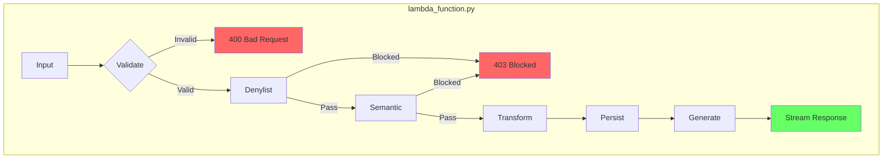

# 1113 - Feature: Naked Python Agent Architecture

## 1. Context & Goal

* **Issue:** #113
* **Objective:** Replace LangGraph/LangChain with pure boto3 for faster cold starts and simpler debugging.
* **Status:** In Progress
* **Related Issues:** #80 (superseded), #10 (semantic), #45 (denylist), #119 (RSDB utility), #116 (LinkedIn Auth - future)
* **ADR:** [0211-ADR-naked-python-architecture.md](0211-ADR-naked-python-architecture.md)

## 2. Requirements

When this feature is complete:

1. `lambda_function.py` is the sole orchestrator (no `agent.py`)
2. All guardrail checks run sequentially before LLM generation
3. System fails closed on ANY exception (no bypass to LLM)
4. Cold start latency reduced by removing LangChain dependency (~200MB)
5. DynamoDB persistence works without LangGraph checkpointer
6. Streaming response maintained via SSE

## 3. Alternatives Considered

*Full analysis in [ADR 0211](0211-ADR-naked-python-architecture.md)*

| Option | Pros | Cons | Decision |
|--------|------|------|----------|
| Naked Python (boto3) | Zero deps, fast cold start, simple | Manual wiring | **Selected** |
| Keep LangGraph | Ready for cycles | 200MB bloat, slow cold start | Rejected |

**Rationale:** Linear pipeline doesn't need graph abstractions. Prioritize latency for browser extension UX.

## 4. Data & Fixtures

*Per [0108-lld-pre-implementation-review.md](0108-lld-pre-implementation-review.md)*

### 4.1 Data Sources

| Attribute | Value |
|-----------|-------|
| **Input** | JSON payload from API Gateway/Function URL |
| **Denylist** | `src/guardrails/resources/denylist.json` (populated via #119) |
| **State** | DynamoDB table `aletheia-state` |
| **LLM** | Bedrock Claude (Haiku for semantic, Sonnet for generation) |

### 4.2 Data Pipeline

```
User Input → Lambda → Denylist Check → Semantic Check → DynamoDB → Bedrock → SSE Stream
                          ↓                  ↓
               denylist.json          boto3.invoke_model
```

### 4.3 Test Fixtures

| Fixture | Source | Notes |
|---------|--------|-------|
| Mock payloads | Hardcoded in tests | Safe terms only, no real slurs |
| Mock boto3 responses | `unittest.mock` | DynamoDB, Bedrock responses |
| Mock denylist | Injected set | `{"test_block_term"}` per #45 pattern |

**Test Data Hygiene:** Tests use mock blocked terms (e.g., `test_block_term`), never real slurs. Real denylist validation occurs in manual smoke tests only.

**Dependency Injection:** `lambda_handler` and `GuardrailEngine` must accept optional parameters for denylist injection to enable mocking. This satisfies the Willison Protocol: tests pass using mocked data, and the repo never contains real slurs in test files.

### 4.4 Deployment Pipeline

1. Run `poetry run python tools/rsdb_download.py` → populates `.rsdb/denylist.json`
2. Copy `.rsdb/denylist.json` → `src/guardrails/resources/denylist.json`
3. Run `./deploy.sh` → zips source and uploads to Lambda
4. Verify DynamoDB table `aletheia-state` exists
5. Verify Bedrock model access configured (IAM role)

## 5. Diagram



## 6. Technical Approach

* **Module:** `lambda_function.py` (orchestrator), `src/guardrails/` (checks)
* **Dependencies:** `boto3` (built into Lambda runtime)
* **Pattern:** Sequential pipeline with early-exit on failure

**CRITICAL: Sequential Execution is Mandatory**

The guardrail pipeline MUST execute sequentially: Denylist → Semantic → Generation. This is NOT an optimization candidate. Rationale: We must fail closed on Semantic check to prevent the Generation step from politely explaining a sexually explicit term. If Semantic fails, Generation MUST NOT run.

### 6.1 Component Map

| Layer | Implementation | Lib |
|:------|:---------------|:----|
| **Orchestrator** | `lambda_function.lambda_handler` | Pure Python |
| **Guardrails** | `src/guardrails/engine.py` | Pure Python |
| **Semantic** | `src/guardrails/semantic.py` | `boto3.invoke_model` |
| **Storage** | `lambda_function.save_state` | `boto3.dynamodb` |
| **LLM** | `lambda_function.generate` | `boto3.invoke_model` |

## 7. Interface Specification

### 7.1 Data Structures

**Input Payload:**
```json
{
  "text": "Selected text",
  "url": "https://example.com",
  "domContext": "Surrounding paragraph...",
  "userId": "uuid"  // Optional until Issue #116 (LinkedIn Auth)
}
```

**Temporary Identity Strategy (Pre-#116):**
Until Issue #116 (LinkedIn Auth) is implemented, `userId` may be missing. The system must:
- Accept requests without `userId`
- Generate a session-based identifier (e.g., hash of URL + timestamp) for DynamoDB PK
- Not crash `save_state` if `userId` is `None`
- Mark all temporary identity code with `# TODO: Issue #116` comments

**DynamoDB Schema (Unchanged):**
* **PK:** `thread_id` (URL hash or User ID)
* **SK:** `checkpoint_id` (Timestamp)
* **Attributes:** `input`, `response`, `safety_score`

### 7.2 Function Signatures

```python
def lambda_handler(event: dict, context: Any) -> dict:
    """Main entry point. Orchestrates validation → guards → persist → generate."""
    ...

def validate_input(event: dict) -> tuple[bool, str | None]:
    """Validate event payload. Returns (is_valid, error_message)."""
    ...

def save_state(thread_id: str, data: dict) -> None:
    """Persist context to DynamoDB."""
    ...

def generate(prompt: str) -> Iterator[str]:
    """Stream response chunks from Bedrock."""
    ...
```

### 7.3 Logic Flow (Pseudocode)

```
1. Receive event from API Gateway / Function URL
2. Validate input (exists, type, length)
   - IF invalid → return 400
3. Run Denylist check
   - IF blocked → return 403 with reason
4. Run Semantic check (Haiku)
   - IF blocked → return 403 with reason
5. Transform (if noarchive flag, summarize)
6. Persist to DynamoDB
7. Generate response via Bedrock
8. Stream chunks back to client
```

## 8. Security Considerations

| Concern | Mitigation | Status |
|---------|------------|--------|
| Missing input fields | Explicit validation with 400 response | TODO |
| Payload size attack | Truncate to 20k chars | TODO |
| Injection via text | Guardrails + prompt sanitization | TODO |
| Fail-open on exception | Global try/except returns error, never generates | TODO |
| CloudWatch log leakage | Never log raw `text` field | TODO |
| IAM over-privilege | Least privilege role (Bedrock, DynamoDB only) | TODO |
| Malformed Unicode/null bytes | Validate string encoding | TODO |

**Fail Mode:** Fail Closed - Any unhandled exception returns error response, never proceeds to LLM generation.

### 8.1 Input Validation

```python
def validate_input(event: dict) -> tuple[bool, str | None]:
    # Existence
    if 'text' not in event:
        return False, "Missing required field: text"

    # Type
    if not isinstance(event['text'], str):
        return False, "Field 'text' must be string"

    # Empty/whitespace (Aletheia should not process empty inputs)
    if not event['text'].strip():
        return False, "Field 'text' cannot be empty"

    # Length (prevent payload attacks)
    if len(event['text']) > 20_000:
        event['text'] = event['text'][:20_000]  # Truncate silently

    # Encoding (reject malformed)
    try:
        event['text'].encode('utf-8')
    except UnicodeError:
        return False, "Invalid text encoding"

    return True, None
```

### 8.2 Global Exception Handler

```python
def lambda_handler(event, context):
    try:
        # 1. Validation
        valid, error = validate_input(event)
        if not valid:
            return {"statusCode": 400, "body": json.dumps({"error": error})}

        # 2. Guardrails
        result = guardrails.check(event['text'])
        if not result.is_safe:
            return {"statusCode": 403, "body": json.dumps({"blocked": result.reason})}

        # 3. Transform, Persist, Generate...

    except ClientError as e:
        # AWS SDK errors (IAM, throttling, etc.)
        print(f"AWS Error: {e.response['Error']['Code']}")
        return {"statusCode": 500, "body": json.dumps({"error": "Service error"})}

    except Exception as e:
        # Catch-all: NEVER proceed to generation
        print(f"CRITICAL: Unhandled exception: {type(e).__name__}")
        return {"statusCode": 500, "body": json.dumps({"error": "Internal error"})}
```

## 9. Performance Considerations

| Metric | Budget | Approach |
|--------|--------|----------|
| Cold Start | < 1s (target: 500ms) | Remove LangChain (~200MB), use built-in boto3 |
| Warm Latency | < 2s total | Sequential pipeline, no graph overhead |
| Memory | 256MB | Minimal deps, stream responses |
| Bedrock Calls | 2 max | 1 Haiku (semantic) + 1 generation |

**Bottlenecks:**
- Bedrock invoke latency (~500ms-2s per call)
- DynamoDB write (~50ms)
- Cold start dominated by import time (target: minimal imports)

**Key Metric:** Time-to-First-Token (TTFT) for streaming - user perception of speed.

## 10. Risks & Mitigations

| Risk | Impact | Likelihood | Mitigation |
|------|--------|------------|------------|
| boto3 API changes | Med | Low | Pin boto3 version in Lambda layer if needed |
| Bedrock throttling | High | Med | Implement exponential backoff, alert on 429s |
| DynamoDB capacity | Med | Low | On-demand pricing, monitor consumed capacity |
| Loss of LangGraph features | Low | N/A | Current flow is linear; no cycles needed |
| Regression in guardrails | High | Med | Comprehensive test coverage before deploy |

## 11. Verification & Testing

*Ref: [0005-testing-strategy-and-protocols.md](0005-testing-strategy-and-protocols.md)*

### 11.1 Test Scenarios

| ID | Scenario | Type | Input | Expected Output | Pass Criteria |
|----|----------|------|-------|-----------------|---------------|
| 010 | Valid input, safe text | Auto | `{"text": "apple"}` | 200 + response | Response contains explanation |
| 020 | Valid input, blocked text | Auto | `{"text": "test_block_term"}` | 403 Blocked | `blocked` in response body |
| 030 | Missing text field | Auto | `{}` | 400 Bad Request | Error mentions "text" |
| 040 | Wrong type for text | Auto | `{"text": 123}` | 400 Bad Request | Error mentions "string" |
| 050 | Oversized payload | Auto | `{"text": "a"*25000}` | 200 (truncated) | Processes first 20k chars |
| 060 | Malformed Unicode | Auto | `{"text": "\xff\xfe"}` | 400 Bad Request | Error mentions "encoding" |
| 070 | boto3 exception | Auto | Mock raise | 500 Error | No LLM output in response |
| 080 | DynamoDB failure | Auto | Mock raise | 500 Error | Logged, no LLM bypass |
| 090 | Bedrock throttle | Auto | Mock 429 | 500 Error | Graceful degradation |
| 100 | Empty string | Auto | `{"text": ""}` | 400 Bad Request | Error mentions "empty" |
| 110 | Streaming works | Manual | Valid input | Chunked SSE | First chunk < 2s |

### 11.2 Test Modules (from 0005)

* **Unit Tests:** `poetry run pytest tests/test_lambda_handler.py -v`
* **Semantic (Module B):** Yes - test Haiku integration with mocks
* **End-to-End (Module C):** Yes - deploy to dev and invoke

### 11.3 Manual Smoke Test

1. Deploy Lambda to dev environment
2. Send valid request: `curl -X POST $URL -d '{"text":"apple"}'`
3. Verify streaming response received
4. Send blocked request using a term from the real denylist (not documented here)
5. Verify 403 response with "blocked" reason
6. Check CloudWatch logs do NOT contain raw text

**Note:** For automated tests, use mock term `test_block_term`. For manual smoke tests, use a real term from `.rsdb/denylist.json` (do not document the term in this LLD).

## 12. Definition of Done

### Code
- [ ] `lambda_function.py` refactored as orchestrator
- [ ] `agent.py` deleted
- [ ] `checkpointer.py` deleted
- [ ] LangChain removed from `pyproject.toml`
- [ ] All imports use only `boto3` and stdlib
- [ ] Code comments reference this LLD

### Tests
- [ ] All scenarios in 10.1 pass
- [ ] Test coverage > 80% for lambda_function.py
- [ ] No regressions in existing guardrail tests

### Documentation
- [ ] This LLD updated with any deviations
- [ ] ADR 0211 status → Implemented
- [ ] Implementation Report (0103) completed

### Deployment
- [ ] Denylist populated: `poetry run python tools/rsdb_download.py`
- [ ] Denylist copied: `.rsdb/denylist.json` → `src/guardrails/resources/denylist.json`
- [ ] Lambda deployed to dev
- [ ] Cold start measured < 1s
- [ ] Manual smoke test passed
- [ ] CloudWatch logs verified (no raw text)

### Review
- [ ] Code review completed
- [ ] User approval before closing issue
