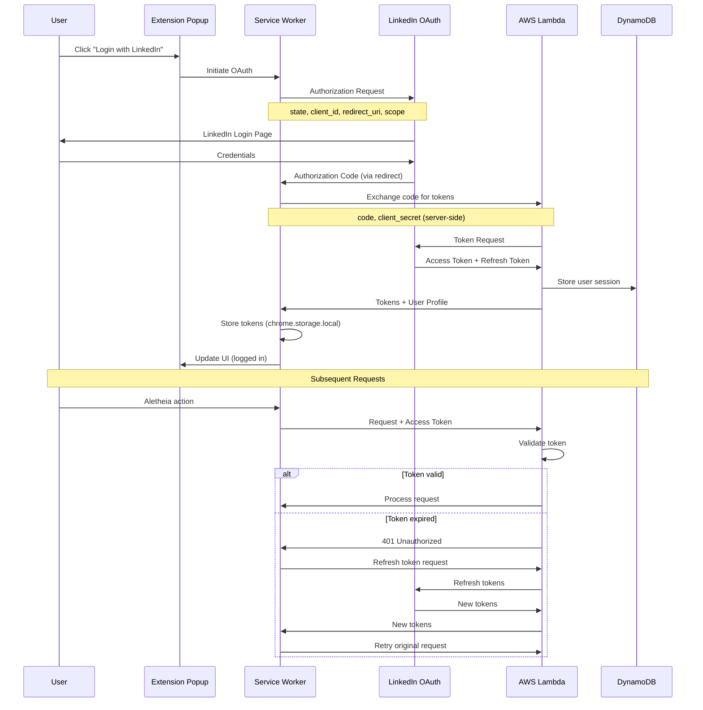

# 1116 - Feature: LinkedIn OAuth Authentication

## 1. Context & Goal
* **Issue:** #116
* **Objective:** Implement LinkedIn OAuth to gate extension features and enable user identification.
* **Status:** Draft
* **Related Issues:** #117 (spike: unauthenticated access), #25 (superseded), #88 (superseded)

### Background

LinkedIn OAuth provides a strong identity signal because LinkedIn enforces one account per person. This reduces abuse compared to disposable email signups and lays the foundation for future tiered access (free/paid).

## 2. Requirements

| ID | Requirement | Acceptance Criteria |
|----|-------------|---------------------|
| R1 | OAuth 2.0 flow with LinkedIn | User can authenticate via LinkedIn |
| R2 | Secure token storage | Access/refresh tokens stored securely in extension |
| R3 | Session management | Handle token expiration and refresh automatically |
| R4 | Login UI in popup | Login button visible when not authenticated |
| R5 | Auth status indicator | Clear visual indicator of logged-in state |
| R6 | Logout/disconnect | User can disconnect LinkedIn and clear tokens |
| R7 | Backend token validation | Lambda validates tokens before processing requests |
| R8 | Graceful degradation | Clear messaging when auth fails or is required |

## 3. Alternatives Considered

| Option | Pros | Cons | Decision |
|--------|------|------|----------|
| A. Chrome Identity API | Built-in, handles complexity | Limited provider support, less control | **Rejected** |
| B. Manual OAuth flow | Full control, works with any provider | More code, handle edge cases manually | **Selected** |
| C. Firebase Auth | Managed service, multiple providers | Additional dependency, cost at scale | **Rejected** |
| D. Custom email/password | No third-party dependency | Disposable emails enable abuse, more security burden | **Rejected** |

**Rationale:** Manual OAuth flow gives full control over the authentication process while keeping LinkedIn as the sole provider (for now). Chrome Identity API doesn't support LinkedIn well.

## 4. Data & Fixtures

### 4.1 Data Sources

| Attribute | Value |
|-----------|-------|
| Source | LinkedIn OAuth 2.0 API |
| Format | JSON (tokens, profile data) |
| Size | ~1KB per user session |
| Refresh | Automatic on token expiration |
| Copyright/License | LinkedIn API Terms of Service |

### 4.2 Data Pipeline

```
User Click ──OAuth──► LinkedIn ──callback──► Extension ──token──► Lambda ──validate──► DynamoDB
```

### 4.3 Test Fixtures

| Fixture | Source | Notes |
|---------|--------|-------|
| Mock OAuth response | Generated | Valid token structure for unit tests |
| Expired token response | Generated | Test refresh flow |
| Invalid token response | Generated | Test error handling |
| Profile data mock | Generated | Minimal profile (id, name) |

### 4.4 Deployment Pipeline

1. Register LinkedIn OAuth app in LinkedIn Developer Portal
2. Configure redirect URI pointing to extension
3. Store client ID in extension (public)
4. Store client secret in Lambda environment variables (private)
5. Deploy Lambda with token validation endpoint

## 5. Diagram



## 6. Technical Approach

* **Module:** `extension/auth.js` (new), `extension/popup.js`, `lambda_function.py`
* **Dependencies:** LinkedIn OAuth 2.0 API, `chrome.identity` (for redirect handling)
* **Pattern:** OAuth 2.0 Authorization Code Flow with PKCE

### 6.1 LinkedIn OAuth Configuration

**Scopes required:**
- `openid` - OpenID Connect for identity
- `profile` - Basic profile info (name)
- `email` - Email address (optional, for future features)

**Endpoints:**
- Authorization: `https://www.linkedin.com/oauth/v2/authorization`
- Token: `https://www.linkedin.com/oauth/v2/accessToken`
- Profile: `https://api.linkedin.com/v2/userinfo`

### 6.2 Token Storage

```javascript
// Stored in chrome.storage.local (encrypted at rest by Chrome)
{
    "auth": {
        "accessToken": "...",
        "refreshToken": "...",
        "expiresAt": 1234567890,  // Unix timestamp
        "userId": "linkedin-user-id",
        "displayName": "User Name"
    }
}
```

### 6.3 PKCE Implementation

To prevent authorization code interception:
1. Generate `code_verifier` (random 43-128 character string)
2. Create `code_challenge` = base64url(SHA256(code_verifier))
3. Include `code_challenge` in authorization request
4. Include `code_verifier` in token exchange

## 7. Interface Specification

### 7.1 Data Structures

```typescript
// Auth state stored in extension
interface AuthState {
    accessToken: string;
    refreshToken: string;
    expiresAt: number;      // Unix timestamp (seconds)
    userId: string;         // LinkedIn user ID
    displayName: string;    // User's name for display
}

// Token exchange request (to Lambda)
interface TokenExchangeRequest {
    code: string;
    codeVerifier: string;
    redirectUri: string;
}

// Token exchange response (from Lambda)
interface TokenExchangeResponse {
    accessToken: string;
    refreshToken: string;
    expiresIn: number;      // Seconds until expiration
    userId: string;
    displayName: string;
}
```

### 7.2 Function Signatures

```javascript
// extension/auth.js
async function initiateLogin(): Promise<void>;
async function handleCallback(code: string, state: string): Promise<AuthState>;
async function refreshTokens(): Promise<AuthState>;
async function logout(): Promise<void>;
async function getAuthState(): Promise<AuthState | null>;
async function isAuthenticated(): Promise<boolean>;
async function getAccessToken(): Promise<string | null>;  // Auto-refreshes if needed

// extension/popup.js
function renderAuthState(isLoggedIn: boolean, displayName?: string): void;
function handleLoginClick(): void;
function handleLogoutClick(): void;

// lambda_function.py (new endpoint)
def exchange_code(event: dict) -> dict:  # Exchange auth code for tokens
def validate_token(token: str) -> dict:   # Validate access token
def refresh_tokens(refresh_token: str) -> dict:  # Get new tokens
```

### 7.3 Logic Flow (Pseudocode)

```
LOGIN FLOW:
1. User clicks "Login with LinkedIn"
2. Generate code_verifier and code_challenge (PKCE)
3. Store code_verifier in session storage
4. Open LinkedIn authorization URL in popup/tab
5. User authenticates with LinkedIn
6. LinkedIn redirects to extension with authorization code
7. Send code + code_verifier to Lambda
8. Lambda exchanges code for tokens (using client_secret)
9. Lambda fetches user profile
10. Lambda returns tokens + profile to extension
11. Extension stores auth state
12. Update popup UI to show logged-in state

TOKEN REFRESH FLOW:
1. Before API call, check if token expires within 5 minutes
2. If expiring soon, call refresh endpoint
3. Lambda uses refresh_token to get new access_token
4. Update stored tokens
5. Proceed with original request

LOGOUT FLOW:
1. User clicks "Logout"
2. Clear chrome.storage.local auth data
3. Optionally revoke token with LinkedIn
4. Update popup UI to show logged-out state
```

## 8. Security Considerations

| Concern | Mitigation | Status |
|---------|------------|--------|
| Token interception (code flow) | PKCE prevents authorization code interception | TODO |
| Token storage exposure | chrome.storage.local encrypted by Chrome | Addressed |
| Client secret exposure | Secret stored server-side in Lambda only | Addressed |
| XSS token theft | Extension runs in isolated context | Addressed |
| CSRF on callback | `state` parameter validated | TODO |
| Token replay | Short-lived access tokens, server validation | TODO |
| Refresh token theft | Refresh only works with matching client_id | Addressed |

**Fail Mode:** Fail Closed - If authentication fails, user cannot access gated features. Clear error messaging guides user to re-authenticate.

## 9. Performance Considerations

| Metric | Budget | Approach |
|--------|--------|----------|
| Login latency | < 3s (excluding LinkedIn UI) | Minimal code exchange overhead |
| Token refresh | < 500ms | Background refresh before expiration |
| Storage | < 2KB | Only essential auth data stored |
| API overhead | 1 validation call per request | Cache validation result briefly |

**Bottlenecks:**
- LinkedIn OAuth popup can be slow (LinkedIn's control)
- Initial token exchange requires round-trip to Lambda

## 10. Risks & Mitigations

| Risk | Impact | Likelihood | Mitigation |
|------|--------|------------|------------|
| LinkedIn API changes | High | Low | Version-pin API, monitor deprecation notices |
| LinkedIn rate limits | Med | Low | Cache tokens, refresh proactively |
| User has no LinkedIn | Med | Med | Clear messaging; consider future providers (#117) |
| Token theft via malware | High | Low | Chrome's storage encryption, short token lifetime |
| LinkedIn account suspension | Med | Low | Graceful degradation, clear error messaging |

## 11. Verification & Testing

### 11.1 Test Scenarios

| ID | Scenario | Type | Input | Expected Output | Pass Criteria |
|----|----------|------|-------|-----------------|---------------|
| 010 | Fresh login | Manual | Click login, enter LinkedIn creds | Logged in state shown | Display name visible |
| 020 | Token persists across sessions | Manual | Close/reopen browser | Still logged in | No re-auth needed |
| 030 | Token refresh | Manual | Wait for near-expiration | Token refreshed silently | No user action needed |
| 040 | Logout clears data | Manual | Click logout | Login button shown | No tokens in storage |
| 050 | Invalid token rejected | Auto | Send expired token to Lambda | 401 response | Error handled gracefully |
| 060 | PKCE validation | Auto | Wrong code_verifier | Token exchange fails | Error logged |
| 070 | State mismatch rejected | Auto | Tampered state param | Auth rejected | Error shown to user |
| 080 | API calls include token | Auto | Make Aletheia request | Token in Authorization header | Lambda receives token |
| 090 | Gated features blocked without auth | Manual | Try Aletheia without login | Prompt to login | Feature not executed |

### 11.2 Test Modules (from 0005)

* **Unit Tests:** `poetry run pytest tests/test_auth.py -v` (Lambda validation logic)
* **Semantic (Module B):** No
* **End-to-End (Module C):** Yes - full OAuth flow testing

### 11.3 Manual Smoke Test

1. Load extension in Chrome
2. Click extension icon - verify login button shown
3. Click "Login with LinkedIn"
4. Complete LinkedIn authentication
5. Verify popup shows user name and logout button
6. Select text, trigger Aletheia - verify request includes auth
7. Check Lambda logs for token validation
8. Click logout - verify login button returns
9. Close browser, reopen - verify still logged out

## 12. Definition of Done

### Code
- [ ] `extension/auth.js` with OAuth logic and PKCE
- [ ] Popup UI for login/logout states
- [ ] Lambda endpoint for token exchange
- [ ] Lambda token validation middleware
- [ ] Token refresh mechanism
- [ ] Secure storage implementation

### Tests
- [ ] Unit tests for token validation (Lambda)
- [ ] Manual OAuth flow testing
- [ ] Token refresh testing
- [ ] Error handling scenarios

### Documentation
- [ ] LinkedIn app registration documented
- [ ] Environment variables documented
- [ ] LLD updated with any deviations

### Review
- [ ] Security review of OAuth implementation
- [ ] Code review completed
- [ ] User approval before closing issue
