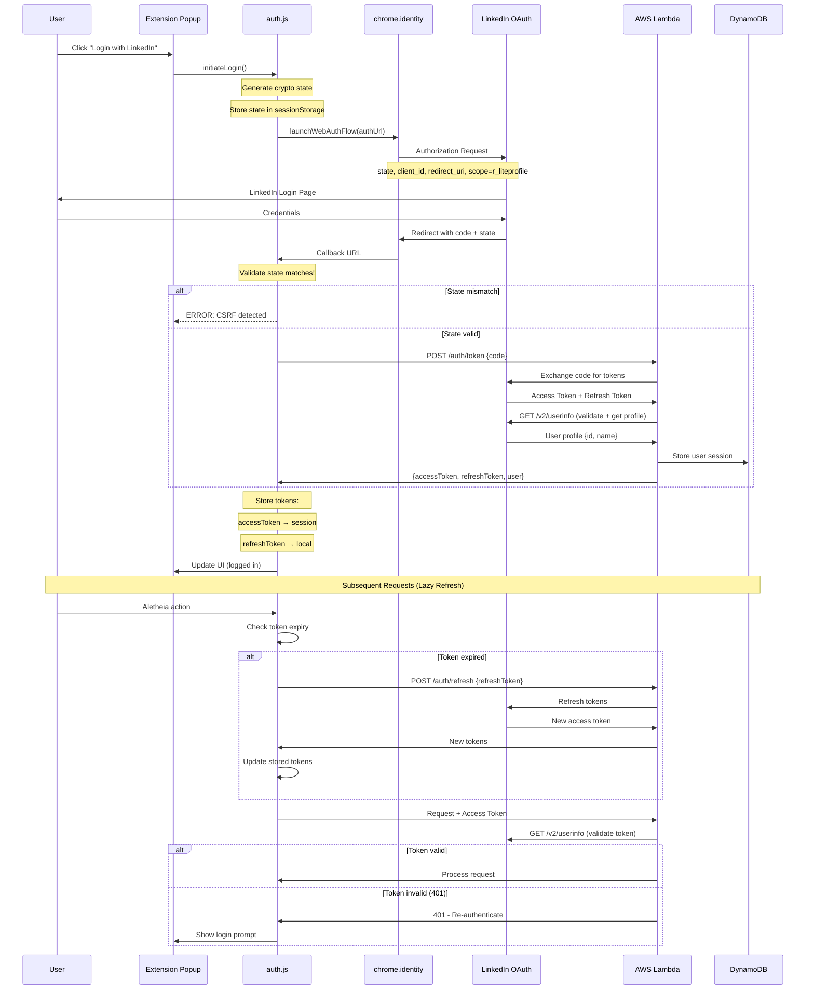

# 1116 - Feature: LinkedIn OAuth Authentication

## 1. Context & Goal
* **Issue:** #116
* **Objective:** Implement LinkedIn OAuth to gate extension features and enable user identification.
* **Status:** Draft
* **Related Issues:** #117 (spike: unauthenticated access), #25 (superseded), #88 (superseded)

### Background

LinkedIn OAuth provides a strong identity signal because LinkedIn enforces one account per person. This reduces abuse compared to disposable email signups and lays the foundation for future tiered access (free/paid).

## 2. Requirements

| ID | Requirement | Acceptance Criteria |
|----|-------------|---------------------|
| R1 | OAuth 2.0 flow with LinkedIn | User can authenticate via LinkedIn using `chrome.identity.launchWebAuthFlow` |
| R2 | Secure token storage | Access token in `chrome.storage.session`, refresh token in `chrome.storage.local` |
| R3 | Session management | Lazy refresh on action - refresh only when token expired and user takes action |
| R4 | Login UI in popup | Login button visible when not authenticated |
| R5 | Auth status indicator | Clear visual indicator of logged-in state |
| R6 | Logout/disconnect | User can disconnect LinkedIn and clear tokens |
| R7 | Backend token validation | Lambda validates tokens by calling LinkedIn API (not just trusting the token) |
| R8 | Graceful degradation | Clear messaging when auth fails or is required |
| R9 | CSRF protection | Cryptographically random `state` parameter validated on callback |
| R10 | Mock mode for testing | `MOCK_MODE` flag enables deterministic fake tokens for automated tests |

## 3. Alternatives Considered

| Option | Pros | Cons | Decision |
|--------|------|------|----------|
| A. `chrome.identity.launchWebAuthFlow` | Chrome-native, handles redirects, avoids "Remote Code" flags | Requires specific redirect URI format | **Selected** |
| B. Manual OAuth flow (tab manipulation) | Full control | Chrome Web Store compliance risk, complexity | **Rejected** |
| C. Firebase Auth | Managed service, multiple providers | Additional dependency, cost at scale | **Rejected** |
| D. Custom email/password | No third-party dependency | Disposable emails enable abuse, more security burden | **Rejected** |

**Rationale:** `chrome.identity.launchWebAuthFlow` is the Chrome-compliant way to handle OAuth in extensions. It avoids "Remote Code" flags and works correctly with Chrome's native auth handling.

## 4. Data & Fixtures

### 4.1 Data Sources

| Attribute | Value |
|-----------|-------|
| Source | LinkedIn OAuth 2.0 API |
| Format | JSON (tokens, profile data) |
| Size | ~1KB per user session |
| Refresh | Lazy - on user action when token expired |
| Copyright/License | LinkedIn API Terms of Service |

### 4.2 Data Pipeline

```
User Click ──launchWebAuthFlow──► LinkedIn ──callback──► Extension ──code──► Lambda ──validate──► DynamoDB
```

### 4.3 Test Fixtures

| Fixture | Source | Notes |
|---------|--------|-------|
| Mock OAuth response | `MOCK_MODE` in auth.js | Deterministic fake token for automated tests |
| Expired token response | Generated | Test lazy refresh flow |
| Invalid token response | Generated | Test error handling |
| Profile data mock | Generated | `{id: "mock-user-123", name: "Test User"}` |

### 4.4 Deployment Pipeline

1. Register LinkedIn OAuth app in LinkedIn Developer Portal
2. Configure redirect URI: `https://<extension-id>.chromiumapp.org/`
3. Store client ID in extension (public) - `extension/config.js`
4. Store client secret in Lambda environment variables (private)
5. Deploy Lambda with token exchange and validation endpoints

## 5. Diagram



## 6. Technical Approach

* **Module:** `extension/auth.js` (new), `extension/config.js` (new), `extension/popup.js`, `lambda_function.py`
* **Dependencies:** `chrome.identity.launchWebAuthFlow`, LinkedIn OAuth 2.0 API
* **Pattern:** OAuth 2.0 Authorization Code Flow (no PKCE - LinkedIn doesn't support it)

### 6.1 LinkedIn OAuth Configuration

**Scope (STRICT - r_liteprofile ONLY):**
- `r_liteprofile` - Basic profile info (id, name)
- ~~`r_emailaddress`~~ - **NOT REQUESTED** - Minimizes privacy concerns and user friction

**Endpoints:**
- Authorization: `https://www.linkedin.com/oauth/v2/authorization`
- Token: `https://www.linkedin.com/oauth/v2/accessToken`
- Profile: `https://api.linkedin.com/v2/userinfo`

**Redirect URI:**
```
https://<extension-id>.chromiumapp.org/
```

### 6.2 CSRF Protection (MANDATORY)

```javascript
// auth.js - CSRF state management
function generateState() {
    const array = new Uint8Array(32);
    crypto.getRandomValues(array);
    return Array.from(array, b => b.toString(16).padStart(2, '0')).join('');
}

async function initiateLogin() {
    const state = generateState();
    sessionStorage.setItem('oauth_state', state);

    const authUrl = buildAuthUrl(state);
    const redirectUrl = await chrome.identity.launchWebAuthFlow({
        url: authUrl,
        interactive: true
    });

    // Validate state on callback
    const urlParams = new URL(redirectUrl).searchParams;
    const returnedState = urlParams.get('state');
    const savedState = sessionStorage.getItem('oauth_state');
    sessionStorage.removeItem('oauth_state');

    if (returnedState !== savedState) {
        throw new Error('CSRF detected: state mismatch');
    }

    const code = urlParams.get('code');
    // Continue with token exchange...
}
```

### 6.3 Secure Token Storage Hierarchy

| Token | Storage | Rationale |
|-------|---------|-----------|
| Access Token | `chrome.storage.session` | In-memory only, cleared on browser close |
| Refresh Token | `chrome.storage.local` | Persists for re-authentication, encrypted by Chrome |
| User Profile | `chrome.storage.local` | Display name, user ID for UI |

**NEVER use `chrome.storage.sync`** - Tokens must not sync across devices.

```javascript
// Store tokens with proper hierarchy
async function storeTokens(accessToken, refreshToken, expiresIn, user) {
    // Access token - session only (cleared on browser close)
    await chrome.storage.session.set({
        accessToken,
        expiresAt: Date.now() + (expiresIn * 1000)
    });

    // Refresh token + profile - local persistence
    await chrome.storage.local.set({
        refreshToken,
        userId: user.id,
        displayName: user.name
    });
}

async function getAccessToken() {
    const session = await chrome.storage.session.get(['accessToken', 'expiresAt']);

    if (!session.accessToken || Date.now() >= session.expiresAt) {
        // Lazy refresh - only when needed
        return await refreshTokens();
    }

    return session.accessToken;
}
```

### 6.4 Mock Mode for Testing

```javascript
// config.js
const AUTH_CONFIG = {
    MOCK_MODE: false,  // Set to true for automated tests
    CLIENT_ID: 'your-linkedin-client-id',
    REDIRECT_URI: `https://${chrome.runtime.id}.chromiumapp.org/`
};

// auth.js - Mock mode support
async function initiateLogin() {
    if (AUTH_CONFIG.MOCK_MODE) {
        return mockLogin();
    }
    // Real OAuth flow...
}

function mockLogin() {
    const mockUser = {
        accessToken: 'mock-access-token-12345',
        refreshToken: 'mock-refresh-token-67890',
        expiresIn: 3600,
        user: {
            id: 'mock-user-123',
            name: 'Test User'
        }
    };
    return storeTokens(
        mockUser.accessToken,
        mockUser.refreshToken,
        mockUser.expiresIn,
        mockUser.user
    );
}
```

### 6.5 Lambda Token Validation (Trust but Verify)

The Lambda MUST validate tokens by calling LinkedIn, not just trusting the token string:

```python
# lambda_function.py
import requests

def validate_token(access_token: str) -> dict | None:
    """
    Validate token by calling LinkedIn API.
    Returns user profile if valid, None if invalid.

    Caching: May cache result for 5-10 minutes to avoid rate limits.
    """
    headers = {'Authorization': f'Bearer {access_token}'}

    response = requests.get(
        'https://api.linkedin.com/v2/userinfo',
        headers=headers
    )

    if response.status_code == 200:
        return response.json()  # {sub: "...", name: "...", ...}
    elif response.status_code == 401:
        return None  # Token invalid or expired
    else:
        raise Exception(f"LinkedIn API error: {response.status_code}")


def require_auth(handler):
    """Decorator to require valid LinkedIn token on requests."""
    def wrapper(event, context):
        auth_header = event.get('headers', {}).get('Authorization', '')

        if not auth_header.startswith('Bearer '):
            return {'statusCode': 401, 'body': '{"error": "Missing token"}'}

        token = auth_header.replace('Bearer ', '')
        user = validate_token(token)

        if user is None:
            return {'statusCode': 401, 'body': '{"error": "Invalid token"}'}

        # Add user to event for handler
        event['user'] = user
        return handler(event, context)

    return wrapper
```

## 7. Interface Specification

### 7.1 Data Structures

```typescript
// Auth state (split across storage types)
interface SessionAuth {
    accessToken: string;
    expiresAt: number;      // Unix timestamp (milliseconds)
}

interface LocalAuth {
    refreshToken: string;
    userId: string;         // LinkedIn user ID (sub claim)
    displayName: string;    // User's name for display
}

// Token exchange request (to Lambda)
interface TokenExchangeRequest {
    code: string;
    redirectUri: string;
}

// Token exchange response (from Lambda)
interface TokenExchangeResponse {
    accessToken: string;
    refreshToken: string;
    expiresIn: number;      // Seconds until expiration
    user: {
        id: string;
        name: string;
    };
}

// Refresh request (to Lambda)
interface RefreshRequest {
    refreshToken: string;
}
```

### 7.2 Function Signatures

```javascript
// extension/auth.js
async function initiateLogin(): Promise<void>;
async function handleCallback(redirectUrl: string): Promise<void>;
async function refreshTokens(): Promise<string>;  // Returns new access token
async function logout(): Promise<void>;
async function getAuthState(): Promise<{userId: string, displayName: string} | null>;
async function isAuthenticated(): Promise<boolean>;
async function getAccessToken(): Promise<string | null>;  // Lazy refresh if needed

// extension/config.js
const AUTH_CONFIG: {
    MOCK_MODE: boolean;
    CLIENT_ID: string;
    REDIRECT_URI: string;
    AUTH_ENDPOINT: string;
    LAMBDA_AUTH_URL: string;
};

// extension/popup.js
function renderAuthState(isLoggedIn: boolean, displayName?: string): void;
async function handleLoginClick(): Promise<void>;
async function handleLogoutClick(): Promise<void>;

// lambda_function.py
def exchange_code(event: dict) -> dict;     # Exchange auth code for tokens
def validate_token(token: str) -> dict | None;  # Validate via LinkedIn API
def refresh_tokens(event: dict) -> dict;    # Get new tokens
def require_auth(handler) -> callable;      # Decorator for protected routes
```

### 7.3 Logic Flow (Pseudocode)

```
LOGIN FLOW:
1. User clicks "Login with LinkedIn"
2. IF MOCK_MODE: return mock tokens immediately
3. Generate cryptographically random state (32 bytes hex)
4. Store state in sessionStorage
5. Call chrome.identity.launchWebAuthFlow with auth URL
6. User authenticates with LinkedIn
7. Chrome receives redirect with code + state
8. VALIDATE: returned state === stored state (abort if mismatch!)
9. Clear state from sessionStorage
10. Send code to Lambda /auth/token endpoint
11. Lambda exchanges code for tokens (using client_secret)
12. Lambda calls LinkedIn /v2/userinfo to validate and get profile
13. Lambda stores user in DynamoDB, returns tokens + profile
14. Extension stores: accessToken → session, refreshToken → local
15. Update popup UI to show logged-in state

LAZY REFRESH FLOW (on user action):
1. User triggers Aletheia action
2. Call getAccessToken()
3. Check if token exists and not expired
4. IF expired or missing:
   a. Get refreshToken from local storage
   b. Call Lambda /auth/refresh endpoint
   c. Lambda uses refresh_token with LinkedIn
   d. Store new accessToken in session storage
   e. Return new accessToken
5. IF refresh fails: prompt user to login again
6. Proceed with original request using valid token

LOGOUT FLOW:
1. User clicks "Logout"
2. Clear chrome.storage.session (accessToken)
3. Clear chrome.storage.local (refreshToken, userId, displayName)
4. Update popup UI to show logged-out state
```

## 8. Security Considerations

| Concern | Mitigation | Status |
|---------|------------|--------|
| CSRF on callback | Crypto-random `state` parameter, validated exactly | Addressed |
| Token storage exposure | Access token in session (memory), refresh in local | Addressed |
| Client secret exposure | Secret stored server-side in Lambda only | Addressed |
| XSS token theft | Extension runs in isolated context | Addressed |
| Token validity trust | Lambda validates tokens via LinkedIn API call | Addressed |
| Token replay | Short-lived access tokens (1 hour), server validation | Addressed |
| Refresh token theft | Only usable with matching client_id/secret | Addressed |
| Remote code flags | Using chrome.identity.launchWebAuthFlow | Addressed |

**Fail Mode:** Fail Closed - If authentication fails or token validation fails, user cannot access gated features. Clear error messaging guides user to re-authenticate.

## 9. Performance Considerations

| Metric | Budget | Approach |
|--------|--------|----------|
| Login latency | < 3s (excluding LinkedIn UI) | Single Lambda call for token exchange |
| Token refresh | < 500ms | Lazy refresh only when needed |
| Storage | < 2KB | Minimal auth data stored |
| API overhead | 1 LinkedIn validation call per Lambda request | Cache validation 5-10 min |

**Bottlenecks:**
- LinkedIn OAuth popup (LinkedIn's control)
- Token validation call to LinkedIn on each request (mitigated by caching)

## 10. Risks & Mitigations

| Risk | Impact | Likelihood | Mitigation |
|------|--------|------------|------------|
| LinkedIn API changes | High | Low | Version-pin API, monitor deprecation notices |
| LinkedIn rate limits | Med | Low | Cache token validation, lazy refresh |
| User has no LinkedIn | Med | Med | Clear messaging; consider future providers (#117) |
| Token theft via malware | High | Low | Session storage for access token, short lifetime |
| LinkedIn account suspension | Med | Low | Graceful degradation, clear error messaging |
| State parameter bypass | High | Very Low | Crypto-random generation, exact match validation |

## 11. Verification & Testing

### 11.1 Test Scenarios

| ID | Scenario | Type | Input | Expected Output | Pass Criteria |
|----|----------|------|-------|-----------------|---------------|
| 010 | Mock mode login | Auto | `MOCK_MODE=true`, call login | Mock tokens stored | Deterministic result |
| 020 | State generation | Auto | Call generateState() | 64-char hex string | Crypto-random |
| 030 | State mismatch rejection | Auto | Tampered state param | Error thrown | "CSRF detected" |
| 040 | Token storage hierarchy | Auto | Store tokens | Access in session, refresh in local | Correct storage |
| 050 | Fresh login | Manual | Click login, enter LinkedIn creds | Logged in state shown | Display name visible |
| 060 | Token persists in session | Manual | Close/reopen tab | Still logged in | No re-auth needed |
| 070 | Token cleared on browser close | Manual | Close browser, reopen | Access token gone | Refresh needed |
| 080 | Lazy token refresh | Manual | Wait for expiration, trigger action | Token refreshed | No user action needed |
| 090 | Logout clears all data | Manual | Click logout | Login button shown | No tokens in storage |
| 100 | Lambda validates with LinkedIn | Auto | Send token to Lambda | LinkedIn API called | User profile returned |
| 110 | Invalid token rejected | Auto | Send bad token to Lambda | 401 response | Error handled |
| 120 | Gated features blocked | Manual | Try Aletheia without login | Prompt to login | Feature not executed |

### 11.2 Test Modules (from 0005)

* **Unit Tests:** `tests/test_auth.js` - State generation, storage logic, mock mode
* **Unit Tests:** `poetry run pytest tests/test_auth.py -v` - Lambda validation logic
* **Semantic (Module B):** No
* **End-to-End (Module C):** Yes - full OAuth flow testing (manual)

### 11.3 Unit Test Implementation

```javascript
// tests/test_auth.js
describe('Auth Module', () => {
    describe('generateState', () => {
        test('generates 64-character hex string', () => {
            const state = generateState();
            expect(state).toMatch(/^[0-9a-f]{64}$/);
        });

        test('generates unique values', () => {
            const states = new Set(Array(100).fill().map(() => generateState()));
            expect(states.size).toBe(100);
        });
    });

    describe('MOCK_MODE', () => {
        test('returns deterministic mock user', async () => {
            AUTH_CONFIG.MOCK_MODE = true;
            await initiateLogin();
            const state = await getAuthState();
            expect(state.userId).toBe('mock-user-123');
            expect(state.displayName).toBe('Test User');
        });
    });

    describe('state validation', () => {
        test('rejects mismatched state', async () => {
            sessionStorage.setItem('oauth_state', 'original-state');
            await expect(handleCallback('https://...?state=wrong-state&code=xxx'))
                .rejects.toThrow('CSRF detected');
        });
    });
});
```

```python
# tests/test_auth.py
import pytest
from unittest.mock import patch, Mock
from lambda_function import validate_token, require_auth

class TestTokenValidation:
    @patch('requests.get')
    def test_valid_token_returns_user(self, mock_get):
        mock_get.return_value = Mock(
            status_code=200,
            json=lambda: {'sub': 'user-123', 'name': 'Test User'}
        )

        result = validate_token('valid-token')
        assert result['sub'] == 'user-123'
        mock_get.assert_called_with(
            'https://api.linkedin.com/v2/userinfo',
            headers={'Authorization': 'Bearer valid-token'}
        )

    @patch('requests.get')
    def test_invalid_token_returns_none(self, mock_get):
        mock_get.return_value = Mock(status_code=401)

        result = validate_token('invalid-token')
        assert result is None

    def test_require_auth_rejects_missing_token(self):
        @require_auth
        def handler(event, context):
            return {'statusCode': 200}

        result = handler({'headers': {}}, None)
        assert result['statusCode'] == 401
```

### 11.4 Manual Smoke Test

1. Set `MOCK_MODE = true` in config.js
2. Load extension, click login - verify mock login works
3. Set `MOCK_MODE = false`
4. Load extension in Chrome
5. Click extension icon - verify login button shown
6. Click "Login with LinkedIn"
7. Complete LinkedIn authentication
8. Verify popup shows user name and logout button
9. Open DevTools → Application → Storage - verify:
   - Session Storage has accessToken
   - Local Storage has refreshToken, userId, displayName
10. Select text, trigger Aletheia - verify request includes Authorization header
11. Check Lambda logs for LinkedIn validation call
12. Click logout - verify all storage cleared
13. Close browser completely, reopen - verify must re-login (access token gone)

## 12. Definition of Done

### Code
- [ ] `extension/config.js` with CLIENT_ID, MOCK_MODE, endpoints
- [ ] `extension/auth.js` with:
  - [ ] `chrome.identity.launchWebAuthFlow` integration
  - [ ] Crypto-random state generation and validation
  - [ ] Secure storage hierarchy (session/local)
  - [ ] MOCK_MODE support
  - [ ] Lazy refresh logic
- [ ] `extension/popup.js` login/logout UI
- [ ] Lambda `/auth/token` endpoint for code exchange
- [ ] Lambda `/auth/refresh` endpoint for token refresh
- [ ] Lambda `validate_token()` calling LinkedIn API
- [ ] Lambda `@require_auth` decorator for protected routes

### Tests
- [ ] Unit tests for state generation (crypto-random, unique)
- [ ] Unit tests for MOCK_MODE
- [ ] Unit tests for Lambda token validation
- [ ] Manual OAuth flow testing
- [ ] Storage hierarchy verification

### Documentation
- [ ] LinkedIn app registration documented
- [ ] Environment variables documented (CLIENT_SECRET in Lambda)
- [ ] LLD updated with any deviations

### Review
- [ ] Security review of CSRF protection
- [ ] Code review completed
- [ ] User approval before closing issue

---

## Appendix: Gemini Review Response

**Review Date:** 2026-01-05
**Reviewer:** Gemini 3 Pro

### Tier 2 Issues (HIGH) - Noted

| Issue | Action Required |
|-------|-----------------|
| Stable Extension ID | OAuth redirect URIs (`https://<id>.chromiumapp.org/`) depend on Extension ID. **MUST** add a fixed `key` field in `manifest.json` so ID remains stable across reloads and matches LinkedIn Developer Portal registration |
| State validation strictness | Ensure validation handles multiple popup opens (overwriting state). Check must be **strict**: `returned_state === stored_state` |

### Implementation Note

```json
// manifest.json - Add key for stable extension ID
{
  "key": "YOUR_BASE64_ENCODED_PUBLIC_KEY_HERE",
  ...
}
```

Generate the key using: `openssl genrsa 2048 | openssl rsa -pubout -outform DER | openssl base64 -A`

**Verdict:** APPROVED - With reminder to fix Extension Key in manifest.json.
