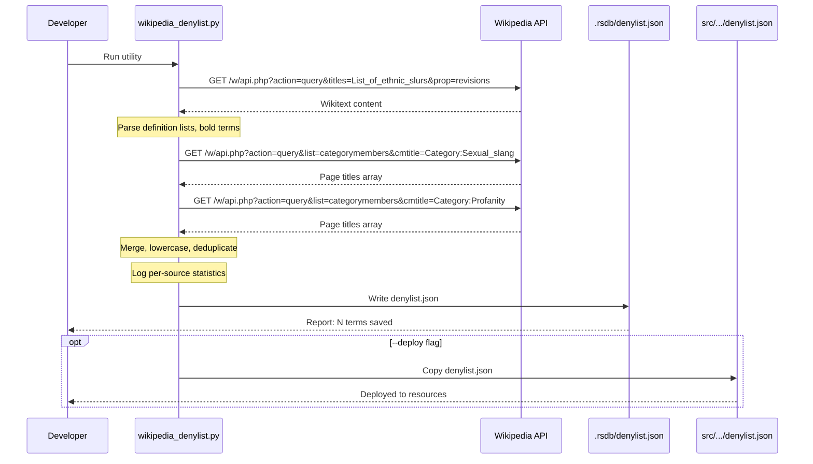

# 1121 - Feature: Wikipedia Denylist Integration

## 1. Context & Goal
* **Issue:** #121
* **Objective:** Replace third-party GitHub Gist source with Wikipedia as the authoritative denylist data source.
* **Status:** Draft
* **Related Issues:** #119 (RSDB download utility - superseded), #45 (Denylist implementation)

### Background

Issue #119 created `tools/rsdb_download.py` which fetches denylist data from a third-party GitHub Gist (stale, ~2022). Issue #121 was originally to get official RSDB data directly, but that approach is blocked. We are pivoting to Wikipedia as the authoritative source.

**Current pipeline:** Gist → `.rsdb/denylist.json` → `src/guardrails/resources/denylist.json`

**New pipeline:** Wikipedia API → `.rsdb/denylist.json` → `src/guardrails/resources/denylist.json`

## 2. Requirements

| ID | Requirement | Acceptance Criteria |
|----|-------------|---------------------|
| R1 | Fetch ethnic slurs from Wikipedia | Extract terms from "List of ethnic slurs" article |
| R2 | Fetch profanity terms | Enumerate Category:Profanity members |
| R3 | Fetch sexual slang terms | Enumerate Category:Sexual_slang members |
| R4 | API-first approach | Use MediaWiki API only - no HTML scraping |
| R5 | Politeness protocol | User-Agent header, 1 req/sec rate limit |
| R6 | Merge and deduplicate | Combine all sources, lowercase, unique terms |
| R7 | Log source statistics | Report term counts per source |
| R8 | Output schema v2.0 | Match specified JSON schema |
| R9 | Deploy option | Copy to `src/guardrails/resources/denylist.json` |

## 3. Alternatives Considered

| Option | Pros | Cons | Decision |
|--------|------|------|----------|
| A. Keep GitHub Gist | Already working, no changes needed | Stale data (~2022), third-party dependency, no provenance | **Rejected** |
| B. Official RSDB API | Authoritative source | Blocked/unavailable | **Rejected** |
| C. Wikipedia API | Authoritative, up-to-date, well-documented API, Wikimedia-friendly | Requires parsing wikitext for article content | **Selected** |
| D. Web scraping | Simple extraction | Violates Wikimedia ToS, fragile, blocked by robots.txt | **Rejected** |

**Rationale:** Wikipedia provides authoritative, curated lists with a well-documented API. The MediaWiki API allows programmatic access without scraping. The "List of ethnic slurs" article and profanity categories are actively maintained.

## 4. Data & Fixtures

### 4.1 Data Sources

| Attribute | Value |
|-----------|-------|
| Source | Wikipedia (en.wikipedia.org) via MediaWiki API |
| Format | JSON API responses containing wikitext or page titles |
| Size | ~500-700 terms estimated |
| Refresh | Manual (run utility when update needed) |
| Copyright/License | CC BY-SA 4.0 (Wikipedia content license) |

### 4.2 Data Pipeline

```
Wikipedia API ──GET──► Python Utility ──parse──► .rsdb/denylist.json ──copy──► src/guardrails/resources/denylist.json
```

**Three data extraction methods:**

1. **List of ethnic slurs** (article): Fetch wikitext → parse definition lists and bold terms
2. **Category:Sexual_slang** (category): Enumerate member page titles
3. **Category:Profanity** (category): Enumerate member page titles

### 4.3 Test Fixtures

| Fixture | Source | Notes |
|---------|--------|-------|
| Mock API response (ethnic slurs) | Captured from live API | Sanitized sample for unit tests |
| Mock category response | Captured from live API | Small subset for testing |
| Expected output JSON | Generated | Golden file for regression testing |

### 4.4 Deployment Pipeline

1. Developer runs: `poetry run python tools/wikipedia_denylist.py`
2. Output saved to: `.rsdb/denylist.json` (gitignored staging area)
3. Developer runs with `--deploy` flag to copy to `src/guardrails/resources/denylist.json`
4. Commit and deploy with Lambda package

**Separate utility:** This replaces `tools/rsdb_download.py` (or creates new `tools/wikipedia_denylist.py`).

## 5. Diagram



## 6. Technical Approach

* **Module:** `tools/wikipedia_denylist.py` (standalone utility, not runtime code)
* **Dependencies:** Python stdlib only (`urllib.request`, `json`, `re`) - no new packages required
* **Pattern:** ETL (Extract-Transform-Load) utility script

### 6.1 MediaWiki API Details

**Endpoint:** `https://en.wikipedia.org/w/api.php`

**Required parameters for all requests:**
- `format=json` - JSON response format
- User-Agent header: `Aletheia-Bot/1.0 (+https://github.com/martymcenroe/Aletheia; contact@example.com)`

**Fetch article wikitext:**
```
action=query
titles=List_of_ethnic_slurs
prop=revisions
rvprop=content
rvslots=main
```

**Enumerate category members:**
```
action=query
list=categorymembers
cmtitle=Category:Profanity
cmlimit=500
cmtype=page
```

**Continuation:** API returns `continue.cmcontinue` token if more results exist. Must loop until no continuation token.

### 6.2 Wikitext Parsing Strategy

The "List of ethnic slurs" article uses multiple formats:

1. **Definition lists:** `;Term : definition` or `;'''Term''' : definition`
2. **Bold terms:** `'''term'''` within text
3. **Table cells:** `| Term ||` format

Regex patterns needed:
- Definition list: `^;\s*(?:''')?([^':|\n\[\]]+?)(?:''')?(?:\s*:|\s*$)`
- Bold terms: `'''([^'|\[\]]{2,50})'''`

### 6.3 Category Member Extraction

Category members return article titles like:
- "Fuck" (direct term)
- "Fuck (word)" (with disambiguation)
- "List of profane words" (article about, not a term)

**Filtering rules:**
- Remove disambiguation suffixes: `"Fuck (word)"` → `"Fuck"`
- Filter out list/category articles: Skip titles starting with "List of", "Category:", etc.
- Filter by word count: Skip titles with >4 words (likely descriptive articles)

### 6.4 Term Normalization

**Compound term splitting:**
Some extracted terms contain variants:
- `"abo / abbo"` → `["abo", "abbo"]`
- `"beaner, beaney"` → `["beaner", "beaney"]`

Split on: ` / `, `, `, ` or `

**Final normalization:**
- Lowercase all terms
- Strip whitespace
- Deduplicate
- Filter terms < 2 characters
- Sort alphabetically

## 7. Interface Specification

### 7.1 Data Structures

```python
# Output schema (denylist.json)
DenylistSchema = {
    "version": "2.0",
    "source": "wikipedia",
    "sources": {
        "ethnic_slurs": "https://en.wikipedia.org/wiki/List_of_ethnic_slurs",
        "sexual-slang": "https://en.wikipedia.org/wiki/Category:Sexual_slang",
        "profanity": "https://en.wikipedia.org/wiki/Category:Profanity",
    },
    "source_stats": {
        "ethnic_slurs": int,  # count from this source
        "sexual-slang": int,
        "profanity": int,
    },
    "updated": "YYYY-MM-DD",  # ISO date
    "term_count": int,        # total unique terms
    "terms": list[str],       # sorted, lowercase, unique
}
```

### 7.2 Function Signatures

```python
def api_request(params: dict) -> dict:
    """Make a request to Wikipedia API with proper User-Agent."""
    ...

def fetch_page_wikitext(title: str) -> str:
    """Fetch raw wikitext content of a Wikipedia article."""
    ...

def fetch_category_members(category: str) -> list[str]:
    """Enumerate all page titles in a Wikipedia category (handles continuation)."""
    ...

def parse_ethnic_slurs_wikitext(wikitext: str) -> set[str]:
    """Extract slur terms from the ethnic slurs article wikitext."""
    ...

def extract_terms_from_title(title: str) -> list[str]:
    """Extract usable terms from a Wikipedia article title (filters non-terms)."""
    ...

def split_compound_terms(term: str) -> list[str]:
    """Split terms containing multiple variants (e.g., 'abo / abbo')."""
    ...

def merge_and_normalize(sources: dict[str, set[str]]) -> list[str]:
    """Merge all sources, normalize to lowercase, deduplicate, sort."""
    ...

def main() -> None:
    """CLI entry point with --dry-run and --deploy options."""
    ...
```

### 7.3 Logic Flow (Pseudocode)

```
1. Parse CLI arguments (--dry-run, --deploy, --output-dir)
2. Log User-Agent for transparency

3. FETCH ethnic slurs article:
   - Call API for wikitext
   - Parse with regex patterns
   - Extract terms to set
   - Sleep 1 second (rate limit)

4. FOR EACH category in [Sexual_slang, Profanity]:
   - Call API for category members
   - Handle continuation (loop until done)
   - Filter titles to extract terms
   - Sleep 1 second between requests

5. LOG per-source statistics

6. MERGE all sources:
   - Combine all term sets
   - Split compound terms
   - Lowercase and strip
   - Filter invalid terms
   - Deduplicate
   - Sort alphabetically

7. IF dry-run:
   - Log stats and sample terms
   - Exit without saving
   ELSE:
   - Save to .rsdb/denylist.json
   - IF --deploy: copy to src/guardrails/resources/

8. Report success with term count
```

## 8. Security Considerations

| Concern | Mitigation | Status |
|---------|------------|--------|
| API abuse / rate limiting | 1 req/sec rate limit, proper User-Agent | Addressed |
| Injection via term content | Terms only used for string matching, not executed | Addressed |
| Malicious content in Wikipedia | Wikipedia is community-moderated; terms are lowercased strings | Addressed |
| Network errors | Proper exception handling with informative messages | TODO |
| Stale data | Manual refresh process; `updated` field tracks freshness | Addressed |

**Fail Mode:** Fail Closed - If API fails, utility exits with error. No partial data written.

## 9. Performance Considerations

| Metric | Budget | Approach |
|--------|--------|----------|
| API calls | ~4-6 total | One for article, 1-2 per category (with continuation) |
| Runtime | < 30 seconds | Rate limiting is the bottleneck (1 req/sec) |
| Output size | < 100KB | ~700 terms × ~20 chars average |

**Bottlenecks:**
- Rate limiting (intentional for politeness)
- Wikitext parsing (regex on ~300KB article)

## 10. Risks & Mitigations

| Risk | Impact | Likelihood | Mitigation |
|------|--------|------------|------------|
| Wikipedia article structure changes | Med | Low | Regex patterns designed for flexibility; monitor for failures |
| Category reorganization | Med | Low | Log warnings if expected categories empty |
| API deprecation | High | Very Low | MediaWiki API is stable; version pinning not required |
| Terms extracted incorrectly (false positives) | Low | Med | Manual review of output; sample in dry-run mode |
| Terms missed (false negatives) | Med | Med | Multiple extraction patterns; log statistics for monitoring |
| Rate limit exceeded / IP blocked | High | Low | Strict 1 req/sec; proper User-Agent with contact info |

## 11. Verification & Testing

### 11.1 Test Scenarios

| ID | Scenario | Type | Input | Expected Output | Pass Criteria |
|----|----------|------|-------|-----------------|---------------|
| 010 | Dry run shows stats | Manual | `--dry-run` | Logs term counts, no file written | No file created, stats printed |
| 020 | Full run creates file | Manual | (no args) | `.rsdb/denylist.json` created | File exists, valid JSON |
| 030 | Deploy copies to resources | Manual | `--deploy` | Both files created | Files match |
| 040 | Rate limiting respected | Manual | Observe logs | 1+ second between requests | Timestamps show delays |
| 050 | Ethnic slurs extracted | Auto | Mock wikitext | Known terms present | Set contains expected terms |
| 060 | Category members extracted | Auto | Mock API response | Titles converted to terms | Filter rules applied |
| 070 | Compound terms split | Auto | `"abo / abbo"` | `["abo", "abbo"]` | Both terms in output |
| 080 | Invalid titles filtered | Auto | `"List of profane words"` | Empty list | Title not in output |
| 090 | Schema validation | Auto | Output JSON | Matches DenylistSchema | All required fields present |
| 100 | Network error handling | Manual | Disconnect network | Graceful exit with error | No partial file, error logged |
| 110 | Continuation handling | Auto | Mock paginated response | All pages fetched | Loop terminates correctly |

### 11.2 Test Modules (from 0005)

* **Unit Tests:** `poetry run pytest tests/test_wikipedia_denylist.py -v`
* **Semantic (Module B):** No - utility script, not runtime
* **End-to-End (Module C):** No - offline utility

### 11.3 Manual Smoke Test

1. Run: `poetry run python tools/wikipedia_denylist.py --dry-run`
2. Verify: Logs show term counts from 3 sources
3. Verify: No file created in `.rsdb/`
4. Run: `poetry run python tools/wikipedia_denylist.py`
5. Verify: `.rsdb/denylist.json` exists with valid JSON
6. Verify: `term_count` matches array length
7. Run: `poetry run python tools/wikipedia_denylist.py --deploy`
8. Verify: `src/guardrails/resources/denylist.json` matches staging file

## 12. Definition of Done

### Code
- [ ] `tools/wikipedia_denylist.py` implemented
- [ ] Replaces or supplements `tools/rsdb_download.py`
- [ ] All functions have docstrings
- [ ] Logging provides visibility into progress

### Tests
- [ ] Unit tests for parsing functions (050-090)
- [ ] Manual smoke test passes (010-040)
- [ ] Output validated against schema

### Documentation
- [ ] This LLD updated with any deviations
- [ ] `docs/0003-file-inventory.md` updated
- [ ] Usage documented in script docstring

### Review
- [ ] Code review completed
- [ ] Output manually reviewed for quality
- [ ] User approval before closing issue
