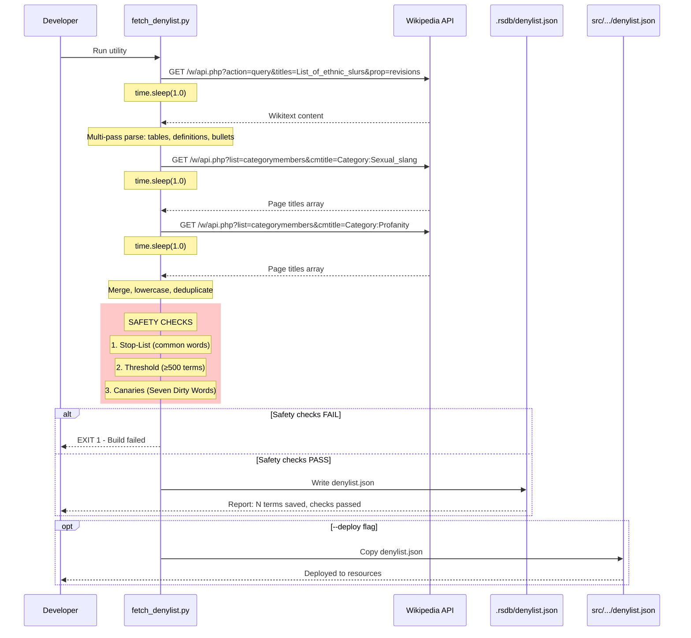

# 1121 - Feature: Wikipedia Denylist Integration

## 1. Context & Goal
* **Issue:** #121
* **Objective:** Replace third-party GitHub Gist source with Wikipedia as the authoritative denylist data source.
* **Status:** Draft
* **Related Issues:** #119 (RSDB download utility - superseded), #45 (Denylist implementation)

### Background

Issue #119 created `tools/rsdb_download.py` which fetches denylist data from a third-party GitHub Gist (stale, ~2022). Issue #121 was originally to get official RSDB data directly, but that approach is blocked. We are pivoting to Wikipedia as the authoritative source.

**Current pipeline:** Gist → `.rsdb/denylist.json` → `src/guardrails/resources/denylist.json`

**New pipeline:** Wikipedia API → `.rsdb/denylist.json` → `src/guardrails/resources/denylist.json`

## 2. Requirements

| ID | Requirement | Acceptance Criteria |
|----|-------------|---------------------|
| R1 | Fetch ethnic slurs from Wikipedia | Extract terms from "List of ethnic slurs" article |
| R2 | Fetch profanity terms | Enumerate Category:Profanity members |
| R3 | Fetch sexual slang terms | Enumerate Category:Sexual_slang members |
| R4 | API-first approach | Use MediaWiki API only - no HTML scraping |
| R5 | Politeness protocol | Custom User-Agent header, `time.sleep(1.0)` between ALL API calls |
| R6 | Merge and deduplicate | Combine all sources, lowercase, unique terms |
| R7 | Log source statistics | Report term counts per source |
| R8 | Output schema v2.0 | Match specified JSON schema with `generated_by` and `safety_checks` metadata |
| R9 | Deploy option | Copy to `src/guardrails/resources/denylist.json` |
| R10 | **Safety Stop-List** | FAIL BUILD if any term matches top 100 common English words |
| R11 | **Minimum Threshold** | FAIL BUILD if `total_terms < 500` |
| R12 | **Canary Assertions** | FAIL BUILD if known immutable terms (Seven Dirty Words) are missing |
| R13 | **Multi-Pass Parsing** | Extract from wikitables, definition lists, AND bulleted bold terms |
| R14 | **Tool Consolidation** | Delete `tools/rsdb_download.py` after implementation |

## 3. Alternatives Considered

| Option | Pros | Cons | Decision |
|--------|------|------|----------|
| A. Keep GitHub Gist | Already working, no changes needed | Stale data (~2022), third-party dependency, no provenance | **Rejected** |
| B. Official RSDB API | Authoritative source | Blocked/unavailable | **Rejected** |
| C. Wikipedia API | Authoritative, up-to-date, well-documented API, Wikimedia-friendly | Requires parsing wikitext for article content | **Selected** |
| D. Web scraping | Simple extraction | Violates Wikimedia ToS, fragile, blocked by robots.txt | **Rejected** |

**Rationale:** Wikipedia provides authoritative, curated lists with a well-documented API. The MediaWiki API allows programmatic access without scraping. The "List of ethnic slurs" article and profanity categories are actively maintained.

## 4. Data & Fixtures

### 4.1 Data Sources

| Attribute | Value |
|-----------|-------|
| Source | Wikipedia (en.wikipedia.org) via MediaWiki API |
| Format | JSON API responses containing wikitext or page titles |
| Size | ~500-700 terms estimated |
| Refresh | Manual (run utility when update needed) |
| Copyright/License | CC BY-SA 4.0 (Wikipedia content license) |

### 4.2 Data Pipeline

```
Wikipedia API ──GET──► Python Utility ──parse──► .rsdb/denylist.json ──copy──► src/guardrails/resources/denylist.json
```

**Three data extraction methods:**

1. **List of ethnic slurs** (article): Fetch wikitext → parse definition lists and bold terms
2. **Category:Sexual_slang** (category): Enumerate member page titles
3. **Category:Profanity** (category): Enumerate member page titles

### 4.3 Test Fixtures

| Fixture | Source | Notes |
|---------|--------|-------|
| `tests/fixtures/ethnic_slurs_wikitext.txt` | Captured from live API | Sanitized wikitext sample with all 3 formats |
| `tests/fixtures/category_profanity.json` | Captured from live API | Mock API response for category enumeration |
| `tests/fixtures/category_sexual_slang.json` | Captured from live API | Mock API response for category enumeration |
| `tests/fixtures/expected_output.json` | Generated | Golden file for regression testing |

**Mocking Strategy (Willison Protocol Compliance):**
- All unit tests MUST use mocked responses from fixtures
- Tests MUST run without network access
- Fixtures captured once from live API, then frozen for deterministic testing
- If Wikipedia format changes, update fixtures and verify parsing still works

### 4.4 Deployment Pipeline

1. Developer runs: `poetry run python tools/fetch_denylist.py`
2. Safety checks run automatically (stop-list, threshold, canaries)
3. If checks pass: Output saved to `.rsdb/denylist.json` (gitignored staging area)
4. Developer runs with `--deploy` flag to copy to `src/guardrails/resources/denylist.json`
5. Commit and deploy with Lambda package

**Tool Consolidation:**
- Create `tools/fetch_denylist.py` (new canonical name)
- Delete `tools/rsdb_download.py` (superseded - prevents zombie code)

## 5. Diagram



## 6. Technical Approach

* **Module:** `tools/fetch_denylist.py` (standalone utility, not runtime code)
* **Dependencies:** Python stdlib only (`urllib.request`, `json`, `re`, `time`) - no new packages required
* **Pattern:** ETL (Extract-Transform-Load) with Safety Gates

### 6.1 MediaWiki API Details

**Endpoint:** `https://en.wikipedia.org/w/api.php`

**Required parameters for all requests:**
- `format=json` - JSON response format
- User-Agent header: `Aletheia-Bot/1.0 (+https://github.com/martymcenroe/Aletheia; contact@example.com)`

**Fetch article wikitext:**
```
action=query
titles=List_of_ethnic_slurs
prop=revisions
rvprop=content
rvslots=main
```

**Enumerate category members:**
```
action=query
list=categorymembers
cmtitle=Category:Profanity
cmlimit=500
cmtype=page
```

**Continuation:** API returns `continue.cmcontinue` token if more results exist. Must loop until no continuation token.

### 6.2 Multi-Pass Wikitext Parsing Strategy

The "List of ethnic slurs" article uses multiple formats. A single regex approach WILL miss terms. **All three passes are REQUIRED:**

| Pass | Format | Pattern | Example |
|------|--------|---------|---------|
| 1 | **Wikitables** | `{\|` table start, `\|` cell delimiter | `\| Beaner \|\| Mexican` |
| 2 | **Definition Lists** | `^;` at line start | `;Beaner : A slur for...` |
| 3 | **Bulleted Bold** | `* '''term'''` | `* '''beaner''' - offensive` |

**Regex patterns:**
```python
# Pass 1: Wikitable cells - first cell often contains the term
TABLE_CELL = r"^\|\s*(?:''')?([A-Za-z][^|'\n\[\]]{1,40}?)(?:''')?\s*(?:\|\||$)"

# Pass 2: Definition list format
DEFINITION_LIST = r"^;\s*(?:''')?([^':|\n\[\]]+?)(?:''')?(?:\s*:|\s*$)"

# Pass 3: Bulleted bold terms
BULLETED_BOLD = r"^\*+\s*'''([^']{2,50})'''"
```

**Aggregation:** Results from ALL passes are merged into a single set before normalization.

**No subcategory traversal:** Graph depth = 0. Only direct category members are fetched to reduce noise.

### 6.3 Category Member Extraction

Category members return article titles like:
- "Fuck" (direct term)
- "Fuck (word)" (with disambiguation)
- "List of profane words" (article about, not a term)

**Filtering rules:**
- Remove disambiguation suffixes: `"Fuck (word)"` → `"Fuck"`
- Filter out list/category articles: Skip titles starting with "List of", "Category:", etc.
- Filter by word count: Skip titles with >4 words (likely descriptive articles)

### 6.4 Term Normalization

**Compound term splitting:**
Some extracted terms contain variants:
- `"abo / abbo"` → `["abo", "abbo"]`
- `"beaner, beaney"` → `["beaner", "beaney"]`

Split on: ` / `, `, `, ` or `

**Final normalization:**
- Lowercase all terms
- Strip whitespace
- Deduplicate
- Filter terms < 2 characters
- Sort alphabetically

### 6.5 Safety Checks (BLOCKING)

These checks run BEFORE any file is written. If ANY check fails, the build exits with code 1.

#### 6.5.1 Safety Stop-List (Data Poisoning Defense)

Hardcoded list of top 100 most common English words. If Wikipedia is vandalized to include common words, this prevents a DoS via over-blocking.

```python
SAFETY_STOP_LIST = {
    "the", "be", "to", "of", "and", "a", "in", "that", "have", "i",
    "it", "for", "not", "on", "with", "he", "as", "you", "do", "at",
    "this", "but", "his", "by", "from", "they", "we", "say", "her", "she",
    "or", "an", "will", "my", "one", "all", "would", "there", "their", "what",
    "so", "up", "out", "if", "about", "who", "get", "which", "go", "me",
    "when", "make", "can", "like", "time", "no", "just", "him", "know", "take",
    "people", "into", "year", "your", "good", "some", "could", "them", "see", "other",
    "than", "then", "now", "look", "only", "come", "its", "over", "think", "also",
    "back", "after", "use", "two", "how", "our", "work", "first", "well", "way",
    "even", "new", "want", "because", "any", "these", "give", "day", "most", "us",
    # Additional safety words
    "hello", "world", "cloud", "computer", "phone", "email", "name", "home", "help",
}
```

**Check:** `if term in SAFETY_STOP_LIST: FAIL`

#### 6.5.2 Minimum Threshold

```python
MINIMUM_TERM_COUNT = 500
```

If parsing returns fewer than 500 terms, Wikipedia's format likely changed and parsing failed silently.

**Check:** `if len(terms) < MINIMUM_TERM_COUNT: FAIL`

#### 6.5.3 Canary Assertions (Seven Dirty Words)

Known immutable terms that MUST be present. If these are missing, extraction is broken.

```python
CANARY_TERMS = {
    "shit", "piss", "fuck", "cunt", "cocksucker", "motherfucker", "tits",
}
```

**Check:** `if not CANARY_TERMS.issubset(terms): FAIL`

## 7. Interface Specification

### 7.1 Data Structures

```python
# Output schema (denylist.json)
DenylistSchema = {
    "version": "2.0",
    "source": "wikipedia",
    "generated_by": "tools/fetch_denylist.py",  # Tier 3: provenance
    "safety_checks": "passed",                   # Tier 3: audit trail
    "sources": {
        "ethnic_slurs": "https://en.wikipedia.org/wiki/List_of_ethnic_slurs",
        "sexual-slang": "https://en.wikipedia.org/wiki/Category:Sexual_slang",
        "profanity": "https://en.wikipedia.org/wiki/Category:Profanity",
    },
    "source_stats": {
        "ethnic_slurs": int,  # count from this source
        "sexual-slang": int,
        "profanity": int,
    },
    "updated": "YYYY-MM-DD",  # ISO date
    "term_count": int,        # total unique terms
    "terms": list[str],       # sorted, lowercase, unique
}
```

### 7.2 Function Signatures

```python
# --- API Layer ---
def api_request(params: dict) -> dict:
    """Make a request to Wikipedia API with proper User-Agent. Includes time.sleep(1.0)."""
    ...

def fetch_page_wikitext(title: str) -> str:
    """Fetch raw wikitext content of a Wikipedia article."""
    ...

def fetch_category_members(category: str) -> list[str]:
    """Enumerate all page titles in a Wikipedia category (handles continuation)."""
    ...

# --- Multi-Pass Parsing ---
def parse_wikitables(wikitext: str) -> set[str]:
    """Pass 1: Extract terms from wikitable cells."""
    ...

def parse_definition_lists(wikitext: str) -> set[str]:
    """Pass 2: Extract terms from definition list format (^;Term:)."""
    ...

def parse_bulleted_bold(wikitext: str) -> set[str]:
    """Pass 3: Extract terms from bulleted bold format (* '''term''')."""
    ...

def parse_ethnic_slurs_wikitext(wikitext: str) -> set[str]:
    """Aggregate all three parsing passes into a single set."""
    ...

# --- Normalization ---
def extract_terms_from_title(title: str) -> list[str]:
    """Extract usable terms from a Wikipedia article title (filters non-terms)."""
    ...

def split_compound_terms(term: str) -> list[str]:
    """Split terms containing multiple variants (e.g., 'abo / abbo')."""
    ...

def merge_and_normalize(sources: dict[str, set[str]]) -> list[str]:
    """Merge all sources, normalize to lowercase, deduplicate, sort."""
    ...

# --- Safety Checks (BLOCKING) ---
def check_safety_stop_list(terms: set[str]) -> list[str]:
    """Return list of terms that match the stop-list. Empty = pass."""
    ...

def check_minimum_threshold(terms: set[str]) -> bool:
    """Return True if term count >= MINIMUM_TERM_COUNT."""
    ...

def check_canary_terms(terms: set[str]) -> list[str]:
    """Return list of missing canary terms. Empty = pass."""
    ...

def run_safety_checks(terms: set[str]) -> tuple[bool, str]:
    """Run all safety checks. Returns (passed: bool, message: str)."""
    ...

# --- Entry Point ---
def main() -> None:
    """CLI entry point with --dry-run and --deploy options."""
    ...
```

### 7.3 Logic Flow (Pseudocode)

```
1. Parse CLI arguments (--dry-run, --deploy, --output-dir)
2. Log User-Agent for transparency

3. FETCH ethnic slurs article:
   - Call API for wikitext
   - time.sleep(1.0)  # MANDATORY rate limit
   - MULTI-PASS PARSE:
     - Pass 1: parse_wikitables(wikitext)
     - Pass 2: parse_definition_lists(wikitext)
     - Pass 3: parse_bulleted_bold(wikitext)
   - Merge all passes into single set

4. FOR EACH category in [Sexual_slang, Profanity]:
   - Call API for category members
   - time.sleep(1.0)  # MANDATORY rate limit
   - Handle continuation (loop until done, sleep between pages)
   - Filter titles to extract terms

5. LOG per-source statistics

6. MERGE all sources:
   - Combine all term sets
   - Split compound terms
   - Lowercase and strip
   - Filter invalid terms
   - Deduplicate
   - Sort alphabetically

7. RUN SAFETY CHECKS (BLOCKING):
   - Check 1: Stop-List (common words) → FAIL if any match
   - Check 2: Threshold (≥500 terms) → FAIL if below
   - Check 3: Canaries (Seven Dirty Words) → FAIL if any missing
   - IF any check fails: EXIT 1 with error message

8. IF dry-run:
   - Log stats and sample terms
   - Exit without saving (but still run safety checks)
   ELSE:
   - Save to .rsdb/denylist.json (with safety_checks: "passed")
   - IF --deploy: copy to src/guardrails/resources/

9. Report success with term count
```

## 8. Security Considerations

| Concern | Mitigation | Status |
|---------|------------|--------|
| **Data Poisoning (Wikipedia Vandalism)** | Safety Stop-List blocks top 100 common words; build fails if matched | Addressed |
| **Silent Parsing Failure** | Minimum threshold (500 terms) catches empty/broken extraction | Addressed |
| **Extraction Regression** | Canary terms (Seven Dirty Words) must be present or build fails | Addressed |
| API abuse / rate limiting | `time.sleep(1.0)` between ALL requests, custom User-Agent | Addressed |
| Injection via term content | Terms only used for string matching, not executed | Addressed |
| Network errors | Proper exception handling with informative messages | TODO |
| Stale data | Manual refresh process; `updated` field tracks freshness | Addressed |

**Fail Mode:** Fail Closed - If ANY safety check fails, build exits with code 1. No partial data written.

## 9. Performance Considerations

| Metric | Budget | Approach |
|--------|--------|----------|
| API calls | ~4-6 total | One for article, 1-2 per category (with continuation) |
| Runtime | < 30 seconds | Rate limiting is the bottleneck (1 req/sec) |
| Output size | < 100KB | ~700 terms × ~20 chars average |

**Bottlenecks:**
- Rate limiting (intentional for politeness)
- Wikitext parsing (regex on ~300KB article)

## 10. Risks & Mitigations

| Risk | Impact | Likelihood | Mitigation |
|------|--------|------------|------------|
| **Wikipedia vandalism (data poisoning)** | High | Med | Safety Stop-List + build failure on common words |
| **Silent parsing failure** | High | Low | Minimum threshold (500) + canary assertions |
| Wikipedia article structure changes | Med | Low | Multi-pass parsing (3 formats); threshold catches total failures |
| Category reorganization | Med | Low | Log warnings if expected categories empty |
| API deprecation | High | Very Low | MediaWiki API is stable; version pinning not required |
| Terms extracted incorrectly (false positives) | Low | Med | Manual review of output; sample in dry-run mode |
| Terms missed (false negatives) | Med | Med | Multi-pass parsing; log statistics for monitoring |
| Rate limit exceeded / IP blocked | High | Low | `time.sleep(1.0)` enforced; proper User-Agent with contact info |

## 11. Verification & Testing

### 11.1 Test Scenarios

| ID | Scenario | Type | Input | Expected Output | Pass Criteria |
|----|----------|------|-------|-----------------|---------------|
| 010 | Dry run shows stats | Manual | `--dry-run` | Logs term counts, no file written | No file created, stats printed |
| 020 | Full run creates file | Manual | (no args) | `.rsdb/denylist.json` created | File exists, valid JSON |
| 030 | Deploy copies to resources | Manual | `--deploy` | Both files created | Files match |
| 040 | Rate limiting respected | Manual | Observe logs | 1+ second between requests | Timestamps show delays |
| 050 | Wikitable parsing | Auto | Mock wikitext with `{\|...\|}` | Terms from tables extracted | Pass 1 populates set |
| 055 | Definition list parsing | Auto | Mock wikitext with `;Term:` | Terms from definitions extracted | Pass 2 populates set |
| 058 | Bulleted bold parsing | Auto | Mock wikitext with `* '''term'''` | Terms from bullets extracted | Pass 3 populates set |
| 060 | Multi-pass aggregation | Auto | Mock wikitext (all formats) | All terms merged | Union of all passes |
| 070 | Category members extracted | Auto | Mock API response | Titles converted to terms | Filter rules applied |
| 080 | Compound terms split | Auto | `"abo / abbo"` | `["abo", "abbo"]` | Both terms in output |
| 090 | Invalid titles filtered | Auto | `"List of profane words"` | Empty list | Title not in output |
| 100 | Schema validation | Auto | Output JSON | Matches DenylistSchema | All fields incl. `generated_by`, `safety_checks` |
| **110** | **Stop-List blocks common words** | Auto | Terms including "the" | Build fails (exit 1) | Error message names violating term |
| **120** | **Threshold catches empty result** | Auto | < 500 terms | Build fails (exit 1) | Error message shows count |
| **130** | **Canary catches missing terms** | Auto | Terms missing "fuck" | Build fails (exit 1) | Error message lists missing canaries |
| **140** | **All safety checks pass** | Auto | Valid term set | `safety_checks: "passed"` in JSON | Build succeeds (exit 0) |
| 150 | Network error handling | Manual | Disconnect network | Graceful exit with error | No partial file, error logged |
| 160 | Continuation handling | Auto | Mock paginated response | All pages fetched | Loop terminates correctly |

### 11.2 Test Modules (from 0005)

* **Unit Tests:** `poetry run pytest tests/test_fetch_denylist.py -v`
* **Fixtures Required:** All tests use mocked responses (Willison Protocol - no network)
* **Semantic (Module B):** No - utility script, not runtime
* **End-to-End (Module C):** No - offline utility

### 11.3 Manual Smoke Test

1. Run: `poetry run python tools/fetch_denylist.py --dry-run`
2. Verify: Logs show term counts from 3 sources
3. Verify: Logs show "Safety checks: PASSED"
4. Verify: No file created in `.rsdb/`
5. Run: `poetry run python tools/fetch_denylist.py`
6. Verify: `.rsdb/denylist.json` exists with valid JSON
7. Verify: `term_count` >= 500
8. Verify: `generated_by` and `safety_checks` fields present
9. Run: `poetry run python tools/fetch_denylist.py --deploy`
10. Verify: `src/guardrails/resources/denylist.json` matches staging file

## 12. Definition of Done

### Code
- [ ] `tools/fetch_denylist.py` implemented (new canonical name)
- [ ] `tools/rsdb_download.py` DELETED (prevents zombie code)
- [ ] Multi-pass parsing (wikitables, definitions, bullets)
- [ ] Safety checks implemented (stop-list, threshold, canaries)
- [ ] `time.sleep(1.0)` between ALL API calls
- [ ] All functions have docstrings
- [ ] Logging provides visibility into progress

### Tests
- [ ] Test fixtures created (`tests/fixtures/`)
- [ ] Unit tests use mocked responses (no network)
- [ ] Safety check tests pass (110-140)
- [ ] Manual smoke test passes (010-040)
- [ ] Output validated against schema

### Documentation
- [ ] This LLD updated with any deviations
- [ ] `docs/0003-file-inventory.md` updated
- [ ] Usage documented in script docstring

### Review
- [ ] Code review completed
- [ ] Output manually reviewed for quality
- [ ] User approval before closing issue
