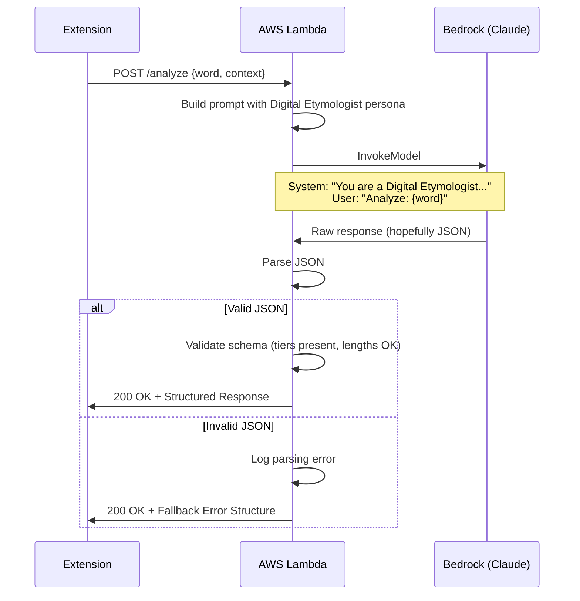

# 1124 - Feature: Digital Etymologist Persona & Structured JSON Response

## 1. Context & Goal
* **Issue:** #124
* **Objective:** Transform the Bedrock generation layer to produce structured, encyclopedic responses with a neutral academic tone.
* **Status:** Draft
* **Related Issues:** #125 (Museum Label UI - consumes this output), #126 (Hard vs. Soft Blocking)

### Background

Currently the Bedrock layer returns free-form text. We need structured JSON output with three tiers (Signal, Gem, Context) that the frontend can progressively disclose. The persona must be that of a neutral "Digital Etymologist" - informative without lecturing.

## 2. Requirements

| ID | Requirement | Acceptance Criteria |
|----|-------------|---------------------|
| R1 | Neutral academic tone | No scolding, moralizing, or conversational filler |
| R2 | Structured JSON output | Response matches defined schema |
| R3 | Signal tier | 2-4 word classification (e.g., "Archaic Pejorative") |
| R4 | Gem tier | Single sentence summary, max 25 words |
| R5 | Context tier | 3-sentence historical detail, max 100 words |
| R6 | JSON validation | Lambda validates output before returning |
| R7 | Fallback on invalid JSON | Return standard error structure, not raw text |
| R8 | Latency budget | Response under 3 seconds |

## 3. Alternatives Considered

| Option | Pros | Cons | Decision |
|--------|------|------|----------|
| A. Free-form text with frontend parsing | Flexible, less prompt engineering | Fragile parsing, inconsistent structure | **Rejected** |
| B. Structured JSON via system prompt | Reliable structure, type-safe | Requires careful prompt engineering | **Selected** |
| C. Multiple LLM calls (one per tier) | Each tier optimized separately | 3x latency, 3x cost | **Rejected** |
| D. Template with LLM fill-in | Very consistent output | Less natural, robotic feel | **Rejected** |

**Rationale:** A well-crafted system prompt can reliably produce structured JSON while maintaining natural language quality. Single call keeps latency and cost manageable.

## 4. Data & Fixtures

### 4.1 Data Sources

| Attribute | Value |
|-----------|-------|
| Source | User text selection + page context |
| Format | Plain text input, JSON output |
| Size | Input: ~1-50 words; Output: ~200 words max |
| Refresh | Per-request (no caching) |
| Copyright/License | N/A |

### 4.2 Data Pipeline

```
User Selection ──POST──► Lambda ──invoke──► Bedrock ──JSON──► Lambda ──validate──► Extension
```

### 4.3 Test Fixtures

| Fixture | Source | Notes |
|---------|--------|-------|
| Valid response JSON | Generated | All tiers present, within limits |
| Invalid JSON response | Generated | Malformed JSON for error handling |
| Oversized response | Generated | Exceeds word limits |
| Edge case terms | Curated | Archaic, compound, foreign-origin terms |

### 4.4 Deployment Pipeline

1. Update system prompt in Lambda
2. Add JSON schema validation
3. Deploy Lambda with updated code
4. Test with sample inputs
5. Monitor error rates for invalid JSON

## 5. Diagram



## 6. Technical Approach

* **Module:** `lambda_function.py`, `src/guardrails/semantic.py`
* **Dependencies:** AWS Bedrock (Claude 3 Haiku or Sonnet), `json` stdlib
* **Pattern:** Prompt Engineering with Schema Enforcement

### 6.1 System Prompt Design

```text
You are the Digital Etymologist, a neutral scholarly voice that explains the origins and cultural weight of words and phrases.

Your role is to inform, not to moralize. You speak like a museum placard: factual, concise, and respectful of the reader's intelligence.

You MUST respond with a JSON object containing exactly three fields:
- "signal": A 2-4 word classification (e.g., "Archaic Pejorative", "Regional Slang", "Historical Term")
- "gem": A single sentence summary of 25 words or fewer
- "context": Exactly 3 sentences providing historical detail, totaling 100 words or fewer

Do not include any text outside the JSON object. Do not use markdown code blocks.
```

### 6.2 Response Schema

```json
{
    "signal": "string (2-4 words)",
    "gem": "string (max 25 words)",
    "context": "string (3 sentences, max 100 words)"
}
```

### 6.3 Validation Rules

| Field | Validation | Action on Failure |
|-------|------------|-------------------|
| signal | Present, string, 2-15 words | Use fallback |
| gem | Present, string, 1-50 words | Use fallback |
| context | Present, string, 1-150 words | Use fallback |
| JSON parse | Valid JSON | Use fallback |

### 6.4 Fallback Structure

```json
{
    "signal": "Analysis Unavailable",
    "gem": "Unable to generate analysis for this term.",
    "context": "The system encountered an issue processing this request. Please try again. If the problem persists, the term may be outside the scope of analysis."
}
```

## 7. Interface Specification

### 7.1 Data Structures

```python
from typing import TypedDict

class EtymologistResponse(TypedDict):
    signal: str   # 2-4 word classification
    gem: str      # Single sentence, max 25 words
    context: str  # 3 sentences, max 100 words

class AnalysisResult(TypedDict):
    status: str           # "success" | "fallback" | "error"
    response: EtymologistResponse
    metadata: dict        # timing, model used, etc.
```

### 7.2 Function Signatures

```python
def build_etymologist_prompt(word: str, page_context: str) -> dict:
    """Construct the prompt with Digital Etymologist persona."""
    ...

def invoke_bedrock(prompt: dict) -> str:
    """Call Bedrock and return raw response text."""
    ...

def parse_etymologist_response(raw: str) -> EtymologistResponse | None:
    """Parse and validate JSON response. Returns None if invalid."""
    ...

def validate_response_schema(response: dict) -> tuple[bool, list[str]]:
    """Validate response matches schema. Returns (valid, errors)."""
    ...

def get_fallback_response() -> EtymologistResponse:
    """Return standard fallback when parsing fails."""
    ...

def analyze_term(word: str, context: str) -> AnalysisResult:
    """Main entry point for Digital Etymologist analysis."""
    ...
```

### 7.3 Logic Flow (Pseudocode)

```
1. Receive word and context from request
2. Build prompt with Digital Etymologist system message
3. Call Bedrock with prompt
4. Attempt to parse response as JSON:
   - IF parse fails: log error, return fallback
   - IF parse succeeds: validate schema
5. Validate each field:
   - signal: present, reasonable length
   - gem: present, under word limit
   - context: present, under word limit
6. IF any validation fails:
   - Log specific failures
   - Return fallback with status="fallback"
7. ELSE:
   - Return validated response with status="success"
8. Include timing metadata in response
```

## 8. Security Considerations

| Concern | Mitigation | Status |
|---------|------------|--------|
| Prompt injection via user input | User text is data, not instructions; clear delimiter | TODO |
| LLM outputs unexpected content | Validation rejects non-conforming output | Addressed |
| Response size limits | Enforce max token count in Bedrock call | TODO |
| Sensitive data in context | Context already filtered by upstream guardrails | Addressed |

**Fail Mode:** Fail Safe - If LLM produces invalid output, return a neutral fallback message. Never expose raw LLM errors to user.

## 9. Performance Considerations

| Metric | Budget | Approach |
|--------|--------|----------|
| Latency | < 3 seconds | Use Claude 3 Haiku for speed |
| Token input | < 2000 tokens | Truncate context if needed |
| Token output | < 500 tokens | Prompt constrains response length |
| Cost per request | ~$0.001 | Haiku pricing |

**Bottlenecks:**
- Bedrock model invocation (primary latency source)
- JSON parsing (negligible)

**Model Selection:**
- Claude 3 Haiku: Fast, cheap, sufficient for structured output
- Claude 3 Sonnet: Better quality, 3x cost, use for complex terms
- Default: Haiku with fallback logic

## 10. Risks & Mitigations

| Risk | Impact | Likelihood | Mitigation |
|------|--------|------------|------------|
| LLM ignores JSON instruction | Med | Med | Add examples to prompt, validate output |
| Tone drift (moralizing) | Med | Med | Clear persona instructions, review samples |
| Latency exceeds budget | Med | Low | Use Haiku, set timeout, fallback |
| Word count limits exceeded | Low | Med | Post-validation truncation |
| Bedrock service outage | High | Low | Graceful fallback, error messaging |

## 11. Verification & Testing

### 11.1 Test Scenarios

| ID | Scenario | Type | Input | Expected Output | Pass Criteria |
|----|----------|------|-------|-----------------|---------------|
| 010 | Valid term analysis | Auto | Common slur | Valid JSON with all tiers | Schema validates |
| 020 | Neutral tone check | Manual | Offensive term | Encyclopedic, not preachy | Human review |
| 030 | Signal length | Auto | Various terms | 2-4 words per signal | Word count check |
| 040 | Gem word limit | Auto | Various terms | ≤25 words | Word count check |
| 050 | Context word limit | Auto | Various terms | ≤100 words | Word count check |
| 060 | Invalid JSON fallback | Auto | Force malformed output | Fallback structure returned | status="fallback" |
| 070 | Missing field fallback | Auto | Partial JSON | Fallback structure returned | status="fallback" |
| 080 | Latency check | Manual | 10 sample terms | All < 3 seconds | Timer check |
| 090 | Empty input handling | Auto | Empty string | Graceful error | No crash |
| 100 | Foreign term handling | Manual | Non-English slur | Valid analysis or appropriate fallback | Schema validates |

### 11.2 Test Modules (from 0005)

* **Unit Tests:** `poetry run pytest tests/test_etymologist.py -v`
* **Semantic (Module B):** Yes - LLM output quality testing
* **End-to-End (Module C):** Yes - full request flow

### 11.3 Manual Smoke Test

1. Send POST request with known term
2. Verify response is valid JSON
3. Verify all three tiers present
4. Read "gem" and "context" - verify neutral tone
5. Check signal is a short classification
6. Verify latency < 3 seconds
7. Test with invalid/edge case terms
8. Verify fallback on forced error

## 12. Definition of Done

### Code
- [ ] System prompt implemented with Digital Etymologist persona
- [ ] JSON schema validation function
- [ ] Fallback response mechanism
- [ ] Latency logging for monitoring
- [ ] Error handling for Bedrock failures

### Tests
- [ ] Unit tests for parsing and validation
- [ ] Sample term test suite (diverse inputs)
- [ ] Tone review on 10+ outputs
- [ ] Latency benchmarks

### Documentation
- [ ] System prompt documented
- [ ] Schema documented in this LLD
- [ ] Error codes documented

### Review
- [ ] Prompt engineering review
- [ ] Sample output quality review
- [ ] Code review completed
- [ ] User approval before closing issue
