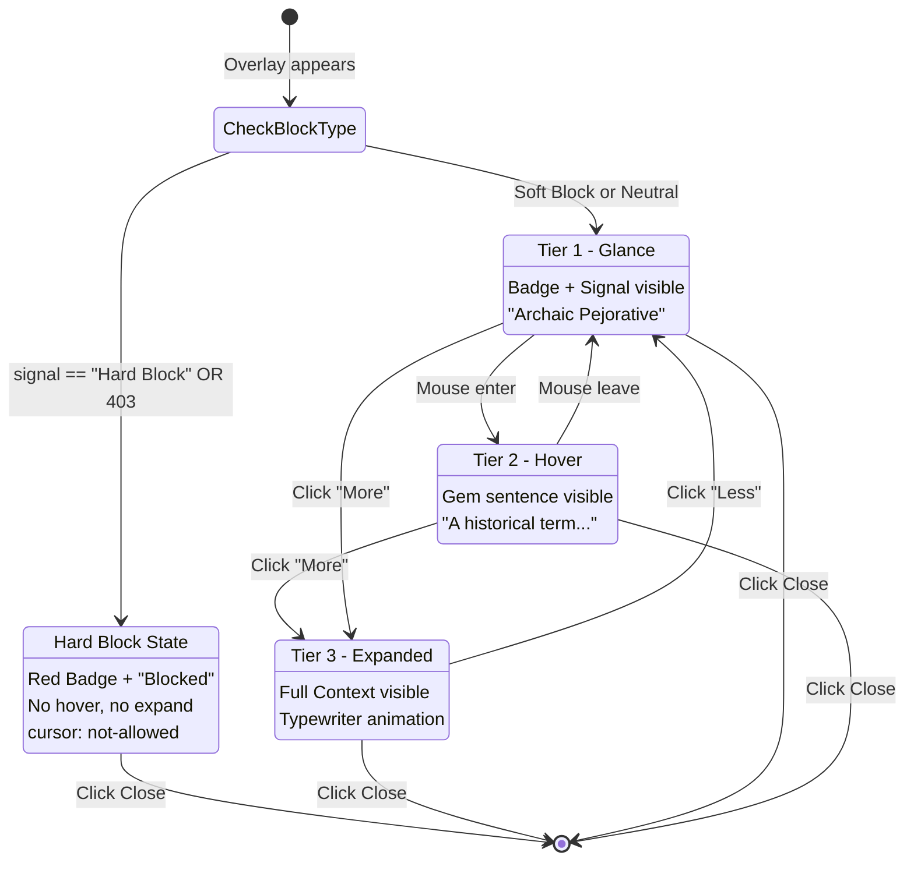

# 1125 - Feature: Museum Label Progressive Disclosure UI

## 1. Context & Goal
* **Issue:** #125
* **Objective:** Update the overlay UI to support progressive disclosure with Signal, Gem, and Context tiers.
* **Status:** Draft
* **Related Issues:** #124 (Digital Etymologist - provides the data), #126 (Hard vs. Soft Blocking)

### Background

Users should not be overwhelmed with information. The "Museum Label" concept presents information like a museum placard: the artifact (Signal) is immediately visible, a brief description (Gem) is available on hover, and deep history (Context) is opt-in via click/expand.

## 2. Requirements

| ID | Requirement | Acceptance Criteria |
|----|-------------|---------------------|
| R1 | Tier 1 (Glance) | Show badge color + Signal classification by default |
| R2 | Tier 2 (Hover) | Show Gem (1-sentence summary) on hover |
| R3 | Tier 3 (Expand) | Reveal full Context on click/expand |
| R4 | Smooth animations | Expansion uses CSS transitions |
| R5 | Close button accessible | Always visible, works at any tier, Tab-accessible |
| R6 | Visual hierarchy | Clear distinction between tiers |
| R7 | Mobile-friendly | Touch targets adequate, works without hover |
| R8 | Shadow DOM isolation | Styles don't leak to/from host page |
| R9 | Typewriter Effect | Context text streams character-by-character (~10-20ms delay) |
| R10 | Hard Block State | Hard Block disables Tier 2/3 interactions entirely |
| R11 | No Markdown | Render all text as raw text via textContent (security) |
| R12 | Max Z-Index | Overlay uses z-index: 2147483647 to beat all host content |
| R13 | ARIA Accessibility | Use aria-expanded attributes for screen readers |
| R14 | Interruptible Animation | Typewriter animation stops cleanly on close |

## 3. Alternatives Considered

| Option | Pros | Cons | Decision |
|--------|------|------|----------|
| A. All content visible immediately | Simple, no interaction needed | Overwhelming, cluttered | **Rejected** |
| B. Progressive disclosure (hover/click) | Clean UX, user controls depth | Slightly more complex | **Selected** |
| C. Tabbed interface | Clear separation | Too formal, slower navigation | **Rejected** |
| D. Tooltip only | Minimal footprint | Not enough space for Context | **Rejected** |

**Rationale:** Progressive disclosure respects user attention. Power users can dive deep; casual users get quick answers. Museum labels work because they layer information.

## 4. Data & Fixtures

### 4.1 Data Sources

| Attribute | Value |
|-----------|-------|
| Source | Digital Etymologist JSON response (#124) |
| Format | JSON with signal, gem, context fields |
| Size | ~200 words max |
| Refresh | Per-request |
| Copyright/License | N/A |

### 4.2 Data Pipeline

```
Lambda Response ──JSON──► Extension ──parse──► Overlay ──render──► Shadow DOM
```

### 4.3 Test Fixtures

| Fixture | Source | Notes |
|---------|--------|-------|
| Short response | Generated | Minimal content for layout testing |
| Long response | Generated | Max-length content for overflow testing |
| Various signals | Generated | Different badge colors/types |

### 4.4 Deployment Pipeline

Update `extension/overlay.js` and `extension/overlay.css` (or inline styles in Shadow DOM). Deploy via extension update.

## 5. Diagram



## 6. Technical Approach

* **Module:** `extension/overlay.js`, styles in Shadow DOM
* **Dependencies:** None (vanilla JS/CSS)
* **Pattern:** Component with state machine (Glance → Hover → Expanded)
* **Z-Index:** 2147483647 (max 32-bit signed integer)

### 6.0 Hard Block State

When the response indicates a Hard Block (signal == "Hard Block" OR HTTP 403):

| Aspect | Behavior |
|--------|----------|
| Visual | Red badge (#EF4444) + "Blocked" signal text |
| Tier 2 (Hover) | Disabled - no Gem shown on hover |
| Tier 3 (Expand) | Disabled - "Show More" button hidden or disabled |
| Cursor | `cursor: not-allowed` on the card body |
| Close | Still functional - user can dismiss |

```javascript
function isHardBlock(response, httpStatus) {
    if (httpStatus === 403) return true;
    if (!response || !response.signal) return false;
    return response.signal.toLowerCase().includes('hard block') ||
           response.signal.toLowerCase() === 'blocked';
}
```

### 6.1 UI Layout

```
+------------------------------------------+
| [Amber/Red Badge]  Signal Classification  [X] |
+------------------------------------------+
| Gem: Single sentence summary visible on  |
| hover or by default on mobile.           |
+------------------------------------------+  <- Collapsed by default
| Context: Three sentences of historical   |
| detail appear when user clicks "More".   |
| This section slides down smoothly.       |
|                                          |
|                              [Show Less] |
+------------------------------------------+
```

### 6.2 Color Coding

| Type | Badge Color | Signal Examples |
|------|-------------|-----------------|
| Warning (Soft Block) | Amber (#FBBF24) | "Archaic Pejorative", "Regional Slang" |
| Block (Hard Block) | Red (#EF4444) | "Hate Speech", "Severe Slur" |
| Neutral | Blue (#3B82F6) | "Historical Term", "Loanword" |

### 6.3 CSS Animation

```css
.aletheia-card {
    z-index: 2147483647;  /* Max z-index to beat all host content */
}

.aletheia-context {
    max-height: 0;
    overflow: hidden;
    transition: max-height 0.3s ease-out, padding 0.3s ease-out;
}

.aletheia-context.expanded {
    max-height: 200px;  /* Adjust based on content */
    padding: 12px;
}

.aletheia-card.hard-block {
    cursor: not-allowed;
}

.aletheia-card.hard-block .aletheia-toggle {
    display: none;
}
```

### 6.4 Typewriter Effect ("Unconcealment")

The Context text streams in character-by-character to "unconceal" meaning. Backend buffers the full response (#124); frontend animates rendering.

**Constraints:**
- Delay: ~10-20ms per character (configurable)
- Must be interruptible (user can close mid-animation)
- Use textContent only (no innerHTML - XSS prevention)
- Performant: use requestAnimationFrame or efficient timeouts

```javascript
// Typewriter animation state
let typewriterAbort = null;

function typewriterRender(element, text, delayMs = 15) {
    // Cancel any existing animation
    if (typewriterAbort) {
        typewriterAbort.abort = true;
    }

    const controller = { abort: false };
    typewriterAbort = controller;

    element.textContent = '';
    let index = 0;

    function renderNext() {
        if (controller.abort || index >= text.length) {
            typewriterAbort = null;
            return;
        }

        element.textContent += text[index];
        index++;

        // Use requestAnimationFrame for smooth rendering
        setTimeout(() => {
            requestAnimationFrame(renderNext);
        }, delayMs);
    }

    requestAnimationFrame(renderNext);
}

function stopTypewriter() {
    if (typewriterAbort) {
        typewriterAbort.abort = true;
        typewriterAbort = null;
    }
}
```

**Integration:**
- Call `typewriterRender()` when expanding to Tier 3
- Call `stopTypewriter()` on close or collapse
- On Hard Block: typewriter is never invoked (Tier 3 disabled)

### 6.5 Shadow DOM Structure

```html
<div id="aletheia-overlay" style="z-index: 2147483647;">
  #shadow-root (closed)
    <style>/* All styles inline */</style>
    <div class="aletheia-card" role="dialog" aria-label="Aletheia word context">
      <div class="aletheia-header">
        <span class="aletheia-badge amber">!</span>
        <span class="aletheia-signal">Archaic Pejorative</span>
        <button class="aletheia-close" aria-label="Close" tabindex="0">×</button>
      </div>
      <div class="aletheia-gem" aria-expanded="false">
        A dated term historically used to demean...
      </div>
      <div class="aletheia-context" aria-expanded="false">
        <!-- Content rendered via textContent, no innerHTML -->
      </div>
      <button class="aletheia-toggle" tabindex="0">Show More</button>
    </div>
```

## 7. Interface Specification

### 7.1 Data Structures

```javascript
// Response from Digital Etymologist
const EtymologistResponse = {
    signal: "string",   // 2-4 words
    gem: "string",      // 1 sentence
    context: "string",  // 3 sentences (rendered as raw text, no markdown)
};

// Overlay state
const OverlayState = {
    HARD_BLOCKED: 'hard_blocked', // Red badge, no interaction allowed
    GLANCE: 'glance',             // Badge + Signal only
    HOVER: 'hover',               // + Gem visible
    EXPANDED: 'expanded',         // + Context visible (typewriter animation)
};

// Badge type for styling
const BadgeType = {
    WARNING: 'warning',   // Amber - soft block
    BLOCK: 'block',       // Red - hard block
    NEUTRAL: 'neutral',   // Blue - informational
};
```

### 7.2 Function Signatures

```javascript
// overlay.js - Core functions
function createOverlay(response: EtymologistResponse, httpStatus: number): HTMLElement;
function showOverlay(element: HTMLElement): void;
function hideOverlay(): void;
function setOverlayState(state: OverlayState): void;
function getBadgeType(response: EtymologistResponse): BadgeType;

// Hard Block detection
function isHardBlock(response: EtymologistResponse, httpStatus: number): boolean;

// Typewriter animation
function typewriterRender(element: HTMLElement, text: string, delayMs?: number): void;
function stopTypewriter(): void;

// Event handlers
function handleToggleClick(): void;
function handleCloseClick(): void;
function handleMouseEnter(): void;
function handleMouseLeave(): void;
function handleKeydown(event: KeyboardEvent): void;  // Escape key support

// ARIA state management
function updateAriaExpanded(element: HTMLElement, expanded: boolean): void;

// Exposed globally for service worker injection
window.showAletheiaResult = function(response: EtymologistResponse, httpStatus: number): void;
```

### 7.3 Logic Flow (Pseudocode)

```
RENDER OVERLAY:
1. Receive EtymologistResponse and httpStatus from service worker
2. Check isHardBlock(response, httpStatus)
3. IF Hard Block:
   a. Set state to HARD_BLOCKED
   b. Show Red Badge + "Blocked" signal
   c. Hide toggle button, disable hover interactions
   d. Set cursor: not-allowed
4. ELSE:
   a. Determine badge type from response (warning/block/neutral)
   b. Set initial state to GLANCE
5. Create Shadow DOM container (z-index: 2147483647)
6. Inject HTML structure with data (use textContent, no innerHTML)
7. Inject styles (all inline in Shadow DOM)
8. Attach event listeners (hover, click, close, keydown)
9. Set aria-expanded attributes
10. Append to document body
11. Focus close button for keyboard users

HOVER BEHAVIOR (Soft Block / Neutral only):
- Desktop: mouseenter → show Gem (HOVER state), update aria-expanded
- Desktop: mouseleave → hide Gem (GLANCE state), update aria-expanded
- Mobile: Gem always visible (skip hover state)
- Hard Block: No hover effect

EXPAND BEHAVIOR (Soft Block / Neutral only):
- Click "Show More":
  a. Animate Context container in (CSS transition)
  b. Start typewriterRender() for Context text
  c. Update aria-expanded="true"
  d. Set state to EXPANDED
- Click "Show Less":
  a. Call stopTypewriter() to interrupt animation
  b. Animate Context container out
  c. Update aria-expanded="false"
  d. Set state to GLANCE
- Hard Block: Toggle button hidden, no expand possible

CLOSE BEHAVIOR:
- Click X button OR Press Escape key:
  a. Call stopTypewriter() to clean up
  b. Fade out overlay (CSS transition)
  c. Remove overlay from DOM
```

## 8. Security Considerations

| Concern | Mitigation | Status |
|---------|------------|--------|
| XSS via response content | Use textContent only (no innerHTML, no markdown) | Addressed |
| Style bleed from host | Shadow DOM with closed mode | Addressed |
| Click-jacking | Overlay positioned clearly, close always accessible | Addressed |
| Host page JavaScript access | Closed Shadow DOM prevents access | Addressed |
| Z-index conflicts | Max z-index (2147483647) ensures visibility | Addressed |

**Critical Security Rule:** NEVER use innerHTML or insertAdjacentHTML. All text content MUST be set via textContent or createTextNode. This prevents XSS even if the backend response is compromised.

**No Markdown:** Per orchestrator decision, all text is rendered as raw text. No markdown parsing, no rich text formatting. Security first.

**Fail Mode:** Fail Safe - If overlay fails to render, log error and do nothing. Never inject malformed HTML.

## 9. Performance Considerations

| Metric | Budget | Approach |
|--------|--------|----------|
| Render time | < 50ms | Simple DOM, no framework |
| Animation FPS | 60fps | CSS transitions only (GPU accelerated) |
| Typewriter FPS | 60fps | requestAnimationFrame + setTimeout combo |
| Memory | < 1MB | Single overlay, cleaned up on close |
| Bundle size | < 10KB | Vanilla JS, inline CSS |

**Bottlenecks:**
- Initial Shadow DOM creation (one-time)
- Animation performance on low-end devices
- Typewriter effect on very long context text (mitigated by ~200 word max)

**Typewriter Performance:**
- Use requestAnimationFrame for smooth rendering
- setTimeout for character delay (10-20ms)
- textContent append is efficient (no reparse)
- Interruptible: abort flag checked each frame

## 10. Risks & Mitigations

| Risk | Impact | Likelihood | Mitigation |
|------|--------|------------|------------|
| Host CSS breaks overlay | Med | Low | Shadow DOM isolation |
| Overlay obscures important content | Med | Med | Draggable or dismissible |
| Accessibility issues | Med | Med | ARIA labels, keyboard navigation, tabindex |
| Animation jank | Low | Low | CSS-only transitions, test on slow devices |
| Touch targets too small | Med | Med | Minimum 44x44px touch targets |
| Typewriter memory leak | Med | Low | Abort controller pattern, cleanup on close |
| Z-index war with host | Low | Low | Max z-index (2147483647) |
| Hard Block not detected | High | Low | Check both signal text AND HTTP status |

## 11. Verification & Testing

### 11.1 Test Scenarios

| ID | Scenario | Type | Input | Expected Output | Pass Criteria |
|----|----------|------|-------|-----------------|---------------|
| 010 | Render with all tiers | Manual | Valid response | Overlay shows Signal | Visual inspection |
| 020 | Hover shows Gem | Manual | Hover on overlay | Gem text appears | Text visible |
| 030 | Click expands Context | Manual | Click "Show More" | Context slides down | Animation smooth |
| 035 | Typewriter animation | E2E | Click "Show More" | Context types in char-by-char | Text streams visibly |
| 040 | Click collapses Context | Manual | Click "Show Less" | Context slides up | Animation smooth |
| 045 | Typewriter interruption | E2E | Expand then close mid-animation | No errors, clean DOM | No console errors |
| 050 | Close button works | Manual | Click X | Overlay removed | DOM clean |
| 055 | Tab to close button | Manual | Press Tab | Close button focused | Focus visible |
| 060 | Escape key closes | Manual | Press Escape | Overlay removed | DOM clean |
| 070 | Badge color correct | Unit | Warning response | Amber badge | getBadgeType returns 'warning' |
| 080 | Badge color correct | Unit | Block response | Red badge | getBadgeType returns 'block' |
| 085 | Hard Block detected (403) | Unit | httpStatus=403 | isHardBlock returns true | Function returns true |
| 086 | Hard Block detected (signal) | Unit | signal="Hard Block" | isHardBlock returns true | Function returns true |
| 087 | Hard Block UI | E2E | Hard Block response | No hover, no expand, red badge | Toggle hidden |
| 090 | Styles don't leak | Manual | Host with CSS reset | Overlay unaffected | Visual inspection |
| 095 | aria-expanded updates | E2E | Expand/collapse | aria-expanded toggles | Attribute changes |
| 100 | Mobile touch works | Manual | Touch on mobile | Tiers work | No hover needed |
| 110 | Long content handled | Manual | Max-length response | No overflow, scrollable | Layout intact |
| 120 | XSS prevented | Unit | Response with `<script>` | textContent used | No script execution |

### 11.2 Test Modules (from 0005)

* **Unit Tests:** `tests/test_overlay_logic.js`
  - `getBadgeType()` - returns correct badge type for response
  - `isHardBlock()` - detects hard block from signal or HTTP status
  - State transitions (GLANCE → HOVER → EXPANDED)
  - No innerHTML usage (static analysis or test)
* **Semantic (Module B):** No
* **End-to-End (Module C):** `tests/e2e/test_extension.spec.ts` (Playwright)
  - Verify expand triggers typewriter animation
  - Verify hard block disables interactions
  - Verify aria-expanded attribute changes
  - Verify Escape key and Tab navigation

### 11.3 Manual Smoke Test

1. Trigger Aletheia on test term (soft block)
2. Verify overlay appears with badge and Signal
3. Hover - verify Gem appears
4. Click "Show More" - verify Context slides down with typewriter effect
5. Close mid-animation - verify no errors in console
6. Reopen, let typewriter complete
7. Click "Show Less" - verify Context slides up
8. Press Tab - verify close button receives focus
9. Press Escape - verify overlay closes
10. Trigger Aletheia on denylist term (hard block)
11. Verify red badge, "Blocked" text, no hover effect, no toggle button
12. Repeat on a page with aggressive CSS reset
13. Test on mobile device

## 12. Definition of Done

### Code
- [ ] Shadow DOM overlay structure (z-index: 2147483647)
- [ ] Three-tier progressive disclosure (Glance → Hover → Expanded)
- [ ] Hard Block state (Tier 1 only, no interactions)
- [ ] CSS animations for expand/collapse
- [ ] Typewriter effect for Context text (interruptible)
- [ ] Event handlers (hover, click, close, escape, keydown)
- [ ] textContent only - no innerHTML (XSS prevention)
- [ ] No markdown rendering (raw text only)
- [ ] ARIA attributes (aria-expanded, aria-label)
- [ ] Tab-accessible close button

### Tests
- [ ] Unit tests pass (`tests/test_overlay_logic.js`)
- [ ] E2E tests pass (`tests/e2e/test_extension.spec.ts`)
- [ ] All manual scenarios pass (010-120)
- [ ] Tested on 5+ diverse websites
- [ ] Tested on Chrome, Firefox, Edge
- [ ] Tested on mobile (Android Chrome, iOS Safari)

### Documentation
- [ ] Component structure documented
- [ ] Color coding documented
- [ ] Typewriter effect documented
- [ ] Hard Block behavior documented
- [ ] LLD updated with any deviations

### Review
- [ ] UI/UX review
- [ ] Accessibility review (ARIA, keyboard navigation)
- [ ] Security review (no innerHTML)
- [ ] Code review completed
- [ ] User approval before closing issue
