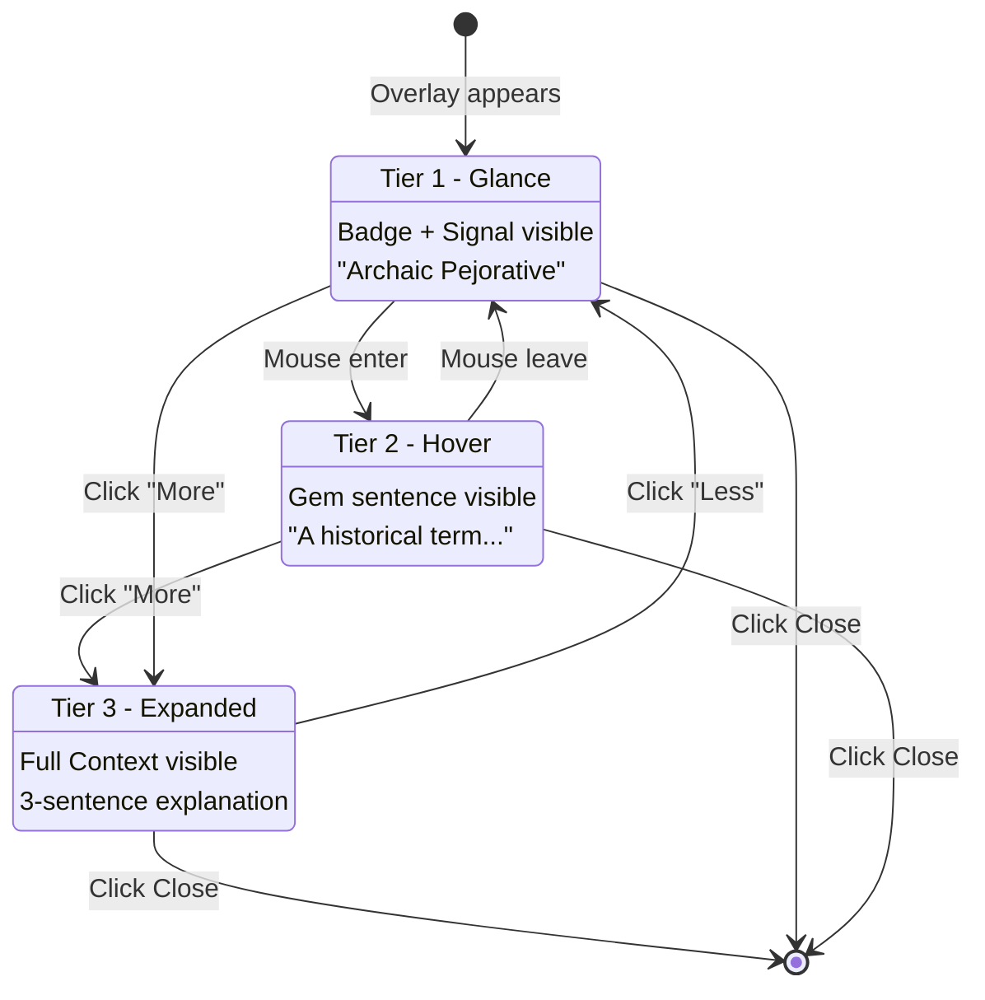

# 1125 - Feature: Museum Label Progressive Disclosure UI

## 1. Context & Goal
* **Issue:** #125
* **Objective:** Update the overlay UI to support progressive disclosure with Signal, Gem, and Context tiers.
* **Status:** Draft
* **Related Issues:** #124 (Digital Etymologist - provides the data), #126 (Hard vs. Soft Blocking)

### Background

Users should not be overwhelmed with information. The "Museum Label" concept presents information like a museum placard: the artifact (Signal) is immediately visible, a brief description (Gem) is available on hover, and deep history (Context) is opt-in via click/expand.

## 2. Requirements

| ID | Requirement | Acceptance Criteria |
|----|-------------|---------------------|
| R1 | Tier 1 (Glance) | Show badge color + Signal classification by default |
| R2 | Tier 2 (Hover) | Show Gem (1-sentence summary) on hover |
| R3 | Tier 3 (Expand) | Reveal full Context on click/expand |
| R4 | Smooth animations | Expansion uses CSS transitions |
| R5 | Close button accessible | Always visible, works at any tier |
| R6 | Visual hierarchy | Clear distinction between tiers |
| R7 | Mobile-friendly | Touch targets adequate, works without hover |
| R8 | Shadow DOM isolation | Styles don't leak to/from host page |

## 3. Alternatives Considered

| Option | Pros | Cons | Decision |
|--------|------|------|----------|
| A. All content visible immediately | Simple, no interaction needed | Overwhelming, cluttered | **Rejected** |
| B. Progressive disclosure (hover/click) | Clean UX, user controls depth | Slightly more complex | **Selected** |
| C. Tabbed interface | Clear separation | Too formal, slower navigation | **Rejected** |
| D. Tooltip only | Minimal footprint | Not enough space for Context | **Rejected** |

**Rationale:** Progressive disclosure respects user attention. Power users can dive deep; casual users get quick answers. Museum labels work because they layer information.

## 4. Data & Fixtures

### 4.1 Data Sources

| Attribute | Value |
|-----------|-------|
| Source | Digital Etymologist JSON response (#124) |
| Format | JSON with signal, gem, context fields |
| Size | ~200 words max |
| Refresh | Per-request |
| Copyright/License | N/A |

### 4.2 Data Pipeline

```
Lambda Response ──JSON──► Extension ──parse──► Overlay ──render──► Shadow DOM
```

### 4.3 Test Fixtures

| Fixture | Source | Notes |
|---------|--------|-------|
| Short response | Generated | Minimal content for layout testing |
| Long response | Generated | Max-length content for overflow testing |
| Various signals | Generated | Different badge colors/types |

### 4.4 Deployment Pipeline

Update `extension/overlay.js` and `extension/overlay.css` (or inline styles in Shadow DOM). Deploy via extension update.

## 5. Diagram



## 6. Technical Approach

* **Module:** `extension/overlay.js`, styles in Shadow DOM
* **Dependencies:** None (vanilla JS/CSS)
* **Pattern:** Component with state machine (Glance → Hover → Expanded)

### 6.1 UI Layout

```
+------------------------------------------+
| [Amber/Red Badge]  Signal Classification  [X] |
+------------------------------------------+
| Gem: Single sentence summary visible on  |
| hover or by default on mobile.           |
+------------------------------------------+  <- Collapsed by default
| Context: Three sentences of historical   |
| detail appear when user clicks "More".   |
| This section slides down smoothly.       |
|                                          |
|                              [Show Less] |
+------------------------------------------+
```

### 6.2 Color Coding

| Type | Badge Color | Signal Examples |
|------|-------------|-----------------|
| Warning (Soft Block) | Amber (#FBBF24) | "Archaic Pejorative", "Regional Slang" |
| Block (Hard Block) | Red (#EF4444) | "Hate Speech", "Severe Slur" |
| Neutral | Blue (#3B82F6) | "Historical Term", "Loanword" |

### 6.3 CSS Animation

```css
.aletheia-context {
    max-height: 0;
    overflow: hidden;
    transition: max-height 0.3s ease-out, padding 0.3s ease-out;
}

.aletheia-context.expanded {
    max-height: 200px;  /* Adjust based on content */
    padding: 12px;
}
```

### 6.4 Shadow DOM Structure

```html
<div id="aletheia-overlay">
  #shadow-root (closed)
    <style>/* All styles inline */</style>
    <div class="aletheia-card">
      <div class="aletheia-header">
        <span class="aletheia-badge amber">!</span>
        <span class="aletheia-signal">Archaic Pejorative</span>
        <button class="aletheia-close">×</button>
      </div>
      <div class="aletheia-gem">
        A dated term historically used to demean...
      </div>
      <div class="aletheia-context">
        Originated in 19th century America...
      </div>
      <button class="aletheia-toggle">Show More</button>
    </div>
```

## 7. Interface Specification

### 7.1 Data Structures

```javascript
// Response from Digital Etymologist
const EtymologistResponse = {
    signal: "string",   // 2-4 words
    gem: "string",      // 1 sentence
    context: "string",  // 3 sentences
};

// Overlay state
const OverlayState = {
    GLANCE: 'glance',     // Badge + Signal only
    HOVER: 'hover',       // + Gem visible
    EXPANDED: 'expanded', // + Context visible
};

// Badge type for styling
const BadgeType = {
    WARNING: 'warning',   // Amber - soft block
    BLOCK: 'block',       // Red - hard block
    NEUTRAL: 'neutral',   // Blue - informational
};
```

### 7.2 Function Signatures

```javascript
// overlay.js
function createOverlay(response: EtymologistResponse, type: BadgeType): HTMLElement;
function showOverlay(element: HTMLElement): void;
function hideOverlay(): void;
function setOverlayState(state: OverlayState): void;
function getBadgeType(response: EtymologistResponse): BadgeType;
function handleToggleClick(): void;
function handleCloseClick(): void;
function handleMouseEnter(): void;
function handleMouseLeave(): void;

// Exposed globally for service worker injection
window.showAletheiaResult = function(response: EtymologistResponse, type: BadgeType): void;
```

### 7.3 Logic Flow (Pseudocode)

```
RENDER OVERLAY:
1. Receive EtymologistResponse from service worker
2. Determine badge type from response (warning/block/neutral)
3. Create Shadow DOM container
4. Inject HTML structure with data
5. Inject styles (all inline in Shadow DOM)
6. Attach event listeners (hover, click, close)
7. Set initial state to GLANCE
8. Append to document body

HOVER BEHAVIOR:
- Desktop: mouseenter → show Gem (HOVER state)
- Desktop: mouseleave → hide Gem (GLANCE state)
- Mobile: Gem always visible (skip hover state)

EXPAND BEHAVIOR:
- Click "Show More" → animate Context in (EXPANDED state)
- Click "Show Less" → animate Context out (GLANCE state)

CLOSE BEHAVIOR:
- Click X button → fade out and remove overlay
- Keyboard: Escape key → same as close click
```

## 8. Security Considerations

| Concern | Mitigation | Status |
|---------|------------|--------|
| XSS via response content | Escape HTML in signal/gem/context | TODO |
| Style bleed from host | Shadow DOM with closed mode | Addressed |
| Click-jacking | Overlay positioned clearly, close always accessible | Addressed |
| Host page JavaScript access | Closed Shadow DOM prevents access | Addressed |

**Fail Mode:** Fail Safe - If overlay fails to render, log error and do nothing. Never inject malformed HTML.

## 9. Performance Considerations

| Metric | Budget | Approach |
|--------|--------|----------|
| Render time | < 50ms | Simple DOM, no framework |
| Animation FPS | 60fps | CSS transitions only (GPU accelerated) |
| Memory | < 1MB | Single overlay, cleaned up on close |
| Bundle size | < 10KB | Vanilla JS, inline CSS |

**Bottlenecks:**
- Initial Shadow DOM creation (one-time)
- Animation performance on low-end devices

## 10. Risks & Mitigations

| Risk | Impact | Likelihood | Mitigation |
|------|--------|------------|------------|
| Host CSS breaks overlay | Med | Low | Shadow DOM isolation |
| Overlay obscures important content | Med | Med | Draggable or dismissible |
| Accessibility issues | Med | Med | ARIA labels, keyboard navigation |
| Animation jank | Low | Low | CSS-only transitions, test on slow devices |
| Touch targets too small | Med | Med | Minimum 44x44px touch targets |

## 11. Verification & Testing

### 11.1 Test Scenarios

| ID | Scenario | Type | Input | Expected Output | Pass Criteria |
|----|----------|------|-------|-----------------|---------------|
| 010 | Render with all tiers | Manual | Valid response | Overlay shows Signal | Visual inspection |
| 020 | Hover shows Gem | Manual | Hover on overlay | Gem text appears | Text visible |
| 030 | Click expands Context | Manual | Click "Show More" | Context slides down | Animation smooth |
| 040 | Click collapses Context | Manual | Click "Show Less" | Context slides up | Animation smooth |
| 050 | Close button works | Manual | Click X | Overlay removed | DOM clean |
| 060 | Escape key closes | Manual | Press Escape | Overlay removed | DOM clean |
| 070 | Badge color correct | Manual | Warning response | Amber badge | Color check |
| 080 | Badge color correct | Manual | Block response | Red badge | Color check |
| 090 | Styles don't leak | Manual | Host with CSS reset | Overlay unaffected | Visual inspection |
| 100 | Mobile touch works | Manual | Touch on mobile | Tiers work | No hover needed |
| 110 | Long content handled | Manual | Max-length response | No overflow, scrollable | Layout intact |
| 120 | XSS prevented | Auto | Response with `<script>` | Escaped, not executed | No script runs |

### 11.2 Test Modules (from 0005)

* **Unit Tests:** N/A - UI component, manual testing
* **Semantic (Module B):** No
* **End-to-End (Module C):** Yes - full visual testing

### 11.3 Manual Smoke Test

1. Trigger Aletheia on test term
2. Verify overlay appears with badge and Signal
3. Hover - verify Gem appears
4. Click "Show More" - verify Context slides down smoothly
5. Click "Show Less" - verify Context slides up
6. Press Escape - verify overlay closes
7. Repeat on a page with aggressive CSS reset
8. Test on mobile device

## 12. Definition of Done

### Code
- [ ] Shadow DOM overlay structure
- [ ] Three-tier progressive disclosure
- [ ] CSS animations for expand/collapse
- [ ] Event handlers (hover, click, close, escape)
- [ ] Badge color logic based on response type
- [ ] HTML escaping for response content

### Tests
- [ ] All manual scenarios pass (010-120)
- [ ] Tested on 5+ diverse websites
- [ ] Tested on Chrome, Firefox, Edge
- [ ] Tested on mobile (Android Chrome, iOS Safari)

### Documentation
- [ ] Component structure documented
- [ ] Color coding documented
- [ ] LLD updated with any deviations

### Review
- [ ] UI/UX review
- [ ] Accessibility review
- [ ] Code review completed
- [ ] User approval before closing issue
