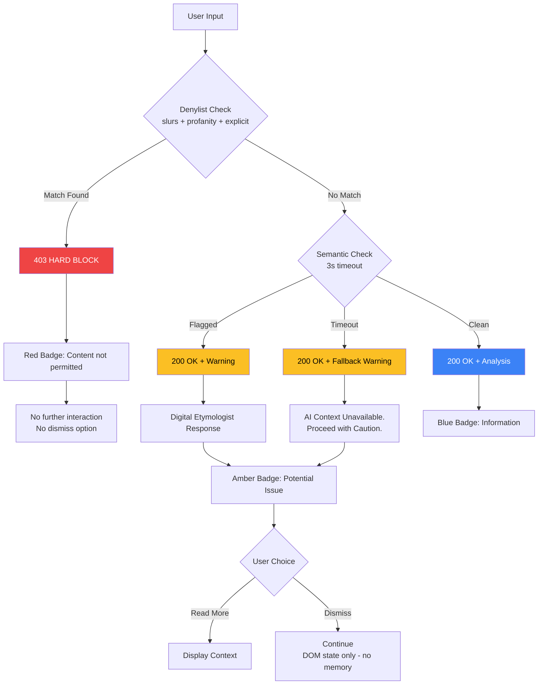

# 1126 - Feature: Hard vs. Soft Blocking Logic

## 1. Context & Goal
* **Issue:** #126
* **Objective:** Differentiate between "Forbidden" terms (hard block via Denylist) and "Educational" terms (soft block via Semantic Analysis).
* **Status:** Draft
* **Related Issues:** #45 (Denylist implementation), #121 (Wikipedia denylist source), #124 (Digital Etymologist), #125 (Museum Label UI)

### Background

The current system treats all flagged content the same way. We need to split responses into two categories:

1. **Hard Block:** Immediate rejection for denylist terms (slurs, profanity, explicit content). No further interaction.
2. **Soft Block:** Warning with educational context for nuanced terms. User can read explanation and proceed.

## 2. Requirements

| ID | Requirement | Acceptance Criteria |
|----|-------------|---------------------|
| R1 | Hard block on denylist terms | 403 Forbidden response, no explanation generated |
| R2 | Hard block includes profanity | "Seven Dirty Words" and explicit terms trigger 403 |
| R3 | Soft block on semantic flags | 200 OK with warning payload |
| R4 | Clear UX distinction | Red badge (hard) vs. Amber badge (soft) |
| R5 | Hard block message | "Blocked: Content not permitted" |
| R6 | Soft block allows reading | User can view the Digital Etymologist explanation |
| R7 | Dismissal is per-selection only | NO persistence - dismissing applies only to current popup |
| R8 | Denylist remains fail-closed | If denylist check fails, treat as hard block |
| R9 | Semantic timeout → soft block | If semantic times out, show warning with fallback message |
| R10 | No storage of dismissals | Never save dismissed terms to chrome.storage or globals |

## 3. Alternatives Considered

| Option | Pros | Cons | Decision |
|--------|------|------|----------|
| A. Block everything flagged | Simple, conservative | Over-blocking educational content | **Rejected** |
| B. Two-tier (Hard/Soft) | Nuanced, educational | More complex logic | **Selected** |
| C. Three-tier (Block/Warn/Info) | Very granular | Too complex, confusing UX | **Rejected** |
| D. User-configurable sensitivity | Personalized | Too much burden on user | **Rejected** |
| E. Remember dismissed terms | Smoother UX | Violates "Privacy First" - no saving | **Rejected** |

**Rationale:** A two-tier system balances safety (hard block on denylist content) with education (context for nuanced terms). This aligns with Aletheia's mission as a "Digital Etymologist."

## 4. Data & Fixtures

### 4.1 Data Sources

| Attribute | Value |
|-----------|-------|
| Source | Wikipedia Denylist + Bedrock Semantic Analysis |
| Format | JSON (denylist), LLM response (semantic) |
| Size | Denylist: ~2500 terms; Semantic: per-request |
| Refresh | Denylist: manual update; Semantic: real-time |
| Copyright/License | Denylist: CC BY-SA 4.0 (Wikipedia); Semantic: N/A |

### 4.2 Data Pipeline

```
Input ──denylist check──► HARD BLOCK (if match: slurs, profanity, explicit)
   │
   └──semantic check──► SOFT BLOCK (if flagged) ──► Digital Etymologist ──► Response
                 │              │
                 │              └──► TIMEOUT: Soft Block with fallback message
                 │
                 └──► ALLOW (if clean)
```

### 4.3 Test Fixtures (Decision Matrix)

| Term | In Denylist | Semantic Result | Expected | HTTP Code |
|------|-------------|-----------------|----------|-----------|
| N-word | Yes | N/A (skipped) | Hard Block | 403 |
| F-word | Yes | N/A (skipped) | Hard Block | 403 |
| "Shylock" | No | Pejorative | Soft Block | 200 |
| "Hello" | No | Clean | Allow | 200 |
| "Lunatic" | No | Archaic Pejorative | Soft Block | 200 |
| (timeout) | No | Timeout | Soft Block (fallback) | 200 |

### 4.4 What Triggers Hard Block

The Denylist (sourced from Wikipedia, Issue #121) includes:
- **Slurs:** Racial, ethnic, religious epithets
- **Profanity:** The "Seven Dirty Words" and explicit variants
- **Explicit sexual terms:** Anatomical vulgarity, explicit acts

**Rule:** If it's in the Denylist, it's a Hard Block. No exceptions, no "soft blocking" profanity.

### 4.5 Deployment Pipeline

1. Update `lambda_function.py` to return different response codes
2. Update `src/guardrails/denylist.py` for hard block logic
3. Update `src/guardrails/semantic.py` for soft block logic with timeout handling
4. Update extension to handle both response types
5. Deploy Lambda and extension

## 5. Diagram



## 6. Technical Approach

* **Module:** `lambda_function.py`, `src/guardrails/denylist.py`, `src/guardrails/semantic.py`, `extension/overlay.js`
* **Dependencies:** Existing guardrails infrastructure, Bedrock
* **Pattern:** Pipeline with early exit (fail fast for hard blocks)

### 6.1 Response Types

| Type | HTTP Code | Body | Frontend Action |
|------|-----------|------|-----------------|
| Hard Block | 403 | `{"blocked": true, "reason": "denylist"}` | Red badge, no context, no dismiss |
| Soft Block | 200 | `{"warning": true, "response": {...}}` | Amber badge, show context, can dismiss |
| Soft Block (timeout) | 200 | `{"warning": true, "fallback": true, "response": {...}}` | Amber badge, fallback message |
| Clean | 200 | `{"response": {...}}` | Blue badge, show context |

### 6.2 Denylist Check (Hard Block)

```python
# src/guardrails/denylist.py
def check_denylist(term: str) -> tuple[bool, str | None]:
    """Check if term is in denylist.

    The denylist includes:
    - Slurs (racial, ethnic, religious)
    - Profanity (Seven Dirty Words + variants)
    - Explicit sexual terms

    Source: Wikipedia (Issue #121)

    Returns:
        (is_blocked, reason) - reason is None if not blocked
    """
    normalized = term.lower().strip()
    if normalized in DENYLIST_TERMS:
        return (True, "denylist")
    return (False, None)
```

### 6.3 Semantic Check with Timeout (Soft Block)

```python
# src/guardrails/semantic.py
import time

SEMANTIC_TIMEOUT_SECONDS = 3.0

def check_semantic(term: str, context: str) -> tuple[bool, str | None, bool]:
    """Check if term requires semantic warning.

    Returns:
        (needs_warning, category, is_timeout)
        - category is None if no warning needed
        - is_timeout is True if Bedrock timed out
    """
    start = time.time()

    try:
        result = invoke_semantic_check(term, context, timeout=SEMANTIC_TIMEOUT_SECONDS)

        if result.get("flagged"):
            return (True, result.get("category"), False)
        return (False, None, False)

    except TimeoutError:
        # Fail SAFE: Semantic timeout → Soft Block with fallback
        return (True, "timeout", True)

    except Exception as e:
        # Other errors: Soft Block with fallback (conservative)
        logger.error(f"Semantic check error: {e}")
        return (True, "error", True)
```

### 6.4 Lambda Response Flow

```python
def handler(event):
    term = event["word"]
    context = event["context"]

    # Step 1: Denylist check (HARD BLOCK)
    # Includes slurs, profanity, explicit content
    is_blocked, reason = check_denylist(term)
    if is_blocked:
        return {
            "statusCode": 403,
            "body": json.dumps({
                "blocked": True,
                "reason": reason,
                "message": "Blocked: Content not permitted"
            })
        }

    # Step 2: Semantic check (SOFT BLOCK)
    needs_warning, category, is_timeout = check_semantic(term, context)

    # Step 3: Generate Digital Etymologist response
    if is_timeout:
        # Use fallback response for timeout/error
        response = get_timeout_fallback_response()
    else:
        response = generate_etymology(term, context)

    if needs_warning:
        return {
            "statusCode": 200,
            "body": json.dumps({
                "warning": True,
                "category": category,
                "fallback": is_timeout,
                "response": response
            })
        }

    # Clean response
    return {
        "statusCode": 200,
        "body": json.dumps({
            "response": response
        })
    }


def get_timeout_fallback_response():
    """Return fallback when semantic check times out."""
    return {
        "signal": "Context Unavailable",
        "gem": "AI analysis timed out. Proceed with caution.",
        "context": "The semantic analysis could not complete in time. "
                   "This term may require careful consideration. "
                   "If you're unsure, consider researching further."
    }
```

### 6.5 Dismissal Behavior (Privacy First)

**CRITICAL: No Memory Rule**

```javascript
// extension/overlay.js
// Dismissal is DOM-only, per-selection, no persistence

function showSoftBlock(category, etymology) {
    const overlay = createOverlay(etymology, 'warning');

    const dismissButton = overlay.querySelector('.dismiss-btn');
    dismissButton.addEventListener('click', () => {
        // Simply remove the overlay from DOM
        // NO chrome.storage writes
        // NO global variable updates
        // NO "dismissed_terms" tracking
        overlay.remove();
    });

    document.body.appendChild(overlay);
}

// If user re-selects the same text 10 seconds later,
// the warning appears again. This is intentional.
```

**Why:** We do not want to "save things." The Privacy First doctrine means no tracking of user behavior, dismissed terms, or interaction history.

## 7. Interface Specification

### 7.1 Data Structures

```python
from typing import TypedDict, Literal

class HardBlockResponse(TypedDict):
    blocked: Literal[True]
    reason: str           # "denylist"
    message: str          # "Blocked: Content not permitted"

class SoftBlockResponse(TypedDict):
    warning: Literal[True]
    category: str         # "archaic_pejorative", "timeout", etc.
    fallback: bool        # True if semantic timed out
    response: dict        # Digital Etymologist response

class CleanResponse(TypedDict):
    response: dict        # Digital Etymologist response

# Frontend enum
class BlockType:
    HARD = "hard"     # 403, no interaction, no dismiss
    SOFT = "soft"     # 200 with warning, can dismiss (DOM only)
    NONE = "none"     # 200, clean
```

### 7.2 Function Signatures

```python
# lambda_function.py
def handler(event: dict, context: Any) -> dict:
    """Main Lambda handler with hard/soft block logic."""
    ...

def get_timeout_fallback_response() -> dict:
    """Return fallback response for semantic timeout."""
    ...

# src/guardrails/denylist.py
def check_denylist(term: str) -> tuple[bool, str | None]:
    """Check term against denylist (slurs + profanity + explicit)."""
    ...

def load_denylist() -> set[str]:
    """Load denylist from Wikipedia source (Issue #121)."""
    ...

# src/guardrails/semantic.py
def check_semantic(term: str, context: str) -> tuple[bool, str | None, bool]:
    """Semantic analysis. Returns (flagged, category, is_timeout)."""
    ...

# extension/overlay.js (no storage functions!)
function showHardBlock(message: string): void;
function showSoftBlock(category: string, etymology: object): void;
function showCleanResult(etymology: object): void;
function dismissOverlay(): void;  // DOM removal only
```

### 7.3 Logic Flow (Pseudocode)

```
LAMBDA HANDLER:
1. Extract term and context from request
2. DENYLIST CHECK (deterministic, fast):
   - Normalize term (lowercase, strip)
   - Check against denylist set (slurs + profanity + explicit)
   - IF match: return 403 with hard block message, EXIT
3. SEMANTIC CHECK (LLM-based, 3s timeout):
   - Send term + context to semantic analyzer
   - IF timeout/error: set warning=True, category="timeout", use fallback response
   - IF flagged: set warning=True, capture category
4. GENERATE RESPONSE:
   - IF timeout: use fallback response
   - ELSE: call Digital Etymologist
5. RETURN:
   - IF warning: 200 with warning payload
   - ELSE: 200 with clean payload

FRONTEND HANDLER:
1. Receive response from Lambda
2. CHECK status code:
   - IF 403: Show red badge, hard block message, NO dismiss button
   - IF 200 with warning: Show amber badge, etymology, dismiss button (DOM only)
   - IF 200 clean: Show blue badge, etymology
3. ON DISMISS (soft block only):
   - Remove overlay from DOM
   - Do NOT write to storage
   - Do NOT track dismissed terms
```

## 8. Security Considerations

| Concern | Mitigation | Status |
|---------|------------|--------|
| Denylist bypass via encoding | Normalize before check (lowercase, strip) | Addressed |
| Semantic check bypass | Belt-and-suspenders with denylist | Addressed |
| Rate limiting on semantic | Already rate-limited at Lambda level | Addressed |
| Soft block misclassification | Conservative: err toward warning | Addressed |
| Hard block too aggressive | Curated Wikipedia denylist | Addressed |
| Dismissal tracking | No storage - DOM only | Addressed |

**Fail Modes:**
- **Denylist check failure:** Fail Closed → treat as hard block (403)
- **Semantic check timeout:** Fail Safe → soft block with fallback message (200 + warning)
- **Semantic check error:** Fail Safe → soft block with fallback message (200 + warning)

## 9. Performance Considerations

| Metric | Budget | Approach |
|--------|--------|----------|
| Denylist check | < 1ms | In-memory set lookup |
| Semantic check | < 3s | Bedrock Haiku with timeout |
| Total latency | < 3s | Early exit on hard block saves time |
| Memory (denylist) | < 1MB | ~3000 terms × ~20 chars |

**Bottlenecks:**
- Semantic check is the slowest step
- Hard blocks bypass semantic check entirely (fast path)
- Timeout ensures semantic never blocks for more than 3s

## 10. Risks & Mitigations

| Risk | Impact | Likelihood | Mitigation |
|------|--------|------------|------------|
| Denylist misses a slur | High | Med | Wikipedia source, regular updates |
| Semantic over-flags | Med | Med | Review samples, tune prompt |
| Semantic under-flags | Med | Med | Denylist as safety net |
| User ignores warnings | Low | High | Design decision: educate, not police |
| Hard block on false positive | High | Low | Curated Wikipedia denylist |
| Semantic timeout | Low | Med | Fallback to soft block with message |

## 11. Verification & Testing

### 11.1 Test Scenarios

| ID | Scenario | Type | Input | Expected Output | Pass Criteria |
|----|----------|------|-------|-----------------|---------------|
| 010 | Hard block on slur | Auto | N-word (denylist) | 403 response | Status code 403 |
| 011 | Hard block on profanity | Auto | F-word (denylist) | 403 response | Status code 403 |
| 020 | Hard block UI | Manual | Denylist term | Red badge, no dismiss | Visual inspection |
| 030 | Soft block on archaic term | Auto | "Shylock" | 200 with warning | warning=True |
| 040 | Soft block UI | Manual | Archaic term | Amber badge, dismiss works | Visual inspection |
| 050 | Clean term passes | Auto | "hello" | 200 without warning | No warning field |
| 060 | Clean term UI | Manual | Normal word | Blue badge | Visual inspection |
| 070 | Denylist failure → hard block | Auto | Force denylist error | 403 response | Fail closed |
| 080 | Semantic timeout → soft block | Auto | Force 5s delay | 200 with fallback | fallback=True |
| 090 | Hard block has no etymology | Auto | Denylist term | No response field | blocked=True only |
| 100 | Soft block has etymology | Auto | Archaic term | response field present | Etymology included |
| 110 | Dismiss removes overlay only | Auto | Dismiss soft block | Overlay removed | No storage write |
| 120 | Re-select shows warning again | Manual | Dismiss, re-select same term | Warning reappears | No memory |

### 11.2 Test Modules (from 0005)

* **Unit Tests:** `poetry run pytest tests/test_blocking.py -v`
* **Semantic (Module B):** Yes - semantic classification testing
* **End-to-End (Module C):** Yes - full flow testing

### 11.3 Decision Matrix Test (MANDATORY)

```python
# tests/test_blocking.py
import pytest
from unittest.mock import patch, Mock

class TestDecisionMatrix:
    """Truth table tests with mocked engines."""

    @patch('src.guardrails.denylist.DENYLIST_TERMS', {'n-word', 'f-word'})
    def test_slur_hard_block(self):
        """N-word in denylist → 403 Hard Block."""
        from lambda_function import handler
        result = handler({'word': 'n-word', 'context': ''}, None)
        assert result['statusCode'] == 403
        assert json.loads(result['body'])['blocked'] == True

    @patch('src.guardrails.denylist.DENYLIST_TERMS', {'n-word', 'f-word'})
    def test_profanity_hard_block(self):
        """F-word in denylist → 403 Hard Block."""
        from lambda_function import handler
        result = handler({'word': 'f-word', 'context': ''}, None)
        assert result['statusCode'] == 403
        assert json.loads(result['body'])['blocked'] == True

    @patch('src.guardrails.denylist.DENYLIST_TERMS', set())
    @patch('src.guardrails.semantic.check_semantic')
    def test_archaic_soft_block(self, mock_semantic):
        """Shylock not in denylist, semantic=pejorative → 200 Soft Block."""
        mock_semantic.return_value = (True, 'archaic_pejorative', False)
        from lambda_function import handler
        result = handler({'word': 'shylock', 'context': ''}, None)
        assert result['statusCode'] == 200
        body = json.loads(result['body'])
        assert body['warning'] == True

    @patch('src.guardrails.denylist.DENYLIST_TERMS', set())
    @patch('src.guardrails.semantic.check_semantic')
    def test_clean_term_passes(self, mock_semantic):
        """Hello → 200 OK, no warning."""
        mock_semantic.return_value = (False, None, False)
        from lambda_function import handler
        result = handler({'word': 'hello', 'context': ''}, None)
        assert result['statusCode'] == 200
        body = json.loads(result['body'])
        assert 'warning' not in body or body.get('warning') == False

    @patch('src.guardrails.denylist.DENYLIST_TERMS', set())
    @patch('src.guardrails.semantic.check_semantic')
    def test_timeout_soft_block(self, mock_semantic):
        """Semantic timeout → 200 Soft Block with fallback."""
        mock_semantic.return_value = (True, 'timeout', True)
        from lambda_function import handler
        result = handler({'word': 'test', 'context': ''}, None)
        assert result['statusCode'] == 200
        body = json.loads(result['body'])
        assert body['warning'] == True
        assert body['fallback'] == True
```

### 11.4 Manual Smoke Test

1. Test denylist slur → verify 403, red badge, no dismiss button
2. Test denylist profanity → verify 403, red badge
3. Test archaic term → verify 200 with warning, amber badge
4. Test normal word → verify 200 clean, blue badge
5. Verify hard block cannot be dismissed
6. Verify soft block shows etymology
7. Dismiss soft block, immediately re-select same term → warning appears again
8. Open DevTools Storage → verify no dismissed_terms saved
9. Check Lambda logs for proper classification

## 12. Definition of Done

### Code
- [ ] Denylist check returns hard block (403) for slurs AND profanity
- [ ] Semantic check returns soft block (200 + warning) with timeout handling
- [ ] Semantic timeout returns soft block with fallback message
- [ ] Clean terms return normal (200)
- [ ] Frontend handles all three response types
- [ ] Badge colors match block type
- [ ] Fail-closed on denylist errors
- [ ] Fail-safe (soft block) on semantic errors
- [ ] Dismissal is DOM-only (no storage writes)

### Tests
- [ ] Decision matrix tests with mocked engines
- [ ] Timeout behavior tests
- [ ] Dismissal behavior tests (no persistence)
- [ ] Manual UI verification

### Documentation
- [ ] Response schema documented
- [ ] Fail modes documented
- [ ] Privacy behavior (no memory) documented
- [ ] LLD updated with any deviations

### Review
- [ ] Security review of fail modes
- [ ] Privacy review (no tracking)
- [ ] Sample term review
- [ ] Code review completed
- [ ] User approval before closing issue

---

## Appendix: Gemini Review Response

**Review Date:** 2026-01-05
**Reviewer:** Gemini 3 Pro

### Tier 2 Issues (HIGH) - Noted

| Issue | Action Required |
|-------|-----------------|
| Wikipedia Denylist Source | Ensure `fetch_denylist.py` (if it exists) handles Wikipedia's formatting variability OR use a **static snapshot**. Do NOT rely on live Wikipedia scraping during Lambda execution (slow/fragile). The denylist MUST be a **static JSON baked into Lambda deployment** |

### Implementation Note

The denylist should be:
1. Generated offline via `tools/fetch_denylist.py`
2. Saved as `data/denylist.json`
3. Bundled with Lambda deployment
4. Loaded once at Lambda cold start (not fetched per-request)

**Verdict:** APPROVED - Proceed with implementation.
