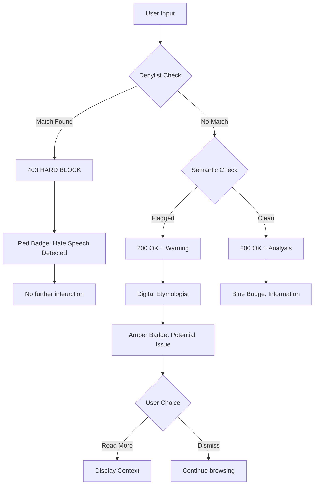

# 1126 - Feature: Hard vs. Soft Blocking Logic

## 1. Context & Goal
* **Issue:** #126
* **Objective:** Differentiate between "Forbidden" terms (hard block via Denylist) and "Educational" terms (soft block via Semantic Analysis).
* **Status:** Draft
* **Related Issues:** #45 (Denylist implementation), #121 (Wikipedia denylist source), #124 (Digital Etymologist), #125 (Museum Label UI)

### Background

The current system treats all flagged content the same way. We need to split responses into two categories:

1. **Hard Block:** Immediate rejection for well-known slurs and severe hate speech. No further interaction.
2. **Soft Block:** Warning with educational context for nuanced terms. User can read explanation and proceed.

## 2. Requirements

| ID | Requirement | Acceptance Criteria |
|----|-------------|---------------------|
| R1 | Hard block on denylist terms | 403 Forbidden response, no explanation generated |
| R2 | Soft block on semantic flags | 200 OK with warning payload |
| R3 | Clear UX distinction | Red badge (hard) vs. Amber badge (soft) |
| R4 | Hard block message | "Blocked: Hate Speech detected" |
| R5 | Soft block allows reading | User can view the Digital Etymologist explanation |
| R6 | Soft block allows dismissal | User can dismiss warning and continue |
| R7 | Denylist remains fail-closed | If denylist check fails, treat as hard block |
| R8 | Semantic returns warning, not block | Gray area terms get context, not rejection |

## 3. Alternatives Considered

| Option | Pros | Cons | Decision |
|--------|------|------|----------|
| A. Block everything flagged | Simple, conservative | Over-blocking educational content | **Rejected** |
| B. Two-tier (Hard/Soft) | Nuanced, educational | More complex logic | **Selected** |
| C. Three-tier (Block/Warn/Info) | Very granular | Too complex, confusing UX | **Rejected** |
| D. User-configurable sensitivity | Personalized | Too much burden on user | **Rejected** |

**Rationale:** A two-tier system balances safety (hard block on known hate speech) with education (context for nuanced terms). This aligns with Aletheia's mission as a "Digital Etymologist."

## 4. Data & Fixtures

### 4.1 Data Sources

| Attribute | Value |
|-----------|-------|
| Source | Denylist JSON + Bedrock Semantic Analysis |
| Format | JSON (denylist), LLM response (semantic) |
| Size | Denylist: ~2500 terms; Semantic: per-request |
| Refresh | Denylist: manual update; Semantic: real-time |
| Copyright/License | Denylist: CC BY-SA 4.0 (Wikipedia); Semantic: N/A |

### 4.2 Data Pipeline

```
Input ──denylist check──► HARD BLOCK (if match)
   │
   └──semantic check──► SOFT BLOCK (if flagged) ──► Digital Etymologist ──► Response
                 │
                 └──► ALLOW (if clean)
```

### 4.3 Test Fixtures

| Fixture | Source | Notes |
|---------|--------|-------|
| Hard block terms | From denylist | Known slurs that should hard block |
| Soft block terms | Curated | Archaic/nuanced terms for semantic check |
| Clean terms | Curated | Normal words that should pass |

### 4.4 Deployment Pipeline

1. Update `lambda_function.py` to return different response codes
2. Update `src/guardrails/denylist.py` for hard block logic
3. Update `src/guardrails/semantic.py` for soft block logic
4. Update extension to handle both response types
5. Deploy Lambda and extension

## 5. Diagram



## 6. Technical Approach

* **Module:** `lambda_function.py`, `src/guardrails/denylist.py`, `src/guardrails/semantic.py`, `extension/overlay.js`
* **Dependencies:** Existing guardrails infrastructure, Bedrock
* **Pattern:** Pipeline with early exit (fail fast for hard blocks)

### 6.1 Response Types

| Type | HTTP Code | Body | Frontend Action |
|------|-----------|------|-----------------|
| Hard Block | 403 | `{"blocked": true, "reason": "hate_speech"}` | Red badge, no context |
| Soft Block | 200 | `{"warning": true, "response": {...}}` | Amber badge, show context |
| Clean | 200 | `{"response": {...}}` | Blue badge, show context |

### 6.2 Denylist Check (Hard Block)

```python
# src/guardrails/denylist.py
def check_denylist(term: str) -> tuple[bool, str | None]:
    """Check if term is in denylist.

    Returns:
        (is_blocked, reason) - reason is None if not blocked
    """
    normalized = term.lower().strip()
    if normalized in DENYLIST_TERMS:
        return (True, "hate_speech")
    return (False, None)
```

### 6.3 Semantic Check (Soft Block)

```python
# src/guardrails/semantic.py
def check_semantic(term: str, context: str) -> tuple[bool, str | None]:
    """Check if term requires semantic warning.

    Returns:
        (needs_warning, category) - category is None if no warning needed
    """
    # Call Bedrock for semantic analysis
    result = invoke_semantic_check(term, context)

    if result.get("flagged"):
        return (True, result.get("category"))  # e.g., "archaic_pejorative"
    return (False, None)
```

### 6.4 Lambda Response Flow

```python
def handler(event):
    term = event["word"]
    context = event["context"]

    # Step 1: Denylist check (HARD BLOCK)
    is_blocked, reason = check_denylist(term)
    if is_blocked:
        return {
            "statusCode": 403,
            "body": json.dumps({
                "blocked": True,
                "reason": reason,
                "message": "Blocked: Hate Speech detected"
            })
        }

    # Step 2: Semantic check (SOFT BLOCK)
    needs_warning, category = check_semantic(term, context)

    # Step 3: Generate Digital Etymologist response
    response = generate_etymology(term, context)

    if needs_warning:
        return {
            "statusCode": 200,
            "body": json.dumps({
                "warning": True,
                "category": category,
                "response": response
            })
        }

    # Clean response
    return {
        "statusCode": 200,
        "body": json.dumps({
            "response": response
        })
    }
```

## 7. Interface Specification

### 7.1 Data Structures

```python
from typing import TypedDict, Literal

class HardBlockResponse(TypedDict):
    blocked: Literal[True]
    reason: str           # "hate_speech"
    message: str          # User-facing message

class SoftBlockResponse(TypedDict):
    warning: Literal[True]
    category: str         # "archaic_pejorative", "regional_slang", etc.
    response: dict        # Digital Etymologist response

class CleanResponse(TypedDict):
    response: dict        # Digital Etymologist response

# Frontend enum
class BlockType:
    HARD = "hard"     # 403, no interaction
    SOFT = "soft"     # 200 with warning
    NONE = "none"     # 200, clean
```

### 7.2 Function Signatures

```python
# lambda_function.py
def handler(event: dict, context: Any) -> dict:
    """Main Lambda handler with hard/soft block logic."""
    ...

# src/guardrails/denylist.py
def check_denylist(term: str) -> tuple[bool, str | None]:
    """Check term against denylist. Returns (blocked, reason)."""
    ...

def load_denylist() -> set[str]:
    """Load denylist from resources."""
    ...

# src/guardrails/semantic.py
def check_semantic(term: str, context: str) -> tuple[bool, str | None]:
    """Semantic analysis for soft blocking. Returns (flagged, category)."""
    ...

# extension/service-worker.js
async function handleResponse(response: Response): Promise<void>;
function showHardBlock(message: string): void;
function showSoftBlock(category: string, etymology: object): void;
function showCleanResult(etymology: object): void;
```

### 7.3 Logic Flow (Pseudocode)

```
LAMBDA HANDLER:
1. Extract term and context from request
2. DENYLIST CHECK (deterministic, fast):
   - Normalize term (lowercase, strip)
   - Check against denylist set
   - IF match: return 403 with hard block message, EXIT
3. SEMANTIC CHECK (LLM-based):
   - Send term + context to semantic analyzer
   - IF flagged: set warning=True, capture category
4. GENERATE RESPONSE:
   - Call Digital Etymologist regardless of soft block
   - Build response with etymology
5. RETURN:
   - IF warning: 200 with warning payload
   - ELSE: 200 with clean payload

FRONTEND HANDLER:
1. Receive response from Lambda
2. CHECK status code:
   - IF 403: Show red badge, hard block message, no interaction
   - IF 200 with warning: Show amber badge, etymology, user can dismiss
   - IF 200 clean: Show blue badge, etymology
```

## 8. Security Considerations

| Concern | Mitigation | Status |
|---------|------------|--------|
| Denylist bypass via encoding | Normalize before check (lowercase, strip) | TODO |
| Semantic check bypass | Belt-and-suspenders with denylist | Addressed |
| Rate limiting on semantic | Already rate-limited at Lambda level | Addressed |
| Soft block misclassification | Conservative: err toward warning | Addressed |
| Hard block too aggressive | Curated denylist, not algorithmic | Addressed |

**Fail Mode:**
- **Denylist check failure:** Fail Closed - treat as hard block
- **Semantic check failure:** Fail Open - proceed without warning (log error)

## 9. Performance Considerations

| Metric | Budget | Approach |
|--------|--------|----------|
| Denylist check | < 1ms | In-memory set lookup |
| Semantic check | < 2s | Bedrock Haiku, cached if possible |
| Total latency | < 3s | Early exit on hard block saves time |
| Memory (denylist) | < 1MB | ~3000 terms × ~20 chars |

**Bottlenecks:**
- Semantic check is the slowest step
- Hard blocks bypass semantic check entirely (fast path)

## 10. Risks & Mitigations

| Risk | Impact | Likelihood | Mitigation |
|------|--------|------------|------------|
| Denylist misses a slur | High | Med | Wikipedia source, regular updates |
| Semantic over-flags | Med | Med | Review samples, tune prompt |
| Semantic under-flags | Med | Med | Denylist as safety net |
| User ignores warnings | Low | High | Design decision: educate, not police |
| Hard block on false positive | High | Low | Curated denylist, user feedback channel |

## 11. Verification & Testing

### 11.1 Test Scenarios

| ID | Scenario | Type | Input | Expected Output | Pass Criteria |
|----|----------|------|-------|-----------------|---------------|
| 010 | Hard block on denylist term | Auto | Known slur from denylist | 403 response | Status code 403 |
| 020 | Hard block UI | Manual | Known slur | Red badge, no context | Visual inspection |
| 030 | Soft block on archaic term | Auto | "colored" (contextual) | 200 with warning | warning=True |
| 040 | Soft block UI | Manual | Archaic term | Amber badge, context shown | Visual inspection |
| 050 | Clean term passes | Auto | "hello" | 200 without warning | No warning field |
| 060 | Clean term UI | Manual | Normal word | Blue badge, context shown | Visual inspection |
| 070 | Denylist failure → hard block | Auto | Force denylist error | 403 response | Fail closed |
| 080 | Semantic failure → no warning | Auto | Force semantic error | 200 without warning | Fail open |
| 090 | Hard block has no etymology | Auto | Known slur | No response field | Blocked only |
| 100 | Soft block has etymology | Auto | Archaic term | response field present | Etymology included |
| 110 | User can dismiss soft block | Manual | Archaic term | Click dismiss | Warning closes |
| 120 | User cannot dismiss hard block | Manual | Known slur | No dismiss button | Stuck until close |

### 11.2 Test Modules (from 0005)

* **Unit Tests:** `poetry run pytest tests/test_blocking.py -v`
* **Semantic (Module B):** Yes - semantic classification testing
* **End-to-End (Module C):** Yes - full flow testing

### 11.3 Manual Smoke Test

1. Test known slur from denylist → verify 403, red badge
2. Test archaic term → verify 200 with warning, amber badge
3. Test normal word → verify 200 clean, blue badge
4. Verify hard block cannot be dismissed (no "continue" option)
5. Verify soft block shows etymology
6. Verify soft block can be dismissed
7. Check Lambda logs for proper classification

## 12. Definition of Done

### Code
- [ ] Denylist check returns hard block (403)
- [ ] Semantic check returns soft block (200 + warning)
- [ ] Clean terms return normal (200)
- [ ] Frontend handles all three response types
- [ ] Badge colors match block type
- [ ] Fail-closed on denylist errors
- [ ] Fail-open on semantic errors

### Tests
- [ ] Unit tests for blocking logic
- [ ] Integration tests for full flow
- [ ] Manual UI verification

### Documentation
- [ ] Response schema documented
- [ ] Error codes documented
- [ ] LLD updated with any deviations

### Review
- [ ] Security review of fail modes
- [ ] Sample term review
- [ ] Code review completed
- [ ] User approval before closing issue
