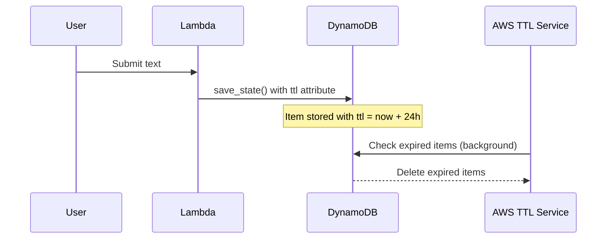

# 1145 - Feature: Configure DynamoDB TTL for Automatic Data Expiry

## 1. Context & Goal
* **Issue:** #145
* **Objective:** Add automatic TTL-based expiry to DynamoDB items for privacy compliance and cost control.
* **Status:** Draft
* **Related Issues:** #147 (GDPR erasure), #150 (data hygiene tool)

### Open Questions
*Questions that need clarification before or during implementation. Remove when resolved.*

- [ ] What TTL duration is appropriate? Issue suggests 24-48 hours. Is 24h sufficient for user value, or should it be longer (7 days)?
- [ ] Should TTL be configurable per-user or per-request, or a fixed system-wide value?
- [ ] Do we need to notify users before their data expires, or is silent expiry acceptable?
- [ ] Should we add a `created_at` timestamp for audit purposes separate from TTL?

## 2. Requirements

1. Lambda adds `ttl` attribute to all DynamoDB items with epoch timestamp
2. `provision.sh` enables TTL on the table via `update-time-to-live`
3. Existing data either cleaned up or allowed to expire naturally
4. Privacy audit 0810 updated to mark P1 as resolved

## 3. Alternatives Considered

| Option | Pros | Cons | Decision |
|--------|------|------|----------|
| 24-hour TTL | Maximum privacy protection | Users lose context quickly | TBD |
| 48-hour TTL | Balance of privacy and utility | Still relatively short | TBD |
| 7-day TTL | Better user experience | Longer data retention | TBD |
| Configurable TTL | Flexible | Adds complexity | Rejected |

**Rationale:** TBD after questions resolved.

## 4. Data & Fixtures

### 4.1 Data Sources

| Attribute | Value |
|-----------|-------|
| Source | Lambda event payload |
| Format | Python dict → DynamoDB item |
| Size | ~1KB per item |
| Refresh | Per-request |
| Copyright/License | N/A |

### 4.2 Data Pipeline

```
Lambda request ──save_state()──► DynamoDB item with TTL ──AWS TTL──► Auto-deleted
```

### 4.3 Test Fixtures

| Fixture | Source | Notes |
|---------|--------|-------|
| Mock DynamoDB item | Generated | Include TTL attribute |

### 4.4 Deployment Pipeline

- Lambda code deployed via `sam deploy`
- DynamoDB TTL enabled via `provision.sh` or AWS CLI one-time command

## 5. Diagram



## 6. Technical Approach

* **Module:** `src/lambda_function.py` (save_state function)
* **Dependencies:** boto3 (existing)
* **Pattern:** Add `ttl` attribute with epoch timestamp

### Implementation

```python
# In save_state() function
import time

item = {
    ...existing fields...,
    "ttl": {"N": str(int(time.time()) + 86400)},  # 24 hours
}
```

```bash
# In provision.sh or one-time command
aws dynamodb update-time-to-live \
    --table-name "$TABLE_NAME" \
    --time-to-live-specification "Enabled=true,AttributeName=ttl"
```

## 7. Interface Specification

### 7.1 Data Structures
```python
# DynamoDB item structure
{
    "thread_id": {"S": "hash"},
    "input": {"S": "user text"},
    "url": {"S": "source url"},
    "safety_score": {"N": "1.0"},
    "ttl": {"N": "1704067200"},  # NEW: epoch timestamp
}
```

### 7.2 Function Signatures
```python
def save_state(thread_id: str, text: str, url: str, safety_score: float) -> None:
    """Save state to DynamoDB with TTL attribute."""
    ...
```

## 8. Security Considerations

| Concern | Mitigation | Status |
|---------|------------|--------|
| Data persists indefinitely | TTL auto-deletes after 24-48h | TODO |
| TTL clock skew | AWS handles internally | N/A |

**Fail Mode:** Fail Open - If TTL fails to delete, data persists (acceptable, manual cleanup possible)

## 9. Performance Considerations

| Metric | Budget | Approach |
|--------|--------|----------|
| Write latency | No change | TTL is just another attribute |
| Storage cost | Reduced over time | Auto-cleanup |

**Bottlenecks:** None expected.

## 10. Risks & Mitigations

| Risk | Impact | Likelihood | Mitigation |
|------|--------|------------|------------|
| TTL deletes valuable data | Med | Low | Clear documentation of retention period |
| Provision.sh not re-run | High | Med | Add to deployment checklist |

## 11. Verification & Testing

### 11.1 Test Scenarios

| ID | Scenario | Type | Input | Expected Output | Pass Criteria |
|----|----------|------|-------|-----------------|---------------|
| 010 | Item saved with TTL | Auto | save_state() call | Item has ttl attribute | ttl = now + 86400 |
| 020 | TTL is future timestamp | Auto | Retrieve item | ttl > current time | Assertion passes |

### 11.2 Test Commands

```bash
# Unit test TTL attribute
poetry run pytest tests/test_lambda_function.py -v -k ttl

# Verify TTL enabled on table
aws dynamodb describe-time-to-live --table-name AletheiaState
```

## 12. Definition of Done

### Code
- [ ] save_state() adds ttl attribute
- [ ] provision.sh enables TTL on table

### Tests
- [ ] Unit test verifies ttl attribute added
- [ ] Integration test verifies TTL config

### Documentation
- [ ] Privacy audit 0810 updated
- [ ] Implementation report created
