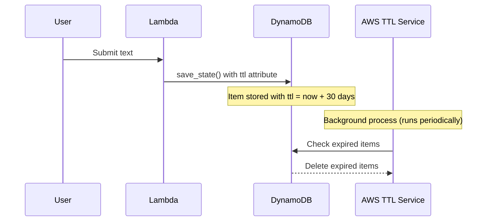

# 1145 - Feature: Configure DynamoDB TTL for Automatic Data Expiry

## 1. Context & Goal
* **Issue:** #145
* **Objective:** Add automatic TTL-based expiry to DynamoDB items for privacy compliance and cost control.
* **Status:** **APPROVED** - Ready to implement
* **Related Issues:** #147 (GDPR erasure - blocked until #116), #150 (data hygiene tool)

### Open Questions
*Questions that need clarification before or during implementation. Remove when resolved.*

- [x] ~~What TTL duration is appropriate?~~ **30 days (2,592,000 seconds)**
- [x] ~~Should TTL be configurable?~~ **No - fixed system-wide value**
- [x] ~~Do we need to notify users?~~ **No - document in privacy policy**
- [ ] Should we add a `created_at` timestamp for audit purposes separate from TTL?

### Resolved Questions (Gemini Review 2026-01-05)

1. **Q: What TTL duration?**
   **A: 30 days (2,592,000 seconds).** Balances privacy with user value. Note: This means #147 (GDPR erasure) requires on-demand deletion, which requires #116 (OAuth).

2. **Q: Idempotency of provision.sh?**
   **A: Verify.** `update-time-to-live` should be idempotent but add check.

## 2. Requirements

1. Lambda adds `ttl` attribute to all DynamoDB items with epoch timestamp
2. `provision.sh` enables TTL on the table via `update-time-to-live` (idempotent)
3. Existing data expires naturally (30 days from now if added today)
4. Privacy audit 0810 updated to mark P1 as resolved
5. Privacy policy updated to document 30-day retention

## 3. Alternatives Considered

| Option | Pros | Cons | Decision |
|--------|------|------|----------|
| 24-hour TTL | Maximum privacy | Users lose context, no value | Rejected |
| 48-hour TTL | Good privacy | Still too short for utility | Rejected |
| 7-day TTL | Balance | May not be enough for returning users | Rejected |
| **30-day TTL** | User value, reasonable retention | Requires on-demand deletion (#147) | **Selected** |
| Configurable TTL | Flexible | Adds complexity | Rejected |

**Rationale:** 30 days provides meaningful user value while still limiting data retention. Requires #147 (on-demand deletion) for full GDPR compliance, which is blocked by #116 (OAuth).

## 4. Data & Fixtures

### 4.1 Data Sources

| Attribute | Value |
|-----------|-------|
| Source | Lambda event payload |
| Format | Python dict → DynamoDB item |
| Size | ~1KB per item |
| Refresh | Per-request |
| Copyright/License | N/A |

### 4.2 Data Pipeline

```
Lambda request ──save_state()──► DynamoDB item with TTL ──AWS TTL──► Auto-deleted (30 days)
```

### 4.3 Test Fixtures

| Fixture | Source | Notes |
|---------|--------|-------|
| Mock DynamoDB item | Generated | Include TTL attribute |

### 4.4 Deployment Pipeline

- Lambda code deployed via `sam deploy`
- DynamoDB TTL enabled via `provision.sh` (idempotent)

## 5. Diagram



## 6. Technical Approach

* **Module:** `src/lambda_function.py` (save_state function)
* **Dependencies:** boto3 (existing)
* **Pattern:** Add `ttl` attribute with epoch timestamp

### 6.1 Implementation

```python
# In save_state() function
import time

TTL_SECONDS = 2592000  # 30 days

item = {
    ...existing fields...,
    "ttl": {"N": str(int(time.time()) + TTL_SECONDS)},
}
```

### 6.2 Provision Script (Idempotent)

```bash
# In provision.sh - check before enabling
TTL_STATUS=$(aws dynamodb describe-time-to-live \
    --table-name "$TABLE_NAME" \
    --query 'TimeToLiveDescription.TimeToLiveStatus' \
    --output text)

if [ "$TTL_STATUS" != "ENABLED" ]; then
    echo "Enabling TTL on $TABLE_NAME..."
    aws dynamodb update-time-to-live \
        --table-name "$TABLE_NAME" \
        --time-to-live-specification "Enabled=true,AttributeName=ttl"
else
    echo "TTL already enabled on $TABLE_NAME"
fi
```

## 7. Interface Specification

### 7.1 Data Structures
```python
# DynamoDB item structure
{
    "thread_id": {"S": "hash"},
    "input": {"S": "user text"},
    "url": {"S": "source url"},
    "safety_score": {"N": "1.0"},
    "ttl": {"N": "1735689600"},  # NEW: epoch timestamp (30 days from creation)
}
```

### 7.2 Function Signatures
```python
TTL_SECONDS = 2592000  # 30 days

def save_state(thread_id: str, text: str, url: str, safety_score: float) -> None:
    """Save state to DynamoDB with 30-day TTL attribute."""
    ...
```

## 8. Security Considerations

| Concern | Mitigation | Status |
|---------|------------|--------|
| Data persists indefinitely | TTL auto-deletes after 30 days | This feature |
| TTL clock skew | AWS handles internally | N/A |
| User wants deletion before TTL | Requires #147 (blocked by #116) | Post-MVP |

**Fail Mode:** Fail Open - If TTL fails to delete, data persists (acceptable, manual cleanup possible via #150)

## 9. Performance Considerations

| Metric | Budget | Approach |
|--------|--------|----------|
| Write latency | No change | TTL is just another attribute |
| Storage cost | Reduced over time | Auto-cleanup after 30 days |

**Bottlenecks:** None expected.

## 10. Risks & Mitigations

| Risk | Impact | Likelihood | Mitigation |
|------|--------|------------|------------|
| TTL deletes valuable data | Med | Low | 30 days is generous; document in privacy policy |
| Provision.sh not re-run | High | Med | Add to deployment checklist; make idempotent |
| GDPR requires faster deletion | High | Low | #147 provides on-demand deletion (after #116) |

## 11. Verification & Testing

### 11.1 Test Scenarios

| ID | Scenario | Type | Input | Expected Output | Pass Criteria |
|----|----------|------|-------|-----------------|---------------|
| 010 | Item saved with TTL | Auto | save_state() call | Item has ttl attribute | ttl = now + 2592000 |
| 020 | TTL is 30 days ahead | Auto | Retrieve item | ttl - now ≈ 2592000 | Within 1 second |
| 030 | Provision idempotent | Auto | Run twice | No error | Second run is no-op |

### 11.2 Test Commands

```bash
# Unit test TTL attribute
poetry run pytest tests/test_lambda_function.py -v -k ttl

# Verify TTL enabled on table
aws dynamodb describe-time-to-live --table-name AletheiaState

# Verify TTL value on item
aws dynamodb get-item --table-name AletheiaState --key '{"thread_id": {"S": "test"}}'
```

## 12. Definition of Done

### Code
- [ ] save_state() adds ttl attribute (30 days)
- [ ] provision.sh enables TTL (idempotent check)
- [ ] TTL_SECONDS constant defined (2592000)

### Tests
- [ ] Unit test verifies ttl attribute added
- [ ] Unit test verifies ttl is 30 days ahead
- [ ] Integration test verifies TTL config

### Documentation
- [ ] Privacy audit 0810 updated
- [ ] Privacy policy updated with 30-day retention
- [ ] Implementation report created

---

## Appendix: Gemini Review Response

**Review Date:** 2026-01-05
**Reviewer:** Gemini 3 Pro

### Decision

**APPROVED** with TTL set to **30 days (2,592,000 seconds)**.

### Key Implications

1. 30-day retention is longer than original 24h proposal
2. This legally requires on-demand deletion capability (#147)
3. On-demand deletion requires user identification (#116 OAuth)
4. Therefore: #145 can proceed, but #147 is blocked by #116
