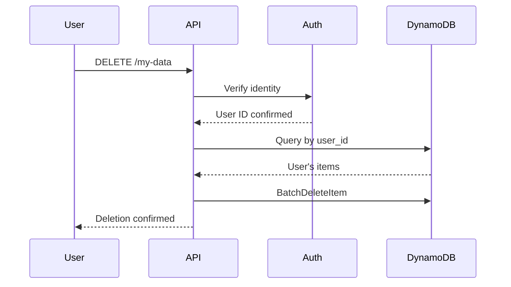

# 1147 - Feature: GDPR Data Erasure (Right to Be Forgotten)

## 1. Context & Goal
* **Issue:** #147
* **Objective:** Implement GDPR Article 17 compliant data erasure process for user-requested deletion.
* **Status:** Draft
* **Related Issues:** #145 (DynamoDB TTL), #116 (LinkedIn OAuth - prerequisite for user identification)

### Open Questions
*Questions that need clarification before or during implementation. Remove when resolved.*

- [ ] **BLOCKER:** How do users identify "their" data without authentication? thread_id is a hash they don't know.
- [ ] Is TTL-only sufficient for GDPR compliance (data auto-erases in 24-48h), or is on-demand deletion legally required?
- [ ] Do we need a formal "Data Subject Access Request" (DSAR) workflow, or just technical deletion capability?
- [ ] Should we implement #116 (OAuth) first to enable user identification?
- [ ] What's our legal basis for processing? Legitimate interest or consent?
- [ ] Do we need to delete CloudWatch logs too (30-day retention)?

## 2. Requirements

Per GDPR Article 17:
1. Users must be able to request erasure of their personal data
2. Erasure must be "without undue delay" (typically 30 days max)
3. Must document data retention policy in privacy policy
4. Must have mechanism to execute deletion

## 3. Alternatives Considered

| Option | Pros | Cons | Decision |
|--------|------|------|----------|
| TTL-only (24h) | Automatic, no user action needed | No on-demand deletion | Consider |
| On-demand API endpoint | User control | Requires auth (#116) | Consider |
| Email-based requests | Simple | Manual process, slow | Rejected |
| Combined TTL + API | Best coverage | Most complex | Consider |

**Rationale:** TTL may be sufficient given short retention. On-demand requires solving user identification first.

## 4. Data & Fixtures

### 4.1 Data Sources

| Attribute | Value |
|-----------|-------|
| Source | DynamoDB AletheiaState table |
| Format | DynamoDB items |
| Size | Unknown (need inventory) |
| Refresh | N/A (deletion) |
| Copyright/License | User data |

### 4.2 Data Pipeline

```
User request ──identify data──► Query by user ID ──delete──► DynamoDB
```

### 4.3 Test Fixtures

| Fixture | Source | Notes |
|---------|--------|-------|
| Test DynamoDB items | Generated | Create items for deletion tests |

## 5. Diagram



## 6. Technical Approach

### Option A: TTL-Only Approach
- Implement #145 (24-48h TTL)
- Document in privacy policy: "Data automatically deleted within 48 hours"
- No on-demand deletion needed if TTL is short enough

### Option B: On-Demand Deletion (Requires #116 First)
* **Module:** New API endpoint or Lambda function
* **Dependencies:** User authentication (#116), DynamoDB
* **Pattern:** Query by user_id, batch delete

## 7. Interface Specification

### 7.1 Data Structures
```python
# Current DynamoDB schema lacks user_id
# Would need schema change:
{
    "thread_id": {"S": "hash"},
    "user_id": {"S": "linkedin_id"},  # NEW - requires #116
    "input": {"S": "user text"},
    ...
}
```

### 7.2 Function Signatures
```python
# Only applicable if implementing on-demand deletion
def delete_user_data(user_id: str) -> int:
    """Delete all DynamoDB items for a user. Returns count deleted."""
    ...
```

## 8. Security Considerations

| Concern | Mitigation | Status |
|---------|------------|--------|
| Unauthorized deletion | Require authentication | Blocked on #116 |
| Incomplete deletion | Verify with query after delete | TODO |
| Deletion of others' data | user_id must match auth token | Blocked on #116 |

**Fail Mode:** Fail Closed - Require positive identification before any deletion.

## 9. Performance Considerations

| Metric | Budget | Approach |
|--------|--------|----------|
| Deletion latency | < 5s | Batch delete |
| Query efficiency | N/A | Need GSI on user_id |

**Bottlenecks:** May need Global Secondary Index on user_id for efficient queries.

## 10. Risks & Mitigations

| Risk | Impact | Likelihood | Mitigation |
|------|--------|------------|------------|
| Cannot identify user data | High | High | Implement #116 first OR rely on TTL |
| GDPR complaint | High | Low | Document TTL-based auto-deletion |
| Incomplete deletion | Med | Low | Post-delete verification query |

## 11. Verification & Testing

### 11.1 Test Scenarios

| ID | Scenario | Type | Input | Expected Output | Pass Criteria |
|----|----------|------|-------|-----------------|---------------|
| 010 | Delete user data | Auto | user_id | Items deleted | Query returns empty |
| 020 | Unauthorized delete attempt | Auto | Wrong user_id | 403 Forbidden | No items deleted |

### 11.2 Test Commands

```bash
# Integration test
poetry run pytest tests/test_gdpr_erasure.py -v
```

## 12. Definition of Done

### Prerequisites
- [ ] Decision: TTL-only or on-demand deletion?
- [ ] If on-demand: #116 (OAuth) must be implemented first

### Code
- [ ] Erasure mechanism implemented
- [ ] Privacy policy updated with retention period

### Tests
- [ ] Deletion verified end-to-end

### Documentation
- [ ] Privacy audit 0810 updated
- [ ] GDPR compliance documented
