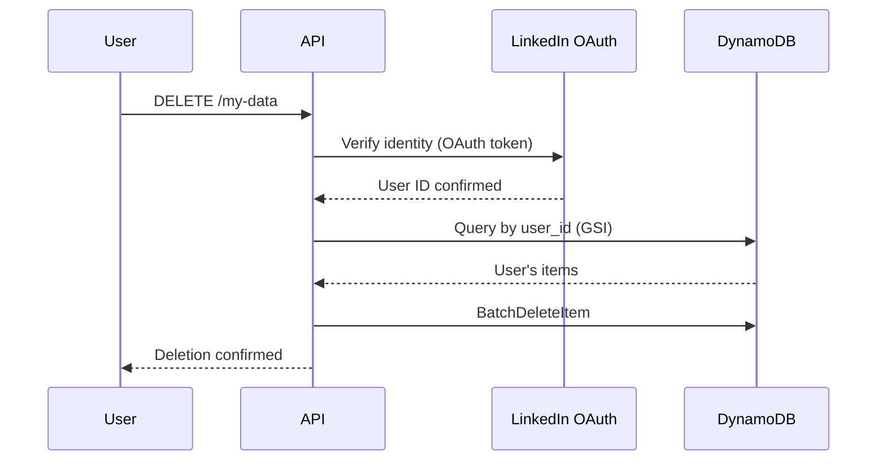

# 1147 - Feature: GDPR Data Erasure (Right to Be Forgotten)

## 1. Context & Goal
* **Issue:** #147
* **Objective:** Implement GDPR Article 17 compliant data erasure process for user-requested deletion.
* **Status:** **BLOCKED BY #116** (LinkedIn OAuth)
* **Related Issues:** #145 (DynamoDB TTL - 30 days), #116 (LinkedIn OAuth - **PREREQUISITE**)

### BLOCKING DEPENDENCY

```
┌─────────────────────────────────────────────────────────────┐
│  ⛔ THIS FEATURE IS BLOCKED                                 │
│                                                             │
│  Prerequisite: #116 (LinkedIn OAuth) must be implemented    │
│  first to enable user identification.                       │
│                                                             │
│  Without authentication, users cannot prove ownership of    │
│  their data (thread_id is a hash they don't know).          │
│                                                             │
│  Decision: DEFERRED until #116 is complete.                 │
│  Date: 2026-01-05 (per Gemini review)                       │
└─────────────────────────────────────────────────────────────┘
```

### Open Questions
*Questions that need clarification before or during implementation. Remove when resolved.*

- [x] ~~**BLOCKER:** How do users identify "their" data without authentication?~~ **Cannot - requires #116**
- [x] ~~Is TTL-only sufficient for GDPR compliance?~~ **No - 30-day TTL requires on-demand deletion**
- [ ] Do we need a formal "Data Subject Access Request" (DSAR) workflow, or just technical deletion capability?
- [x] ~~Should we implement #116 (OAuth) first?~~ **Yes - this is blocked until #116 is done**
- [ ] What's our legal basis for processing? Legitimate interest or consent?
- [x] ~~Do we need to delete CloudWatch logs too?~~ **See §8.1 - verify no raw input logged**

### Resolved Questions (Gemini Review 2026-01-05)

1. **Q: Is TTL-only sufficient for GDPR?**
   **A: No.** With 30-day TTL (decided for #145), users have legal right to on-demand deletion. TTL alone is insufficient.

2. **Q: Should we implement #116 first?**
   **A: Yes.** This feature is BLOCKED until OAuth enables user identification.

3. **Q: What about CloudWatch logs?**
   **A: Verify** `lambda_function.py` does NOT log raw input text. If it does, CloudWatch retention must match 30-day policy.

## 2. Requirements

Per GDPR Article 17:
1. Users must be able to request erasure of their personal data
2. Erasure must be "without undue delay" (typically 30 days max)
3. Must document data retention policy in privacy policy
4. Must have mechanism to execute deletion
5. **NEW:** Requires user authentication to identify "their" data

## 3. Alternatives Considered

| Option | Pros | Cons | Decision |
|--------|------|------|----------|
| TTL-only (30 days) | Automatic | No on-demand, legally insufficient | **Rejected** |
| On-demand API endpoint | User control, GDPR compliant | Requires auth (#116) | **Selected** |
| Email-based requests | Simple | Manual process, slow, identity verification hard | Rejected |
| Combined TTL + API | Best coverage | Most complex | **Selected** |

**Rationale:** 30-day TTL + on-demand deletion via authenticated API. Both are required for full GDPR compliance.

## 4. Data & Fixtures

### 4.1 Data Sources

| Attribute | Value |
|-----------|-------|
| Source | DynamoDB AletheiaState table |
| Format | DynamoDB items |
| Size | Unknown (need inventory) |
| Refresh | N/A (deletion) |
| Copyright/License | User data |

### 4.2 Data Pipeline

```
User request ──OAuth verify──► Query by user_id ──delete──► DynamoDB
```

### 4.3 Test Fixtures

| Fixture | Source | Notes |
|---------|--------|-------|
| Test DynamoDB items | Generated | Create items for deletion tests |

## 5. Diagram



## 6. Technical Approach

### 6.1 Prerequisites (BLOCKING)

| Prerequisite | Issue | Status |
|--------------|-------|--------|
| LinkedIn OAuth | #116 | ❌ Not implemented |
| DynamoDB schema with user_id | Part of #116 | ❌ Not implemented |
| GSI on user_id | Part of #116 | ❌ Not implemented |

**DO NOT PROCEED** until #116 is complete.

### 6.2 Schema Migration (After #116)

**Current schema (no user identification):**
```python
{
    "thread_id": {"S": "hash"},
    "input": {"S": "user text"},
    "url": {"S": "source url"},
    "ttl": {"N": "epoch"},
}
```

**Required schema (with user identification):**
```python
{
    "thread_id": {"S": "hash"},
    "user_id": {"S": "linkedin_id"},  # NEW - requires #116
    "input": {"S": "user text"},
    "url": {"S": "source url"},
    "ttl": {"N": "epoch"},
}
# Plus GSI on user_id for efficient queries
```

### 6.3 Legacy Data (Orphan Policy)

Data created before #116 implementation will have no `user_id`. Policy:
- **Orphaned data cannot be claimed** by users (no way to prove ownership)
- **Orphaned data expires via TTL** (30 days)
- **Document in privacy policy:** "Data created before [date] cannot be associated with user accounts and will be automatically deleted within 30 days."

## 7. Interface Specification

### 7.1 Data Structures
```python
# Schema after #116 implementation
{
    "thread_id": {"S": "hash"},
    "user_id": {"S": "linkedin_id"},  # NEW
    "input": {"S": "user text"},
    "url": {"S": "source url"},
    "ttl": {"N": "epoch"},
}
```

### 7.2 Function Signatures
```python
def delete_user_data(user_id: str) -> int:
    """Delete all DynamoDB items for a user. Returns count deleted."""
    # Query GSI by user_id
    # BatchDeleteItem
    # Return count
    ...
```

## 8. Security Considerations

| Concern | Mitigation | Status |
|---------|------------|--------|
| Unauthorized deletion | Require OAuth authentication | Blocked on #116 |
| Incomplete deletion | Verify with query after delete | TODO |
| Deletion of others' data | user_id must match OAuth token | Blocked on #116 |
| CloudWatch data leakage | Verify no raw input logged | See §8.1 |

**Fail Mode:** Fail Closed - Require positive identification before any deletion.

### 8.1 CloudWatch Log Audit (REQUIRED)

**Before implementation, verify:**
- [ ] `lambda_function.py` does NOT log raw `event` body
- [ ] `lambda_function.py` does NOT log raw `input` text
- [ ] If it does, CloudWatch Log retention must be set to 30 days max

```bash
# Check for dangerous logging patterns
grep -n "print.*event" src/lambda_function.py
grep -n "print.*input" src/lambda_function.py
grep -n "logger.*event" src/lambda_function.py
```

## 9. Performance Considerations

| Metric | Budget | Approach |
|--------|--------|----------|
| Deletion latency | < 5s | Batch delete |
| Query efficiency | Fast | GSI on user_id |

**Bottlenecks:** Requires Global Secondary Index on user_id for efficient queries.

## 10. Risks & Mitigations

| Risk | Impact | Likelihood | Mitigation |
|------|--------|------------|------------|
| Cannot identify user data | High | **Certain** | Blocked until #116 |
| GDPR complaint | High | Low | 30-day TTL provides baseline |
| Incomplete deletion | Med | Low | Post-delete verification query |
| Legacy orphan data complaints | Med | Low | Document in privacy policy |

## 11. Verification & Testing

### 11.1 Test Scenarios

| ID | Scenario | Type | Input | Expected Output | Pass Criteria |
|----|----------|------|-------|-----------------|---------------|
| 010 | Delete user data | Auto | user_id | Items deleted | Query returns empty |
| 020 | Unauthorized delete attempt | Auto | Wrong user_id | 403 Forbidden | No items deleted |
| 030 | Legacy data not claimable | Auto | No user_id | Cannot delete | Error returned |

### 11.2 Test Commands

```bash
# Integration test (after #116)
poetry run pytest tests/test_gdpr_erasure.py -v
```

## 12. Definition of Done

### Prerequisites (BLOCKING)
- [ ] #116 (LinkedIn OAuth) implemented and deployed
- [ ] DynamoDB schema includes user_id
- [ ] GSI on user_id created
- [ ] CloudWatch logging verified (no raw input)

### Code
- [ ] DELETE /my-data endpoint implemented
- [ ] Erasure function implemented
- [ ] Privacy policy updated with retention period

### Tests
- [ ] Deletion verified end-to-end
- [ ] Authorization verified

### Documentation
- [ ] Privacy audit 0810 updated
- [ ] GDPR compliance documented
- [ ] Orphan data policy documented

---

## Appendix: Gemini Review Response

**Review Date:** 2026-01-05
**Reviewer:** Gemini 3 Pro

### Tier 1 Issues (BLOCKING) - Addressed

| Issue | Resolution |
|-------|------------|
| Missing Identity Provider | Marked as BLOCKED BY #116; cannot proceed |

### Tier 2 Issues (HIGH) - Addressed

| Issue | Resolution |
|-------|------------|
| CloudWatch Data Leakage | Added §8.1 audit requirement |
| Schema Migration | Added §6.3 orphan policy for legacy data |

### Tier 3 Issues (SUGGESTIONS) - Noted

| Issue | Resolution |
|-------|------------|
| Legal Basis | To be documented in Privacy Policy, not code |
