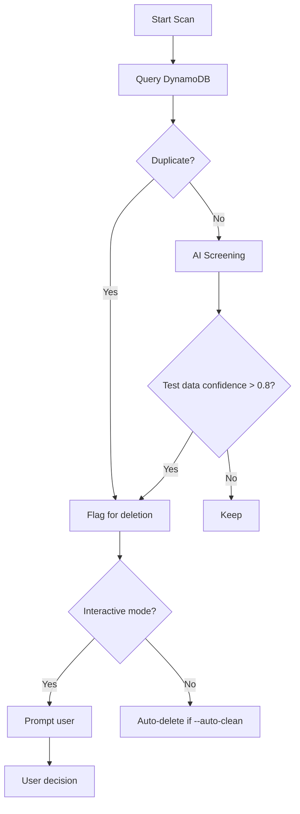

# 1150 - Feature: AI-Powered DynamoDB Data Hygiene Tool

## 1. Context & Goal
* **Issue:** #150
* **Objective:** Create CLI tool to identify and remove test/duplicate data from DynamoDB using AI screening.
* **Status:** Draft
* **Related Issues:** #145 (DynamoDB TTL), #147 (GDPR erasure), #149 (lambda_harvester investigation)

### Open Questions
*Questions that need clarification before or during implementation. Remove when resolved.*

- [ ] Which AI model should be used for screening? Bedrock Claude? Local model? Cost implications?
- [ ] What's the cost budget for running AI screening on potentially thousands of entries?
- [ ] Should this be a one-time cleanup or an ongoing scheduled job?
- [ ] How do we handle the chicken-egg problem: if we implement #145 (TTL), old data will auto-delete anyway?
- [ ] Is there sensitive data in DynamoDB that shouldn't be sent to an AI for evaluation?
- [ ] Should we create a backup before any deletions?

## 2. Requirements

1. CLI tool scans DynamoDB for entries
2. Identifies duplicates by (word, url, user_id)
3. AI screens entries for test data confidence score
4. Interactive review mode with keep/delete options
5. Marks reviewed entries with `retention_reviewed: true`
6. Dry-run mode (no deletes without confirmation)
7. Batch auto-clean mode for high-confidence test data

## 3. Alternatives Considered

| Option | Pros | Cons | Decision |
|--------|------|------|----------|
| AI-powered screening | Smart detection of test data | Cost, privacy concerns | Consider |
| Rule-based heuristics only | No AI cost, deterministic | May miss subtle patterns | Consider |
| Manual review only | No automation | Time-consuming | Rejected |
| Just implement TTL (#145) | Automatic cleanup | Doesn't clean old data | Complement |

**Rationale:** If #145 (TTL) is implemented, this tool becomes less critical for new data. May still be useful for one-time historical cleanup.

## 4. Data & Fixtures

### 4.1 Data Sources

| Attribute | Value |
|-----------|-------|
| Source | DynamoDB AletheiaState table |
| Format | DynamoDB items |
| Size | Unknown - need scan count |
| Refresh | On-demand scan |
| Copyright/License | User data - privacy sensitive |

### 4.2 Data Pipeline

```
DynamoDB ──scan──► Python ──AI screening──► Flagged items ──user confirm──► Delete
```

### 4.3 Test Fixtures

| Fixture | Source | Notes |
|---------|--------|-------|
| Mock DynamoDB items | Generated | Mix of test and legitimate data |

## 5. Diagram



## 6. Technical Approach

* **Module:** `tools/data_hygiene.py`
* **Dependencies:** boto3, click (CLI), anthropic or bedrock-runtime
* **Pattern:** Scan, filter, confirm, delete

### CLI Interface

```bash
# Scan and report (dry run)
python tools/data_hygiene.py --scan

# Interactive review
python tools/data_hygiene.py --review

# Auto-delete high-confidence test data
python tools/data_hygiene.py --auto-clean --confidence 0.9

# Show duplicates only
python tools/data_hygiene.py --duplicates
```

## 7. Interface Specification

### 7.1 Data Structures
```python
@dataclass
class DynamoDBEntry:
    thread_id: str
    input: str
    url: str
    timestamp: datetime
    retention_reviewed: bool = False
    retention_decision: str | None = None
    test_data_confidence: float | None = None
```

### 7.2 Function Signatures
```python
def scan_entries() -> list[DynamoDBEntry]:
    """Scan all DynamoDB entries."""
    ...

def find_duplicates(entries: list[DynamoDBEntry]) -> list[tuple[DynamoDBEntry, ...]]:
    """Group entries by (word, url) and return duplicate groups."""
    ...

def screen_for_test_data(entry: DynamoDBEntry) -> float:
    """Use AI to determine test data confidence (0.0-1.0)."""
    ...

def delete_entries(entries: list[DynamoDBEntry], dry_run: bool = True) -> int:
    """Delete entries from DynamoDB. Returns count deleted."""
    ...
```

## 8. Security Considerations

| Concern | Mitigation | Status |
|---------|------------|--------|
| User data sent to AI | Consider local heuristics first | TODO |
| Accidental data loss | Dry-run default, confirmation required | TODO |
| Audit trail | Log all deletions | TODO |

**Fail Mode:** Fail Closed - Require explicit confirmation for all deletions.

## 9. Performance Considerations

| Metric | Budget | Approach |
|--------|--------|----------|
| AI API calls | Minimize | Batch similar entries, use heuristics first |
| Scan time | < 5 min | Paginated scan |
| Cost | < $1 per run | Limit AI calls |

**Bottlenecks:** AI screening cost if many entries.

## 10. Risks & Mitigations

| Risk | Impact | Likelihood | Mitigation |
|------|--------|------------|------------|
| Delete legitimate data | High | Med | Interactive mode, dry-run default |
| High AI cost | Med | Med | Heuristics first, AI only for uncertain |
| Tool not needed if TTL implemented | Low | High | Still useful for historical cleanup |

## 11. Verification & Testing

### 11.1 Test Scenarios

| ID | Scenario | Type | Input | Expected Output | Pass Criteria |
|----|----------|------|-------|-----------------|---------------|
| 010 | Find duplicates | Auto | Duplicate entries | Grouped results | Correct grouping |
| 020 | Dry-run mode | Auto | --scan flag | No deletions | DynamoDB unchanged |
| 030 | Interactive confirm | Manual | User input | Deletion on 'y' | Correct items deleted |

### 11.2 Test Commands

```bash
# Unit tests (mocked DynamoDB)
poetry run pytest tests/test_data_hygiene.py -v
```

## 12. Definition of Done

### Code
- [ ] CLI tool implemented with all modes
- [ ] Dry-run default behavior
- [ ] Deletion audit logging

### Tests
- [ ] Unit tests with mocked DynamoDB
- [ ] Integration test with real table (staging)

### Documentation
- [ ] Usage instructions in tool docstring
- [ ] Add to file inventory
