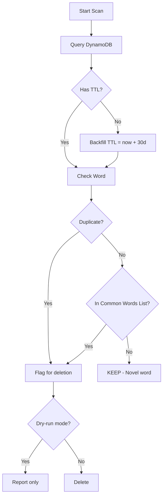

# 1150 - Feature: DynamoDB Data Hygiene Tool (Novelty Filter)

## 1. Context & Goal
* **Issue:** #150
* **Objective:** Create CLI tool to clean DynamoDB by keeping novel/interesting words and deleting common words, plus backfill TTL for historical data.
* **Status:** Draft
* **Related Issues:** #145 (DynamoDB TTL), #147 (GDPR erasure)

### Open Questions
*Questions that need clarification before or during implementation. Remove when resolved.*

- [x] ~~Which AI model should be used?~~ **None - using simple dictionary filter instead**
- [x] ~~Cost implications?~~ **Zero - no AI calls, just dictionary lookup**
- [x] ~~One-time or ongoing?~~ **One-time cleanup + TTL backfill**
- [x] ~~What about typos like "asdf"?~~ **Acceptable to keep - solution doesn't need to be perfect**
- [ ] Source for common words list? (Options: top 10-20k most frequent English words)

### Resolved Questions (Gemini Review 2026-01-05)

1. **Q: What filtering logic?**
   **A: Novelty Filter (inverted).** Delete COMMON words (boring), keep NOVEL words (interesting).
   - "hello", "test", "working" → DELETE (common)
   - "petrichor", "defenestrate" → KEEP (novel)
   - "asdf" → KEEP (not in common list, acceptable trade-off)

2. **Q: What about historical data without TTL?**
   **A: Add `--backfill-ttl` mode.** Sets `ttl = now + 30 days` on all items missing TTL attribute.

## 2. Requirements

1. **TTL Backfill (CRITICAL):** Add `ttl` attribute to historical data missing it
2. **Novelty Filter:** Keep rare/interesting words, delete common words
3. **Dry-run default:** No deletes without explicit confirmation
4. **Duplicate detection:** Find and flag duplicate (word, url) entries
5. **Audit logging:** Log all deletions

## 3. Alternatives Considered

| Option | Pros | Cons | Decision |
|--------|------|------|----------|
| AI-powered screening | Smart detection | Cost, privacy, complexity | **Rejected** |
| Simple Dictionary Filter | Zero cost, deterministic, fast | May miss some edge cases | **Selected** |
| Manual review only | Precise | Time-consuming | Rejected |

**Rationale:** Simple dictionary lookup is free, fast, and deterministic. Typos remaining is acceptable trade-off.

## 4. Data & Fixtures

### 4.1 Data Sources

| Attribute | Value |
|-----------|-------|
| Source | DynamoDB AletheiaState table |
| Format | DynamoDB items |
| Size | Unknown - need scan count |
| Refresh | On-demand scan |
| Copyright/License | User data |
| Common Words List | Static text file (10-20k words) |

### 4.2 Data Pipeline

```
DynamoDB ──scan──► Python ──dictionary filter──► Flag common words ──confirm──► Delete
                          ──backfill TTL──► Update items missing TTL
```

### 4.3 Test Fixtures

| Fixture | Source | Notes |
|---------|--------|-------|
| Mock DynamoDB items | Generated | Mix of common and novel words |
| Common words list | Public domain | Top 10-20k English words |

## 5. Diagram



## 6. Technical Approach

* **Module:** `tools/data_hygiene.py`
* **Dependencies:** boto3, click (CLI)
* **Pattern:** Scan, filter, confirm, delete

### 6.1 TTL Backfill (CRITICAL)

```python
TTL_SECONDS = 2592000  # 30 days

def backfill_ttl(dry_run: bool = True) -> int:
    """Add TTL to all items missing it. Returns count updated."""
    table = boto3.resource('dynamodb').Table('AletheiaState')
    count = 0
    ttl_value = int(time.time()) + TTL_SECONDS

    for item in scan_all_items():
        if 'ttl' not in item:
            if not dry_run:
                table.update_item(
                    Key={'thread_id': item['thread_id']},
                    UpdateExpression='SET #ttl = :ttl',
                    ExpressionAttributeNames={'#ttl': 'ttl'},
                    ExpressionAttributeValues={':ttl': ttl_value}
                )
            count += 1

    return count
```

### 6.2 Novelty Filter (Simple Dictionary)

```python
# Load common words once at startup
COMMON_WORDS: set[str] = set()

def load_common_words(path: str = "data/common_words.txt") -> None:
    """Load common words list (10-20k words)."""
    global COMMON_WORDS
    with open(path) as f:
        COMMON_WORDS = {line.strip().lower() for line in f}

def is_common_word(word: str) -> bool:
    """Check if word is in common vocabulary."""
    return word.lower().strip() in COMMON_WORDS

def should_delete(word: str) -> bool:
    """
    Returns True if word should be deleted.

    DELETE if:
    - Word is in common words list (boring)
    - Word length < 3 (fragments like "a", "hi")

    KEEP if:
    - Word is NOT in common list (novel/interesting)
    - Even if it's a typo like "asdf" (acceptable)
    """
    word = word.strip()

    # Delete very short fragments
    if len(word) < 3:
        return True

    # Delete common words
    if is_common_word(word):
        return True

    # Keep everything else (novel words, even typos)
    return False
```

### 6.3 Common Words List

Source options (ranked):
1. **NLTK words corpus** - ~235k words (too broad)
2. **Google 10000 English** - Top 10k most frequent (good)
3. **Custom curated list** - Top 20k + stop words (best)

**Recommendation:** Start with Google 10000 English + explicit stop words.

```python
# Ensure stop words are included
STOP_WORDS = {
    'the', 'a', 'an', 'in', 'on', 'at', 'to', 'for', 'of', 'and',
    'or', 'but', 'is', 'are', 'was', 'were', 'be', 'been', 'being',
    'have', 'has', 'had', 'do', 'does', 'did', 'will', 'would',
    'could', 'should', 'may', 'might', 'must', 'shall',
    'i', 'you', 'he', 'she', 'it', 'we', 'they', 'me', 'him', 'her',
    'us', 'them', 'my', 'your', 'his', 'its', 'our', 'their',
    'this', 'that', 'these', 'those', 'what', 'which', 'who', 'whom',
    'test', 'hello', 'hi', 'bye', 'yes', 'no', 'ok', 'okay',
}
COMMON_WORDS = COMMON_WORDS.union(STOP_WORDS)
```

### 6.4 Deduplication Mode

Testing has created duplicate entries where the same word and URL appear multiple times. The `--deduplicate` mode cleans this up.

**Logic:**
1. Scan the table
2. Group items by `(input, url)` tuple
3. If a group has > 1 item:
   - Keep the most recent item (highest `checkpoint_id` timestamp)
   - Delete all others

**Safety:** Defaults to `--dry-run`. Must use `--no-dry-run` to actually delete.

```python
def deduplicate(dry_run: bool = True) -> CleanupStats:
    """
    Remove duplicate entries, keeping only the most recent per (input, url).

    Groups items by (input.lower(), url) tuple.
    For each group with >1 item, keeps the one with highest checkpoint_id
    (which is a timestamp in milliseconds) and deletes the rest.
    """
    stats = CleanupStats()
    table = get_dynamodb_table()

    items = scan_all_items()
    stats.total_scanned = len(items)

    # Group by (input, url)
    groups: dict[tuple[str, str], list[dict]] = {}
    for item in items:
        input_text = get_input_text(item).lower().strip()
        url = item.get("url", "N/A")
        key = (input_text, url)
        if key not in groups:
            groups[key] = []
        groups[key].append(item)

    # Process groups with duplicates
    for (input_text, url), group_items in groups.items():
        if len(group_items) > 1:
            stats.duplicates_found += len(group_items) - 1

            # Sort by checkpoint_id descending (keep newest)
            sorted_items = sorted(
                group_items,
                key=lambda x: x.get("checkpoint_id", "0"),
                reverse=True
            )
            keep = sorted_items[0]
            delete_items = sorted_items[1:]

            if dry_run:
                print(f'[DRY-RUN] Found duplicate "{input_text}" '
                      f'({len(group_items)} copies). '
                      f'Would delete {len(delete_items)}, keep 1.')
            else:
                for item in delete_items:
                    try:
                        table.delete_item(
                            Key={
                                "thread_id": item["thread_id"],
                                "checkpoint_id": item["checkpoint_id"]
                            }
                        )
                        stats.duplicates_deleted += 1
                        print(f'[DELETED] Duplicate "{input_text}"')
                    except ClientError as e:
                        stats.errors += 1
                        print(f'[ERROR] Failed to delete duplicate: {e}')

    return stats
```

### 6.5 CLI Interface

```bash
# Scan and report (dry run) - DEFAULT
python tools/data_hygiene.py --scan

# Backfill TTL on historical data (dry run first)
python tools/data_hygiene.py --backfill-ttl --dry-run
python tools/data_hygiene.py --backfill-ttl --no-dry-run  # Actually do it

# Delete common words (dry run first)
python tools/data_hygiene.py --clean-common --dry-run
python tools/data_hygiene.py --clean-common --no-dry-run  # Actually do it

# Deduplicate (dry run first)
python tools/data_hygiene.py --deduplicate --dry-run
python tools/data_hygiene.py --deduplicate --no-dry-run  # Actually do it

# Full cleanup: normalize -> backfill -> deduplicate -> clean
python tools/data_hygiene.py --normalize --backfill-ttl --deduplicate --clean-common --no-dry-run
```

## 7. Interface Specification

### 7.1 Data Structures
```python
@dataclass
class DynamoDBEntry:
    thread_id: str
    input: str  # The word/phrase
    url: str
    ttl: int | None  # Epoch timestamp, may be missing
    timestamp: datetime | None

@dataclass
class CleanupStats:
    total_scanned: int = 0
    missing_ttl: int = 0
    ttl_backfilled: int = 0
    common_words_found: int = 0
    common_words_deleted: int = 0
    duplicates_found: int = 0        # Count of extra copies (total - 1 per group)
    duplicates_deleted: int = 0      # Actually deleted in --no-dry-run
    novel_words_kept: int = 0
    needs_normalization: int = 0
    normalized: int = 0
    errors: int = 0
```

### 7.2 Function Signatures
```python
def scan_all_items() -> list[dict]:
    """Scan all DynamoDB items with pagination."""
    ...

def backfill_ttl(dry_run: bool = True) -> CleanupStats:
    """Add TTL to items missing it."""
    ...

def deduplicate(dry_run: bool = True) -> CleanupStats:
    """
    Remove duplicate entries, keeping only the most recent per (input, url).

    Groups items by (input.lower(), url) tuple.
    For each group with >1 item, keeps the one with highest checkpoint_id
    and deletes the rest.
    """
    ...

def clean_common_words(dry_run: bool = True) -> CleanupStats:
    """Delete items where input text is a common word."""
    ...

def normalize_schema(dry_run: bool = True) -> CleanupStats:
    """Normalize items to current schema format."""
    ...
```

## 8. Security Considerations

| Concern | Mitigation | Status |
|---------|------------|--------|
| Accidental data loss | Dry-run default, confirmation required | TODO |
| Audit trail | Log all deletions with thread_id | TODO |
| No AI privacy concerns | Using local dictionary, no external calls | Resolved |

**Fail Mode:** Fail Closed - Require explicit `--no-dry-run` for real deletions.

## 9. Performance Considerations

| Metric | Budget | Approach |
|--------|--------|----------|
| Scan time | < 5 min | Paginated scan |
| Memory | < 100MB | Stream items, don't load all |
| Cost | $0 | No AI calls, just DynamoDB reads/writes |

**Bottlenecks:** DynamoDB scan throughput. Use pagination.

## 10. Risks & Mitigations

| Risk | Impact | Likelihood | Mitigation |
|------|--------|------------|------------|
| Delete novel word by mistake | Med | Low | Review common words list carefully |
| Keep too many typos | Low | Med | Acceptable trade-off per decision |
| TTL backfill fails | High | Low | Retry logic, idempotent operation |

## 11. Verification & Testing

### 11.1 Test Scenarios

| ID | Scenario | Type | Input | Expected Output | Pass Criteria |
|----|----------|------|-------|-----------------|---------------|
| 010 | Common word detected | Auto | "hello" | should_delete=True | Flagged |
| 020 | Novel word kept | Auto | "petrichor" | should_delete=False | Kept |
| 030 | Typo kept | Auto | "asdf" | should_delete=False | Kept (acceptable) |
| 040 | Short word deleted | Auto | "hi" | should_delete=True | Flagged |
| 050 | TTL backfill | Auto | Item without TTL | TTL added | ttl = now + 30d |
| 060 | Dry-run mode | Auto | --dry-run | No changes | DynamoDB unchanged |
| 070 | Duplicate detection | Auto | 3 items same (input,url) | 2 flagged | duplicates_found=2 |
| 080 | Keep newest duplicate | Auto | 3 items diff checkpoint_id | Highest kept | Correct item retained |
| 090 | No false duplicates | Auto | Same input, diff URL | 0 flagged | Both kept |

### 11.2 Test Commands

```bash
# Unit tests (mocked DynamoDB)
poetry run pytest tests/test_data_hygiene.py -v

# Dry run on real data
python tools/data_hygiene.py --scan --dry-run
```

## 12. Definition of Done

### Code
- [x] CLI tool with all modes implemented
- [x] TTL backfill functionality
- [x] Novelty filter (common words list)
- [x] Schema normalization (raw_capture fix)
- [ ] **Deduplication mode (`--deduplicate`)**
- [x] Dry-run default behavior
- [x] Deletion audit logging

### Data
- [x] Common words list sourced (10-20k words)
- [x] Stop words added to list

### Tests
- [ ] Unit tests for deduplication (mocked DynamoDB)
- [x] Dry-run verified on production

### Documentation
- [x] Usage instructions in tool docstring
- [x] Add to file inventory

---

## Appendix: Gemini Review Response

**Review Date:** 2026-01-05
**Reviewer:** Gemini 3 Pro

### Tier 1 Issues (BLOCKING) - Addressed

| Issue | Resolution |
|-------|------------|
| Missing TTL Backfill | Added `--backfill-ttl` mode in §6.1 |

### Tier 2 Issues (HIGH) - Addressed

| Issue | Resolution |
|-------|------------|
| Logic Inversion (Novelty Filter) | Completely replaced AI screening with dictionary filter in §6.2 |

### Tier 3 Issues (SUGGESTIONS) - Addressed

| Issue | Resolution |
|-------|------------|
| Stop Words | Added explicit STOP_WORDS set in §6.3 |
| Minimum Length | Added `len(word) < 3` check in §6.2 |
| Dry Run | Retained as default behavior |

### Accepted Trade-off

Typos like "asdf" may remain in database. This is acceptable per orchestrator decision ("solution doesn't need to be perfect").
