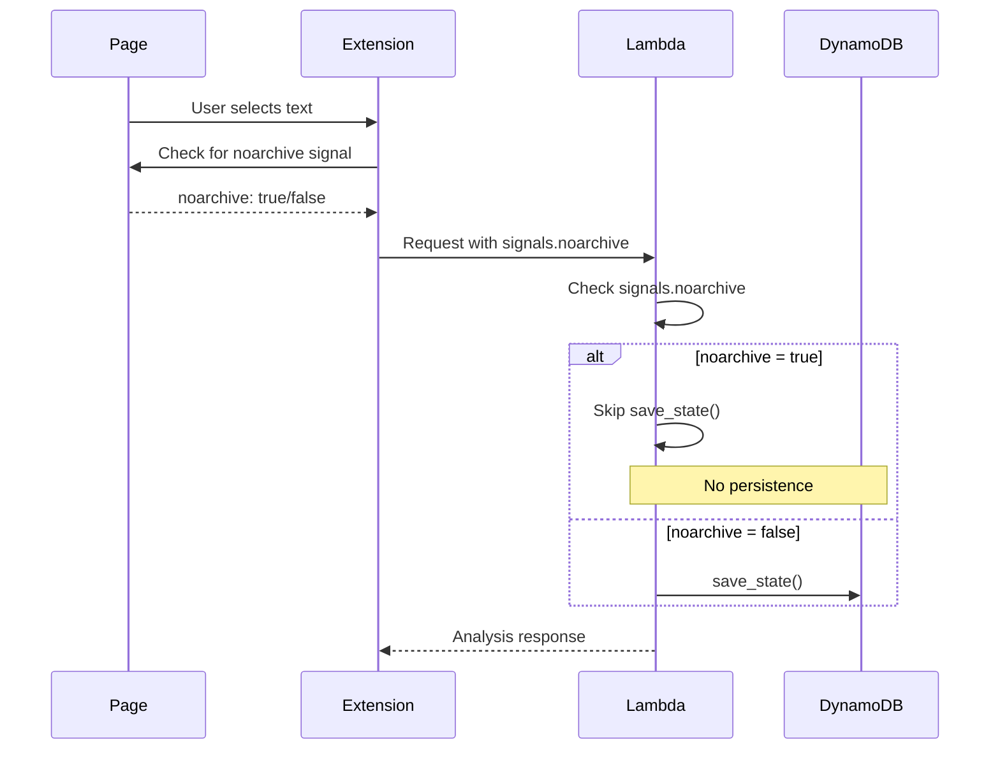

# 1155 - Feature: Skip DynamoDB Persistence When 'noarchive' Signal Present

## 1. Context & Goal
* **Issue:** #155
* **Objective:** Respect `noarchive` robot signal by skipping DynamoDB persistence per docs/0007-signal-handling.md.
* **Status:** Draft
* **Related Issues:** #162 (Transform layer for noarchive), #145 (DynamoDB TTL)

### Open Questions
*Questions that need clarification before or during implementation. Remove when resolved.*

- [x] ~~Should the extension detect `noarchive` (client-side) or should Lambda fetch/check headers (server-side)?~~ **Client-side (extension)**
- [x] ~~Issue body suggests client-side (Option A) - confirm this is the approach?~~ **Yes, confirmed**
- [x] ~~What happens to the response if we don't persist?~~ **Still return analysis, just don't save to DynamoDB**
- [x] ~~Should we log that persistence was skipped?~~ **Yes - log `{"action": "save_state_skipped", "reason": "noarchive_signal"}`**
- [x] ~~How does this interact with #162 (Transform layer)?~~ **BOTH apply - they are additive privacy layers**

### Resolved Questions (Gemini Review 2026-01-05)

1. **Q: How does this interact with #162 (Transform layer)?**
   **A: BOTH apply.** The signals are NOT mutually exclusive; they are additive privacy layers:
   - **#1155 (this):** Skip DynamoDB persistence
   - **#162:** Summarize/transform the output
   When `noarchive` is present, apply BOTH: don't save AND summarize.

2. **Q: Should we log when persistence is skipped?**
   **A: Yes.** Log `{"action": "save_state_skipped", "reason": "noarchive_signal"}` (without content). This is crucial for debugging why an item is "missing" from DynamoDB later.

## 2. Requirements

Per docs/0007-signal-handling.md:
1. Lambda checks for `noarchive` signal in request payload
2. If present, skip `save_state()` call to DynamoDB
3. Still return analysis to user (just don't persist)
4. Extension must detect and pass `noarchive` signal

## 3. Alternatives Considered

| Option | Pros | Cons | Decision |
|--------|------|------|----------|
| Client-side detection (extension sends flag) | No Lambda latency added | Extension must parse page | **Selected** |
| Server-side detection (Lambda fetches headers) | Lambda has full control | Adds latency, extra request | Rejected |

**Rationale:** Per issue recommendation, client already has page context from content script.

## 4. Data & Fixtures

### 4.1 Data Sources

| Attribute | Value |
|-----------|-------|
| Source | HTML meta tags, HTTP headers |
| Format | `<meta name="robots" content="noarchive">` or `X-Robots-Tag: noarchive` |
| Detection | Client-side in extension |

### 4.2 Data Pipeline

```
Page ──extension detects noarchive──► Include in request ──Lambda checks──► Skip save_state()
```

### 4.3 Test Fixtures

| Fixture | Source | Notes |
|---------|--------|-------|
| `noarchive.html` | Test HTML (GitHub Pages) | **Required** - dedicated fixture for deterministic testing |
| Page without noarchive | Test HTML | Control case |

**Note:** E2E test suite MUST include `tests/fixtures/noarchive.html` with `<meta name="robots" content="noarchive">` to deterministically test this behavior.

## 5. Diagram



## 6. Technical Approach

* **Module:**
  - `extension-chrome-V3/service-worker.js` (detect and send signal)
  - `extension-chrome-V3/content-script.js` (detect noarchive in page)
  - `src/lambda_function.py` (check signal, skip save)
* **Dependencies:** None new
* **Pattern:** Flag-based conditional persistence

### Extension Change

```javascript
// content-script.js - detect noarchive
function detectNoarchive() {
  const robotsMeta = document.querySelector('meta[name="robots"]');
  if (robotsMeta) {
    const content = robotsMeta.getAttribute('content') || '';
    return content.toLowerCase().includes('noarchive');
  }
  return false;
}
```

```javascript
// service-worker.js - include in request
const payload = {
  text: selectedText,
  url: pageUrl,
  signals: {
    noarchive: await detectNoarchiveFromTab(tabId)
  }
};
```

### Lambda Change

```python
# lambda_function.py
import json

def lambda_handler(event, context):
    ...
    signals = event.get('signals', {})

    # Only persist if noarchive is not set
    if signals.get('noarchive', False):
        # Log skip for debugging (no content logged)
        print(json.dumps({"action": "save_state_skipped", "reason": "noarchive_signal"}))
    else:
        save_state(thread_id, text, url, safety_score)

    return response
```

## 7. Interface Specification

### 7.1 Data Structures
```python
# Request payload with signals
{
    "text": "selected text",
    "url": "https://example.com/page",
    "signals": {
        "noarchive": True  # NEW
    }
}
```

### 7.2 Function Signatures
```javascript
// Extension
async function detectNoarchiveFromTab(tabId: number): Promise<boolean>
```

```python
# Lambda - no new functions, just conditional in handler
```

## 8. Security Considerations

| Concern | Mitigation | Status |
|---------|------------|--------|
| User spoofs noarchive to avoid logging | Acceptable - user choice | N/A |
| Site spoofs noarchive to avoid analysis | Still analyzed, just not persisted | N/A |

**Fail Mode:** Fail Open - If signal detection fails, persist as usual (default behavior).

## 9. Performance Considerations

| Metric | Budget | Approach |
|--------|--------|----------|
| Signal detection | < 5ms | Simple DOM query |
| Lambda check | < 1ms | Dictionary lookup |

**Bottlenecks:** None.

## 10. Risks & Mitigations

| Risk | Impact | Likelihood | Mitigation |
|------|--------|------------|------------|
| Signal detection misses X-Robots-Tag header | Med | Med | Extension can't see headers easily; document limitation |
| Inconsistent behavior Chrome vs Firefox | Med | Low | Test both |

## 11. Verification & Testing

### 11.1 Test Scenarios

| ID | Scenario | Type | Input | Expected Output | Pass Criteria |
|----|----------|------|-------|-----------------|---------------|
| 010 | Page with noarchive meta | Auto | signals.noarchive=true | save_state not called | DynamoDB unchanged |
| 020 | Page without noarchive | Auto | signals.noarchive=false | save_state called | Item in DynamoDB |
| 030 | Extension detects meta tag | Auto | Page with meta | noarchive=true in request | Payload correct |

### 11.2 Test Commands

```bash
# Lambda unit test
poetry run pytest tests/test_lambda_function.py -v -k noarchive

# E2E with test page
npx playwright test --grep noarchive
```

## 12. Definition of Done

### Code
- [ ] Extension detects noarchive signal
- [ ] Extension includes signal in request payload
- [ ] Lambda checks signal before save_state()
- [ ] Both Chrome and Firefox extensions updated

### Tests
- [ ] Unit test for Lambda conditional (includes logging verification)
- [ ] E2E test with `noarchive.html` fixture
- [ ] Verify log output: `{"action": "save_state_skipped", "reason": "noarchive_signal"}`

### Documentation
- [ ] 0007-signal-handling.md verified as accurate

---

## Appendix: Gemini Review Response

**Review Date:** 2026-01-05
**Reviewer:** Gemini 3 Pro

### Tier 2 Issues (HIGH) - Addressed

| Issue | Resolution |
|-------|------------|
| Interaction with #162 | Clarified: BOTH apply - additive privacy layers |
| Test fixture | Added requirement for `noarchive.html` dedicated fixture |

### Tier 3 Issues (SUGGESTIONS) - Addressed

| Issue | Resolution |
|-------|------------|
| Logging | Added structured JSON log: `{"action": "save_state_skipped", "reason": "noarchive_signal"}` |
