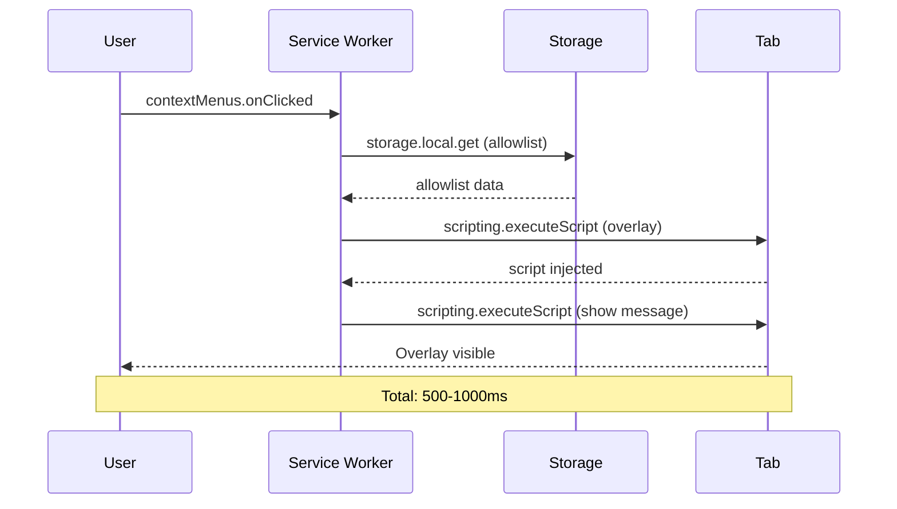
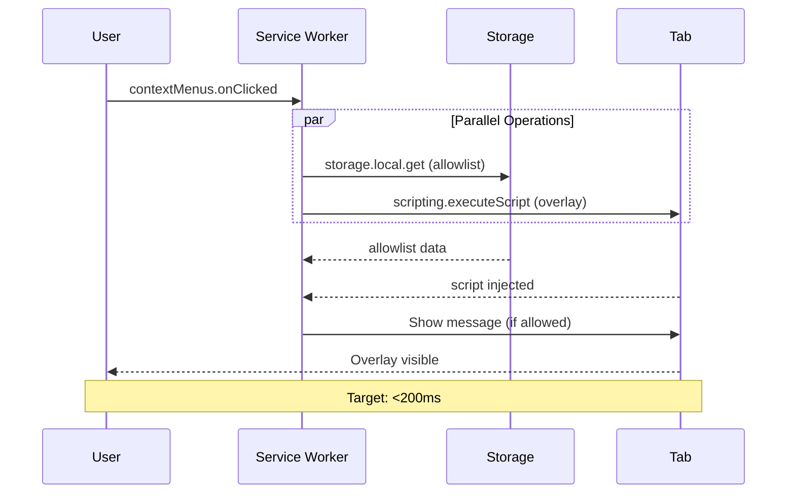

# 1156 - Performance: Optimize Extension 'Time to Feedback' Latency

## 1. Context & Goal
* **Issue:** #156
* **Objective:** Reduce time between user click and overlay appearance from 500-1000ms to <200ms.
* **Status:** Draft
* **Related Issues:** #137 (Lambda latency - separate issue)

### Open Questions
*Questions that need clarification before or during implementation. Remove when resolved.*

- [ ] What's the current measured latency breakdown? (allowlist check vs script injection vs message passing)
- [ ] Is parallelization of allowlist check and script injection safe? Any race conditions?
- [ ] Should we pre-inject overlay.js on allowlisted domains? Privacy implications?
- [ ] Is 200ms target achievable given activeTab permission model constraints?
- [ ] Do we need Chrome DevTools profiling first to identify actual bottlenecks?

## 2. Requirements

1. Measure current "click-to-glass" latency with Chrome DevTools
2. Reduce latency to <200ms target
3. Apply improvements to both Chrome and Firefox extensions
4. Maintain privacy guarantees (activeTab, no <all_urls>)

## 3. Alternatives Considered

| Option | Pros | Cons | Decision |
|--------|------|------|----------|
| Parallelize allowlist + injection | Significant speedup | Complexity | **Selected** |
| Pre-inject on allowlisted domains | Fastest possible | Privacy concern, memory | Consider |
| Combine scripting.executeScript calls | Reduces round trips | Limited gains | Consider |
| Accept current latency | No work | Poor UX | Rejected |

**Rationale:** Parallelization offers best balance of improvement vs complexity.

## 4. Data & Fixtures

N/A - Performance optimization, no data changes.

## 5. Diagram

### Current Flow (Sequential)


### Proposed Flow (Parallel)


## 6. Technical Approach

* **Module:**
  - `extension-chrome-V3/service-worker.js`
  - `extension-firefox-V2/background.js`
* **Dependencies:** None
* **Pattern:** Promise.all for parallel async operations

### Implementation

```javascript
// Current (sequential)
chrome.contextMenus.onClicked.addListener(async (info, tab) => {
  const allowed = await checkAllowlist(tab.url);  // Wait
  if (allowed) {
    await injectOverlay(tab.id);  // Then wait
    await showMessage(tab.id, "Analyzing...");  // Then wait
  }
});

// Proposed (parallel where safe)
chrome.contextMenus.onClicked.addListener(async (info, tab) => {
  // Start both immediately
  const [allowed, _injected] = await Promise.all([
    checkAllowlist(tab.url),
    injectOverlay(tab.id)  // Inject optimistically
  ]);

  if (allowed) {
    await showMessage(tab.id, "Analyzing...");
  } else {
    await hideOverlay(tab.id);  // Clean up if not allowed
  }
});
```

## 7. Interface Specification

### 7.1 Function Signatures
```javascript
// Existing functions, no signature changes
async function checkAllowlist(url: string): Promise<boolean>
async function injectOverlay(tabId: number): Promise<void>
async function showMessage(tabId: number, message: string): Promise<void>
async function hideOverlay(tabId: number): Promise<void>  // May need to add
```

## 8. Security Considerations

| Concern | Mitigation | Status |
|---------|------------|--------|
| Overlay injected before allowlist check | Hide if not allowed | TODO |
| No privacy regression | Still using activeTab only | Verified |

**Fail Mode:** Fail Safe - If injection fails, no overlay shown (current behavior).

## 9. Performance Considerations

| Metric | Budget | Approach |
|--------|--------|----------|
| Click-to-glass | < 200ms | Parallel operations |
| Memory | No increase | No pre-injection |

**Bottlenecks:**
- `scripting.executeScript` inherently takes time due to cross-process communication
- Cannot eliminate entirely due to activeTab permission model (ADR 0201)

## 10. Risks & Mitigations

| Risk | Impact | Likelihood | Mitigation |
|------|--------|------------|------------|
| Race condition in parallel ops | Med | Low | Careful Promise.all handling |
| Overlay flashes then hides | Med | Med | Consider skeleton/loading state |
| Target not achievable | Low | Med | Document actual achieved latency |

## 11. Verification & Testing

### 11.1 Test Scenarios

| ID | Scenario | Type | Input | Expected Output | Pass Criteria |
|----|----------|------|-------|-----------------|---------------|
| 010 | Measure baseline latency | Manual | DevTools Performance | Current ms | Document baseline |
| 020 | Measure optimized latency | Manual | DevTools Performance | < 200ms | Target met |
| 030 | Allowlist denied case | Auto | Non-allowlisted site | No overlay or brief flash | Clean UX |

### 11.2 Test Commands

```bash
# E2E test with timing
npx playwright test --grep latency

# Manual: Chrome DevTools > Performance > Record click action
```

## 12. Definition of Done

### Code
- [ ] Service worker parallelizes operations
- [ ] Handle non-allowlisted cleanup gracefully
- [ ] Both Chrome and Firefox updated

### Tests
- [ ] Latency measured and documented
- [ ] E2E tests still pass

### Documentation
- [ ] 0812 Performance Audit updated with new metrics
