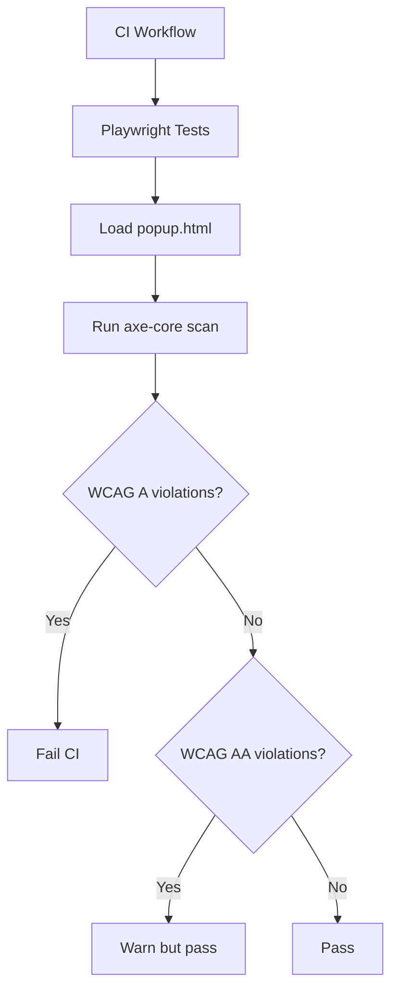

# 1160 - Chore: Automate Accessibility Checks in CI (pa11y/axe-core)

## 1. Context & Goal
* **Issue:** #160
* **Objective:** Add automated accessibility scanning to CI pipeline using pa11y or axe-core.
* **Status:** Draft
* **Related Issues:** #154 (ARIA attributes - manual fixes first)

### Open Questions
*Questions that need clarification before or during implementation. Remove when resolved.*

- [x] ~~Should we use pa11y (CLI-based) or axe-core with Playwright (already in stack)?~~ **axe-core with Playwright**
- [ ] Should CI fail on WCAG Level A violations only, or also AA?
- [ ] Do we need to test popup.html served from a local server, or can we test the file directly?
- [x] ~~Should we test the overlay in-page, or is popup.html sufficient?~~ **MUST test Overlay DOM in-page**
- [ ] What's the baseline? Do we fix existing issues first (#154) or document them as known?

### Resolved Questions (Gemini Review 2026-01-05)

1. **Q: Should we test the overlay in-page?**
   **A: YES - REQUIRED.** Testing `popup.html` covers the popup, but the Overlay (injected into content pages) is a SEPARATE DOM structure that interacts with arbitrary host page CSS. The Overlay must be tested in-page with `axe.analyze()` on the overlay container specifically.

## 2. Requirements

Per 0899 Meta-Audit recommendation:
1. CI fails on WCAG Level A violations
2. CI warns on WCAG Level AA violations
3. Test popup.html and overlay
4. Results logged for audit record

## 3. Alternatives Considered

| Option | Pros | Cons | Decision |
|--------|------|------|----------|
| pa11y in CI | Standalone, simple | Separate from existing test stack | Consider |
| axe-core with Playwright | Integrated with existing E2E | Requires Playwright setup | **Selected** |
| Manual audits only | No setup | High toil, likely skipped | Rejected |

**Rationale:** We already use Playwright for E2E tests; axe-core integration is natural.

## 4. Data & Fixtures

### 4.1 Test Fixtures

| Fixture | Source | Notes |
|---------|--------|-------|
| popup.html | Extension source | Served via test server |
| Overlay HTML | Injected by extension | Test on real page |

## 5. Diagram



## 6. Technical Approach

* **Module:** `tests/test_accessibility.py` or `tests/accessibility.spec.ts`
* **Dependencies:** @axe-core/playwright (npm) or axe-playwright
* **Pattern:** Page load → axe scan → assert no violations

### Implementation with Playwright + axe-core

```typescript
// tests/accessibility.spec.ts
import { test, expect } from '@playwright/test';
import AxeBuilder from '@axe-core/playwright';

test.describe('Accessibility', () => {
  test('popup.html has no WCAG A violations', async ({ page }) => {
    await page.goto('/popup.html');

    const results = await new AxeBuilder({ page })
      .withTags(['wcag2a', 'wcag21a'])
      .analyze();

    expect(results.violations).toEqual([]);
  });

  test('popup.html WCAG AA check', async ({ page }) => {
    await page.goto('/popup.html');

    const results = await new AxeBuilder({ page })
      .withTags(['wcag2aa', 'wcag21aa'])
      .analyze();

    // Log warnings but don't fail
    if (results.violations.length > 0) {
      console.warn('WCAG AA violations:', results.violations);
    }
  });

  // CRITICAL: Test Overlay DOM in-page (per Gemini review)
  test('overlay in-page has no WCAG A violations', async ({ page }) => {
    await page.goto('/test-page.html');

    // Inject overlay (simulate extension behavior)
    await page.evaluate(() => {
      const overlay = document.createElement('div');
      overlay.className = 'aletheia-overlay';
      overlay.setAttribute('role', 'dialog');
      overlay.setAttribute('aria-modal', 'false');
      overlay.innerHTML = '<div aria-live="polite">Test content</div><button aria-label="Close">×</button>';
      document.body.appendChild(overlay);
    });

    // Run axe on overlay specifically
    const results = await new AxeBuilder({ page })
      .include('.aletheia-overlay')
      .withTags(['wcag2a', 'wcag21a'])
      .analyze();

    expect(results.violations).toEqual([]);
  });
});
```

### Alternative: pa11y CLI

```yaml
# .github/workflows/ci.yml addition
- name: Accessibility scan
  run: |
    npx serve extension-chrome-V3 -p 8080 &
    sleep 2
    npx pa11y http://localhost:8080/popup.html --standard WCAG2A
```

## 7. Interface Specification

N/A - Test infrastructure, no code interfaces.

## 8. Security Considerations

| Concern | Mitigation | Status |
|---------|------------|--------|
| N/A | Test infrastructure only | N/A |

**Fail Mode:** N/A

## 9. Performance Considerations

| Metric | Budget | Approach |
|--------|--------|----------|
| CI time increase | < 30s | Lightweight axe scan |

**Bottlenecks:** None expected.

## 10. Risks & Mitigations

| Risk | Impact | Likelihood | Mitigation |
|------|--------|------------|------------|
| Existing violations fail CI | High | High | Fix #154 first OR baseline exceptions |
| False positives | Med | Low | Review and configure rules |

## 11. Verification & Testing

### 11.1 Test Scenarios

| ID | Scenario | Type | Input | Expected Output | Pass Criteria |
|----|----------|------|-------|-----------------|---------------|
| 010 | Clean popup passes | Auto | Accessible popup.html | No violations | Zero A violations |
| 020 | Violation detected | Auto | Add inaccessible element | Violation reported | Test fails |
| 030 | **Overlay in-page** | Auto | Inject overlay into test page | No violations | Zero A violations |

### 11.2 Test Commands

```bash
# Run accessibility tests locally
npx playwright test accessibility

# With pa11y
npx pa11y extension-chrome-V3/popup.html --standard WCAG2A
```

## 12. Definition of Done

### Code
- [ ] Accessibility test file created
- [ ] CI workflow includes accessibility step
- [ ] WCAG A violations fail, AA warn

### Tests
- [ ] Test passes on current code (after #154 fixes)

### Documentation
- [ ] 0811 Accessibility Audit updated with automation status
- [ ] 0899 Meta-Audit recommendation marked resolved

---

## Appendix: Gemini Review Response

**Review Date:** 2026-01-05
**Reviewer:** Gemini 3 Pro

### Tier 2 Issues (HIGH) - Addressed

| Issue | Resolution |
|-------|------------|
| Must test Overlay DOM, not just Popup | Added test case 030 that injects overlay and runs axe.analyze() on it specifically |

**Verdict:** APPROVED - With overlay testing requirement.
