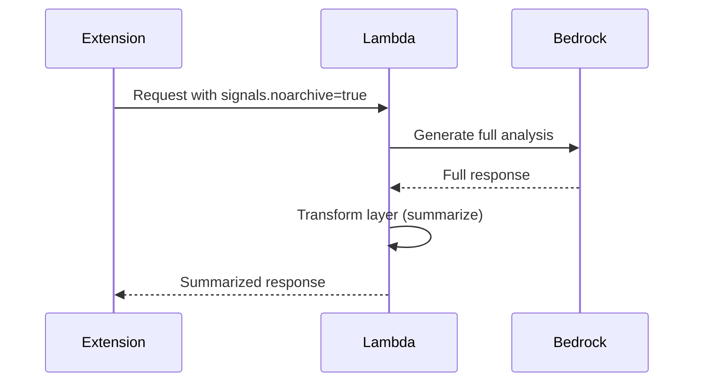

# 1162 - Feature: Apply Transform Layer (Summarization) When 'noarchive' Signal Present

## 1. Context & Goal
* **Issue:** #162
* **Objective:** Route responses through Transform layer (summarization) when `noarchive` signal is detected, per docs/0007-signal-handling.md.
* **Status:** Draft
* **Related Issues:** #155 (Skip DynamoDB persistence for noarchive - related but different)

### Open Questions
*Questions that need clarification before or during implementation. Remove when resolved.*

- [ ] What exactly does "Transform layer" mean? Summarize the LLM response before returning to user?
- [ ] Is this about copyright compliance (don't reproduce full content) or privacy (don't persist)?
- [ ] How aggressive should summarization be? 50% reduction? Key points only?
- [ ] Should Transform apply INSTEAD of or IN ADDITION to skipping persistence (#155)?
- [ ] Does the Digital Etymologist persona already do some summarization? Is this redundant?
- [ ] What's the difference between this issue and #155? Both mention noarchive signal.

## 2. Requirements

Per docs/0007-signal-handling.md:
1. Detect `noarchive` signal (same as #155)
2. If present, apply Transform layer (summarization) to response
3. Return summarized content instead of full analysis

## 3. Alternatives Considered

| Option | Pros | Cons | Decision |
|--------|------|------|----------|
| Summarize at Lambda response | Centralized | Adds latency | Consider |
| Summarize in extension | No Lambda change | JS complexity | Rejected |
| Truncate response | Simple | Loses context | Rejected |
| Different prompt for noarchive | Clean separation | Prompt maintenance | Consider |

**Rationale:** TBD - need clarification on Transform layer definition.

## 4. Data & Fixtures

### 4.1 Data Sources

| Attribute | Value |
|-----------|-------|
| Source | LLM response |
| Format | Text |
| Transform | Summarization |

### 4.2 Data Pipeline

```
User request ──check noarchive──► LLM analysis ──Transform──► Summarized response
```

## 5. Diagram



## 6. Technical Approach

* **Module:** `src/lambda_function.py`
* **Dependencies:** Bedrock (for summarization call)
* **Pattern:** Post-processing transformation

### Implementation Options

#### Option A: Second LLM Call for Summarization

```python
def transform_response(full_response: str) -> str:
    """Summarize response for noarchive compliance."""
    prompt = f"""Summarize this analysis in 2-3 key points:
    {full_response}"""
    return invoke_bedrock_for_summary(prompt)
```

**Concern:** Doubles LLM cost and latency.

#### Option B: Different Prompt for noarchive

```python
def get_prompt(text: str, context: str, noarchive: bool) -> str:
    if noarchive:
        return f"""Provide a brief summary analysis (2-3 sentences) of: {text}
        Do not reproduce source content verbatim."""
    else:
        return f"""Provide detailed analysis of: {text}..."""
```

**Benefit:** Single LLM call, but different output.

#### Option C: Truncation (Simple)

```python
def transform_response(full_response: str, max_chars: int = 500) -> str:
    """Truncate response for noarchive compliance."""
    if len(full_response) <= max_chars:
        return full_response
    return full_response[:max_chars] + "... [summarized for copyright compliance]"
```

**Concern:** Loses context, not a real summary.

## 7. Interface Specification

### 7.1 Function Signatures
```python
def transform_response(response: str, transform_type: str = "summarize") -> str:
    """Apply transformation to response content."""
    ...

def lambda_handler(event, context):
    ...
    signals = event.get('signals', {})

    response = generate_analysis(text, page_context)

    if signals.get('noarchive', False):
        response = transform_response(response)

    return {'statusCode': 200, 'body': response}
```

## 8. Security Considerations

| Concern | Mitigation | Status |
|---------|------------|--------|
| Copyright infringement | Summarization reduces reproduction | Goal of feature |
| Double LLM cost | Consider single-call approach | TODO |

**Fail Mode:** Fail Open - If transform fails, return full response (acceptable fallback).

## 9. Performance Considerations

| Metric | Budget | Approach |
|--------|--------|----------|
| Additional latency | < 500ms | Single modified prompt preferred |
| LLM cost | No doubling | Avoid second LLM call |

**Bottlenecks:** Second LLM call would significantly increase latency and cost.

## 10. Risks & Mitigations

| Risk | Impact | Likelihood | Mitigation |
|------|--------|------------|------------|
| Summary loses important context | Med | Med | Balance brevity vs usefulness |
| Doubled latency | High | Med | Use single-call prompt approach |
| Confusion with #155 | Med | High | Clarify relationship in docs |

## 11. Verification & Testing

### 11.1 Test Scenarios

| ID | Scenario | Type | Input | Expected Output | Pass Criteria |
|----|----------|------|-------|-----------------|---------------|
| 010 | noarchive triggers transform | Auto | signals.noarchive=true | Shorter response | Response is summarized |
| 020 | No noarchive = full response | Auto | signals.noarchive=false | Full response | No transformation |
| 030 | Transform quality | Manual | Various inputs | Useful summaries | Human review |

### 11.2 Test Commands

```bash
# Unit tests
poetry run pytest tests/test_lambda_function.py -v -k transform
```

## 12. Definition of Done

### Prerequisites
- [ ] Clarify: What is Transform layer exactly?
- [ ] Clarify: Relationship to #155 (skip persistence)

### Code
- [ ] Transform logic implemented
- [ ] Single-call approach preferred (no double LLM)

### Tests
- [ ] Unit tests for transform logic
- [ ] E2E test with noarchive page

### Documentation
- [ ] 0007-signal-handling.md verified/updated
