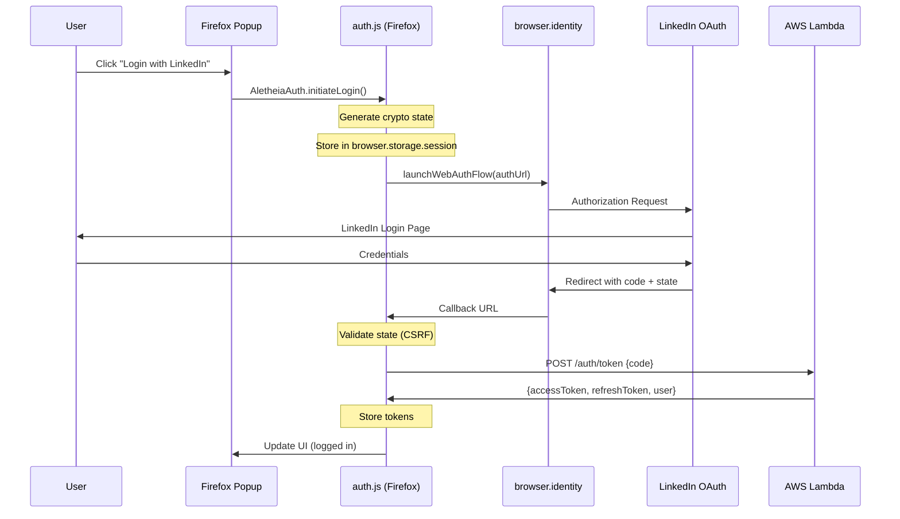

# 1206 - Feature: Firefox LinkedIn OAuth Authentication

## 1. Context & Goal

* **Issue:** #206
* **Objective:** Port LinkedIn OAuth authentication from Chrome to Firefox extension, achieving feature parity.
* **Status:** LLD Draft
* **Related Issues:** #116 (Chrome OAuth implementation), #214 (Firefox test parity)
* **Parent LLD:** `docs/1116-linkedin-oauth.md` (Chrome implementation)

### Background

Issue #116 implemented LinkedIn OAuth for the Chrome extension. The Firefox extension (`extensions/firefox/`) currently lacks authentication, creating a feature gap:

| Feature | Chrome | Firefox |
|---------|--------|---------|
| LinkedIn OAuth | ✅ auth.js (350 lines) | ❌ Missing |
| Login view | ✅ popup.html | ❌ Missing |
| User bar | ✅ popup.html/popup.js | ❌ Missing |
| Age gate | ✅ Integrated | ❌ Missing |
| Restricted view | ✅ popup.html | ❌ Missing |

### Firefox Extension Context

The Firefox extension is **Manifest V3** (like Chrome), which means:
- `browser.storage.session` is available (access token storage)
- `browser.identity.launchWebAuthFlow` is available
- Background scripts syntax differs slightly: `"scripts": ["service-worker.js"]` vs Chrome's `"service_worker"`

## 2. Requirements

| ID | Requirement | Acceptance Criteria |
|----|-------------|---------------------|
| R1 | OAuth 2.0 flow with LinkedIn | User can authenticate via `browser.identity.launchWebAuthFlow` |
| R2 | Secure token storage | Access token in `browser.storage.session`, refresh token in `browser.storage.local` |
| R3 | Session management | Lazy refresh on action (same as Chrome) |
| R4 | Login UI in popup | Login button visible when not authenticated |
| R5 | Auth status indicator | User bar shows display name when logged in |
| R6 | Logout/disconnect | User can disconnect and clear tokens |
| R7 | Age gate integration | Restricted view for age-gated sites |
| R8 | CSRF protection | Cryptographically random state parameter |
| R9 | Mock mode for testing | `MOCK_MODE` flag for deterministic fake tokens |
| R10 | Feature parity with Chrome | Firefox popup matches Chrome popup behavior |

## 3. Alternatives Considered

| Option | Pros | Cons | Decision |
|--------|------|------|----------|
| A. Port auth.js with minimal changes | Fast, proven code | API namespace differences (`browser.*` vs `chrome.*`) | **Selected** |
| B. Create abstraction layer | Single codebase | Over-engineering for 2 files | **Rejected** |
| C. Use WebExtension polyfill | Browser-agnostic code | Additional dependency, complexity | **Rejected** |

**Rationale:** Firefox's `browser.*` API is nearly identical to Chrome's `chrome.*` API for identity and storage. A direct port with namespace changes is simplest.

## 4. Data & Fixtures

### 4.1 Data Pipeline

Same as Chrome (LLD 1116 §4.2):
```
User Click ──launchWebAuthFlow──► LinkedIn ──callback──► Extension ──code──► Lambda ──validate──► DynamoDB
```

### 4.2 Firefox-Specific Configuration

| Attribute | Chrome | Firefox |
|-----------|--------|---------|
| API namespace | `chrome.*` | `browser.*` |
| Redirect URL | `https://{id}.chromiumapp.org/` | `https://{id}.extensions.allizom.org/` |
| Identity API | `chrome.identity` | `browser.identity` |
| Session storage | `chrome.storage.session` | `browser.storage.session` (MV3) |

### 4.3 LinkedIn OAuth App Configuration

The existing LinkedIn OAuth app needs an additional redirect URI:

```
Redirect URIs (LinkedIn Developer Portal):
1. https://{chrome-extension-id}.chromiumapp.org/     (existing)
2. https://{firefox-extension-id}.extensions.allizom.org/  (NEW)
```

**Note:** Firefox extension ID is defined in `manifest.json`:
```json
"browser_specific_settings": {
  "gecko": {
    "id": "extension@aletheia.study"
  }
}
```

The redirect URL format for Firefox is: `https://extensions.allizom.org/{gecko-id}/`

## 5. Diagram



## 6. Technical Approach

### 6.1 Files to Create/Modify

| File | Action | Description |
|------|--------|-------------|
| `extensions/firefox/auth.js` | **CREATE** | Port from Chrome with `browser.*` namespace |
| `extensions/firefox/popup.html` | **MODIFY** | Add login-view, user-bar, restricted-view, checking-view |
| `extensions/firefox/popup.js` | **MODIFY** | Add auth integration, age gate logic |
| `extensions/firefox/popup.css` | **MODIFY** | Add auth-related styles (if not present) |
| `extensions/firefox/manifest.json` | **MODIFY** | Add `identity` permission |

### 6.2 auth.js Port Strategy

The Chrome `auth.js` (350 lines) needs these changes for Firefox:

```javascript
// CHANGE 1: API namespace (global find/replace)
// Chrome: chrome.identity, chrome.storage
// Firefox: browser.identity, browser.storage

// CHANGE 2: Redirect URL helper
// Chrome: chrome.identity.getRedirectURL()
// Firefox: browser.identity.getRedirectURL()
// NOTE: Both return the correct format for their platform

// CHANGE 3: Promise-based APIs (Firefox native)
// Chrome: chrome.* APIs return Promises in MV3
// Firefox: browser.* APIs return Promises natively
// No change needed - both are Promise-based in MV3
```

### 6.3 Manifest Changes

```json
// extensions/firefox/manifest.json - ADD identity permission
{
  "permissions": [
    "activeTab",
    "tabs",
    "scripting",
    "contextMenus",
    "storage",
    "identity"  // NEW - required for launchWebAuthFlow
  ]
}
```

### 6.4 popup.html Changes

Add these views from Chrome popup.html:

1. **Login View** - Lines 13-33 from Chrome popup.html
2. **User Bar** - Lines 38-41 from Chrome popup.html (inside main-view)
3. **Restricted View** - Lines 109-117 from Chrome popup.html
4. **Checking View** - Lines 119-125 from Chrome popup.html
5. **Script tag** - Add `<script src="auth.js"></script>` before popup.js

### 6.5 popup.js Changes

Port auth-related functions from Chrome popup.js:

```javascript
// ADD: Auth state management
async function init() {
    // Check authentication first
    const isAuthed = await AletheiaAuth.isAuthenticated();

    if (!isAuthed) {
        showView('login');
        return;
    }

    // Check age gate for current tab
    await checkAgeGate();
}

// ADD: Login handler
async function handleLoginClick() {
    const loginButton = document.getElementById('login-button');
    const loginError = document.getElementById('login-error');

    loginButton.disabled = true;
    loginButton.textContent = 'Signing in...';
    loginError.style.display = 'none';

    try {
        await AletheiaAuth.initiateLogin();
        await checkAgeGate();
    } catch (error) {
        loginError.textContent = `Login failed: ${error.message}`;
        loginError.style.display = 'block';
        // Reset button (use DOM methods, not innerHTML)
        loginButton.disabled = false;
        loginButton.textContent = '';
        const iconSpan = document.createElement('span');
        iconSpan.className = 'linkedin-icon';
        iconSpan.textContent = 'in';
        loginButton.appendChild(iconSpan);
        loginButton.appendChild(document.createTextNode(' Sign in with LinkedIn'));
    }
}

// ADD: Logout handler
async function handleLogoutClick() {
    await AletheiaAuth.logout();
    showView('login');
}

// ADD: User bar update
async function updateUserBar() {
    const authState = await AletheiaAuth.getAuthState();
    const userName = document.getElementById('user-name');
    if (authState && userName) {
        userName.textContent = authState.displayName || 'User';
    }
}

// ADD: Age gate check (simplified - Firefox doesn't have content-safety.js)
async function checkAgeGate() {
    showView('checking');

    // For Firefox MVP: Skip age gate, go directly to main view
    // Age gate requires content-safety.js which is Chrome-only (Issue #104)
    // TODO: Port content-safety.js to Firefox in future issue

    showView('main');
    await renderMainView();
    await updateUserBar();
}
```

### 6.6 API Compatibility Matrix

| API | Chrome | Firefox MV3 | Notes |
|-----|--------|-------------|-------|
| `identity.launchWebAuthFlow` | ✅ | ✅ | Same signature |
| `identity.getRedirectURL` | ✅ | ✅ | Returns platform-specific URL |
| `storage.session` | ✅ | ✅ | Available in MV3 |
| `storage.local` | ✅ | ✅ | Same API |
| `tabs.query` | ✅ | ✅ | Same API |

## 7. Interface Specification

### 7.1 Firefox auth.js Exports

Same as Chrome (LLD 1116 §7.2):

```javascript
window.AletheiaAuth = {
    initiateLogin,      // Start OAuth flow
    logout,             // Clear all tokens
    isAuthenticated,    // Check if user is logged in
    getAuthState,       // Get {userId, displayName} or null
    getAccessToken,     // Get valid token (lazy refresh)
    clearTokens,        // Clear all auth data
    getConfig           // Get config (CLIENT_ID masked)
};
```

### 7.2 View States

| View | Condition | Elements Shown |
|------|-----------|----------------|
| `login` | Not authenticated | Logo, welcome message, LinkedIn button |
| `checking` | Auth OK, checking age gate | Spinner |
| `restricted` | Age-gated site detected | "Not Permitted" message |
| `main` | Auth OK, site allowed | User bar, domain card, power button |
| `manage` | User clicked "Manage Allowlist" | Allowlist management |
| `confirm` | User clicked "Clear All Data" | Confirmation dialog |

## 8. Security Considerations

Same as Chrome (LLD 1116 §8), plus:

| Concern | Firefox-Specific Mitigation |
|---------|----------------------------|
| Extension ID stability | Firefox uses `gecko.id` in manifest - stable across installs |
| Redirect URL security | Firefox validates redirect matches registered extension |
| Storage isolation | `browser.storage` is extension-isolated |

## 9. Performance Considerations

| Metric | Budget | Notes |
|--------|--------|-------|
| Login latency | < 3s | Same as Chrome |
| Token refresh | < 500ms | Same as Chrome |
| Popup load | < 200ms | Auth check is async, doesn't block render |

## 10. Risks & Mitigations

| Risk | Impact | Likelihood | Mitigation |
|------|--------|------------|------------|
| Firefox identity API differences | Med | Low | Test early, fallback to manual flow if needed |
| Redirect URL registration failure | High | Low | Test with LinkedIn app before PR |
| Storage.session unavailable | High | Very Low | Firefox MV3 supports it; fallback to local |
| Age gate not portable | Med | Med | Skip for MVP, document as known limitation |

## 11. Verification & Testing

### 11.1 Test Scenarios

| ID | Scenario | Type | Expected Output |
|----|----------|------|-----------------|
| 010 | Mock mode login | Auto | Mock tokens stored in browser.storage |
| 020 | CSRF state validation | Auto | Mismatched state rejected |
| 030 | Token storage hierarchy | Auto | Access in session, refresh in local |
| 040 | Fresh login | Manual | LinkedIn popup, user bar shows name |
| 050 | Logout clears data | Manual | Login view shown, storage cleared |
| 060 | Token persists in session | Manual | Reopen popup, still logged in |
| 070 | Browser close clears access | Manual | Access token gone, refresh needed |
| 080 | Popup shows login when unauthenticated | Manual | Login view displayed first |

### 11.2 Manual Smoke Test

1. Load Firefox extension via `about:debugging`
2. Click extension icon - verify login view shown
3. Click "Sign in with LinkedIn"
4. Complete LinkedIn authentication
5. Verify popup shows user name and main view
6. Open DevTools → Storage Inspector - verify:
   - Session Storage has accessToken
   - Local Storage has refreshToken, userId, displayName
7. Click logout - verify login view returns
8. Close Firefox completely, reopen - verify must re-login

### 11.3 LinkedIn App Configuration Test

Before implementation:
1. Get Firefox extension ID: `extension@aletheia.study`
2. Add redirect URI to LinkedIn Developer Portal:
   `https://extensions.allizom.org/extension@aletheia.study/`
3. Test redirect URL in browser to confirm format

## 12. Definition of Done

### Code
- [ ] `extensions/firefox/auth.js` created (port from Chrome)
- [ ] `extensions/firefox/popup.html` updated with auth views
- [ ] `extensions/firefox/popup.js` updated with auth handlers
- [ ] `extensions/firefox/popup.css` has auth styles
- [ ] `extensions/firefox/manifest.json` has `identity` permission
- [ ] LinkedIn app has Firefox redirect URI registered

### Tests
- [ ] Manual OAuth flow works in Firefox
- [ ] Mock mode works for automated tests
- [ ] Storage hierarchy verified (session vs local)
- [ ] Logout clears all data

### Documentation
- [ ] Implementation report created
- [ ] Test report created
- [ ] Known limitations documented (age gate deferred)

### Review
- [ ] Code review completed
- [ ] Pre-merge gate passed
- [ ] Firefox Add-ons compatibility verified

---

## Appendix A: Chrome vs Firefox auth.js Diff

The port requires only namespace changes. Key search/replace:

| Search | Replace | Count (approx) |
|--------|---------|----------------|
| `chrome.identity` | `browser.identity` | 3 |
| `chrome.storage` | `browser.storage` | 8 |
| `chrome.runtime` | `browser.runtime` | 1 |

No logic changes required - APIs are compatible.

## Appendix B: Known Limitations

### Age Gate (Deferred)

Chrome's age gate relies on:
- `content-safety.js` - Content script for age detection
- `content-check.js` - Page signal inspection
- Service worker tab state management

These are Chrome-specific (Issue #104). For Firefox MVP:
- **Skip age gate** - Go directly to main view after auth
- **Future issue** - Port content-safety.js to Firefox

### Manifest V2 Fallback (Not Needed)

Firefox extension is already MV3, so `browser.storage.session` is available. No MV2 fallback needed.

## Appendix C: File Sizes (Effort Estimate)

| File | Chrome Lines | Firefox Changes |
|------|--------------|-----------------|
| auth.js | 350 | ~10 lines changed (namespace) |
| popup.html | 132 | ~50 lines added (views) |
| popup.js | 494 → 317 (Firefox simpler) | ~100 lines added (auth) |
| popup.css | Same | ~20 lines added (auth styles) |

**Total Effort:** ~180 lines of changes/additions
