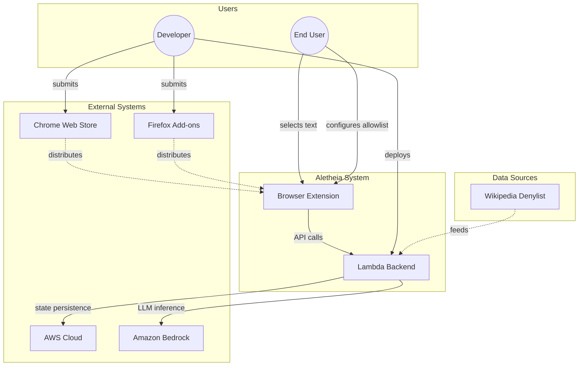
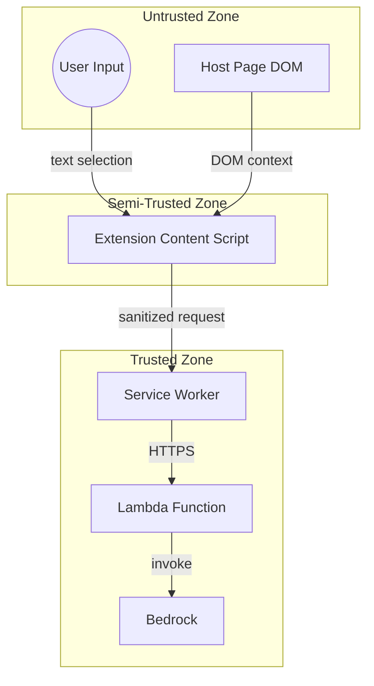

# 0001a - Context View (C4 Level 1)

The system context diagram shows Aletheia's boundary and its interactions with external actors and systems.

## External Actors

| Actor | Description | Interaction |
|-------|-------------|-------------|
| **End User** | Browser user who selects text for analysis | Triggers analysis, configures site allowlist |
| **Developer** | Maintains and deploys the system | Deploys Lambda, submits to stores |

## External Systems

| System | Purpose | Integration |
|--------|---------|-------------|
| **Chrome Web Store** | Distribution for Chrome extension | Manual submission via developer dashboard |
| **Firefox Add-ons** | Distribution for Firefox extension | Manual submission via AMO dashboard |
| **Amazon Bedrock** | LLM inference (Amazon Nova Micro) | boto3 SDK, invoke_model API |
| **AWS Cloud** | Hosting (Lambda, DynamoDB, API Gateway) | Infrastructure as Code via provision.sh |
| **Wikipedia** | Source for denylist terms (803 terms) | One-time harvest, static JSON in Lambda |

## Trust Boundaries

| Boundary | What Crosses | Validation |
|----------|--------------|------------|
| User → Extension | Raw text selection | XML escaping, length limits |
| Host Page → Extension | DOM context | Shadow DOM isolation |
| Extension → Lambda | JSON payload | Schema validation, rate limiting |
| Lambda → Bedrock | Prompt | Prompt injection protection |

---

[← Back to Architecture](0001-architecture.md) | [Container View →](0001b-container-view.md)
