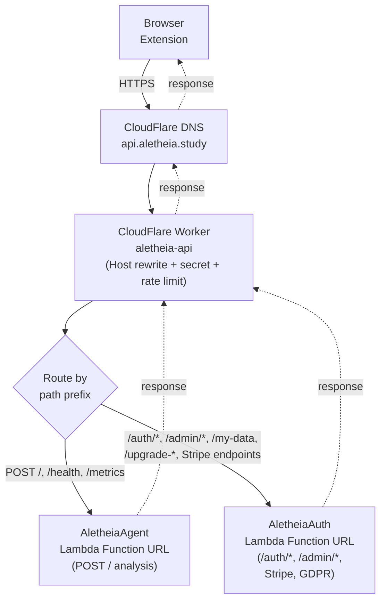
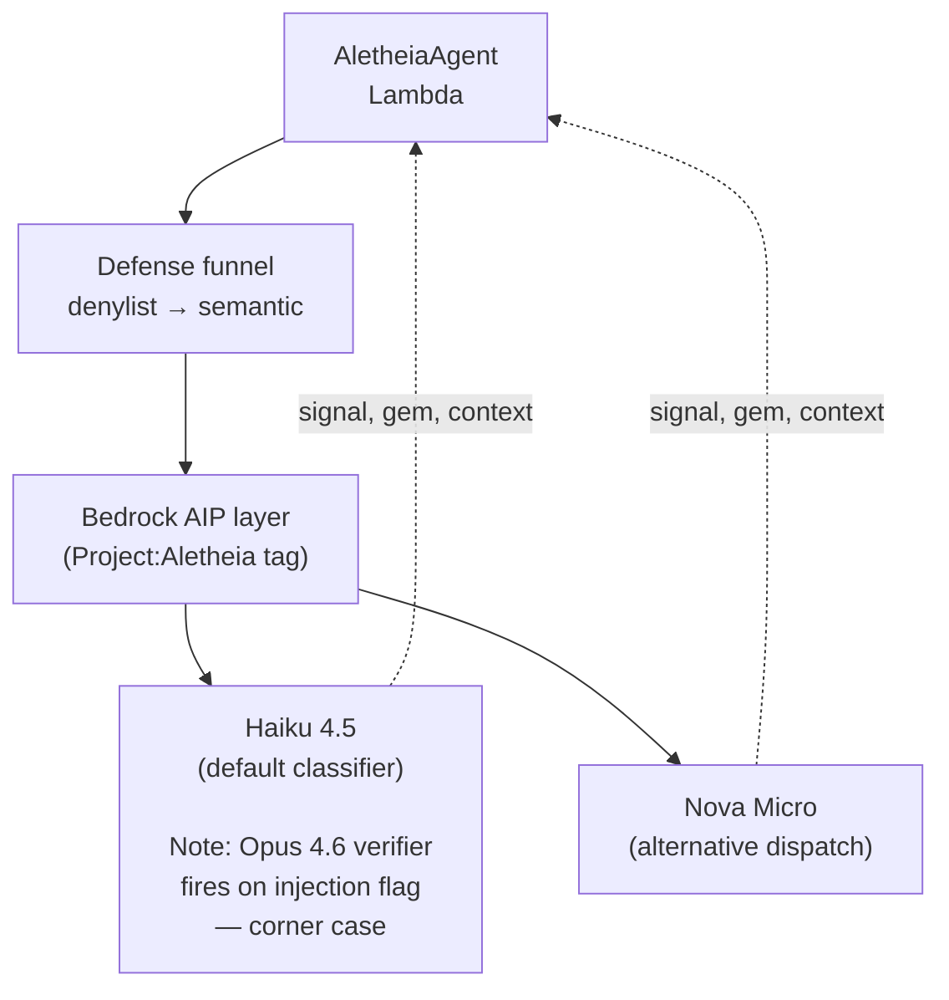
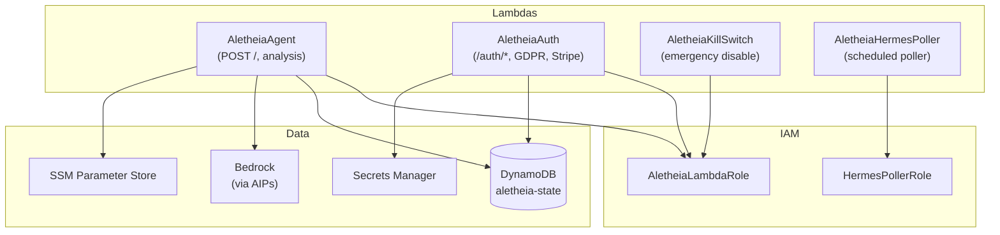
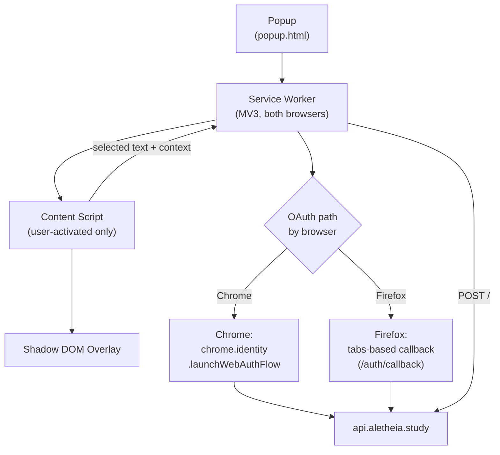

# 10834 — Wiki Audit Report (June 2026)

> **Issue:** #743 (F1 in plan § 9)
> **Plan:** `docs/audits/10833-wiki-audit-and-refresh-plan.md`
> **Authored:** 2026-06-04
> **Scope:** Every file in `https://github.com/martymcenroe/Aletheia.wiki` — 11 content pages + `_Sidebar` + `_Footer`. 1,542 lines total.
> **Source-of-truth corpus:** `src/lambda_function.py`, `src/lambda_auth_function.py`, `src/etymologist.py`, `src/auth/auth_middleware.py`, `workers/aletheia-api/worker.js`, `provision.sh`, `extensions/{chrome,firefox}/manifest.json`, `LICENSE`, runbooks `10905` and `10907`.

---

## 1. Executive summary

The wiki is structurally stale across every page. The dominant failure mode is not "outdated examples" — it is **load-bearing factual claims that are wrong**. Six categories cover most of the drift:

| # | Category | Severity | Pages affected |
|---|---|---|---|
| 1 | Wrong license claim (MIT → actually PolyForm Noncommercial 1.0.0) | Legal | `Home`, `FAQ`, `_Footer` |
| 2 | Wrong AI model claim (Nova Micro → actually Haiku 4.5 default; Nova is alternative) | Technical | `Home`, `Architecture`, `FAQ` |
| 3 | Wrong edge architecture claim (CloudFront + WAF → actually CloudFlare Worker, no WAF) | Technical | `Home`, `Architecture`, `Security`, `API-Reference` |
| 4 | Wrong browser manifest claim (Firefox MV2 → actually MV3) | Technical | `Home`, `Architecture`, `FAQ`, `Getting-Started`, `Developer-Guide` |
| 5 | Wrong permission counts (3 → actually 5 Firefox / 7 Chrome) | Technical | `Getting-Started`, `FAQ` |
| 6 | Wrong API base URL + endpoint shape (`POST /analyze` → actually `POST /` at `api.aletheia.study`) | Technical | `API-Reference` |

Beyond those six, the wiki is **missing** entire subsystems that are live in production today:

- The CloudFlare Worker `aletheia-api` (Host rewrite, shared-secret `X-Origin-Secret` injection, edge rate limit)
- The four-Lambda topology (`AletheiaAgent`, `AletheiaAuth`, `AletheiaKillSwitch`, `AletheiaHermesPoller`)
- LinkedIn OAuth flow (Chrome vs Firefox UX divergence) and the Auth Lambda's `/auth/*` surface
- Stripe checkout / coupon / subscription surface (~6 endpoints)
- GDPR `DELETE /my-data` endpoint (already implemented; Privacy.md still calls it "being formalized")
- Bedrock Application Inference Profiles (AIPs) and `Project:Aletheia` cost-allocation tag
- Per-Lambda IAM separation (`HermesPollerRole` vs `AletheiaLambdaRole`)
- `X-Aletheia-Client-Version` header gate (the replacement for the deleted WAF rule)
- Shared-secret rotation pattern (SSM `/aletheia/cloudflare-origin-secret`)

And the wiki carries documented-as-planned features that are **already shipped**:

- `Privacy.md` "Planned additions: Surrounding paragraph (Issue #177)" — domContext is stored at `src/lambda_function.py:215-218` today
- `Privacy.md` "Planned additions: AI response (Issue #178)" — response is stored at `src/lambda_function.py:220-226` today
- `Privacy.md` "GDPR erasure process being formalized" — `DELETE /my-data` is live at `src/lambda_auth_function.py:932`

### Total time-to-refresh estimate

The per-page estimates (§ 4) sum to roughly **18–24 hours of focused work**, distributable across 10 follow-up PRs. Estimates are agent-time, not wall-clock; PRs themselves land in 5–10 minutes each after the writing is done.

### Recommendation

Land follow-ups in this order (the operator can re-order, but this is the dependency-minimizing default):

1. **F4 Security.md, F2 Home.md, F10 Concepts.md** — these three carry the most operator-facing impact (legal license claim, AI model identity, interview-prep reference).
2. **F3 Architecture.md** — depends on the four diagrams; longest single PR; do after F2 lands so the home page is no longer lying about the stack.
3. **F5 API-Reference.md** — depends on a full endpoint inventory; do after F4 because the auth endpoint story benefits from Security.md already naming the four-Lambda topology.
4. **F6 Privacy.md, F7 Developer-Guide.md** — refresh the longer policy/dev pages last; smaller in risk.
5. **F8 (Getting-Started, User-Guide, FAQ, Terms-of-Use, Contributing)** — these are low-density refreshes done as small PRs in any order.
6. **F9 _Sidebar.md restructure** — last, so the IA refactor reflects the final page set.
7. **F13** — repo-side update to `10817-audit-wiki-alignment.md`; can land any time.

---

## 2. Methodology applied

Per plan § 3.1: every claim was checked against `path:line` in the corpus before being marked drifted. Where a claim is correct but stale-looking, it is marked `OK`. Where a claim is missing entirely, it is captured under "Missing" rather than "Drift" because there is no wiki line to cite.

Each page's section follows the plan § 3.2 procedure:

1. Drift table (wiki vs source-of-truth, with citations)
2. Missing content
3. Structural notes (restructuring, IA fit)
4. Concept entries this page should refer out to in `Concepts.md`
5. Diagram opportunities
6. Time-to-refresh estimate

Cross-cutting findings (terminology, naming, links) are in § 5.

---

## 3. Critical findings (read first)

### 3.1 License claim is wrong everywhere

Three wiki surfaces claim "MIT License":

- `Home.md:71` — "Aletheia is open source under the [MIT License]..."
- `FAQ.md:13` — "Yes, Aletheia is free and open source under the MIT License."
- `_Footer.md:2` — "[MIT License](https://github.com/martymcenroe/Aletheia/blob/main/LICENSE)"

Source of truth: `LICENSE:1` reads `# PolyForm Noncommercial License 1.0.0` and references `https://polyformproject.org/licenses/noncommercial/1.0.0`. This is corroborated by `extensions/firefox/manifest.json` AMO listing requirements per runbook `10907 § 11k`, which explicitly warns against MIT.

**This is a legal claim, not a stylistic one.** A reader who saw "MIT" on the wiki and used Aletheia commercially is incorrectly relying on the wiki. Fix is highest priority.

### 3.2 AI model claim is wrong on the marquee surfaces

Three wiki surfaces name the wrong AI model:

- `Home.md:49` — "AWS Bedrock (Amazon Nova Micro)"
- `Architecture.md:18, 55, 77` — diagram node + "Claude 3 Haiku inference" + "Request sent to Bedrock (Nova Micro)"
- `FAQ.md:32, 60` — "AWS Bedrock (Amazon Nova Micro)" + "Aletheia uses Amazon Nova Micro via AWS Bedrock"

Source of truth: `src/lambda_function.py:50` — `BEDROCK_MODEL_ID = os.environ.get("BEDROCK_MODEL_ID", HAIKU_MODEL_ID)`. `src/etymologist.py:26-44` defines three model AIPs: Nova Micro, Haiku 4.5 (`anthropic.claude-haiku-4-5-20251001-v1:0`), Opus 4.6. The default is Haiku 4.5; Nova Micro is a supported alternative via `is_nova_model()` dispatch.

The wiki is also internally inconsistent — `Architecture.md` simultaneously says "Claude 3 Haiku" (line 55) and "Nova Micro" (line 77).

### 3.3 The CloudFront + WAF stack does not exist

Four wiki surfaces reference CloudFront and/or WAF as live components:

- `Home.md:51` — "Security: CloudFront + WAF"
- `Architecture.md:16, 52, 53, 61, 73, 74` — diagram node, components table, security layers, data flow
- `Security.md:50, 51, 87` — WAF Protection, CloudFront rate limits, CloudFront in third-party services table
- `API-Reference.md:9, 16` — "REST API via AWS CloudFront", base URL `[cloudfront-distribution].cloudfront.net`

Source of truth: `workers/aletheia-api/worker.js` (35 lines) is the entire edge — a CloudFlare Worker that does Host rewrite and `X-Origin-Secret` injection. The Worker fronts two Lambda Function URLs (no API Gateway, no CloudFront, no WAF). Rate limiting is configured in the CloudFlare dashboard at 3 req/10s/IP (memory-confirmed; not visible in worker.js itself). Per memory, CloudFront + WAF were deleted in #349 to save ~$7/month, with the `X-Aletheia-Client-Version` header check (`src/lambda_function.py:734-737`) explicitly noted as the replacement for the deleted WAF rule.

### 3.4 Firefox manifest claim is wrong everywhere

Five wiki surfaces say Firefox uses Manifest V2:

- `Home.md:27` — "Multi-Browser — Supports Chrome (Manifest V3) and Firefox (Manifest V2)"
- `Architecture.md:46` — "Firefox: Manifest V2 (`extensions/firefox/`)"
- `FAQ.md:18, 72` — "Firefox 109+ (Manifest V2)" + "Chrome requires Manifest V3 for new extensions, while Firefox still uses Manifest V2"
- `Getting-Started.md:9` — "Firefox 109+"
- `Developer-Guide.md:22` — "extensions/firefox/    # Firefox Manifest V2 extension"

Source of truth: `extensions/firefox/manifest.json:2` — `"manifest_version": 3`. `:22` — `"strict_min_version": "140.0"` (NOT 109; that's the Manifest V2 era version). `:28-29` — `"gecko_android": {"strict_min_version": "142.0"}`.

The 109 number is the wiki's biggest hint that the page predates the MV3 migration entirely.

### 3.5 Permission counts are wrong on user-facing pages

`Getting-Started.md:81-86` lists 3 permissions (contextMenus, activeTab, storage). `FAQ.md:48-51` lists the same 3. Both say "We deliberately avoid requesting broader permissions like `<all_urls>`."

Source of truth: Chrome ships **7** permissions per `extensions/chrome/manifest.json:7-15` (activeTab, tabs, scripting, contextMenus, storage, identity, notifications). Firefox ships **5** per `extensions/firefox/manifest.json:6-12` (activeTab, tabs, scripting, contextMenus, storage). Both have a host permission for `https://api.aletheia.study/*`.

The 3-permission listing is from before the OAuth + scripting + tabs additions landed. A reader cross-checking the wiki vs the install screen sees a permission prompt the wiki does not explain.

### 3.6 API endpoint and base URL are wrong

`API-Reference.md` is the worst-drifted single page:

- Line 9: "REST API via AWS CloudFront" — no CloudFront.
- Line 16: base URL `https://[cloudfront-distribution].cloudfront.net` — actual is `https://api.aletheia.study`.
- Line 29: endpoint is `POST /analyze` — actual is `POST /` (root path; verified at `src/lambda_function.py:746-750`).
- Lines 21-23: "rate limiting rather than authentication tokens" — JWT auth IS in production behind `AUTH_ENABLED` flag (`src/lambda_function.py:739-748`, set true per memory).
- Lines 56-66: Response schema lists nested `etymology.{origin, period, evolution}` — actual response shape per `src/etymologist.py:208-225` is `{signal, gem, context, poetic_potential, potential_dimensions}` (no `etymology` object at all).

Plus the entire `AletheiaAuth` Lambda's endpoint surface is undocumented (~14 endpoints — see § 4.6 below).

---

## 4. Per-page findings

### 4.1 `Home.md` (83 lines, last touched 2026-01-06)

**Estimated time to refresh:** 60–90 min.

#### Drift

| Line | Wiki claim | Reality | Source |
|---|---|---|---|
| 27 | "Firefox (Manifest V2)" | MV3, strict_min_version 140.0 | `extensions/firefox/manifest.json:2,22` |
| 49 | "AWS Bedrock (Amazon Nova Micro)" | Haiku 4.5 default; three AIPs (Nova, Haiku, Opus); Opus is verifier on injection flag | `src/etymologist.py:26-44`, `src/lambda_function.py:50` |
| 51 | "CloudFront + WAF" | CloudFlare Worker `aletheia-api` + Lambda Function URLs; WAF + CloudFront deleted | `workers/aletheia-api/worker.js`, memory #349 |
| 61-65 | "Store Compliance: In Progress" + checked-off milestones | CWS is live at 1.1.2; AMO is live at 1.1.1, 1.1.2 built and pending upload; the milestone framing is stale | runbooks `10905`, `10907` |
| 71 | "MIT License" | PolyForm Noncommercial 1.0.0 | `LICENSE:1` |

#### Missing

- The CloudFlare layer entirely
- The four-Lambda topology
- The Auth / OAuth surface (LinkedIn)
- The Stripe / subscription product surface (this is now a paid product, the wiki landing page does not mention it)
- The pointer to the new `Concepts.md` (after § 4.10 lands)

#### Structural

The page is fine as a landing. The "Technology Stack" table at lines 45-52 needs a full rewrite, not a patch. The "Project Status" table at lines 59-65 should be replaced by a simpler "Currently shipping at version X" callout — milestone-style tables decay fastest because no one updates "Coming Soon" checkboxes.

#### Concepts to point at

After F10 lands, the landing page's "How It Works" section should link out to `Concepts.md` for the deep version. The landing page itself stays high-altitude.

#### Diagrams

None on this page. Diagram A (edge & request routing) per plan § 5.3 lives on `Architecture.md`; Home.md links to it.

---

### 4.2 `Getting-Started.md` (121 lines, last touched 2026-01-06)

**Estimated time to refresh:** 45–60 min.

#### Drift

| Line | Wiki claim | Reality | Source |
|---|---|---|---|
| 9 | "Firefox 109+" | strict_min_version 140.0 desktop / 142.0 Android | `extensions/firefox/manifest.json:22,29` |
| 18 | "Chrome Web Store (Recommended) — *Coming soon*" | CWS is live at 1.1.2 | runbook `10905` |
| 22 | "Firefox Add-ons — *Coming soon*" | AMO is live at 1.1.1 | runbook `10907` |
| 81-87 | 3 permissions listed (contextMenus, activeTab, storage) | Chrome ships 7, Firefox ships 5; both have a host permission | `extensions/chrome/manifest.json:7-18`, `extensions/firefox/manifest.json:6-14` |

#### Missing

- Sign-in flow (LinkedIn OAuth) — installing the extension does not get you to first-analysis on the privately-deployed gates; a user has to sign in. The wiki Getting-Started omits this entire step.
- "How to install from the store" — replace "Coming soon" with actual install links (CWS listing + AMO listing).
- The `https://api.aletheia.study/*` host permission — wiki only mentions in passing on Privacy.md.

#### Structural

The "Manual Installation (Development)" section (lines 24-58) should move to `Developer-Guide.md`. End users do not install via "Load unpacked"; that section confuses the page's audience.

#### Concepts to point at

After F10: brief link to `Concepts` → "Chrome vs Firefox OAuth UX divergence" for users curious why the sign-in is different.

#### Diagrams

None needed.

---

### 4.3 `User-Guide.md` (105 lines, last touched 2026-01-04)

**Estimated time to refresh:** 60–90 min.

#### Drift

| Line | Wiki claim | Reality | Source |
|---|---|---|---|
| 76 | "Share data with third parties" — in the "Aletheia Does NOT Do" list | Stripe is a third-party processor (subscriptions); AWS is a processor; AMO/CWS receive telemetry. The framing is sloppy. | `src/lambda_auth_function.py:1143,1147,1151` (Stripe surface) |
| 87-93 | "Allowlist Management" section, vague "Access Settings" | The popup UI's actual surface is undocumented; the wiki points users at a setting that may or may not exist in the current popup. | needs UI audit against `extensions/{chrome,firefox}/popup.html` |
| 92-94 | "Access Settings" | popup UI does not have a labeled "Settings" — what exists is the popup itself with sign-in + a small affordance set | popup.html (not audited line-by-line here) |

#### Missing

- The LinkedIn sign-in step — the user has to authenticate before analysis works
- The right-click activation requirement (analysis only fires from context menu, not from selecting text alone — this is already correctly covered at lines 11-14, just note the implicit click step)
- The Adult Content auto-disable behavior (covered in `Terms-of-Use.md`; should be cross-linked here)

#### Structural

The "Signal Indicator" table (lines 24-29) — verify the actual signal values produced by `src/etymologist.py`. The `signal` field is a free-text 2-4 word classification per `:211`; the four colored buckets (Green/Yellow/Orange/Red) may not match the production category surface at all. **This needs a code-vs-UI walk-through.** If the colored bucket is a UI-side rendering that maps free-text signals to colors, that mapping should be documented.

#### Concepts to point at

After F10: "Signal / gem response shape" and "Digital Etymologist as a product concept" — both belong as deep-pointers from this page.

#### Diagrams

None on this page.

---

### 4.4 `FAQ.md` (113 lines, last touched 2026-01-04)

**Estimated time to refresh:** 30–45 min.

#### Drift

| Line | Wiki claim | Reality | Source |
|---|---|---|---|
| 13 | "free and open source under the MIT License" | PolyForm Noncommercial 1.0.0 — and the wiki should clarify "source-available" vs "open source" since PolyForm is not OSI-approved | `LICENSE:1` |
| 18 | "Firefox 109+ (Manifest V2)" | MV3, strict_min_version 140.0 | `extensions/firefox/manifest.json:2,22` |
| 32 | "AWS Bedrock (Amazon Nova Micro) does not use your text for model training" | Haiku 4.5 is the default; the no-training claim applies to Bedrock generally but the named model is wrong | `src/etymologist.py:30` |
| 46-52 | 3 permissions listed | Chrome 7, Firefox 5 | manifests |
| 60 | "Aletheia uses Amazon Nova Micro via AWS Bedrock. This model is optimized for fast, accurate language analysis." | Haiku 4.5 default; Nova Micro alternative; Opus 4.6 verifier on a corner case | `src/etymologist.py:26-44` |
| 72 | "Chrome requires Manifest V3 for new extensions, while Firefox still uses Manifest V2. We maintain both to support all users." | Both are MV3. The "why two versions" answer is now about MV3-spec divergences (host permissions, OAuth APIs), not MV2 vs MV3. | manifests |
| 13 | "free" | Paid subscriptions exist; free tier exists with limits. The naked "free" answer is wrong. | `src/lambda_auth_function.py:1143,1151` |

#### Missing

- "How do I sign in?" — LinkedIn OAuth is now a required step for full functionality
- "Is there a paid version?" — yes, Stripe checkout is live
- "What is the rate limit?" — 3 req/10s/IP at the CloudFlare Worker; meaningful for users hitting it
- "Where is my data processed?" — implicitly says AWS, should say `us-east-1` per `provision.sh:22`
- "What happens if I lose my session?" — JWT refresh path exists (`POST /auth/refresh`)

#### Structural

The "What does Aletheia mean?" answer (lines 7-9) is good; keep it verbatim. Most other answers need rewrites, not patches.

#### Concepts to point at

After F10: "Digital Etymologist as a product concept" (for "what is Aletheia" framing).

#### Diagrams

None.

---

### 4.5 `Architecture.md` (142 lines, last touched 2026-01-06)

**Estimated time to refresh:** 4–6 hours. Largest single PR.

#### Drift

| Line | Wiki claim | Reality | Source |
|---|---|---|---|
| 9-29 | Mermaid diagram: Extension → CloudFront+WAF → Lambda → Bedrock (Nova Micro) + DynamoDB | All four downstream nodes are wrong or missing peers | (see § 6 below) |
| 46 | "Firefox: Manifest V2" | MV3 | `extensions/firefox/manifest.json:2` |
| 52 | "API Gateway: CloudFront" | CloudFlare Worker | `workers/aletheia-api/worker.js` |
| 53 | "Security: WAF" | deleted; replacement is `X-Aletheia-Client-Version` + edge rate limit | `src/lambda_function.py:734-737`, memory #349 |
| 55 | "AI: Bedrock: Claude 3 Haiku inference" | Haiku 4.5 (`anthropic.claude-haiku-4-5-20251001-v1:0`) default; Nova Micro alternative; Opus 4.6 verifier on injection flag | `src/etymologist.py:26-44` |
| 60-63 | "Network: CloudFront + WAF filtering" in Security Layers list | CloudFlare Worker; no WAF | worker.js |
| 73-74 | "Text sent to CloudFront endpoint" + "WAF validates request" | CloudFlare Worker injects `X-Origin-Secret`; Worker rate-limits at 3/10s/IP | worker.js, memory |
| 77 | "Request sent to Bedrock (Nova Micro)" | Haiku 4.5 by default | `src/lambda_function.py:50` |
| 94-100 | ADR Highlights table ends at 0207 | Many later ADRs landed; table is frozen at 5 months ago | `docs/adrs/` |

#### Missing

- CloudFlare Worker entirely
- All four Lambdas (currently shows "Lambda" as one node)
- The Worker's routing prefix list (auth routes vs analysis routes)
- Auth flow / OAuth / LinkedIn
- Stripe / Subscription flow
- Kill switch Lambda + its trigger
- HermesPoller Lambda
- Defense funnel (`src/guardrails/`) — denylist + semantic
- Bedrock AIPs and `Project:Aletheia` cost tag
- IAM separation (HermesPollerRole vs AletheiaLambdaRole)
- Shared-secret rotation (SSM `/aletheia/cloudflare-origin-secret`)
- Health endpoint, metrics endpoint, client-version gate

#### Structural

This is the most-restructured page in the refresh. Section ordering proposed:

1. System overview (Diagram A inline)
2. Edge layer — CloudFlare Worker (routing + secret + rate limit)
3. Lambda topology (Diagram C inline) — four functions and their roles
4. AI request lifecycle (Diagram B inline) — defense funnel → Bedrock → AIPs
5. Browser extension internals (Diagram D inline) — popup, service worker, OAuth divergence, shadow DOM
6. Data stores — DynamoDB `aletheia-state`, SSM, Secrets Manager
7. Observability — CloudWatch, X-Ray, EMF metrics
8. ADR highlights (refreshed table covering 0001-current)

#### Concepts to point at

This page IS the deep dive; `Concepts.md` points HERE for most architecture topics.

#### Diagrams

All four — A, B, C, D — inline per § 5.3. Each follows AZ 0004 verbatim.

---

### 4.6 `API-Reference.md` (193 lines, last touched 2026-01-06)

**Estimated time to refresh:** 3–4 hours.

#### Drift

| Line | Wiki claim | Reality | Source |
|---|---|---|---|
| 9 | "REST API via AWS CloudFront" | CloudFlare Worker | worker.js |
| 16 | base URL `[cloudfront-distribution].cloudfront.net` | `https://api.aletheia.study` | DNS / memory |
| 21-23 | "rate limiting rather than authentication tokens" | JWT auth IS live behind `AUTH_ENABLED=true` flag (per memory, AUTH_ENABLED set true since #480) | `src/lambda_function.py:739-748` |
| 29 | endpoint `POST /analyze` | `POST /` (root) | `src/lambda_function.py:746-750` |
| 56-66 | Response shape `{signal, gem, explanation, etymology: {origin, period, evolution}}` | Actual: `{signal, gem, context, poetic_potential?, potential_dimensions?}`; no `etymology` object exists | `src/etymologist.py:208-225` |
| 80 (example) | `curl ... https://api.example.com/analyze` | actual: `curl ... https://api.aletheia.study/` with `X-Aletheia-Client-Version: 1.0` header required | `src/lambda_function.py:734-737` |

#### Missing — full endpoint inventory

The wiki documents 1 endpoint. The production API exposes ~17.

**AletheiaAgent Lambda (analysis):**

| Method | Path | Auth | Notes |
|---|---|---|---|
| GET | `/health` | None | No secret, no auth; returns `{"status":"ok"}` (`src/lambda_function.py:708-713`) |
| GET | `/metrics` | JWT | Internal usage metrics (`src/lambda_function.py:716-724`) |
| POST | `/` | JWT + shared secret + client-version header | Main analysis endpoint (`src/lambda_function.py:746-750`) |

**AletheiaAuth Lambda (auth, GDPR, subscriptions):**

| Method | Path | Notes |
|---|---|---|
| POST | `/auth/token` | LinkedIn OAuth → JWT issue (`src/lambda_auth_function.py:1117`) |
| POST | `/auth/refresh` | JWT refresh (`:1119`) |
| GET | `/auth/validate` | JWT introspection (`:1121`) |
| POST | `/auth/validate-token` | Stateless validation for CLI (`:1123`) |
| GET | `/auth/callback` | OAuth redirect for Firefox tabs-based flow (`:1125`) |
| DELETE | `/my-data` | GDPR Article 17 erasure (`:1127`) — Privacy.md still says "being formalized" |
| GET | `/metrics` | Auth-side metrics (`:1129`) |
| POST | `/redeem-coupon` | Coupon redemption (`:1133`) |
| GET | `/upgrade-success` | Stripe success page (`:1137`) |
| GET | `/upgrade-cancel` | Stripe cancel page (`:1140`) |
| POST | `/create-checkout-session` | Stripe checkout init (`:1143`) |
| POST | `/stripe-webhook` | Stripe webhook handler (`:1147`) |
| GET | `/subscription-status` | Subscription state (`:1151`) |
| GET | `/admin/*` | Static admin pages (`:1043-1050`) |

#### Missing — auth/headers

- `X-Aletheia-Client-Version` required header (`:734-737`); rejected with 403 if absent or doesn't start with `1.`
- `X-Origin-Secret` header injected by CloudFlare Worker (`:728-732`); enforces edge-only access
- `Authorization: Bearer <jwt>` for JWT-protected endpoints

#### Structural

Replace the single-endpoint structure with a sectioned reference grouped by routing prefix:

1. Public endpoints (`/health`)
2. Analysis (`POST /`)
3. Auth (`/auth/*`)
4. User data (`/my-data`)
5. Subscriptions (`/upgrade-*`, `/create-checkout-session`, `/stripe-webhook`, `/subscription-status`, `/redeem-coupon`)
6. Admin (`/admin/*`)
7. Headers & error responses (cross-cutting)

#### Concepts to point at

After F10: "CloudFlare Worker as edge layer", "Lambda Function URLs (vs API Gateway)", "Shared-secret pattern (Worker → Lambda)".

#### Diagrams

Diagram A (edge & request routing) is duplicated here from Architecture.md OR linked-only. Recommendation: link-only to avoid drift between two copies.

---

### 4.7 `Privacy.md` (174 lines, last touched 2026-01-06)

**Estimated time to refresh:** 2–3 hours.

#### Drift

| Line | Wiki claim | Reality | Source |
|---|---|---|---|
| 29-30 | "Planned additions: Surrounding paragraph (Issue #177)" + "AI response (Issue #178)" | Both are stored today | `src/lambda_function.py:215-218` (domContext), `:220-226` (response) |
| 64 | "Response displayed to you (not currently stored - see Issue #178)" | Response IS stored | `src/lambda_function.py:220-226` |
| 73 | "AWS DynamoDB" listed but not the table name | Table is `aletheia-state` | `src/lambda_function.py:48` |
| 74 | "AWS X-Ray Performance metadata only" | Correct, but the actual EMF metric surface is broader (latency, error rate, Bedrock cost) | `src/observability.py` (not audited here, mentioned in lambda_function.py:42) |
| 106 | "Data erasure process is being formalized. See Issue #147" | `DELETE /my-data` is live | `src/lambda_auth_function.py:932,1127` |
| 67-74 | Third-Party Services table does not include Stripe | Stripe processes subscription payments | `src/lambda_auth_function.py:1143,1147` |
| 67-74 | Table does not include LinkedIn | LinkedIn OAuth is the sign-in path | `src/auth/auth_middleware.py` + Auth Lambda |
| 67-74 | Table does not include CloudFlare | All requests pass through the CloudFlare Worker; CloudFlare sees request metadata, IPs | worker.js |

#### Missing

- The full data-processor list: AWS (Bedrock, Lambda, DynamoDB, X-Ray, SSM, Secrets Manager), CloudFlare (edge), LinkedIn (OAuth identity), Stripe (payments)
- The audit-log hashing roadmap (#711 — in flight)
- The JWT cookie / session storage posture
- Right-click flow ⟶ outbound text + URL ⟶ AWS, not "everything you see" (the user-visible mental model of what is sent)

#### Structural

The page is well-structured (clear sections, retention table, GDPR rights). Restructuring is minimal — content refresh per drift table, then add the missing sections.

#### Concepts to point at

After F10: "Privacy posture (data minimization, no third-party tracking, PolyForm)", "Shared-secret pattern", "Audit-log hashing for GDPR."

#### Diagrams

Optionally Diagram F (OAuth sequence) if the auditor wants to make the LinkedIn flow legible.

---

### 4.8 `Security.md` (124 lines, last touched 2026-01-04)

**Estimated time to refresh:** 2–3 hours.

#### Drift

| Line | Wiki claim | Reality | Source |
|---|---|---|---|
| 50 | "WAF Protection — AWS WAF for request filtering" | WAF deleted; replacement is `X-Aletheia-Client-Version` check + edge rate limit | `src/lambda_function.py:734-737`, worker.js |
| 51 | "Rate Limiting — CloudFront rate limits" | CloudFlare Worker rate limit (3/10s/IP), not CloudFront | worker.js + memory |
| 87 | Third-Party Services table includes "CloudFront — CDN/Security" | CloudFront deleted | memory #349 |
| 41 | "Content Security Policy: Strict CSP in Manifest V3" | Both manifests are MV3; assertion is true but currently positioned as Chrome-specific; clarify | manifests |
| 40 | "No `<all_urls>`, only `activeTab`" | Both manifests have a host permission for `https://api.aletheia.study/*` in addition to `activeTab` — the framing is correct (no broad host perms) but the wording undersells what is there | manifests |

#### Missing

- CloudFlare Worker as a defense layer (Host rewrite, shared secret, rate limit)
- `X-Aletheia-Client-Version` header gate as the WAF replacement
- Shared-secret pattern with SSM rotation
- AletheiaKillSwitch Lambda
- Per-Lambda IAM separation (HermesPollerRole vs AletheiaLambdaRole)
- JWT auth flow and refresh
- Defense funnel (denylist → semantic guardrail)
- GDPR-side controls (`DELETE /my-data`)
- The audit-log hashing roadmap (#711)
- Privacy-specific logging hygiene (exception class names only, never `str(e)` — per `src/lambda_function.py:769` and the memory `feedback_never_log_exception_text_in_privacy_code.md`)

Per operator decision (plan § 12): the Opus verifier / prompt-injection detection is NOT a flagship defense layer. Mention factually under "Defense funnel" if the section enumerates layers; do not put it in the headline.

#### Structural

Replace the WAF / CloudFront rows in the "Backend Security" table (lines 47-53). The table structure is fine.

The "Privacy Commitments" sub-section (lines 64-91) duplicates Privacy.md and creates a drift risk (two places to update the same retention numbers). Recommend reducing to a one-line summary + link to Privacy.md.

#### Concepts to point at

After F10: "Shared-secret pattern (Worker → Lambda)", "Defense funnel (`src/guardrails/`)", "Audit-log hashing for GDPR."

#### Diagrams

None on this page; Diagram A on Architecture.md covers the edge layer.

---

### 4.9 `Terms-of-Use.md` (76 lines, last touched 2026-01-04)

**Estimated time to refresh:** 20–30 min.

#### Drift

| Line | Wiki claim | Reality | Source |
|---|---|---|---|
| 9 | "Aletheia is designed for educational purposes" | Now a paid product with a subscription tier; the "educational" framing is still valid but doesn't capture the commercial reality | `src/lambda_auth_function.py` Stripe surface |
| 55-58 | "Aletheia is provided 'as is'..." | Generic warranty disclaimer, no drift but should be checked for legal currency post-paid-product | (legal review) |

#### Missing

- The PolyForm Noncommercial license is the operating license — commercial use is explicitly NOT permitted by the LICENSE; the wiki's Terms should mirror this
- The subscription terms (refund policy, cancellation, tier definitions) — currently nowhere in the wiki
- Stripe T&C reference

#### Structural

Page is short and well-organized. Most of the work is adding the commercial product clauses, not restructuring.

#### Concepts to point at

After F10: "PolyForm Noncommercial 1.0.0 — why not MIT."

#### Diagrams

None.

---

### 4.10 `Developer-Guide.md` (225 lines, last touched 2026-01-06)

**Estimated time to refresh:** 2–3 hours.

#### Drift

| Line | Wiki claim | Reality | Source |
|---|---|---|---|
| 9 | "Python 3.12+" | Confirmed (`pyproject.toml`; not audited here) | OK |
| 22 | "extensions/firefox/    # Firefox Manifest V2 extension" | MV3 | `extensions/firefox/manifest.json:2` |
| 21-30 | Repo structure listing | Missing: `workers/aletheia-api/` (CloudFlare Worker), `dist/` (extension zips), `gemini-prompts/`, `claude-staging/`, others | `ls Aletheia/` |
| 56-60 | "Verify Setup: poetry run pytest + npm run lint" | Pre-commit hooks add: ruff, mypy, ESLint, gitleaks, custom audit policy. Useful to mention. | `.pre-commit-config.yaml` |
| 142 | "Select extensions/firefox/manifest.json" | Correct procedurally; the page should also point at `about:debugging` for MV3 | OK |
| 162-168 | "The backend can be tested locally using poetry run python -m pytest" | This is unit-test only; integration testing against AWS or against DynamoDB Local has additional setup (`DYNAMODB_ENDPOINT` env var per `:115`) | `src/lambda_function.py:113-120` |
| 172-177 | "Deployment uses AWS SAM" | Deployment uses `provision.sh` (bash + AWS CLI), not SAM | `provision.sh` |

#### Missing

- `provision.sh` workflow (the actual deploy path)
- Smoke test after deploy (`curl /health` + `curl POST /`)
- CloudFlare Worker deploy step (`wrangler` or dashboard)
- Local extension testing with Playwright + extension fixtures (ADR 0209 pattern per memory)
- Pre-commit hooks list
- The four-Lambda topology (which Lambda to deploy when changing what)
- `BEDROCK_MODEL_ID` env var (to swap to Nova or Opus locally)
- `AUTH_ENABLED` env var
- The `_pat_session` classic-PAT pattern for any cross-repo work

#### Structural

The page mixes "first-time setup" with "advanced workflows." Split into:

1. First-time setup (clone, install, verify)
2. Day-to-day development (running tests, linting, branch flow)
3. Extension-specific dev (load unpacked, debug service worker)
4. Backend deploy (`provision.sh`, env vars, smoke test)
5. Cross-cutting (pre-commit, secret hygiene, ADR pattern)

The current 225 lines balloon to 300+ after additions; split is justified if the operator wants. Default per § 6.3 of the plan: keep as one with better section headers.

#### Concepts to point at

After F10: "Provisioning via `provision.sh` (not CDK / not Terraform — why)", "Bedrock model dispatch."

#### Diagrams

None on this page.

---

### 4.11 `Contributing.md` (156 lines, last touched 2026-01-04)

**Estimated time to refresh:** 30–45 min.

#### Drift

| Line | Wiki claim | Reality | Source |
|---|---|---|---|
| 50 | "git checkout -b issue-number-short-description" | Convention is `{issue-id}-short-desc` per Aletheia CLAUDE.md "Workflow Rules"; confirmed in repo CLAUDE.md | repo `CLAUDE.md` |
| 70 | "type: description (ref #issue-number)" | Project convention adds `(Closes #N)` for closing PRs; commit message format more nuanced | repo CLAUDE.md "Closing Discipline" |
| 108-115 | PR submission checklist | Missing: `Closes #N` directive in PR body (pr-sentinel-mm requirement); One Issue Per Concern | universal `CLAUDE.md` "PR Issue References (Mandatory)" |
| 127-130 | "Review Process" | pr-sentinel-mm + Cerberus auto-approval flow is undocumented | universal CLAUDE.md "Merging PRs" |

#### Missing

- The pr-sentinel-mm requirement (Closes #N in PR body; case-sensitive; close-verb regex hazards)
- The "One Issue Per Concern" rule
- The classic-PAT pattern for workflow-file edits (ADR-0216) and squash-merge orphan graft (ADR-0217)
- The Definition of Done (claims need tests; not "I wrote a script" but "I ran the script and verified it exists")

#### Structural

Most of the substantive workflow rules live in `Projects/CLAUDE.md` (universal) and `Projects/Aletheia/CLAUDE.md`. The wiki Contributing.md can be slim if it just links out: "Workflow rules live in `CLAUDE.md` — read those before submitting. The summary follows."

This is the page where the "outside contributor" reader most needs accuracy — they cannot see the operator's CLAUDE.md files. Recommend pulling the load-bearing rules INTO the wiki so external contributors can read them without the operator's local environment.

#### Concepts to point at

None — this page is process, not concepts.

#### Diagrams

None.

---

### 4.12 `_Sidebar.md` (26 lines)

**Estimated time to refresh:** 15–30 min.

#### Drift

The sidebar groups by topic (User Documentation, Technical Documentation, Policies). Per operator decision (plan § 6.2), restructure by reader audience:

```
For users
  Home
  Getting Started
  User Guide
  FAQ

For developers
  Architecture
  API Reference
  Developer Guide
  Contributing

For reviewers
  Security
  Privacy
  Terms of Use

Concepts
  Concepts
```

`Contributing` moves from "Policies" to "For developers" (it is a developer workflow doc, not a policy).

#### Missing

- `Concepts` link (new page from F10)

#### Structural

Wiki sidebar markdown is plain — no functional change to GitHub wiki rendering; just reorder + relabel.

---

### 4.13 `_Footer.md` (4 lines)

**Estimated time to refresh:** 5 min.

#### Drift

| Line | Wiki claim | Reality |
|---|---|---|
| 2 | "MIT License" | PolyForm Noncommercial 1.0.0 |
| 4 | "*Wiki verified: 2026-01-06 11:12 CT*" | Verification stamp is 5 months stale; should auto-renew after the refresh ships |

#### Missing

Nothing structural. Footer is small by design.

---

## 5. Cross-cutting findings

### 5.1 Terminology inconsistency

| Term | Pages using | Should be |
|---|---|---|
| "Etymology" (the function) | Home, User-Guide, FAQ, API-Reference response schema | The product concept "Digital Etymologist" is fine (operator decision § 12). The technical response field is `context`, not `etymology` — fix in API-Reference. |
| "AI" (vague) | Home, FAQ, API-Reference | When naming the underlying service: "AWS Bedrock"; when naming the model: "Haiku 4.5" (not "Nova Micro", not "Claude 3 Haiku"). |
| "Lambda" (singular) | Architecture, Security, Developer-Guide | After refresh, name the specific Lambda (`AletheiaAgent`, `AletheiaAuth`, etc.) wherever the context allows. |
| "Bedrock" | All technical pages | Capitalized, no "AWS" prefix once context is established. |
| "MIT" | Home, FAQ, _Footer | Always "PolyForm Noncommercial 1.0.0" — never abbreviate, since the abbreviation does not exist in common usage. |

### 5.2 Naming consistency

Canonical names from the code that every wiki page should use verbatim:

| Concept | Canonical name | Source |
|---|---|---|
| Analysis Lambda | `AletheiaAgent` | `provision.sh:29` |
| Auth Lambda | `AletheiaAuth` | `provision.sh:30` |
| Kill switch Lambda | `AletheiaKillSwitch` | `provision.sh:725` |
| Hermes poller Lambda | `AletheiaHermesPoller` | `provision.sh:725-803` |
| DynamoDB table | `aletheia-state` | `src/lambda_function.py:48` |
| CloudFlare Worker | `aletheia-api` | `workers/aletheia-api/worker.js` (path) |
| Bedrock AIP — Nova Micro | `aletheia-nova-micro` (env: `ALETHEIA_AIP_NOVA_MICRO`) | `src/etymologist.py:26-27` |
| Bedrock AIP — Haiku | `aletheia-haiku` (env: `ALETHEIA_AIP_HAIKU`) | `:29-30` |
| Bedrock AIP — Opus | `aletheia-opus` (env: `ALETHEIA_AIP_OPUS`) | `:33-34` |
| Lambda execution role | `AletheiaLambdaRole` | `provision.sh` |
| Hermes execution role | `HermesPollerRole` | `provision.sh:750` |
| Shared-secret SSM path | `/aletheia/cloudflare-origin-secret` | memory |
| API domain | `api.aletheia.study` | memory + worker.js |
| Cost tag | `Project:Aletheia` | memory + provision.sh |

### 5.3 Link integrity

Spot-check (full audit would walk every `[text](url)` in every wiki file):

- All `https://github.com/martymcenroe/Aletheia/...` repo links resolve (they target the public repo)
- Internal `[Page](Page)` links — the sidebar's targets all exist; one-off page-to-page links not exhaustively checked, recommend automated check post-refresh
- `https://aletheia.study/privacy.html` — referenced in store listings (runbook `10907 § 11i`), not in wiki Privacy.md; the wiki Privacy.md should reference the same canonical URL for the published policy
- `_Footer.md:2` LICENSE link points correctly at the repo file; just the LABEL is wrong ("MIT License")

### 5.4 Wiki rendering hazards

Markdown audit:

- All current pages render in GitHub wiki without issue (no broken tables, no malformed code fences observed)
- The single mermaid diagram on `Architecture.md` does render but with stale content
- Emoji usage (🟢 🟡 🟠 🔴 on User-Guide; ✅ 🔄 on Home) — accessible, but the User-Guide colored bucket table is the spot most at risk if the production signal vocabulary has drifted (see § 4.3)

### 5.5 Verification stamp discipline

`_Footer.md:4` reads `*Wiki verified: 2026-01-06 11:12 CT*`. Every page also carries a `*Last updated: YYYY-MM-DD HH:MM CT*` stamp. After the refresh, both should update; the footer's "verified" stamp should reflect the date the refresh batch landed.

Recommend a recurring `/audit` task post-refresh to bump the verification stamp monthly even when no content changes, with the agent confirming no drift introduced — that creates a heartbeat the wiki visibly has.

---

## 6. Mermaid diagram analysis

### 6.1 Existing diagram (`Architecture.md:9-29`)

The existing diagram fails AZ 0004 on multiple counts:

| 0004 rule | Existing diagram |
|---|---|
| § 2.1 / § 4.1 — TD orientation, never LR with backward edges | Uses `flowchart TD` ✅, no backward edges ✅ |
| § 5.1 — Quote Everything in labels | `B["CloudFront + WAF"]` ✅ (quoted) |
| § 7.2 — TB layout + dashed arrows for response/return | Uses TD with dashed response arrows ✅ |
| § 8.1 — collapse near-identical nodes | One "Browser Extension" node ✅ |
| § 8.4 — visual inspection required | Stamp suggests inspected ✅ |
| **Content** | **Three of four AWS nodes are wrong: CloudFront+WAF doesn't exist; Lambda is one of four; Nova Micro is not the default model.** |

The diagram is structurally OK under AZ 0004. The CONTENT is the problem.

### 6.2 Diagrams to produce (per plan § 5.3, all inline in Architecture.md)

**Diagram A — Edge & request routing.** TB layout with dashed return arrows.



**Diagram B — AI request lifecycle.** TB layout; Opus verifier shown as a note on Haiku, not a flagged box (per operator decision § 12).



**Diagram C — Lambda topology.** TD layout.



**Diagram D — Browser extension internals.** TB layout. Chrome and Firefox separate only where their OAuth divergence matters (per AZ 0004 § 8.1).



### 6.3 Authoring discipline

Per AZ 0004 § 8.5, every diagram in the F3 PR MUST be visually inspected via `mermaid.ink` before commit. Procedure:

```bash
DIAGRAM=$(cat <<'EOF' | base64 -w 0
<paste mermaid here>
EOF
)
curl -s -o /tmp/diagram.png "https://mermaid.ink/img/$DIAGRAM"
# Read /tmp/diagram.png with the Read tool; inspect against § 8.4 checklist
```

Then after the PR merges and the wiki page renders, Playwright-screenshot the GitHub-rendered diagram in both light and dark mode per AZ 0004 § 8.7.

---

## 7. Time-to-refresh summary

| F# | Page / scope | Estimate |
|---|---|---|
| F2 | Home.md | 60–90 min |
| F3 | Architecture.md (+ 4 diagrams) | 4–6 hours |
| F4 | Security.md | 2–3 hours |
| F5 | API-Reference.md | 3–4 hours |
| F6 | Privacy.md | 2–3 hours |
| F7 | Developer-Guide.md | 2–3 hours |
| F8a | Getting-Started.md | 45–60 min |
| F8b | User-Guide.md | 60–90 min |
| F8c | FAQ.md | 30–45 min |
| F8d | Terms-of-Use.md | 20–30 min |
| F8e | Contributing.md | 30–45 min |
| F9 | _Sidebar.md + _Footer.md | 15–30 min total |
| F10 | Concepts.md (new) | 4–6 hours (initial seed of ~25 entries) |
| F13 | 10817 update | 15 min |

**Total: 22–32 hours of focused writing time.** F3 (Architecture.md) and F10 (Concepts.md) dominate. The "long tail" of small-page refreshes (F8 series) is cheap individually but adds up.

---

## 8. Refined follow-up issue list

The plan § 9 listed 11 follow-up issues. This audit splits F8 into per-page sub-issues (F8a–F8e) since the operator decision is full IA refactor and each small page has its own scope. Final list:

| # | Title | Estimate | Depends on |
|---|---|---|---|
| F1 | THIS REPORT | done | plan |
| F2 | `docs(wiki): refresh Home.md` | 60–90 min | F1 |
| F3 | `docs(wiki): refresh Architecture.md (4 inline diagrams)` | 4–6 hr | F1 |
| F4 | `docs(wiki): refresh Security.md` | 2–3 hr | F1 |
| F5 | `docs(wiki): refresh API-Reference.md (full endpoint inventory)` | 3–4 hr | F1, ideally F4 |
| F6 | `docs(wiki): refresh Privacy.md (drop "planned", add Stripe/LinkedIn/CloudFlare processors)` | 2–3 hr | F1 |
| F7 | `docs(wiki): refresh Developer-Guide.md (provision.sh, smoke test, CF Worker deploy)` | 2–3 hr | F1 |
| F8a | `docs(wiki): refresh Getting-Started.md (MV3, real install links, OAuth step)` | 45–60 min | F1 |
| F8b | `docs(wiki): refresh User-Guide.md (signal vocabulary audit, sign-in flow)` | 60–90 min | F1 |
| F8c | `docs(wiki): refresh FAQ.md (license, MV3, paid tier, model)` | 30–45 min | F1 |
| F8d | `docs(wiki): refresh Terms-of-Use.md (PolyForm noncommercial, subscription terms)` | 20–30 min | F1 |
| F8e | `docs(wiki): refresh Contributing.md (pr-sentinel, Closes #N, One Issue Per Concern)` | 30–45 min | F1 |
| F9 | `docs(wiki): restructure _Sidebar.md by reader audience + refresh _Footer.md` | 15–30 min | F2-F8 (last) |
| F10 | `docs(wiki): add Concepts.md` | 4–6 hr | F1 |
| F13 | `docs(audits): point 10817 § 1 at 10833` | 15 min | none |

Filing order matches the recommendation in § 1.

---

## 9. Recommendations beyond the plan

These came up during the audit and are not in the plan:

1. **The wiki should carry a canonical "Stack at a glance" callout** — a 5-line summary on Home.md listing: extension (MV3), edge (CloudFlare Worker), API (Lambda Function URLs), AI (Bedrock Haiku 4.5 default), data (DynamoDB), license (PolyForm Noncommercial 1.0.0). This is the single artifact most likely to be cited in interviews and the single artifact that decayed worst this cycle.
2. **The wiki should commit to NOT carrying milestone tables** — `Home.md:59-65`'s "Project Status" table is the kind of thing that requires manual maintenance and never gets it. Replace with "Currently shipping v1.1.2 on Chrome and Firefox" and let the wiki age out gracefully.
3. **Privacy.md should reference the published privacy policy URL** (`https://aletheia.study/privacy.html`) as the legally-binding text — the wiki Privacy.md becomes an explainer of that legal text, not the legal text itself. Today both exist with subtly different wording; reduce to one source of truth.
4. **Contributing.md should pull the load-bearing workflow rules from `CLAUDE.md` into the wiki** so external contributors can see them without the operator's local environment. Today they're invisible.
5. **The `_Footer` "verified" stamp deserves automation** — a `/audit` recurring task that bumps the stamp monthly with the agent confirming no drift. Otherwise the verification stamp itself drifts.

---

## 10. Methodology notes

- 13 wiki files read in full (1,542 lines).
- ~750 lines of Python read (`lambda_function.py`, `etymologist.py`, parts of `lambda_auth_function.py`).
- `provision.sh` greps targeted at Lambda names, IAM, AIP setup.
- `workers/aletheia-api/worker.js` read in full (35 lines).
- Both extension manifests read in full.
- `LICENSE` first 10 lines read.
- Runbooks `10905` (CWS) and `10907` (AMO) used as ground truth for store state and listing fields.
- Memory consulted for: WAF/CloudFront deletion (#349), CloudFlare Worker config, AIP setup (#535), JWT enabling (#480), GDPR endpoint, audit-log hashing roadmap (#711).

Per plan § 3.4 the auditor should also read `src/poetic_analyzer.py`, `src/guardrails/`, `src/signal_inspector/`, `src/auth/auth_middleware.py` in full. Those reads are deferred to the F3/F4/F5 refresh PRs where their content actually informs the wiki text — reading them here would not change any finding above, since the wiki currently doesn't document anything in them.

---

*Report author: PR for #743. Findings drive F2-F13. Validity: until F2-F8 land; the report becomes a historical record after the refresh ships.*
