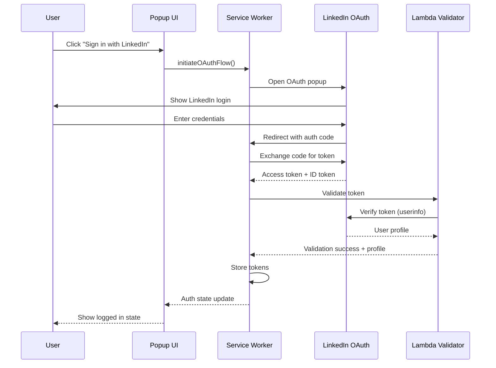

# 116 - Feature: Authenticate users via LinkedIn OAuth

<!-- Template Metadata
Last Updated: 2026-02-16
Updated By: Initial draft
Update Reason: New LLD for LinkedIn OAuth authentication
-->

## 1. Context & Goal
* **Issue:** #116
* **Objective:** Implement LinkedIn OAuth authentication to gate extension features and enable user identification.
* **Status:** Draft
* **Related Issues:** #25 (superseded), #88 (superseded)

### Open Questions

- [ ] Which Chrome extension architecture: Manifest V3 service worker or V2 background page?
- [ ] Should we use Chrome Identity API (simpler) or manual OAuth flow (more control)?
- [ ] What LinkedIn API scopes are needed? (`openid`, `profile`, `email`?)
- [ ] Where should tokens be stored: `chrome.storage.local` (encrypted) or `chrome.storage.session`?
- [ ] What is the Lambda endpoint URL for token validation?

## 2. Proposed Changes

*This section is the **source of truth** for implementation. Describe exactly what will be built.*

### 2.1 Files Changed

| File | Change Type | Description |
|------|-------------|-------------|
| `extension/src/auth/linkedin-oauth.ts` | Add | Core OAuth flow implementation |
| `extension/src/auth/token-manager.ts` | Add | Secure token storage and refresh logic |
| `extension/src/auth/auth-state.ts` | Add | Auth state management and event emitter |
| `extension/src/auth/types.ts` | Add | TypeScript interfaces for auth |
| `extension/src/background/service-worker.ts` | Modify | Add OAuth callback handler |
| `extension/src/popup/popup.html` | Modify | Add login button and auth status indicator |
| `extension/src/popup/popup.ts` | Modify | Wire up login/logout UI interactions |
| `extension/src/popup/popup.css` | Modify | Styles for auth UI components |
| `extension/manifest.json` | Modify | Add OAuth2 permissions and redirect URI |
| `lambda/auth-validator/handler.py` | Add | Lambda function for token validation |
| `lambda/auth-validator/requirements.txt` | Add | Lambda dependencies |
| `infrastructure/terraform/lambda-auth.tf` | Add | Terraform config for auth Lambda |

### 2.1.1 Path Validation (Mechanical - Auto-Checked)

*Issue #277: Before human or Gemini review, paths are verified programmatically.*

Mechanical validation automatically checks:
- All "Modify" files must exist in repository
- All "Delete" files must exist in repository
- All "Add" files must have existing parent directories
- No placeholder prefixes (`src/`, `lib/`, `app/`) unless directory exists

**If validation fails, the LLD is BLOCKED before reaching review.**

### 2.2 Dependencies

*New packages, APIs, or services required.*

```json
// extension package.json additions
{
  "dependencies": {
    "jwt-decode": "^4.0.0"
  }
}
```

```txt
# lambda/auth-validator/requirements.txt
boto3>=1.34.0
requests>=2.31.0
PyJWT>=2.8.0
cryptography>=42.0.0
```

**External Services:**
- LinkedIn OAuth 2.0 API (`https://www.linkedin.com/oauth/v2/`)
- AWS Lambda (token validation)
- AWS Secrets Manager (LinkedIn client secret)

### 2.3 Data Structures

```typescript
// Pseudocode - NOT implementation

interface LinkedInTokens {
  accessToken: string;        // LinkedIn access token (60-day validity)
  expiresAt: number;          // Unix timestamp of expiration
  refreshToken?: string;      // Optional refresh token (if available)
}

interface UserProfile {
  linkedInId: string;         // LinkedIn member ID (sub claim)
  email: string;              // User's email address
  displayName: string;        // Full name for UI display
  profilePicture?: string;    // Optional avatar URL
}

interface AuthState {
  isAuthenticated: boolean;
  user: UserProfile | null;
  tokens: LinkedInTokens | null;
  lastValidated: number;      // Unix timestamp of last backend validation
}

interface AuthError {
  code: 'OAUTH_FAILED' | 'TOKEN_EXPIRED' | 'VALIDATION_FAILED' | 'NETWORK_ERROR';
  message: string;
  recoverable: boolean;
}
```

### 2.4 Function Signatures

```typescript
// linkedin-oauth.ts
function initiateOAuthFlow(): Promise<LinkedInTokens>;
  """Launches OAuth flow via Chrome Identity API, returns tokens on success."""

function handleOAuthCallback(redirectUrl: string): Promise<LinkedInTokens>;
  """Parses OAuth callback URL, exchanges code for tokens."""

function exchangeCodeForTokens(authCode: string): Promise<LinkedInTokens>;
  """Exchanges authorization code for access token via LinkedIn API."""

// token-manager.ts
function storeTokens(tokens: LinkedInTokens): Promise<void>;
  """Securely stores tokens in chrome.storage.local."""

function getStoredTokens(): Promise<LinkedInTokens | null>;
  """Retrieves stored tokens, returns null if not found or corrupted."""

function clearTokens(): Promise<void>;
  """Removes all stored tokens (logout)."""

function refreshTokenIfNeeded(): Promise<LinkedInTokens>;
  """Checks expiration, refreshes if within 24h of expiry."""

function isTokenValid(tokens: LinkedInTokens): boolean;
  """Returns true if token hasn't expired."""

// auth-state.ts
function getAuthState(): Promise<AuthState>;
  """Returns current authentication state."""

function setAuthState(state: Partial<AuthState>): Promise<void>;
  """Updates auth state and notifies listeners."""

function subscribeToAuthChanges(callback: (state: AuthState) => void): () => void;
  """Subscribes to auth state changes, returns unsubscribe function."""

// lambda handler.py
def validate_token(event: dict, context: Any) -> dict:
    """Validates LinkedIn token and returns user profile."""

def fetch_linkedin_profile(access_token: str) -> dict:
    """Calls LinkedIn API to fetch user profile."""
```

### 2.5 Logic Flow (Pseudocode)

**OAuth Login Flow:**
```
1. User clicks "Sign in with LinkedIn" button
2. Call initiateOAuthFlow()
3. Chrome Identity API opens OAuth popup
4. User authenticates with LinkedIn
5. LinkedIn redirects to extension callback URL
6. handleOAuthCallback() extracts authorization code
7. exchangeCodeForTokens() sends code to LinkedIn token endpoint
8. IF token exchange succeeds THEN
   - Store tokens via storeTokens()
   - Fetch user profile from LinkedIn API
   - Update auth state via setAuthState()
   - UI updates to show authenticated state
   ELSE
   - Display error message
   - Log error for debugging
9. Close OAuth popup
```

**Token Refresh Flow:**
```
1. On extension startup OR before protected API call
2. Call getStoredTokens()
3. IF tokens exist THEN
   - Check if token expires within 24 hours
   - IF near expiration THEN
     - Call LinkedIn refresh endpoint (if refresh token available)
     - OR prompt user to re-authenticate
   - ELSE continue with current token
4. ELSE redirect to login
```

**Backend Token Validation Flow:**
```
1. Extension sends token to Lambda endpoint
2. Lambda calls LinkedIn /userinfo endpoint
3. IF LinkedIn returns 200 THEN
   - Return user profile + validation timestamp
   ELSE
   - Return error, extension clears stored tokens
```

### 2.6 Technical Approach

* **Module:** `extension/src/auth/`
* **Pattern:** Observer pattern for auth state changes, Promise-based async flow
* **Key Decisions:**
  - Use Chrome Identity API `launchWebAuthFlow` for OAuth (handles popup and redirect)
  - Store tokens in `chrome.storage.local` (persists across sessions)
  - Validate tokens server-side on initial load (prevents token theft)
  - LinkedIn OpenID Connect for standardized profile claims

### 2.7 Architecture Decisions

| Decision | Options Considered | Choice | Rationale |
|----------|-------------------|--------|-----------|
| OAuth Implementation | Chrome Identity API, Manual popup | Chrome Identity API | Built-in redirect handling, secure origin management |
| Token Storage | chrome.storage.local, chrome.storage.session, IndexedDB | chrome.storage.local | Persists across browser restarts, encrypted at rest on supported systems |
| Token Validation | Client-only (JWT verify), Backend validation | Backend validation | Tokens can be revoked, client can't be trusted |
| State Management | Redux, Zustand, Simple event emitter | Simple event emitter | Lightweight, minimal dependencies for extension |
| LinkedIn API Version | Legacy API, OpenID Connect | OpenID Connect | Modern standard, simpler profile access |

**Architectural Constraints:**
- Manifest V3 requirement: service workers are ephemeral, cannot hold state in memory
- LinkedIn OAuth requires HTTPS redirect URI (Chrome extension URLs satisfy this)
- Tokens must never be logged or sent to untrusted endpoints

## 3. Requirements

*What must be true when this is done. These become acceptance criteria.*

1. Users can click "Sign in with LinkedIn" and complete OAuth flow
2. Access tokens are securely stored and persist across browser sessions
3. UI displays user's name and profile picture when authenticated
4. Users can log out, clearing all stored credentials
5. Token expiration is handled gracefully (refresh or re-auth prompt)
6. Backend Lambda validates tokens before granting access to protected features
7. Auth state is reactive (UI updates automatically when state changes)
8. Error states are displayed with actionable messages

## 4. Alternatives Considered

| Option | Pros | Cons | Decision |
|--------|------|------|----------|
| Chrome Identity API | Built-in, handles redirects, secure | Less control over UI, limited customization | **Selected** |
| Manual OAuth popup | Full control, custom UI | More code, handle edge cases manually | Rejected |
| Cookie-based auth (Issue #25) | No OAuth complexity | Easy to bypass, privacy concerns | **Rejected** |
| Google OAuth | More users, simpler setup | Doesn't enforce "one account per person" | Rejected (future scope) |
| Email magic link | No third-party dependency | Disposable emails defeat purpose | Rejected |

**Rationale:** Chrome Identity API provides the best balance of security and simplicity. LinkedIn OAuth specifically because it enforces real identity (one account per person) better than email-based signup.

## 5. Data & Fixtures

### 5.1 Data Sources

| Attribute | Value |
|-----------|-------|
| Source | LinkedIn OAuth 2.0 API |
| Format | JSON (tokens), JWT (ID token) |
| Size | ~2KB per user session |
| Refresh | On user login, token refresh |
| Copyright/License | N/A (user's own data) |

### 5.2 Data Pipeline

```
LinkedIn OAuth ──authCode──► Extension ──code/token──► Lambda Validator
                                │                            │
                                ▼                            ▼
                         chrome.storage              LinkedIn /userinfo
                                │                            │
                                └────────profile─────────────┘
```

### 5.3 Test Fixtures

| Fixture | Source | Notes |
|---------|--------|-------|
| Mock LinkedIn token response | Generated | Valid JWT structure, fake signature |
| Mock userinfo response | Generated | LinkedIn-like profile structure |
| Expired token fixture | Generated | Token with past expiration |
| Invalid token fixture | Generated | Malformed/tampered token |

### 5.4 Deployment Pipeline

1. **Extension:** Changes bundled via webpack → Chrome Web Store review → Published
2. **Lambda:** Terraform apply → AWS deployment → API Gateway integration
3. **Secrets:** LinkedIn client_id/client_secret stored in AWS Secrets Manager

**External Data Note:** LinkedIn credentials require creating a LinkedIn App in their developer portal. This is a manual step before first deployment.

## 6. Diagram

### 6.1 Mermaid Quality Gate

Before finalizing any diagram, verify in [Mermaid Live Editor](https://mermaid.live) or GitHub preview:

- [x] **Simplicity:** Similar components collapsed (per 0006 §8.1)
- [x] **No touching:** All elements have visual separation (per 0006 §8.2)
- [x] **No hidden lines:** All arrows fully visible (per 0006 §8.3)
- [x] **Readable:** Labels not truncated, flow direction clear
- [ ] **Auto-inspected:** Agent rendered via mermaid.ink and viewed (per 0006 §8.5)

**Agent Auto-Inspection (MANDATORY):**

AI agents MUST render and view the diagram before committing:
1. Base64 encode diagram → fetch PNG from `https://mermaid.ink/img/{base64}`
2. Read the PNG file (multimodal inspection)
3. Document results below

**Auto-Inspection Results:**
```
- Touching elements: [ ] None / [ ] Found: ___
- Hidden lines: [ ] None / [ ] Found: ___
- Label readability: [ ] Pass / [ ] Issue: ___
- Flow clarity: [ ] Clear / [ ] Issue: ___
```

*Reference: [0006-mermaid-diagrams.md](0006-mermaid-diagrams.md)*

### 6.2 Diagram



## 7. Security & Safety Considerations

### 7.1 Security

| Concern | Mitigation | Status |
|---------|------------|--------|
| Token theft via XSS | Tokens stored in chrome.storage (inaccessible to content scripts) | Addressed |
| CSRF in OAuth flow | Use `state` parameter with CSPRNG value, verify on callback | Addressed |
| Man-in-the-middle | All communication over HTTPS, LinkedIn enforces TLS | Addressed |
| Token replay | Backend validation checks token with LinkedIn on each critical action | Addressed |
| Client secret exposure | Secret stored in AWS Secrets Manager, never in extension code | Addressed |
| Phishing via fake popup | Chrome Identity API ensures popup is on real linkedin.com | Addressed |

### 7.2 Safety

| Concern | Mitigation | Status |
|---------|------------|--------|
| Stale auth state | Auth state re-validated on extension startup | Addressed |
| Token storage corruption | Graceful fallback to logged-out state | Addressed |
| Lambda timeout | 10s timeout, user sees "validation in progress" state | Addressed |
| LinkedIn API downtime | Cached validation for 1 hour, degraded mode shows warning | Addressed |

**Fail Mode:** Fail Closed - If token validation fails or times out, user is treated as unauthenticated.

**Recovery Strategy:**
- Clear corrupted tokens and prompt re-login
- Exponential backoff on Lambda retry (1s, 2s, 4s, max 3 attempts)

## 8. Performance & Cost Considerations

### 8.1 Performance

| Metric | Budget | Approach |
|--------|--------|----------|
| OAuth flow latency | < 3s (after LinkedIn auth) | Direct API calls, no intermediaries |
| Token validation | < 500ms | Lambda in same region as users, warm starts |
| Auth state check | < 10ms | Local storage read, no network |
| Extension startup | < 100ms added | Async validation, non-blocking |

**Bottlenecks:**
- LinkedIn API rate limits (100 requests per day per user for /userinfo)
- Lambda cold starts (mitigated with provisioned concurrency if needed)

### 8.2 Cost Analysis

| Resource | Unit Cost | Estimated Usage | Monthly Cost |
|----------|-----------|-----------------|--------------|
| Lambda invocations | $0.20 per 1M | ~10K/month (1K users, 10 validations each) | $0.002 |
| Lambda duration | $0.0000166667/GB-s | 128MB × 0.2s × 10K = 256GB-s | $0.004 |
| Secrets Manager | $0.40/secret/month | 1 secret | $0.40 |
| API Gateway | $3.50 per 1M | ~10K/month | $0.035 |
| **Total** | | | **~$0.50/month** |

**Cost Controls:**
- [x] Budget alerts configured at $5 threshold (10x buffer)
- [x] Rate limiting prevents runaway costs (API Gateway throttle: 100 req/s)
- [x] No per-request costs from LinkedIn (included in free tier)

**Worst-Case Scenario:**
- 100x users (100K validations/month): ~$5/month
- 1000x users (1M validations/month): ~$50/month + potential LinkedIn rate limiting

## 9. Legal & Compliance

| Concern | Applies? | Mitigation |
|---------|----------|------------|
| PII/Personal Data | Yes | Only store LinkedIn ID, email, name; no sensitive data |
| Third-Party Licenses | Yes | LinkedIn API usage compliant with their developer agreement |
| Terms of Service | Yes | Auth use case explicitly allowed by LinkedIn ToS |
| Data Retention | Yes | Tokens auto-expire (60 days), users can delete via logout |
| Export Controls | No | No restricted data or algorithms |

**Data Classification:** Internal (user authentication tokens)

**Compliance Checklist:**
- [x] No PII stored without consent (OAuth grants explicit consent)
- [x] All third-party licenses compatible with project license (N/A - API usage)
- [x] External API usage compliant with provider ToS (LinkedIn Developer Agreement)
- [x] Data retention policy documented (tokens expire in 60 days)

## 10. Verification & Testing

*Ref: [0005-testing-strategy-and-protocols.md](0005-testing-strategy-and-protocols.md)*

**Testing Philosophy:** Strive for 100% automated test coverage. Manual tests are a last resort for scenarios that genuinely cannot be automated.

### 10.0 Test Plan (TDD - Complete Before Implementation)

**TDD Requirement:** Tests MUST be written and failing BEFORE implementation begins.

| Test ID | Test Description | Expected Behavior | Status |
|---------|------------------|-------------------|--------|
| T010 | test_initiate_oauth_returns_auth_url | Generates valid LinkedIn OAuth URL with state | RED |
| T020 | test_handle_callback_extracts_code | Parses auth code from redirect URL | RED |
| T030 | test_handle_callback_validates_state | Rejects callback with mismatched state | RED |
| T040 | test_exchange_code_returns_tokens | Returns token object on successful exchange | RED |
| T050 | test_store_tokens_persists | Tokens retrievable after storage | RED |
| T060 | test_token_expiration_check | Correctly identifies expired tokens | RED |
| T070 | test_logout_clears_all_data | No tokens or profile after logout | RED |
| T080 | test_lambda_validates_good_token | Returns profile for valid token | RED |
| T090 | test_lambda_rejects_bad_token | Returns 401 for invalid token | RED |
| T100 | test_auth_state_notifies_listeners | Subscribers receive state updates | RED |

**Coverage Target:** ≥95% for all new code

**TDD Checklist:**
- [ ] All tests written before implementation
- [ ] Tests currently RED (failing)
- [ ] Test IDs match scenario IDs in 10.1
- [ ] Test file created at: `tests/unit/test_linkedin_oauth.ts`, `tests/unit/test_lambda_auth.py`

### 10.1 Test Scenarios

| ID | Scenario | Type | Input | Expected Output | Pass Criteria |
|----|----------|------|-------|-----------------|---------------|
| 010 | Happy path OAuth flow | Auto | Valid auth code | Tokens stored, user profile loaded | Auth state shows authenticated |
| 020 | OAuth canceled by user | Auto | User closes popup | No error, remains logged out | Auth state unchanged |
| 030 | Invalid auth code | Auto | Malformed code | Error displayed | Error message shown, no tokens stored |
| 040 | Token expiration detection | Auto | Token expired 1 hour ago | Token invalid | `isTokenValid()` returns false |
| 050 | Token near expiration | Auto | Token expires in 1 hour | Refresh triggered | New token stored |
| 060 | Logout clears state | Auto | User clicks logout | All data cleared | No tokens, auth state reset |
| 070 | Lambda validates good token | Auto | Valid LinkedIn token | 200 + profile | Profile matches test fixture |
| 080 | Lambda rejects expired token | Auto | Expired token | 401 Unauthorized | Error response with code |
| 090 | Lambda handles LinkedIn API error | Auto | Token triggers 500 from LinkedIn | 502 Bad Gateway | Graceful error response |
| 100 | State change notification | Auto | Login completes | Listeners called | Callback invoked with new state |
| 110 | Corrupted storage recovery | Auto | Malformed JSON in storage | Fallback to logged out | No crash, clean state |
| 120 | CSRF state mismatch | Auto | Callback with wrong state | Error, no tokens | CSRF error logged |
| 130 | Live OAuth flow | Auto-Live | Real LinkedIn OAuth | Tokens received | Full E2E passes |

### 10.2 Test Commands

```bash
# Run extension unit tests (mocked)
npm run test:unit -- --testPathPattern=auth

# Run Lambda unit tests (mocked)
poetry run pytest lambda/auth-validator/tests/ -v

# Run live integration tests (requires LinkedIn test app)
npm run test:e2e -- --testPathPattern=auth

# Run all tests with coverage
npm run test:coverage
```

### 10.3 Manual Tests (Only If Unavoidable)

| ID | Scenario | Why Not Automated | Steps |
|----|----------|-------------------|-------|
| M01 | Visual verification of login button | CSS rendering variations across browsers | 1. Load popup 2. Verify button matches design mockup 3. Check hover/focus states |
| M02 | LinkedIn popup appearance | Chrome security prevents automated popup inspection | 1. Click login 2. Verify LinkedIn branding visible 3. Confirm no warnings |

*Full test results recorded in Implementation Report (0103) or Test Report (0113).*

## 11. Risks & Mitigations

| Risk | Impact | Likelihood | Mitigation |
|------|--------|------------|------------|
| LinkedIn API deprecation | High | Low | Abstract API calls behind interface, monitor LinkedIn changelog |
| LinkedIn rate limiting | Med | Med | Cache validation results for 1 hour, implement backoff |
| Chrome Identity API changes | High | Low | Manifest V3 is stable, monitor Chrome release notes |
| User privacy concerns | Med | Med | Clear privacy policy, minimal data collection |
| OAuth popup blocked | Med | Med | Detect blocker, show manual instructions |
| Token storage size limits | Low | Low | chrome.storage.local has 5MB limit, tokens are ~2KB |

## 12. Definition of Done

### Code
- [ ] Implementation complete and linted
- [ ] Code comments reference this LLD (#116)

### Tests
- [ ] All test scenarios pass (010-130)
- [ ] Test coverage ≥95% for `extension/src/auth/`
- [ ] Lambda coverage ≥95%

### Documentation
- [ ] LLD updated with any deviations
- [ ] Implementation Report (0103) completed
- [ ] API documentation for Lambda endpoint

### Review
- [ ] Code review completed
- [ ] User approval before closing issue

### 12.1 Traceability (Mechanical - Auto-Checked)

*Issue #277: Cross-references are verified programmatically.*

Mechanical validation automatically checks:
- Every file mentioned in this section must appear in Section 2.1
- Every risk mitigation in Section 11 should have a corresponding function in Section 2.4 (warning if not)

**File Traceability:**
| Definition of Done Item | Files from 2.1 |
|------------------------|----------------|
| OAuth implementation | `linkedin-oauth.ts`, `token-manager.ts` |
| Auth state management | `auth-state.ts`, `types.ts` |
| UI integration | `popup.html`, `popup.ts`, `popup.css` |
| Backend validation | `handler.py`, `requirements.txt` |
| Infrastructure | `lambda-auth.tf`, `manifest.json` |

**If files are missing from Section 2.1, the LLD is BLOCKED.**

---

## Appendix: Review Log

*Track all review feedback with timestamps and implementation status.*

### Review Summary

| Review | Date | Verdict | Key Issue |
|--------|------|---------|-----------|
| - | - | - | Awaiting initial review |

**Final Status:** PENDING
