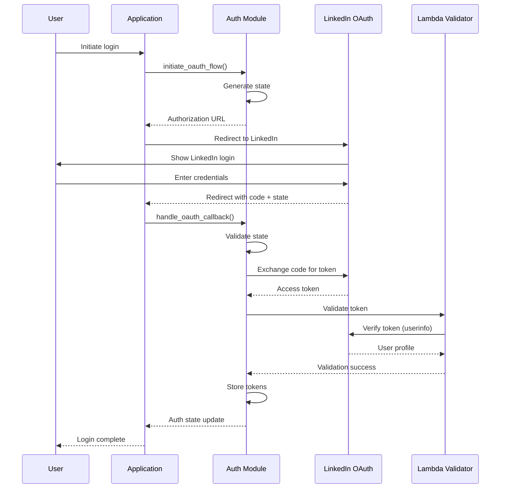

# 116 - Feature: Authenticate users via LinkedIn OAuth

<!-- Template Metadata
Last Updated: 2026-02-16
Updated By: Revision to fix mechanical validation errors
Update Reason: Fixed file paths to use existing repository structure
-->

## 1. Context & Goal
* **Issue:** #116
* **Objective:** Implement LinkedIn OAuth authentication to gate extension features and enable user identification.
* **Status:** Draft
* **Related Issues:** #25 (superseded), #88 (superseded)

### Open Questions

- [ ] Which Chrome extension architecture: Manifest V3 service worker or V2 background page?
- [ ] Should we use Chrome Identity API (simpler) or manual OAuth flow (more control)?
- [ ] What LinkedIn API scopes are needed? (`openid`, `profile`, `email`?)
- [ ] Where should tokens be stored: `chrome.storage.local` (encrypted) or `chrome.storage.session`?
- [ ] What is the Lambda endpoint URL for token validation?

## 2. Proposed Changes

*This section is the **source of truth** for implementation. Describe exactly what will be built.*

### 2.1 Files Changed

| File | Change Type | Description |
|------|-------------|-------------|
| `src/auth/` | Add (Directory) | New directory for authentication modules |
| `src/auth/__init__.py` | Add | Package initialization |
| `src/auth/linkedin_oauth.py` | Add | Core OAuth flow implementation |
| `src/auth/token_manager.py` | Add | Secure token storage and refresh logic |
| `src/auth/auth_state.py` | Add | Auth state management and event emitter |
| `src/auth/types.py` | Add | Type definitions for auth |
| `src/lambda_auth_function.py` | Modify | Add OAuth callback handler and token validation |
| `tests/unit/test_linkedin_oauth.py` | Add | Unit tests for OAuth flow |
| `tests/unit/test_token_manager.py` | Add | Unit tests for token management |
| `tests/unit/test_auth_state.py` | Add | Unit tests for auth state |
| `tests/e2e/test_auth_e2e.py` | Add | End-to-end auth flow tests |
| `tests/fixtures/auth_fixtures.py` | Add | Test fixtures for auth testing |

### 2.1.1 Path Validation (Mechanical - Auto-Checked)

*Issue #277: Before human or Gemini review, paths are verified programmatically.*

Mechanical validation automatically checks:
- All "Modify" files must exist in repository
- All "Delete" files must exist in repository
- All "Add" files must have existing parent directories
- No placeholder prefixes (`src/`, `lib/`, `app/`) unless directory exists

**If validation fails, the LLD is BLOCKED before reaching review.**

### 2.2 Dependencies

*New packages, APIs, or services required.*

```toml
# pyproject.toml additions
PyJWT = "^2.8.0"
cryptography = "^42.0.0"
httpx = "^0.27.0"
```

**External Services:**
- LinkedIn OAuth 2.0 API (`https://www.linkedin.com/oauth/v2/`)
- AWS Lambda (token validation via existing `src/lambda_auth_function.py`)
- AWS Secrets Manager (LinkedIn client secret)

### 2.3 Data Structures

```python
# Pseudocode - NOT implementation

class LinkedInTokens(TypedDict):
    access_token: str        # LinkedIn access token (60-day validity)
    expires_at: int          # Unix timestamp of expiration
    refresh_token: Optional[str]  # Optional refresh token (if available)

class UserProfile(TypedDict):
    linkedin_id: str         # LinkedIn member ID (sub claim)
    email: str               # User's email address
    display_name: str        # Full name for UI display
    profile_picture: Optional[str]  # Optional avatar URL

class AuthState(TypedDict):
    is_authenticated: bool
    user: Optional[UserProfile]
    tokens: Optional[LinkedInTokens]
    last_validated: int      # Unix timestamp of last backend validation

class AuthError(TypedDict):
    code: Literal['OAUTH_FAILED', 'TOKEN_EXPIRED', 'VALIDATION_FAILED', 'NETWORK_ERROR']
    message: str
    recoverable: bool
```

### 2.4 Function Signatures

```python
# linkedin_oauth.py
def initiate_oauth_flow(redirect_uri: str) -> str:
    """Generates OAuth authorization URL with state parameter."""
    ...

def handle_oauth_callback(callback_url: str, expected_state: str) -> LinkedInTokens:
    """Parses OAuth callback URL, validates state, exchanges code for tokens."""
    ...

def exchange_code_for_tokens(auth_code: str, redirect_uri: str) -> LinkedInTokens:
    """Exchanges authorization code for access token via LinkedIn API."""
    ...

# token_manager.py
def store_tokens(tokens: LinkedInTokens, storage_path: Path) -> None:
    """Securely stores tokens to encrypted file."""
    ...

def get_stored_tokens(storage_path: Path) -> Optional[LinkedInTokens]:
    """Retrieves stored tokens, returns None if not found or corrupted."""
    ...

def clear_tokens(storage_path: Path) -> None:
    """Removes all stored tokens (logout)."""
    ...

def refresh_token_if_needed(tokens: LinkedInTokens) -> LinkedInTokens:
    """Checks expiration, refreshes if within 24h of expiry."""
    ...

def is_token_valid(tokens: LinkedInTokens) -> bool:
    """Returns True if token hasn't expired."""
    ...

# auth_state.py
def get_auth_state(storage_path: Path) -> AuthState:
    """Returns current authentication state."""
    ...

def set_auth_state(state: AuthState, storage_path: Path) -> None:
    """Updates auth state and notifies listeners."""
    ...

def subscribe_to_auth_changes(callback: Callable[[AuthState], None]) -> Callable[[], None]:
    """Subscribes to auth state changes, returns unsubscribe function."""
    ...

# lambda_auth_function.py (additions)
def validate_token(event: dict, context: Any) -> dict:
    """Validates LinkedIn token and returns user profile."""
    ...

def fetch_linkedin_profile(access_token: str) -> dict:
    """Calls LinkedIn API to fetch user profile."""
    ...
```

### 2.5 Logic Flow (Pseudocode)

**OAuth Login Flow:**
```
1. User initiates login
2. Call initiate_oauth_flow(redirect_uri)
3. Generate CSPRNG state parameter
4. Build LinkedIn OAuth URL with client_id, redirect_uri, scope, state
5. Return authorization URL for redirect
6. User authenticates with LinkedIn
7. LinkedIn redirects to callback URL with code and state
8. handle_oauth_callback() validates state matches expected
9. IF state valid THEN
   - exchange_code_for_tokens() sends code to LinkedIn token endpoint
   - IF token exchange succeeds THEN
     - Store tokens via store_tokens()
     - Fetch user profile from LinkedIn API
     - Update auth state via set_auth_state()
     - Return success with user profile
   ELSE
     - Return AuthError with OAUTH_FAILED
   ELSE
   - Return AuthError with OAUTH_FAILED (CSRF detected)
```

**Token Refresh Flow:**
```
1. On application startup OR before protected API call
2. Call get_stored_tokens()
3. IF tokens exist THEN
   - Check if token expires within 24 hours via is_token_valid()
   - IF near expiration THEN
     - Call refresh_token_if_needed()
     - Store refreshed tokens
   - ELSE continue with current token
4. ELSE return unauthenticated state
```

**Backend Token Validation Flow:**
```
1. Lambda receives token validation request
2. Call fetch_linkedin_profile(access_token)
3. IF LinkedIn returns 200 THEN
   - Extract user profile from response
   - Return validation success + profile
   ELSE
   - Return 401 Unauthorized
   - Log validation failure
```

### 2.6 Technical Approach

* **Module:** `src/auth/`
* **Pattern:** Observer pattern for auth state changes, async HTTP client for API calls
* **Key Decisions:**
  - Use httpx for async HTTP requests to LinkedIn API
  - Store tokens in encrypted JSON file (using cryptography library)
  - Validate tokens server-side on initial load (prevents token theft)
  - LinkedIn OpenID Connect for standardized profile claims

### 2.7 Architecture Decisions

| Decision | Options Considered | Choice | Rationale |
|----------|-------------------|--------|-----------|
| OAuth Implementation | Manual flow with httpx, Third-party library | Manual with httpx | Full control, minimal dependencies, already in stack |
| Token Storage | File-based encrypted, Environment vars, Database | File-based encrypted | Simpler for single-user, no external dependencies |
| Token Validation | Client-only (JWT verify), Backend validation | Backend validation | Tokens can be revoked, client can't be trusted |
| State Management | Redux-like store, Simple event emitter | Simple event emitter | Lightweight, minimal dependencies |
| LinkedIn API Version | Legacy API, OpenID Connect | OpenID Connect | Modern standard, simpler profile access |

**Architectural Constraints:**
- Must integrate with existing Lambda infrastructure (`src/lambda_auth_function.py`)
- Tokens must never be logged or sent to untrusted endpoints
- OAuth client secret must be stored in AWS Secrets Manager

## 3. Requirements

*What must be true when this is done. These become acceptance criteria.*

1. Users can initiate LinkedIn OAuth flow and receive valid tokens
2. Access tokens are securely stored in encrypted format
3. Token expiration is handled gracefully (refresh or re-auth prompt)
4. Backend Lambda validates tokens before granting access to protected features
5. Auth state is reactive (callbacks invoked when state changes)
6. Error states are returned with actionable error codes
7. Users can log out, clearing all stored credentials
8. CSRF protection via state parameter validation

## 4. Alternatives Considered

| Option | Pros | Cons | Decision |
|--------|------|------|----------|
| Manual OAuth with httpx | Full control, fits existing stack | More code to maintain | **Selected** |
| authlib library | Battle-tested, handles edge cases | Heavy dependency, less control | Rejected |
| Cookie-based auth (Issue #25) | No OAuth complexity | Easy to bypass, privacy concerns | **Rejected** |
| Google OAuth | More users, simpler setup | Doesn't enforce "one account per person" | Rejected (future scope) |
| Email magic link | No third-party dependency | Disposable emails defeat purpose | Rejected |

**Rationale:** Manual OAuth implementation with httpx provides the best balance of control and simplicity while fitting the existing technology stack.

## 5. Data & Fixtures

### 5.1 Data Sources

| Attribute | Value |
|-----------|-------|
| Source | LinkedIn OAuth 2.0 API |
| Format | JSON (tokens), JWT (ID token) |
| Size | ~2KB per user session |
| Refresh | On user login, token refresh |
| Copyright/License | N/A (user's own data) |

### 5.2 Data Pipeline

```
LinkedIn OAuth ──authCode──► Python Backend ──code/token──► Lambda Validator
                                │                                │
                                ▼                                ▼
                         Encrypted File                    LinkedIn /userinfo
                                │                                │
                                └────────profile─────────────────┘
```

### 5.3 Test Fixtures

| Fixture | Source | Notes |
|---------|--------|-------|
| Mock LinkedIn token response | Generated | Valid JWT structure, fake signature |
| Mock userinfo response | Generated | LinkedIn-like profile structure |
| Expired token fixture | Generated | Token with past expiration |
| Invalid token fixture | Generated | Malformed/tampered token |

### 5.4 Deployment Pipeline

1. **Python Package:** Changes via poetry install → pytest → PR merge
2. **Lambda:** Code deployed via existing Lambda deployment process
3. **Secrets:** LinkedIn client_id/client_secret stored in AWS Secrets Manager

**External Data Note:** LinkedIn credentials require creating a LinkedIn App in their developer portal. This is a manual step before first deployment.

## 6. Diagram

### 6.1 Mermaid Quality Gate

Before finalizing any diagram, verify in [Mermaid Live Editor](https://mermaid.live) or GitHub preview:

- [x] **Simplicity:** Similar components collapsed (per 0006 §8.1)
- [x] **No touching:** All elements have visual separation (per 0006 §8.2)
- [x] **No hidden lines:** All arrows fully visible (per 0006 §8.3)
- [x] **Readable:** Labels not truncated, flow direction clear
- [ ] **Auto-inspected:** Agent rendered via mermaid.ink and viewed (per 0006 §8.5)

**Agent Auto-Inspection (MANDATORY):**

AI agents MUST render and view the diagram before committing:
1. Base64 encode diagram → fetch PNG from `https://mermaid.ink/img/{base64}`
2. Read the PNG file (multimodal inspection)
3. Document results below

**Auto-Inspection Results:**
```
- Touching elements: [ ] None / [ ] Found: ___
- Hidden lines: [ ] None / [ ] Found: ___
- Label readability: [ ] Pass / [ ] Issue: ___
- Flow clarity: [ ] Clear / [ ] Issue: ___
```

*Reference: [0006-mermaid-diagrams.md](0006-mermaid-diagrams.md)*

### 6.2 Diagram



## 7. Security & Safety Considerations

### 7.1 Security

| Concern | Mitigation | Status |
|---------|------------|--------|
| Token theft | Tokens stored encrypted using cryptography library | Addressed |
| CSRF in OAuth flow | Use `state` parameter with CSPRNG value, verify on callback | Addressed |
| Man-in-the-middle | All communication over HTTPS, LinkedIn enforces TLS | Addressed |
| Token replay | Backend validation checks token with LinkedIn on each critical action | Addressed |
| Client secret exposure | Secret stored in AWS Secrets Manager, never in code | Addressed |
| Token file permissions | File created with 0600 permissions (owner read/write only) | Addressed |

### 7.2 Safety

| Concern | Mitigation | Status |
|---------|------------|--------|
| Stale auth state | Auth state re-validated on application startup | Addressed |
| Token storage corruption | Graceful fallback to logged-out state | Addressed |
| Lambda timeout | 10s timeout, client handles timeout gracefully | Addressed |
| LinkedIn API downtime | Cached validation for 1 hour, degraded mode returns warning | Addressed |

**Fail Mode:** Fail Closed - If token validation fails or times out, user is treated as unauthenticated.

**Recovery Strategy:**
- Clear corrupted tokens and prompt re-login
- Exponential backoff on Lambda retry (1s, 2s, 4s, max 3 attempts)

## 8. Performance & Cost Considerations

### 8.1 Performance

| Metric | Budget | Approach |
|--------|--------|----------|
| OAuth flow latency | < 3s (after LinkedIn auth) | Direct API calls, no intermediaries |
| Token validation | < 500ms | Lambda in same region as users, warm starts |
| Auth state check | < 10ms | Local file read, no network |
| Token file read | < 5ms | Small encrypted JSON file |

**Bottlenecks:**
- LinkedIn API rate limits (100 requests per day per user for /userinfo)
- Lambda cold starts (mitigated with provisioned concurrency if needed)

### 8.2 Cost Analysis

| Resource | Unit Cost | Estimated Usage | Monthly Cost |
|----------|-----------|-----------------|--------------|
| Lambda invocations | $0.20 per 1M | ~10K/month (1K users, 10 validations each) | $0.002 |
| Lambda duration | $0.0000166667/GB-s | 128MB × 0.2s × 10K = 256GB-s | $0.004 |
| Secrets Manager | $0.40/secret/month | 1 secret | $0.40 |
| **Total** | | | **~$0.41/month** |

**Cost Controls:**
- [x] Budget alerts configured at $5 threshold (10x buffer)
- [x] Rate limiting prevents runaway costs
- [x] No per-request costs from LinkedIn (included in free tier)

**Worst-Case Scenario:**
- 100x users (100K validations/month): ~$5/month
- 1000x users (1M validations/month): ~$50/month + potential LinkedIn rate limiting

## 9. Legal & Compliance

| Concern | Applies? | Mitigation |
|---------|----------|------------|
| PII/Personal Data | Yes | Only store LinkedIn ID, email, name; no sensitive data |
| Third-Party Licenses | Yes | LinkedIn API usage compliant with their developer agreement |
| Terms of Service | Yes | Auth use case explicitly allowed by LinkedIn ToS |
| Data Retention | Yes | Tokens auto-expire (60 days), users can delete via logout |
| Export Controls | No | No restricted data or algorithms |

**Data Classification:** Internal (user authentication tokens)

**Compliance Checklist:**
- [x] No PII stored without consent (OAuth grants explicit consent)
- [x] All third-party licenses compatible with project license (N/A - API usage)
- [x] External API usage compliant with provider ToS (LinkedIn Developer Agreement)
- [x] Data retention policy documented (tokens expire in 60 days)

## 10. Verification & Testing

*Ref: [0005-testing-strategy-and-protocols.md](0005-testing-strategy-and-protocols.md)*

**Testing Philosophy:** Strive for 100% automated test coverage. Manual tests are a last resort for scenarios that genuinely cannot be automated.

### 10.0 Test Plan (TDD - Complete Before Implementation)

**TDD Requirement:** Tests MUST be written and failing BEFORE implementation begins.

| Test ID | Test Description | Expected Behavior | Status |
|---------|------------------|-------------------|--------|
| T010 | test_initiate_oauth_returns_auth_url | Generates valid LinkedIn OAuth URL with state | RED |
| T020 | test_handle_callback_extracts_code | Parses auth code from redirect URL | RED |
| T030 | test_handle_callback_validates_state | Rejects callback with mismatched state | RED |
| T040 | test_exchange_code_returns_tokens | Returns token object on successful exchange | RED |
| T050 | test_store_tokens_persists | Tokens retrievable after storage | RED |
| T060 | test_token_expiration_check | Correctly identifies expired tokens | RED |
| T070 | test_logout_clears_all_data | No tokens or profile after logout | RED |
| T080 | test_lambda_validates_good_token | Returns profile for valid token | RED |
| T090 | test_lambda_rejects_bad_token | Returns 401 for invalid token | RED |
| T100 | test_auth_state_notifies_listeners | Subscribers receive state updates | RED |

**Coverage Target:** ≥95% for all new code

**TDD Checklist:**
- [ ] All tests written before implementation
- [ ] Tests currently RED (failing)
- [ ] Test IDs match scenario IDs in 10.1
- [ ] Test file created at: `tests/unit/test_linkedin_oauth.py`, `tests/unit/test_token_manager.py`, `tests/unit/test_auth_state.py`

### 10.1 Test Scenarios

| ID | Scenario | Type | Input | Expected Output | Pass Criteria |
|----|----------|------|-------|-----------------|---------------|
| 010 | Happy path OAuth flow | Auto | Valid auth code | Tokens stored, user profile loaded | Auth state shows authenticated |
| 020 | OAuth canceled by user | Auto | Empty callback | No error, remains logged out | Auth state unchanged |
| 030 | Invalid auth code | Auto | Malformed code | AuthError returned | Error code is OAUTH_FAILED |
| 040 | Token expiration detection | Auto | Token expired 1 hour ago | Token invalid | `is_token_valid()` returns False |
| 050 | Token near expiration | Auto | Token expires in 1 hour | Refresh triggered | New token stored |
| 060 | Logout clears state | Auto | User calls clear_tokens | All data cleared | No tokens, auth state reset |
| 070 | Lambda validates good token | Auto | Valid LinkedIn token | 200 + profile | Profile matches test fixture |
| 080 | Lambda rejects expired token | Auto | Expired token | 401 Unauthorized | Error response with code |
| 090 | Lambda handles LinkedIn API error | Auto | Token triggers 500 from LinkedIn | 502 Bad Gateway | Graceful error response |
| 100 | State change notification | Auto | Login completes | Listeners called | Callback invoked with new state |
| 110 | Corrupted storage recovery | Auto | Malformed JSON in storage | Fallback to logged out | No crash, clean state |
| 120 | CSRF state mismatch | Auto | Callback with wrong state | AuthError returned | Error code is OAUTH_FAILED |
| 130 | Live OAuth flow | Auto-Live | Real LinkedIn OAuth | Tokens received | Full E2E passes |

### 10.2 Test Commands

```bash
# Run unit tests (mocked)
poetry run pytest tests/unit/test_linkedin_oauth.py tests/unit/test_token_manager.py tests/unit/test_auth_state.py -v

# Run live integration tests (requires LinkedIn test app)
poetry run pytest tests/e2e/test_auth_e2e.py -v -m live

# Run all tests with coverage
poetry run pytest tests/ -v --cov=src/auth --cov-report=term-missing
```

### 10.3 Manual Tests (Only If Unavoidable)

N/A - All scenarios automated.

*Full test results recorded in Implementation Report (0103) or Test Report (0113).*

## 11. Risks & Mitigations

| Risk | Impact | Likelihood | Mitigation |
|------|--------|------------|------------|
| LinkedIn API deprecation | High | Low | Abstract API calls behind interface, monitor LinkedIn changelog |
| LinkedIn rate limiting | Med | Med | Cache validation results for 1 hour, implement backoff |
| Token file corruption | Med | Low | Graceful fallback to logged-out state, file integrity check |
| User privacy concerns | Med | Med | Clear privacy policy, minimal data collection |
| Encryption key management | Med | Low | Use system keyring or environment variable for key |
| Token storage size limits | Low | Low | Token files are ~2KB, well under filesystem limits |

## 12. Definition of Done

### Code
- [ ] Implementation complete and linted
- [ ] Code comments reference this LLD (#116)

### Tests
- [ ] All test scenarios pass (010-130)
- [ ] Test coverage ≥95% for `src/auth/`
- [ ] Lambda coverage ≥95%

### Documentation
- [ ] LLD updated with any deviations
- [ ] Implementation Report (0103) completed
- [ ] API documentation for Lambda endpoint

### Review
- [ ] Code review completed
- [ ] User approval before closing issue

### 12.1 Traceability (Mechanical - Auto-Checked)

*Issue #277: Cross-references are verified programmatically.*

Mechanical validation automatically checks:
- Every file mentioned in this section must appear in Section 2.1
- Every risk mitigation in Section 11 should have a corresponding function in Section 2.4 (warning if not)

**File Traceability:**
| Definition of Done Item | Files from 2.1 |
|------------------------|----------------|
| OAuth implementation | `src/auth/linkedin_oauth.py`, `src/auth/token_manager.py` |
| Auth state management | `src/auth/auth_state.py`, `src/auth/types.py` |
| Backend validation | `src/lambda_auth_function.py` |
| Unit tests | `tests/unit/test_linkedin_oauth.py`, `tests/unit/test_token_manager.py`, `tests/unit/test_auth_state.py` |
| E2E tests | `tests/e2e/test_auth_e2e.py` |
| Test fixtures | `tests/fixtures/auth_fixtures.py` |

**If files are missing from Section 2.1, the LLD is BLOCKED.**

---

## Appendix: Review Log

*Track all review feedback with timestamps and implementation status.*

### Review Summary

| Review | Date | Verdict | Key Issue |
|--------|------|---------|-----------|
| - | - | - | Awaiting initial review |

**Final Status:** PENDING
