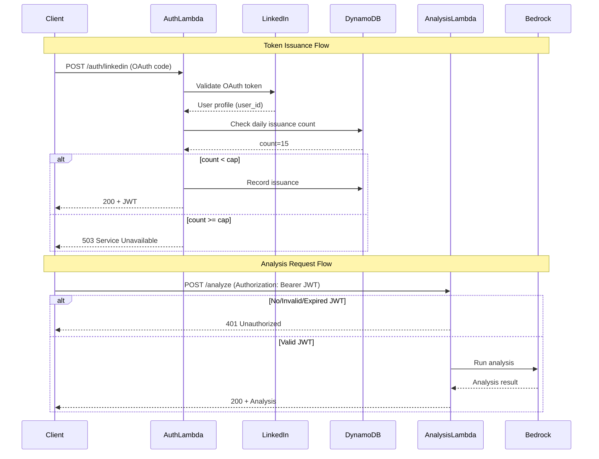

# 1341 - Feature: Add JWT authentication to analysis endpoint with daily token cap

<!-- Template Metadata
Last Updated: 2026-02-02
Updated By: Issue #117 fix
Update Reason: Moved Verification & Testing to Section 10 (was Section 11) to match 0702c review prompt and testing workflow expectations
Previous: Added sections based on 80 blocking issues from 164 governance verdicts (2026-02-01)
-->

## 1. Context & Goal
* **Issue:** #341
* **Objective:** Secure the analysis Lambda with JWT authentication and implement daily token issuance caps to prevent abuse and control costs
* **Status:** Draft
* **Related Issues:** N/A

### Open Questions
*Questions that need clarification before or during implementation. Remove when resolved.*

- [ ] What is the expected daily user base? (affects cap default of 20)
- [ ] Should the admin CLI tool be a Lambda or local script?
- [ ] Is there a preferred JWT library already in use in the codebase?
- [ ] Should token cap be per-user or global across all users?

## 2. Proposed Changes

*This section is the **source of truth** for implementation. Describe exactly what will be built.*

### 2.1 Files Changed

| File | Change Type | Description |
|------|-------------|-------------|
| `src/lambdas/auth/handler.py` | Modify | Add JWT issuance after LinkedIn validation |
| `src/lambdas/auth/jwt_service.py` | Add | JWT generation and validation utilities |
| `src/lambdas/auth/token_cap.py` | Add | Daily token cap tracking and enforcement |
| `src/lambdas/analysis/handler.py` | Modify | Add JWT validation middleware |
| `src/lambdas/analysis/auth_middleware.py` | Add | JWT validation decorator/middleware |
| `src/shared/models/auth.py` | Add | Auth-related data structures |
| `src/admin/adjust_cap.py` | Add | CLI tool for adjusting daily token cap |
| `infrastructure/dynamodb.tf` | Modify | Add token_issuance table for cap tracking |
| `tests/test_jwt_service.py` | Add | Unit tests for JWT operations |
| `tests/test_token_cap.py` | Add | Unit tests for token cap logic |
| `tests/test_auth_middleware.py` | Add | Integration tests for auth flow |

### 2.2 Dependencies

*New packages, APIs, or services required.*

```toml
# pyproject.toml additions
PyJWT = "^2.8.0"
cryptography = "^41.0.0"  # Required for RS256 signing
```

### 2.3 Data Structures

```python
# Pseudocode - NOT implementation
class JWTPayload(TypedDict):
    user_id: str       # LinkedIn user ID
    exp: int           # Expiration timestamp (24h from issuance)
    iat: int           # Issued at timestamp
    jti: str           # Unique token identifier

class TokenIssuanceRecord(TypedDict):
    date: str          # YYYY-MM-DD partition key
    user_id: str       # Sort key
    issued_at: str     # ISO timestamp
    jti: str           # Token identifier for audit

class TokenCapConfig(TypedDict):
    daily_cap: int     # Maximum tokens per day (default: 20)
    updated_at: str    # Last modification timestamp
    updated_by: str    # Admin who made the change

class AuthFailureLog(TypedDict):
    timestamp: str     # ISO timestamp
    action: str        # "auth_failed"
    reason: str        # "missing_header" | "invalid_token" | "expired_token" | "cap_exceeded"
    user_id: str | None  # If extractable from token
    request_id: str    # Lambda request ID for correlation
```

### 2.4 Function Signatures

```python
# src/lambdas/auth/jwt_service.py
def generate_jwt(user_id: str, secret_key: str, expiry_hours: int = 24) -> str:
    """Generate a signed JWT with user_id and 24h expiration."""
    ...

def validate_jwt(token: str, secret_key: str) -> JWTPayload | None:
    """Validate JWT signature and expiration. Returns payload or None if invalid."""
    ...

def decode_jwt_unsafe(token: str) -> JWTPayload | None:
    """Decode JWT without validation for logging purposes."""
    ...

# src/lambdas/auth/token_cap.py
def get_daily_issuance_count(date: str) -> int:
    """Get count of tokens issued on given date."""
    ...

def increment_issuance_count(user_id: str, jti: str) -> bool:
    """Record token issuance. Returns False if cap exceeded."""
    ...

def get_current_cap() -> int:
    """Get current daily token cap from config."""
    ...

def set_daily_cap(new_cap: int, admin_id: str) -> None:
    """Update daily token cap. Requires admin credentials."""
    ...

# src/lambdas/analysis/auth_middleware.py
def require_auth(handler: Callable) -> Callable:
    """Decorator that validates JWT before allowing handler execution."""
    ...

def extract_token(event: dict) -> str | None:
    """Extract Bearer token from Authorization header."""
    ...

def log_auth_failure(reason: str, user_id: str | None, request_id: str) -> None:
    """Log authentication failure with structured fields."""
    ...
```

### 2.5 Logic Flow (Pseudocode)

**Auth Lambda - Token Issuance:**
```
1. Receive LinkedIn OAuth callback
2. Validate LinkedIn token with LinkedIn API
3. IF validation fails THEN
   - Return 401 with error
4. Extract user_id from LinkedIn response
5. Check daily issuance count
6. IF count >= daily_cap THEN
   - Log auth_failed with reason="cap_exceeded"
   - Return 503 Service Unavailable
7. Generate JWT with user_id, exp=now+24h, jti=uuid
8. Record issuance in DynamoDB
9. Return 200 with JWT in response body
```

**Analysis Lambda - Token Validation:**
```
1. Extract Authorization header
2. IF header missing THEN
   - Log auth_failed with reason="missing_header"
   - Return 401 Unauthorized
3. Parse Bearer token from header
4. Validate JWT signature and expiration
5. IF invalid signature THEN
   - Log auth_failed with reason="invalid_token"
   - Return 401 Unauthorized
6. IF expired THEN
   - Log auth_failed with reason="expired_token"
   - Return 401 Unauthorized
7. Extract user_id from payload
8. Proceed to analysis handler with user_id
```

**Admin CLI - Cap Adjustment:**
```
1. Parse command line arguments (new_cap, admin_id)
2. Validate admin credentials
3. IF new_cap < 1 THEN
   - Error: cap must be positive
4. Update cap in DynamoDB config table
5. Log cap change with timestamp and admin_id
6. Print confirmation
```

### 2.6 Technical Approach

* **Module:** `src/lambdas/auth/`, `src/lambdas/analysis/`
* **Pattern:** Middleware/Decorator pattern for auth validation
* **Key Decisions:**
  - Use HS256 symmetric signing (simpler key management for Lambda)
  - Store JWT secret in AWS Secrets Manager
  - Use DynamoDB for token cap tracking (serverless, scalable)
  - Atomic counter for cap enforcement to prevent race conditions

### 2.7 Architecture Decisions

| Decision | Options Considered | Choice | Rationale |
|----------|-------------------|--------|-----------|
| JWT Signing Algorithm | HS256 (symmetric), RS256 (asymmetric) | HS256 | Simpler key management; both Lambdas can share secret via Secrets Manager |
| Token Cap Storage | DynamoDB, Redis, Parameter Store | DynamoDB | Already in stack, supports atomic counters, serverless |
| Cap Scope | Per-user daily, Global daily | Global daily | Simpler implementation; prevents total cost overrun regardless of user distribution |
| Secret Storage | Environment variable, Secrets Manager, Parameter Store | Secrets Manager | Automatic rotation support, audit logging, encryption at rest |
| Token Validation | Per-request LinkedIn call, Local JWT validation | Local JWT | Reduces latency and LinkedIn API dependency; JWT is self-contained |

**Architectural Constraints:**
- Must integrate with existing Lambda deployment pipeline
- Cannot add external services beyond AWS (no Auth0, Cognito, etc.)
- JWT secret must not be committed to repository
- Must maintain backward compatibility during rollout (feature flag)

## 3. Requirements

*What must be true when this is done. These become acceptance criteria.*

1. Request without Authorization header returns 401 Unauthorized
2. Request with invalid JWT returns 401 Unauthorized
3. Request with expired JWT returns 401 Unauthorized
4. Request with valid JWT proceeds to analysis with user_id extracted
5. User receives JWT after successful LinkedIn login
6. JWT contains user_id and exp (24h from issuance)
7. 21st token issuance of the day receives 503 Service Unavailable
8. Admin can adjust daily cap via CLI tool without redeployment
9. All auth failures logged with action: auth_failed and reason field
10. JWT secret stored securely in AWS Secrets Manager

## 4. Alternatives Considered

| Option | Pros | Cons | Decision |
|--------|------|------|----------|
| JWT with local validation | Fast, no external calls, self-contained | Requires secret management, can't revoke individual tokens | **Selected** |
| LinkedIn token validation per request | Simpler, uses existing OAuth | High latency, LinkedIn rate limits, external dependency | Rejected |
| AWS Cognito | Managed service, built-in features | Additional cost, complexity, vendor lock-in | Rejected |
| API Gateway authorizer | Native AWS integration | Less control over error responses, harder to test locally | Rejected |

**Rationale:** JWT with local validation provides the best balance of security, performance, and implementation simplicity. The 24h expiration mitigates the inability to revoke individual tokens, and the daily cap provides additional protection.

## 5. Data & Fixtures

### 5.1 Data Sources

| Attribute | Value |
|-----------|-------|
| Source | LinkedIn OAuth API (existing), DynamoDB (new tables) |
| Format | JSON (LinkedIn response), DynamoDB items |
| Size | ~1KB per token record, ~100 bytes per cap config |
| Refresh | Real-time (tokens), On-demand (cap config) |
| Copyright/License | N/A - internal data |

### 5.2 Data Pipeline

```
LinkedIn OAuth ──callback──► Auth Lambda ──validate──► LinkedIn API
                                 │
                                 ▼
                           Check Cap ◄──read──► DynamoDB (token_issuance)
                                 │
                                 ▼
                           Generate JWT ──store──► DynamoDB (token_issuance)
                                 │
                                 ▼
                           Return JWT to Client

Client Request ──header──► Analysis Lambda ──validate──► JWT (local)
                                 │
                                 ▼
                           Extract user_id
                                 │
                                 ▼
                           Proceed to Analysis
```

### 5.3 Test Fixtures

| Fixture | Source | Notes |
|---------|--------|-------|
| Valid JWT | Generated | Created with test secret, valid expiration |
| Expired JWT | Generated | Created with past expiration date |
| Malformed JWT | Hardcoded | Invalid base64, missing segments |
| Mock LinkedIn response | Hardcoded | Sanitized user profile data |
| DynamoDB mock | moto library | In-memory DynamoDB for testing |

### 5.4 Deployment Pipeline

1. **Dev:** Local testing with mocked DynamoDB and test JWT secret
2. **Test:** Deployed to test stage with isolated DynamoDB tables and test secret
3. **Production:** Deployed with production secret in Secrets Manager, production DynamoDB

**External Dependencies:** LinkedIn OAuth (existing) - no new external services required.

## 6. Diagram

### 6.1 Mermaid Quality Gate

Before finalizing any diagram, verify in [Mermaid Live Editor](https://mermaid.live) or GitHub preview:

- [x] **Simplicity:** Similar components collapsed (per 0006 §8.1)
- [x] **No touching:** All elements have visual separation (per 0006 §8.2)
- [x] **No hidden lines:** All arrows fully visible (per 0006 §8.3)
- [x] **Readable:** Labels not truncated, flow direction clear
- [ ] **Auto-inspected:** Agent rendered via mermaid.ink and viewed (per 0006 §8.5)

**Auto-Inspection Results:**
```
- Touching elements: [ ] None / [ ] Found: ___
- Hidden lines: [ ] None / [ ] Found: ___
- Label readability: [ ] Pass / [ ] Issue: ___
- Flow clarity: [ ] Clear / [ ] Issue: ___
```

*Reference: [0006-mermaid-diagrams.md](0006-mermaid-diagrams.md)*

### 6.2 Diagram



## 7. Security & Safety Considerations

### 7.1 Security

| Concern | Mitigation | Status |
|---------|------------|--------|
| JWT secret exposure | Store in AWS Secrets Manager with rotation policy | TODO |
| Token replay attacks | Include jti (unique ID) and short 24h expiration | Addressed |
| User impersonation | JWT signature validation prevents tampering | Addressed |
| Brute force on JWT | HS256 with 256-bit secret is computationally infeasible | Addressed |
| Auth bypass via direct API | All analysis requests require valid JWT | Addressed |
| Timing attacks on validation | Use constant-time comparison for signature verification (PyJWT handles this) | Addressed |
| Log injection | Sanitize user_id before logging | TODO |

### 7.2 Safety

| Concern | Mitigation | Status |
|---------|------------|--------|
| DynamoDB write failures | Fail closed - deny token if can't record issuance | Addressed |
| Secrets Manager unavailable | Cache secret in Lambda memory with TTL; fail closed if unavailable | TODO |
| Race condition on cap | Use DynamoDB atomic counter (ADD operation) | Addressed |
| Runaway token issuance | Daily cap enforced at database level | Addressed |
| Cap misconfiguration | CLI validates cap > 0; audit log all changes | Addressed |

**Fail Mode:** Fail Closed - If any auth component fails, deny access. This prevents unauthorized access during outages.

**Recovery Strategy:**
1. If Secrets Manager unavailable: Lambda retries with exponential backoff, then fails request
2. If DynamoDB unavailable: Return 503, requests retry naturally
3. If cap set too low: Admin CLI can increase immediately without deployment

## 8. Performance & Cost Considerations

### 8.1 Performance

| Metric | Budget | Approach |
|--------|--------|----------|
| Auth Lambda latency | < 500ms (excluding LinkedIn) | JWT generation is ~1ms; DynamoDB single-digit ms |
| Analysis auth overhead | < 10ms | Local JWT validation, no network calls |
| DynamoDB read latency | < 5ms | On-demand capacity, single-item reads |

**Bottlenecks:**
- LinkedIn API call in auth flow (existing, not new)
- First request after cold start (Lambda init)

### 8.2 Cost Analysis

| Resource | Unit Cost | Estimated Usage | Monthly Cost |
|----------|-----------|-----------------|--------------|
| DynamoDB reads | $0.25 per 1M reads | 20 tokens/day × 30 = 600 reads | ~$0.00 |
| DynamoDB writes | $1.25 per 1M writes | 20 tokens/day × 30 = 600 writes | ~$0.00 |
| DynamoDB storage | $0.25 per GB | < 1MB/month | ~$0.00 |
| Secrets Manager | $0.40 per secret/month | 1 secret | $0.40 |
| Lambda (auth additions) | Existing allocation | Negligible increase | ~$0.00 |

**Cost Controls:**
- [x] Daily token cap prevents runaway Bedrock costs
- [x] No additional external API calls (LinkedIn call already existed)
- [ ] Budget alerts configured at $10 threshold

**Worst-Case Scenario:**
- 10x usage (200 tokens/day): Still under $1/month for auth infrastructure
- 100x usage (2000 tokens/day): ~$2/month for auth; Bedrock costs are the concern, hence the cap

## 9. Legal & Compliance

| Concern | Applies? | Mitigation |
|---------|----------|------------|
| PII/Personal Data | Yes | user_id is LinkedIn ID (pseudonymous); no names/emails stored in JWT or cap tracking |
| Third-Party Licenses | Yes | PyJWT is MIT licensed (compatible) |
| Terms of Service | Yes | LinkedIn OAuth usage follows existing approved integration |
| Data Retention | Yes | Token issuance records auto-expire after 30 days (DynamoDB TTL) |
| Export Controls | No | No restricted algorithms or data |

**Data Classification:** Internal - Token issuance records contain no PII beyond pseudonymous IDs

**Compliance Checklist:**
- [x] No PII stored without consent (using pseudonymous LinkedIn ID)
- [x] All third-party licenses compatible with project license
- [x] External API usage compliant with provider ToS
- [ ] Data retention policy documented (30-day TTL on issuance records)

## 10. Verification & Testing

*Ref: [0005-testing-strategy-and-protocols.md](0005-testing-strategy-and-protocols.md)*

**Testing Philosophy:** All scenarios automated. JWT operations and auth flows are fully testable with mocks.

### 10.1 Test Scenarios

| ID | Scenario | Type | Input | Expected Output | Pass Criteria |
|----|----------|------|-------|-----------------|---------------|
| 010 | Missing Authorization header | Auto | Request without header | 401 + {"error": "Unauthorized"} | Status 401, log with reason="missing_header" |
| 020 | Malformed Authorization header | Auto | "Authorization: NotBearer xyz" | 401 + {"error": "Unauthorized"} | Status 401, log with reason="invalid_token" |
| 030 | Invalid JWT signature | Auto | JWT signed with wrong key | 401 + {"error": "Unauthorized"} | Status 401, log with reason="invalid_token" |
| 040 | Expired JWT | Auto | JWT with exp in past | 401 + {"error": "Unauthorized"} | Status 401, log with reason="expired_token" |
| 050 | Valid JWT proceeds to analysis | Auto | Valid JWT with user_id="123" | Analysis runs with user_id="123" | Handler receives correct user_id |
| 060 | JWT issued after LinkedIn success | Auto | Valid LinkedIn OAuth code | 200 + {"token": "eyJ..."} | JWT contains user_id, exp ~24h future |
| 070 | Token cap at limit (20) | Auto | 21st issuance request | 503 + {"error": "Service Unavailable"} | Status 503, log with reason="cap_exceeded" |
| 080 | Token cap under limit | Auto | 15th issuance request | 200 + {"token": "eyJ..."} | Token issued, count incremented |
| 090 | Admin adjusts cap | Auto | CLI: adjust_cap --cap 50 | Cap updated in DynamoDB | get_current_cap() returns 50 |
| 100 | Cap reset at midnight | Auto | Requests across day boundary | New day starts at 0 | 21st token on new day succeeds |
| 110 | Concurrent token issuance (race) | Auto | 5 simultaneous requests at cap=3 | Max 3 succeed | Exactly 3 tokens issued |
| 120 | JWT payload contains required fields | Auto | Generated JWT | Payload has user_id, exp, iat, jti | All fields present and valid |

### 10.2 Test Commands

```bash
# Run all automated tests
poetry run pytest tests/test_jwt_service.py tests/test_token_cap.py tests/test_auth_middleware.py -v

# Run only fast/mocked tests (exclude live)
poetry run pytest tests/ -v -m "not live" -k "jwt or auth or cap"

# Run live integration tests (requires AWS credentials)
poetry run pytest tests/test_auth_integration.py -v -m live

# Test specific scenario
poetry run pytest tests/test_auth_middleware.py::test_missing_auth_header -v
```

### 10.3 Manual Tests (Only If Unavoidable)

N/A - All scenarios automated. JWT operations, DynamoDB interactions (via moto), and Lambda handlers can all be tested programmatically.

## 11. Risks & Mitigations

| Risk | Impact | Likelihood | Mitigation |
|------|--------|------------|------------|
| JWT secret leaked | High | Low | Secrets Manager with rotation; immediate rotation capability |
| Daily cap too restrictive | Med | Med | Admin CLI allows immediate adjustment; start with cap=20, monitor usage |
| LinkedIn OAuth changes | High | Low | Existing risk; not introduced by this change |
| DynamoDB throttling | Med | Low | On-demand capacity auto-scales; cap limits write volume |
| Clock skew causes early expiration | Low | Low | Use 24h expiry with 5-minute leeway in validation |
| Feature flag rollout issues | Med | Med | Gradual rollout; monitor 401 rates; quick rollback capability |

## 12. Definition of Done

### Code
- [ ] Implementation complete and linted
- [ ] Code comments reference this LLD (#341)
- [ ] JWT secret created in Secrets Manager
- [ ] DynamoDB table created for token issuance tracking

### Tests
- [ ] All test scenarios pass (010-120)
- [ ] Test coverage ≥ 90% for new auth modules
- [ ] Integration test with mocked LinkedIn passes

### Documentation
- [ ] LLD updated with any deviations
- [ ] Implementation Report (0103) completed
- [ ] Admin CLI usage documented in README
- [ ] Runbook updated with auth troubleshooting steps

### Review
- [ ] Code review completed
- [ ] Security review of JWT implementation
- [ ] User approval before closing issue

---

## Appendix: Review Log

*Track all review feedback with timestamps and implementation status.*

### Review Summary

| Review | Date | Verdict | Key Issue |
|--------|------|---------|-----------|
| - | - | - | Awaiting initial review |

**Final Status:** PENDING
<!-- Note: This field is auto-updated to APPROVED by the workflow when finalized -->
