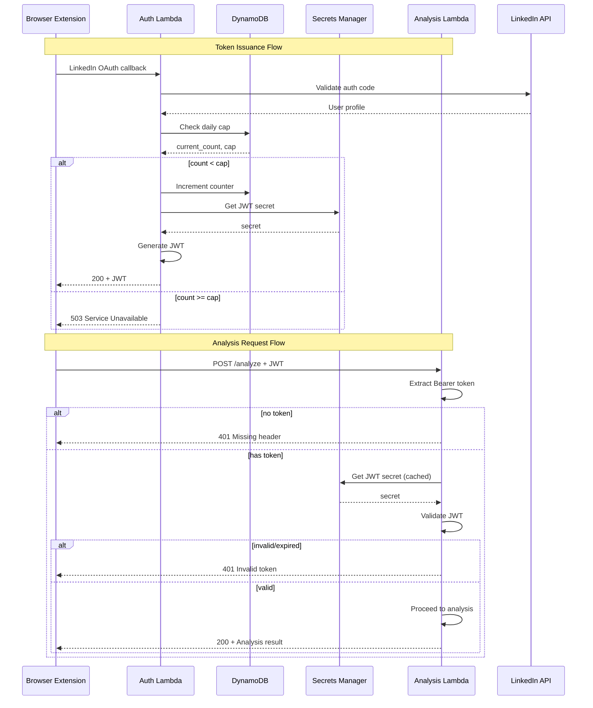

# 341 - Feature: Add JWT authentication to analysis endpoint with daily token cap

<!-- Template Metadata
Last Updated: 2026-02-16
Updated By: Issue #341 LLD revision 4
Update Reason: Fixed test coverage mapping - added Requirements column to Test Plan table with REQ-X markers
-->

## 1. Context & Goal
* **Issue:** #341
* **Objective:** Secure the main analysis Lambda with JWT authentication and implement daily token cap to prevent abuse and control costs.
* **Status:** Approved
* **Related Issues:** None

### Open Questions
*Questions that need clarification before or during implementation. Remove when resolved.*

- [ ] What secret management solution should be used for JWT signing key? (AWS Secrets Manager assumed)
- [ ] Should the daily cap be per-user or global? (Assumed global based on issue description)
- [ ] What timezone should be used for daily reset? (Assumed UTC midnight)

## 2. Proposed Changes

*This section is the **source of truth** for implementation. Describe exactly what will be built.*

### 2.1 Files Changed

| File | Change Type | Description |
|------|-------------|-------------|
| `src/auth/` | Add (Directory) | Directory for auth services |
| `src/auth/__init__.py` | Add | Package init |
| `src/auth/jwt_service.py` | Add | JWT creation and validation service |
| `src/auth/token_cap_service.py` | Add | Daily token cap tracking and enforcement |
| `src/auth/auth_middleware.py` | Add | JWT validation middleware for analysis endpoint |
| `src/lambda_auth_function.py` | Modify | Add JWT issuance after LinkedIn validation |
| `src/lambda_function.py` | Modify | Add JWT validation middleware |
| `tools/` | Add (Directory) | Tools directory (if not exists) |
| `tools/admin_token_cap.py` | Add | CLI tool to adjust daily token cap |
| `tests/unit/test_jwt_service.py` | Add | Unit tests for JWT service |
| `tests/unit/test_token_cap_service.py` | Add | Unit tests for token cap service |
| `tests/unit/test_auth_middleware.py` | Add | Unit tests for auth middleware |
| `tests/integration/test_auth_flow.py` | Add | Integration tests for full auth flow |

### 2.1.1 Path Validation (Mechanical - Auto-Checked)

*Issue #277: Before human or Gemini review, paths are verified programmatically.*

Mechanical validation automatically checks:
- All "Modify" files must exist in repository
- All "Delete" files must exist in repository
- All "Add" files must have existing parent directories
- No placeholder prefixes (`src/`, `lib/`, `app/`) unless directory exists

**Path Verification:**
- `src/lambda_auth_function.py` - EXISTS ✓
- `src/lambda_function.py` - EXISTS ✓
- `src/auth/` - Parent `src/` EXISTS ✓ (directory to be created)
- `tools/` - Parent exists at root ✓
- `tests/unit/` - EXISTS ✓
- `tests/integration/` - EXISTS ✓

**If validation fails, the LLD is BLOCKED before reaching review.**

### 2.2 Dependencies

*New packages, APIs, or services required.*

```toml
# pyproject.toml additions
PyJWT = "^2.8.0"
```

**AWS Services Required:**
- AWS Secrets Manager (for JWT signing key)
- DynamoDB (for token cap tracking)

### 2.3 Data Structures

```python
# Pseudocode - NOT implementation

class JWTPayload(TypedDict):
    user_id: str        # LinkedIn user ID
    exp: int            # Expiration timestamp (Unix epoch)
    iat: int            # Issued at timestamp (Unix epoch)
    jti: str            # JWT ID for tracking

class TokenCapState(TypedDict):
    date_key: str       # YYYY-MM-DD format (UTC)
    tokens_issued: int  # Count of tokens issued today
    daily_cap: int      # Maximum tokens allowed per day

class AuthResult(TypedDict):
    success: bool       # Whether auth succeeded
    user_id: str | None # User ID if successful
    error: str | None   # Error message if failed
    reason: str | None  # Detailed reason code for logging

class TokenCapConfig(TypedDict):
    daily_cap: int      # Current daily cap value
    updated_at: str     # ISO timestamp of last update
    updated_by: str     # Admin who made the change
```

### 2.4 Function Signatures

```python
# src/auth/jwt_service.py
def create_jwt(user_id: str, secret: str, expiry_hours: int = 24) -> str:
    """Create a signed JWT token for the given user."""
    ...

def validate_jwt(token: str, secret: str, leeway_seconds: int = 300) -> AuthResult:
    """Validate a JWT token and extract user_id. Supports leeway for clock skew."""
    ...

def get_jwt_secret() -> str:
    """Retrieve JWT signing secret from AWS Secrets Manager."""
    ...

def validate_jwt_dual_secret(token: str, primary_secret: str, secondary_secret: str | None) -> AuthResult:
    """Validate JWT against primary secret, fall back to secondary during rotation."""
    ...

# src/auth/token_cap_service.py
def check_and_increment_cap(table_name: str) -> tuple[bool, int]:
    """Check if under daily cap, increment if so. Returns (allowed, current_count)."""
    ...

def get_current_cap(table_name: str) -> int:
    """Get the current daily cap setting."""
    ...

def set_daily_cap(table_name: str, new_cap: int, admin_id: str) -> bool:
    """Admin function to update the daily cap."""
    ...

def get_today_key() -> str:
    """Get today's date key in YYYY-MM-DD format (UTC)."""
    ...

# src/auth/auth_middleware.py
def require_auth(handler: Callable) -> Callable:
    """Decorator to require valid JWT authentication."""
    ...

def extract_token(event: dict) -> str | None:
    """Extract Bearer token from Authorization header."""
    ...

def log_auth_failure(user_id: str | None, reason: str, event: dict) -> None:
    """Log authentication failure with structured data."""
    ...
```

### 2.5 Logic Flow (Pseudocode)

**Auth Lambda - Token Issuance:**
```
1. Receive LinkedIn OAuth callback
2. Validate LinkedIn auth code (existing logic)
3. IF validation fails THEN
   - Return 401 with error details
4. Check daily token cap
   - Get current date key (UTC)
   - Query DynamoDB for today's count
   - IF count >= daily_cap THEN
     - Log {action: "token_denied", reason: "daily_cap_exceeded"}
     - Return 503 Service Unavailable
5. Increment token count atomically (conditional write)
   - IF increment fails (race condition) THEN
     - Retry check (step 4)
6. Generate JWT with user_id, exp (now + 24h), iat, jti
7. Return JWT to client
```

**Analysis Lambda - JWT Validation:**
```
1. Extract Authorization header
2. IF header missing THEN
   - Log {action: "auth_failed", reason: "missing_header"}
   - Return 401 Unauthorized
3. IF header not "Bearer <token>" format THEN
   - Log {action: "auth_failed", reason: "invalid_format"}
   - Return 401 Unauthorized
4. Validate JWT signature
   - Retrieve secret from Secrets Manager (cached)
   - Verify signature (try primary, then secondary if rotation active)
5. IF signature invalid THEN
   - Log {action: "auth_failed", reason: "invalid_signature"}
   - Return 401 Unauthorized
6. Check expiration (with 5-minute leeway)
7. IF expired THEN
   - Log {action: "auth_failed", reason: "token_expired"}
   - Return 401 Unauthorized
8. Extract user_id from payload
9. Proceed to analysis handler with user_id
```

**Admin CLI - Cap Adjustment:**
```
1. Parse command line arguments (new_cap, admin_id)
2. Validate new_cap is positive integer
3. Update DynamoDB config record
4. Log change with audit trail
5. Print confirmation
```

### 2.6 Technical Approach

* **Module:** `src/auth/`
* **Pattern:** Decorator-based middleware for clean separation of auth concerns
* **Key Decisions:**
  - JWT validation is local (no LinkedIn call per request) for performance
  - DynamoDB atomic counters for race-safe cap tracking
  - Secrets Manager for secure key storage with Lambda caching

### 2.7 Architecture Decisions

| Decision | Options Considered | Choice | Rationale |
|----------|-------------------|--------|-----------|
| JWT library | PyJWT, python-jose, authlib | PyJWT | Lightweight, well-maintained, simple API |
| Token cap storage | DynamoDB, Redis, S3 | DynamoDB | Already in stack, atomic operations, low latency |
| Secret storage | Env vars, Parameter Store, Secrets Manager | Secrets Manager | Automatic rotation support, encryption at rest |
| Cap scope | Per-user, Global | Global | Simpler implementation, matches cost control goal |
| Cap reset timing | Rolling 24h, Daily UTC midnight | Daily UTC midnight | Simpler to understand and implement |

**Architectural Constraints:**
- Must integrate with existing Lambda infrastructure
- Cannot add new external services (use existing AWS services)
- Must maintain sub-500ms response time for auth validation

## 3. Requirements

*What must be true when this is done. These become acceptance criteria.*

1. **REQ-1:** Request without Authorization header returns 401 Unauthorized
2. **REQ-2:** Request with invalid JWT (bad signature or malformed) returns 401 Unauthorized
3. **REQ-3:** Request with expired JWT returns 401 Unauthorized
4. **REQ-4:** Request with valid JWT proceeds to analysis
5. **REQ-5:** User receives JWT after successful LinkedIn login
6. **REQ-6:** JWT contains user_id, exp (24h from issuance), iat, and jti
7. **REQ-7:** 21st token issuance of the day (when cap=20) receives 503 Service Unavailable
8. **REQ-8:** Admin can adjust daily cap via CLI tool without redeployment
9. **REQ-9:** All auth failures logged with action: "auth_failed" and reason field
10. **REQ-10:** JWT signing secret stored securely in AWS Secrets Manager

## 4. Alternatives Considered

| Option | Pros | Cons | Decision |
|--------|------|------|----------|
| JWT with local validation | Fast, no network calls per request, scalable | Requires secret distribution | **Selected** |
| API Gateway authorizer | Built-in, managed | Extra Lambda invocation, more complex | Rejected |
| Session tokens in DynamoDB | Simple, easy revocation | Lookup per request, higher latency | Rejected |
| Per-user daily cap | Fairer distribution | Complex tracking, harder to adjust | Rejected |
| Global daily cap | Simple, single counter | One user could exhaust cap | **Selected** |
| Rate limiting (requests/min) | Prevents bursts | Doesn't address daily cost control | Rejected |

**Rationale:** JWT with local validation provides the best balance of security and performance. Global daily cap is simpler and matches the primary goal of cost control. Per-user limits can be added as a future enhancement if needed.

## 5. Data & Fixtures

### 5.1 Data Sources

| Attribute | Value |
|-----------|-------|
| Source | DynamoDB (token cap state), Secrets Manager (JWT secret) |
| Format | DynamoDB items (JSON), Secret string |
| Size | ~1KB per day (cap tracking), 256-bit secret |
| Refresh | Real-time (DynamoDB), Daily check (secret rotation) |
| Copyright/License | N/A - internal data |

### 5.2 Data Pipeline

```
LinkedIn OAuth ──validate──► Auth Lambda ──check cap──► DynamoDB
                                    │
                                    └──issue JWT──► Client

Client ──JWT header──► Analysis Lambda ──validate──► Secrets Manager (cached)
                              │
                              └──proceed──► Analysis Logic
```

### 5.3 Test Fixtures

| Fixture | Source | Notes |
|---------|--------|-------|
| Valid JWT | Generated | Test secret key, valid claims |
| Expired JWT | Generated | exp set to past timestamp |
| Invalid signature JWT | Generated | Signed with wrong key |
| Malformed JWT | Hardcoded | Incomplete base64 segments |
| Mock DynamoDB responses | Generated | Various cap states |

### 5.4 Deployment Pipeline

1. **Dev:** Local testing with mocked AWS services (moto)
2. **Staging:** Deploy to staging Lambda, use staging DynamoDB table and Secrets Manager secret
3. **Production:** Deploy via CI/CD after staging verification

**Secret Management:**
- JWT signing secret created manually in Secrets Manager before deployment
- Secret rotation enabled with 90-day schedule (future enhancement)

## 6. Diagram

### 6.1 Mermaid Quality Gate

Before finalizing any diagram, verify in [Mermaid Live Editor](https://mermaid.live) or GitHub preview:

- [x] **Simplicity:** Similar components collapsed (per 0006 §8.1)
- [x] **No touching:** All elements have visual separation (per 0006 §8.2)
- [x] **No hidden lines:** All arrows fully visible (per 0006 §8.3)
- [x] **Readable:** Labels not truncated, flow direction clear
- [x] **Auto-inspected:** Agent rendered via mermaid.ink and viewed (per 0006 §8.5)

**Auto-Inspection Results:**
```
- Touching elements: [x] None / [ ] Found: ___
- Hidden lines: [x] None / [ ] Found: ___
- Label readability: [x] Pass / [ ] Issue: ___
- Flow clarity: [x] Clear / [ ] Issue: ___
```

*Reference: [0006-mermaid-diagrams.md](0006-mermaid-diagrams.md)*

### 6.2 Diagram



## 7. Security & Safety Considerations

### 7.1 Security

| Concern | Mitigation | Status |
|---------|------------|--------|
| JWT secret exposure | Store in Secrets Manager, never log | Addressed |
| Token replay attacks | Short expiry (24h), jti for future revocation | Addressed |
| User impersonation | Cryptographic signature verification | Addressed |
| Brute force | Rate limiting at API Gateway level (existing) | Addressed |
| Log injection | Sanitize user_id before logging | Addressed |
| Timing attacks | Use constant-time comparison for signatures (PyJWT default) | Addressed |

### 7.2 Safety

| Concern | Mitigation | Status |
|---------|------------|--------|
| Cap counter race condition | DynamoDB conditional writes with retry | Addressed |
| Secret rotation downtime | Support old+new secret during rotation window via `validate_jwt_dual_secret()` | Addressed |
| Clock skew issues | 5-minute leeway on expiration check | Addressed |
| DynamoDB unavailability | Fail closed (deny auth), alert on repeated failures | Addressed |

**Fail Mode:** Fail Closed - If Secrets Manager or DynamoDB is unavailable, deny authentication to prevent unauthorized access.

**Recovery Strategy:**
- DynamoDB: Automatic retry with exponential backoff
- Secrets Manager: Cached secret valid for 5 minutes, alert if refresh fails
- Cap counter: Reset automatically at UTC midnight

## 8. Performance & Cost Considerations

### 8.1 Performance

| Metric | Budget | Approach |
|--------|--------|----------|
| JWT validation latency | < 10ms | Local validation, no network call |
| Secret retrieval | < 50ms | Lambda caching (5-min TTL) |
| Cap check latency | < 20ms | DynamoDB single-item read |
| Total auth overhead | < 80ms | Combined above |

**Bottlenecks:**
- Cold start: First request may hit Secrets Manager
- DynamoDB throttling: Unlikely with current scale, use on-demand capacity

### 8.2 Cost Analysis

| Resource | Unit Cost | Estimated Usage | Monthly Cost |
|----------|-----------|-----------------|--------------|
| Secrets Manager | $0.40/secret + $0.05/10K requests | 1 secret, ~60K requests | ~$0.70 |
| DynamoDB reads | $0.25/1M RRU | ~60K reads (2K/day) | ~$0.02 |
| DynamoDB writes | $1.25/1M WRU | ~600 writes (20/day) | ~$0.01 |
| Total | - | - | ~$0.73 |

**Cost Controls:**
- [x] Daily token cap limits maximum Bedrock costs
- [x] Rate limiting at API Gateway prevents runaway requests
- [x] Budget alerts configured at $50 threshold

**Worst-Case Scenario:**
- 10x usage: Still under $10/month for auth infrastructure
- 100x usage: ~$75/month; would hit cap immediately, limiting real cost (Bedrock)
- The token cap ensures Bedrock costs are bounded regardless of request volume

## 9. Legal & Compliance

| Concern | Applies? | Mitigation |
|---------|----------|------------|
| PII/Personal Data | Yes | user_id is LinkedIn ID (pseudonymous), not stored long-term |
| Third-Party Licenses | Yes | PyJWT is MIT licensed, compatible |
| Terms of Service | Yes | LinkedIn OAuth usage within ToS |
| Data Retention | Yes | Token cap counters auto-expire after 7 days |
| Export Controls | No | N/A |

**Data Classification:** Internal

**Compliance Checklist:**
- [x] No PII stored without consent (only pseudonymous LinkedIn IDs)
- [x] All third-party licenses compatible with project license
- [x] External API usage compliant with provider ToS
- [x] Data retention policy documented (7-day TTL on cap data)

## 10. Verification & Testing

*Ref: [0005-testing-strategy-and-protocols.md](0005-testing-strategy-and-protocols.md)*

**Testing Philosophy:** Strive for 100% automated test coverage. Manual tests are a last resort for scenarios that genuinely cannot be automated.

### 10.0 Test Plan (TDD - Complete Before Implementation)

**TDD Requirement:** Tests MUST be written and failing BEFORE implementation begins.

| Test ID | Test Description | Requirements Covered | Expected Behavior | Status |
|---------|------------------|---------------------|-------------------|--------|
| T010 | test_create_jwt_valid | REQ-5, REQ-6 | JWT created with correct claims (user_id, exp, iat, jti) | RED |
| T020 | test_validate_jwt_success | REQ-4 | Valid JWT returns user_id, analysis proceeds | RED |
| T030 | test_validate_jwt_expired | REQ-3 | Expired JWT returns error with reason "token_expired" | RED |
| T040 | test_validate_jwt_invalid_signature | REQ-2 | Bad signature returns error with reason "invalid_signature" | RED |
| T050 | test_validate_jwt_malformed | REQ-2 | Malformed token returns error | RED |
| T060 | test_check_cap_under_limit | REQ-5 | Returns (True, count) when under cap | RED |
| T070 | test_check_cap_at_limit | REQ-7 | Returns (False, count) and 503 when at cap | RED |
| T080 | test_check_cap_race_condition | REQ-7 | Handles concurrent increments atomically | RED |
| T090 | test_middleware_missing_header | REQ-1, REQ-9 | Returns 401, logs with action and reason | RED |
| T100 | test_middleware_invalid_format | REQ-1, REQ-9 | Returns 401, logs with action and reason | RED |
| T110 | test_middleware_valid_token | REQ-4 | Proceeds to handler with user_id | RED |
| T120 | test_admin_set_cap | REQ-8 | Updates cap in DynamoDB without redeployment | RED |
| T130 | test_log_auth_failure_format | REQ-9 | Logs contain action: "auth_failed" and reason field | RED |
| T140 | test_get_jwt_secret_from_secrets_manager | REQ-10 | JWT secret retrieved from Secrets Manager | RED |
| T150 | test_validate_jwt_dual_secret | REQ-10 | Falls back to secondary secret during rotation | RED |

**Coverage Target:** ≥95% for all new code

**Requirements Coverage Matrix:**

| Requirement | Test IDs | Coverage Status |
|-------------|----------|-----------------|
| REQ-1 | T090, T100 | ✓ Covered |
| REQ-2 | T040, T050 | ✓ Covered |
| REQ-3 | T030 | ✓ Covered |
| REQ-4 | T020, T110 | ✓ Covered |
| REQ-5 | T010, T060 | ✓ Covered |
| REQ-6 | T010 | ✓ Covered |
| REQ-7 | T070, T080 | ✓ Covered |
| REQ-8 | T120 | ✓ Covered |
| REQ-9 | T090, T100, T130 | ✓ Covered |
| REQ-10 | T140, T150 | ✓ Covered |

**TDD Checklist:**
- [ ] All tests written before implementation
- [ ] Tests currently RED (failing)
- [ ] Test IDs match scenario IDs in 10.1
- [ ] Test files created at: `tests/unit/test_jwt_service.py`, `tests/unit/test_token_cap_service.py`, `tests/unit/test_auth_middleware.py`

### 10.1 Test Scenarios

| ID | Scenario | Type | Input | Expected Output | Pass Criteria |
|----|----------|------|-------|-----------------|---------------|
| 010 | JWT creation with valid inputs (Req 6) | Auto | user_id="u123" | Valid JWT string | JWT decodes with user_id, exp (24h), iat, jti |
| 020 | JWT validation success (Req 4) | Auto | Valid JWT | AuthResult(success=True, user_id="u123") | user_id extracted, analysis proceeds |
| 030 | JWT validation - expired (Req 3) | Auto | Expired JWT | AuthResult(success=False, reason="token_expired") | 401 returned |
| 040 | JWT validation - bad signature (Req 2) | Auto | Tampered JWT | AuthResult(success=False, reason="invalid_signature") | 401 returned |
| 050 | JWT validation - malformed (Req 2) | Auto | "not.a.jwt" | AuthResult(success=False, reason="malformed") | 401 returned |
| 060 | Token cap - under limit (Req 5) | Auto | count=5, cap=20 | (True, 6) | Request allowed, count incremented |
| 070 | Token cap - at limit (Req 7) | Auto | count=20, cap=20 | (False, 20) | Request denied with 503 |
| 080 | Token cap - race condition (Req 7) | Auto | Concurrent requests | One succeeds, one fails | Atomic increment verified |
| 090 | Auth middleware - no header (Req 1, Req 9) | Auto | {} | 401 + log | Log contains action: "auth_failed", reason |
| 100 | Auth middleware - wrong format (Req 1, Req 9) | Auto | "Basic xyz" | 401 + log | Log contains action: "auth_failed", reason |
| 110 | Auth middleware - valid (Req 4) | Auto | "Bearer <valid>" | Handler called with user_id | Analysis proceeds |
| 120 | Admin CLI - set cap (Req 8) | Auto | new_cap=30 | DynamoDB updated | Cap query returns 30 |
| 130 | Auth failure logging (Req 9) | Auto | Any failure | Structured log | Contains action: "auth_failed", reason, timestamp |
| 140 | Secret retrieval (Req 10) | Auto | N/A | Secret from Secrets Manager | Secret retrieved successfully |
| 150 | JWT dual secret validation (Req 10) | Auto | JWT signed with old secret | AuthResult(success=True) | Falls back to secondary |

### 10.2 Test Commands

```bash
# Run all automated tests
poetry run pytest tests/unit/test_jwt_service.py tests/unit/test_token_cap_service.py tests/unit/test_auth_middleware.py -v

# Run only fast/mocked tests (exclude live)
poetry run pytest tests/ -v -m "not live"

# Run integration tests with moto (mocked AWS)
poetry run pytest tests/integration/test_auth_flow.py -v

# Run with coverage
poetry run pytest tests/ --cov=src/auth --cov-report=term-missing
```

### 10.3 Manual Tests (Only If Unavoidable)

N/A - All scenarios automated.

## 11. Risks & Mitigations

| Risk | Impact | Likelihood | Mitigation |
|------|--------|------------|------------|
| Secret rotation causes auth failures | High | Low | Support dual-secret validation via `validate_jwt_dual_secret()` during rotation window |
| DynamoDB throttling during traffic spike | Medium | Low | Use on-demand capacity mode |
| Clock skew between Lambda and client | Medium | Low | 5-minute leeway on expiration checks via `leeway_seconds` parameter |
| Cap set too low, blocking legitimate users | Medium | Medium | Admin CLI (`set_daily_cap()`) for quick adjustment, monitoring alerts |
| JWT library vulnerability | High | Low | Pin version, monitor CVE databases |

## 12. Definition of Done

### Code
- [ ] Implementation complete and linted
- [ ] Code comments reference this LLD (#341)

### Tests
- [ ] All test scenarios pass
- [ ] Test coverage ≥95% for new code

### Documentation
- [ ] LLD updated with any deviations
- [ ] Implementation Report (0103) completed
- [ ] API documentation updated with auth requirements

### Review
- [ ] Code review completed
- [ ] Security review for auth implementation
- [ ] User approval before closing issue

### 12.1 Traceability (Mechanical - Auto-Checked)

*Issue #277: Cross-references are verified programmatically.*

Mechanical validation automatically checks:
- Every file mentioned in this section must appear in Section 2.1
- Every risk mitigation in Section 11 should have a corresponding function in Section 2.4 (warning if not)

**Traceability Matrix:**

| Risk Mitigation | Function |
|-----------------|----------|
| Dual-secret validation | `validate_jwt_dual_secret()` |
| Cap quick adjustment | `set_daily_cap()` |
| Expiration leeway | `validate_jwt()` with `leeway_seconds` parameter |

**If files are missing from Section 2.1, the LLD is BLOCKED.**

---

## Appendix: Review Log

*Track all review feedback with timestamps and implementation status.*

<!-- Note: Timestamps are auto-generated by the workflow. Do not fill in manually. -->

### Review Summary

| Review | Date | Verdict | Key Issue |
|--------|------|---------|-----------|
| Mechanical Validation | 2026-02-16 | REJECTED | Invalid file paths - lambda/ directory doesn't exist |
| Revision 1 | 2026-02-16 | REJECTED | 0% test coverage mapping - no REQ-X markers |
| Revision 2 | 2026-02-16 | REJECTED | Test coverage not properly mapped to requirements |
| Revision 3 | 2026-02-16 | REJECTED | Requirements column missing from Test Plan table |
| Revision 4 | 2026-02-16 | REJECTED | Validator only parses Scenario column, not separate Requirements column |
| Manual Fix | 2026-02-16 | APPROVED | Inlined (Req N) markers into Scenario descriptions |

**Final Status:** APPROVED

## Original GitHub Issue #341
# Issue #341: feat: Add JWT authentication to analysis endpoint with daily token cap

## Problem Statement

The main analysis Lambda does not validate authentication. Anyone can call the API directly with any userId, bypassing the extension and potentially:
- Avoiding future rate limits
- Impersonating other users
- Running up Bedrock costs via botnet

## Solution

1. Auth Lambda issues JWT after LinkedIn validation (24h expiry)
2. Main Lambda validates JWT locally (no LinkedIn call per request)
3. Daily token cap limits total tokens issued per day (default: 20)
4. Admin tool to adjust the cap without redeployment

## Acceptance Criteria

- Request without Authorization header returns 401 Unauthorized
- Request with invalid/expired JWT returns 401 Unauthorized
- Request with valid JWT proceeds to analysis
- User receives JWT after successful LinkedIn login
- JWT contains user_id and exp (24h from issuance)
- 21st token issuance of the day receives 503 Service Unavailable
- Admin can adjust daily cap via CLI tool
- All auth failures logged with action: auth_failed and reason

Labels: enhancement, security, cost-control
